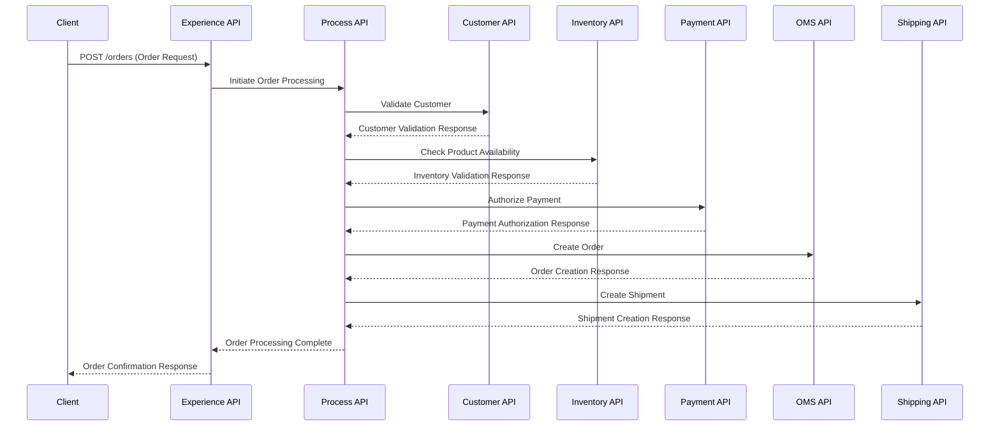
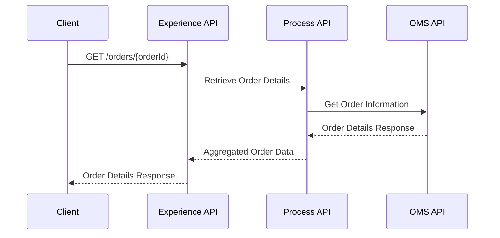

# Technical Specification
## Order Management System Integration

---

## Table of Contents

1. [Introduction](#1-introduction)
   - 1.1 [Business Objective](#11-business-objective)
   - 1.2 [References Link](#12-references-link)

2. [Solution Involve](#2-solution-involve)
   - 2.1 [Integration Overview](#21-integration-overview)
   - 2.2 [Integration Objective](#22-integration-objective)

3. [Technical Details](#3-technical-details)
   - 3.1 [Integration Architecture Diagram](#31-integration-architecture-diagram)
   - 3.2 [Sequence Diagram](#32-sequence-diagram)
   - 3.3 [Layer Responsibilities](#33-layer-responsibilities)

4. [Error Handling Details](#4-error-handling-details)

5. [Connectivity Details](#5-connectivity-details)

6. [Volumetric Details](#6-volumetric-details)

7. [Application Details](#7-application-details)

8. [Mapping Details](#8-mapping-details)

---

## Change History

| Date | Owner | Jira Case | Status |
|------|--------|-----------|---------|
| March 2026 | Integration Team | OMS-001 | Initial Version |

---

## 1. Introduction

### 1.1 Business Objective

The Order Management System (OMS) integration aims to create a unified, scalable, and secure integration platform that connects multiple enterprise systems to enable real-time order processing, validation, fulfillment, and tracking.

**Key Business Drivers:**
- Enable real-time order creation and processing
- Integrate OMS with upstream and downstream enterprise systems
- Ensure accurate inventory validation before order confirmation
- Support complete order lifecycle tracking from creation to delivery
- Provide secure and scalable API-based integration architecture
- Reduce manual intervention and improve operational efficiency
- Ensure consistent data synchronization across all systems

### 1.2 References Link

- Integration Business Requirements Document v1.0
- Order Management System API Documentation
- MuleSoft Anypoint Platform Best Practices
- API-Led Connectivity Architecture Guidelines
- Enterprise Security Standards

---

## 2. Solution Involve

### 2.1 Integration Overview

The Order Management System integration follows **API-Led Connectivity** architecture implemented on **MuleSoft Anypoint Platform**. The solution creates a unified integration layer that connects:

- **Order Management System (OMS)** - Central order lifecycle management
- **Customer System** - Customer profile and validation services
- **Inventory System** - Real-time product availability and stock management
- **Payment Gateway** - Payment processing and authorization
- **Shipping System** - Shipment creation and tracking services

**Integration Pattern:** API-Led Connectivity with three-layer architecture
**Platform:** MuleSoft Anypoint Platform
**Security:** OAuth 2.0 and Client ID enforcement
**Communication:** RESTful APIs with JSON payloads

### 2.2 Integration Objective

**Primary Objectives:**
1. **Real-time Order Processing** - Enable instant order creation, validation, and confirmation
2. **System Synchronization** - Maintain data consistency across all connected systems
3. **Scalable Architecture** - Support high-volume order processing with sub-3-second response times
4. **Error Resilience** - Implement robust error handling and compensation mechanisms
5. **Security Compliance** - Ensure secure data transmission and access control
6. **Monitoring & Observability** - Provide comprehensive logging and monitoring capabilities

**Success Metrics:**
- API response time < 3 seconds
- 99.9% system availability
- Successful end-to-end order processing
- Accurate order lifecycle tracking

---

## 3. Technical Details

### 3.1 Integration Architecture Diagram

```
┌─────────────────────────────────────────────────────────────────┐
│                    EXPERIENCE LAYER                             │
├─────────────────────────────────────────────────────────────────┤
│                Order Experience API                             │
│         ┌─────────────────────────────────────┐                 │
│         │  POST /orders                       │                 │
│         │  GET  /orders/{orderId}             │                 │
│         │  GET  /orders                       │                 │
│         │  PATCH /orders/{orderId}/status     │                 │
│         └─────────────────────────────────────┘                 │
└─────────────────────────┬───────────────────────────────────────┘
                          │
┌─────────────────────────┴───────────────────────────────────────┐
│                    PROCESS LAYER                                │
├─────────────────────────────────────────────────────────────────┤
│               Order Processing API                              │
│  ┌─────────────────┐ ┌─────────────────┐ ┌─────────────────┐   │
│  │ Order Creation  │ │ Order Retrieval │ │ Status Update   │   │
│  │ Orchestration   │ │ Aggregation     │ │ Notification    │   │
│  └─────────────────┘ └─────────────────┘ └─────────────────┘   │
└─────────────┬───────────────┬───────────────┬───────────────────┘
              │               │               │
┌─────────────┴───────────────┴───────────────┴───────────────────┐
│                    SYSTEM LAYER                                 │
├─────────────────────────────────────────────────────────────────┤
│ ┌─────────────┐ ┌─────────────┐ ┌─────────────┐ ┌─────────────┐ │
│ │ Customer    │ │ Inventory   │ │ Payment     │ │ Shipping    │ │
│ │ System API  │ │ System API  │ │ System API  │ │ System API  │ │
│ └─────────────┘ └─────────────┘ └─────────────┘ └─────────────┘ │
└─────┬───────────────┬───────────────┬───────────────┬───────────┘
      │               │               │               │
┌─────┴───┐   ┌───────┴───┐   ┌───────┴───┐   ┌───────┴───┐
│Customer │   │ Inventory │   │ Payment   │   │ Shipping  │
│ System  │   │  System   │   │ Gateway   │   │  System   │
└─────────┘   └───────────┘   └───────────┘   └───────────┘
```

### 3.2 Sequence Diagram

#### Order Creation Flow



#### Order Retrieval Flow



### 3.3 Layer Responsibilities

#### Experience Layer
- **Order Experience API**
  - **Purpose**: Provides business-focused APIs for order operations
  - **Responsibilities**:
    - API endpoint exposure and management
    - Request/response transformation for client compatibility
    - Basic input validation and sanitization
    - API versioning and documentation
    - Rate limiting and throttling policies
  - **Endpoints**:
    - `POST /orders` - Create new order
    - `GET /orders/{orderId}` - Retrieve specific order
    - `GET /orders` - List orders with pagination
    - `PATCH /orders/{orderId}/status` - Update order status

#### Process Layer
- **Order Processing API**
  - **Purpose**: Orchestrates business processes and system interactions
  - **Responsibilities**:
    - Order creation orchestration workflow
    - Business rule validation and enforcement
    - System integration coordination
    - Data aggregation and transformation
    - Compensation and rollback logic
    - Business event publishing
  - **Key Processes**:
    - Customer validation workflow
    - Inventory availability checking
    - Payment authorization processing
    - Order lifecycle management
    - Shipment coordination

#### System Layer
- **Customer System API**
  - **Purpose**: Abstracts customer system interactions
  - **Responsibilities**: Customer validation, profile retrieval
  
- **Inventory System API**
  - **Purpose**: Manages product availability operations
  - **Responsibilities**: Stock validation, inventory updates
  
- **Payment System API**
  - **Purpose**: Handles payment processing operations
  - **Responsibilities**: Payment authorization, transaction management
  
- **Shipping System API**
  - **Purpose**: Manages shipment and logistics operations
  - **Responsibilities**: Shipment creation, tracking updates

---

## 4. Error Handling Details

### Error Response Structure
```json
{
  "error": {
    "code": "ERROR_CODE",
    "message": "Human readable error message",
    "details": "Detailed error description",
    "timestamp": "2026-03-18T18:07:00Z",
    "traceId": "unique-trace-identifier"
  }
}
```

### Error Codes and Handling Strategy

| Error Code | HTTP Status | Description | Handling Strategy |
|------------|-------------|-------------|-------------------|
| `INVALID_REQUEST` | 400 | Invalid request format or missing required fields | Validate request and return detailed field-level errors |
| `UNAUTHORIZED` | 401 | Authentication failure | Redirect to authentication service |
| `FORBIDDEN` | 403 | Insufficient permissions | Log security event and return access denied |
| `ORDER_NOT_FOUND` | 404 | Order ID does not exist | Return not found with suggested actions |
| `CUSTOMER_INVALID` | 422 | Customer validation failed | Return validation details and requirements |
| `INVENTORY_UNAVAILABLE` | 422 | Insufficient inventory | Return available quantity and alternatives |
| `PAYMENT_FAILED` | 422 | Payment authorization failed | Return payment failure reason and retry options |
| `SYSTEM_UNAVAILABLE` | 503 | Backend system temporarily unavailable | Implement circuit breaker and retry mechanism |
| `INTERNAL_ERROR` | 500 | Unexpected system error | Log error details and return generic message |

### Retry and Circuit Breaker Policies

**Retry Configuration:**
- Maximum retry attempts: 3
- Retry delay: 1s, 2s, 4s (exponential backoff)
- Retryable errors: 503, 504, connection timeouts

**Circuit Breaker Configuration:**
- Failure threshold: 5 consecutive failures
- Recovery timeout: 30 seconds
- Half-open state: Allow 3 test requests

### Compensation Logic
For failed order creation:
1. Reverse inventory reservation
2. Cancel payment authorization
3. Update order status to "FAILED"
4. Send failure notification

---

## 5. Connectivity Details

### API Gateway Configuration
- **Platform**: MuleSoft Anypoint Platform API Gateway
- **Base URL**: `https://api.company.com/oms/v1`
- **Protocol**: HTTPS with TLS 1.2+
- **Authentication**: OAuth 2.0 with Client Credentials flow
- **Rate Limiting**: 1000 requests per minute per client

### Security Policies
- **Client ID Enforcement**: Required for all API calls
- **OAuth 2.0 Token Validation**: JWT token validation with 1-hour expiry
- **IP Whitelisting**: Restricted to approved client IP ranges
- **Request/Response Logging**: All API interactions logged for audit
- **Data Masking**: PII and payment data masked in logs

### Backend System Connectivity

| System | Protocol | Authentication | Endpoint | Timeout |
|--------|----------|----------------|----------|---------|
| Customer System | HTTPS REST | API Key | `https://customer.internal.com/api/v1` | 5s |
| Inventory System | HTTPS REST | OAuth 2.0 | `https://inventory.internal.com/api/v2` | 10s |
| Payment Gateway | HTTPS REST | API Key + Secret | `https://payments.gateway.com/v3` | 15s |
| Shipping System | HTTPS REST | Basic Auth | `https://shipping.logistics.com/api/v1` | 8s |
| OMS System | HTTPS REST | OAuth 2.0 | `https://oms.internal.com/api/v1` | 12s |

---

## 6. Volumetric Details

### Expected Transaction Volumes

| Metric | Peak Hours | Off-Peak Hours | Daily Total |
|--------|------------|----------------|-------------|
| Order Creation | 500 requests/minute | 100 requests/minute | 50,000 orders |
| Order Retrieval | 1000 requests/minute | 200 requests/minute | 100,000 requests |
| Status Updates | 200 requests/minute | 50 requests/minute | 20,000 updates |

### Performance Requirements

| API Operation | Target Response Time | Maximum Response Time | Throughput |
|---------------|---------------------|----------------------|------------|
| Create Order | < 2 seconds | < 3 seconds | 500 TPS |
| Retrieve Order | < 1 second | < 2 seconds | 1000 TPS |
| List Orders | < 1.5 seconds | < 2.5 seconds | 200 TPS |
| Update Status | < 1 second | < 2 seconds | 200 TPS |

### Scaling Strategy
- **Horizontal Scaling**: Auto-scale API instances based on CPU/memory utilization
- **Connection Pooling**: Optimize backend system connections
- **Caching Strategy**: Implement Redis cache for frequently accessed order data
- **Database Optimization**: Index optimization for order queries

---

## 7. Application Details

### Environment Details

| Environment | Purpose | URL | Deployment |
|-------------|---------|-----|------------|
| Development | Development and unit testing | `https://dev-api.company.com/oms/v1` | Single instance |
| QA | Integration and system testing | `https://qa-api.company.com/oms/v1` | Load balanced (2 instances) |
| UAT | User acceptance testing | `https://uat-api.company.com/oms/v1` | Load balanced (2 instances) |
| Production | Live production environment | `https://api.company.com/oms/v1` | Load balanced (4+ instances) |

### RAML Specifications

**Order Experience API RAML:**
```yaml
#%RAML 1.0
title: Order Experience API
version: v1
baseUri: https://api.company.com/oms/{version}
mediaType: application/json

securitySchemes:
  oauth2:
    type: OAuth 2.0
    settings:
      authorizationGrants: [client_credentials]
      accessTokenUri: https://auth.company.com/oauth/token

/orders:
  securedBy: [oauth2]
  post:
    displayName: Create Order
    body:
      application/json:
        type: CreateOrderRequest
        example: |
          {
            "customerId": "CUST123",
            "items": [
              {
                "productId": "PROD456",
                "quantity": 2,
                "price": 99.99
              }
            ],
            "shippingAddress": {
              "street": "123 Main St",
              "city": "Anytown",
              "state": "ST",
              "zipCode": "12345"
            }
          }
    responses:
      201:
        body:
          application/json:
            type: OrderResponse
      400:
        body:
          application/json:
            type: ErrorResponse

  get:
    displayName: List Orders
    queryParameters:
      customerId:
        type: string
        required: false
      status:
        type: string
        required: false
      page:
        type: integer
        default: 1
      limit:
        type: integer
        default: 10
    responses:
      200:
        body:
          application/json:
            type: OrderListResponse

  /{orderId}:
    get:
      displayName: Get Order
      responses:
        200:
          body:
            application/json:
              type: OrderResponse
        404:
          body:
            application/json:
              type: ErrorResponse
    
    /status:
      patch:
        displayName: Update Order Status
        body:
          application/json:
            type: UpdateStatusRequest
        responses:
          200:
            body:
              application/json:
                type: OrderResponse
```

### GitHub Repository Links

| Component | Repository URL |
|-----------|----------------|
| Order Experience API | `https://github.com/company/oms-experience-api` |
| Order Processing API | `https://github.com/company/oms-process-api` |
| Customer System API | `https://github.com/company/customer-system-api` |
| Inventory System API | `https://github.com/company/inventory-system-api` |
| Payment System API | `https://github.com/company/payment-system-api` |
| Shipping System API | `https://github.com/company/shipping-system-api` |

---

## 8. Mapping Details

### Request/Response Transformations

#### Create Order Request Mapping

**Input (Experience API):**
```json
{
  "customerId": "CUST123",
  "items": [
    {
      "productId": "PROD456",
      "quantity": 2,
      "price": 99.99
    }
  ],
  "shippingAddress": {
    "street": "123 Main St",
    "city": "Anytown",
    "state": "ST",
    "zipCode": "12345"
  }
}
```

**Output (OMS System):**
```json
{
  "order": {
    "customer_id": "CUST123",
    "order_date": "2026-03-18T18:07:00Z",
    "line_items": [
      {
        "product_id": "PROD456",
        "qty": 2,
        "unit_price": 99.99,
        "total_price": 199.98
      }
    ],
    "shipping_details": {
      "address_line1": "123 Main St",
      "city": "Anytown",
      "state": "ST",
      "postal_code": "12345"
    },
    "total_amount": 199.98,
    "status": "PENDING"
  }
}
```

#### Field Mapping Table

| Experience API Field | OMS System Field | Transformation Rule |
|---------------------|------------------|-------------------|
| `customerId` | `customer_id` | Direct mapping |
| `items[].productId` | `line_items[].product_id` | Direct mapping |
| `items[].quantity` | `line_items[].qty` | Direct mapping |
| `items[].price` | `line_items[].unit_price` | Direct mapping |
| N/A | `line_items[].total_price` | Calculated: quantity × price |
| N/A | `order_date` | Generated: current timestamp |
| `shippingAddress.street` | `shipping_details.address_line1` | Direct mapping |
| `shippingAddress.city` | `shipping_details.city` | Direct mapping |
| `shippingAddress.state` | `shipping_details.state` | Direct mapping |
| `shippingAddress.zipCode` | `shipping_details.postal_code` | Direct mapping |
| N/A | `total_amount` | Calculated: sum of all line item totals |
| N/A | `status` | Default: "PENDING" |

### Data Validation Rules

#### Customer Validation
- Customer ID must exist in Customer System
- Customer account must be active
- Customer must have valid billing information

#### Inventory Validation
- Product ID must exist in Inventory System
- Requested quantity must be available
- Product must be active and orderable

#### Payment Validation
- Payment method must be valid
- Sufficient funds/credit limit available
- Payment authorization successful

### Status Mapping

| OMS Status | Experience API Status | Description |
|------------|----------------------|-------------|
| `PENDING` | `PENDING` | Order created, awaiting processing |
| `CONFIRMED` | `CONFIRMED` | Order validated and confirmed |
| `PROCESSING` | `PROCESSING` | Order being fulfilled |
| `SHIPPED` | `SHIPPED` | Order dispatched for delivery |
| `DELIVERED` | `DELIVERED` | Order successfully delivered |
| `CANCELLED` | `CANCELLED` | Order cancelled by customer or system |
| `FAILED` | `FAILED` | Order processing failed |

---

## Appendix

### Sample Payloads

#### Create Order Request
```json
{
  "customerId": "CUST123456",
  "items": [
    {
      "productId": "LAPTOP001",
      "quantity": 1,
      "price": 1299.99
    },
    {
      "productId": "MOUSE001",
      "quantity": 2,
      "price": 29.99
    }
  ],
  "shippingAddress": {
    "street": "456 Technology Blvd",
    "city": "San Francisco",
    "state": "CA",
    "zipCode": "94105",
    "country": "US"
  },
  "billingAddress": {
    "street": "456 Technology Blvd",
    "city": "San Francisco",
    "state": "CA",
    "zipCode": "94105",
    "country": "US"
  },
  "paymentMethod": {
    "type": "CREDIT_CARD",
    "cardToken": "tok_visa_4242"
  }
}
```

#### Create Order Response
```json
{
  "orderId": "ORD789012",
  "status": "CONFIRMED",
  "customerId": "CUST123456",
  "orderDate": "2026-03-18T18:07:00Z",
  "items": [
    {
      "productId": "LAPTOP001",
      "quantity": 1,
      "price": 1299.99,
      "totalPrice": 1299.99
    },
    {
      "productId": "MOUSE001",
      "quantity": 2,
      "price": 29.99,
      "totalPrice": 59.98
    }
  ],
  "totalAmount": 1359.97,
  "shippingAddress": {
    "street": "456 Technology Blvd",
    "city": "San Francisco",
    "state": "CA",
    "zipCode": "94105",
    "country": "US"
  },
  "paymentStatus": "AUTHORIZED",
  "shipmentId": "SHIP456789",
  "estimatedDelivery": "2026-03-20T18:00:00Z"
}
```

#### Order Retrieval Response
```json
{
  "orderId": "ORD789012",
  "status": "SHIPPED",
  "customerId": "CUST123456",
  "orderDate": "2026-03-18T18:07:00Z",
  "items": [
    {
      "productId": "LAPTOP001",
      "productName": "Premium Business Laptop",
      "quantity": 1,
      "price": 1299.99,
      "totalPrice": 1299.99
    },
    {
      "productId": "MOUSE001",
      "productName": "Wireless Mouse",
      "quantity": 2,
      "price": 29.99,
      "totalPrice": 59.98
    }
  ],
  "totalAmount": 1359.97,
  "paymentStatus": "PAID",
  "shipmentDetails": {
    "shipmentId": "SHIP456789",
    "trackingNumber": "1Z999AA1234567890",
    "carrier": "UPS",
    "shippedDate": "2026-03-19T10:30:00Z",
    "estimatedDelivery": "2026-03-20T18:00:00Z"
  },
  "orderHistory": [
    {
      "status": "PENDING",
      "timestamp": "2026-03-18T18:07:00Z",
      "description": "Order created"
    },
    {
      "status": "CONFIRMED",
      "timestamp": "2026-03-18T18:08:30Z",
      "description": "Payment authorized and inventory confirmed"
    },
    {
      "status": "PROCESSING",
      "timestamp": "2026-03-19T09:15:00Z",
      "description": "Order being prepared for shipment"
    },
    {
      "status": "SHIPPED",
      "timestamp": "2026-03-19T10:30:00Z",
      "description": "Order dispatched via UPS"
    }
  ]
}
```

#### Error Response Examples

**Customer Validation Error:**
```json
{
  "error": {
    "code": "CUSTOMER_INVALID",
    "message": "Customer validation failed",
    "details": "Customer CUST123456 does not exist or account is inactive",
    "timestamp": "2026-03-18T18:07:00Z",
    "traceId": "trace-abc123-def456"
  }
}
```

**Inventory Unavailable Error:**
```json
{
  "error": {
    "code": "INVENTORY_UNAVAILABLE",
    "message": "Insufficient inventory for requested items",
    "details": "Product LAPTOP001: requested 5, available 2",
    "timestamp": "2026-03-18T18:07:00Z",
    "traceId": "trace-xyz789-ghi012",
    "additionalInfo": {
      "availableQuantity": 2,
      "suggestedAlternatives": [
        {
          "productId": "LAPTOP002",
          "productName": "Business Laptop Pro",
          "availableQuantity": 10,
          "price": 1399.99
        }
      ]
    }
  }
}
```

**Payment Failed Error:**
```json
{
  "error": {
    "code": "PAYMENT_FAILED",
    "message": "Payment authorization failed",
    "details": "Credit card declined - insufficient funds",
    "timestamp": "2026-03-18T18:07:00Z",
    "traceId": "trace-pay789-ment012",
    "additionalInfo": {
      "paymentReference": "pay_declined_123456",
      "retryOptions": [
        "Use different payment method",
        "Contact card issuer",
        "Reduce order amount"
      ]
    }
  }
}
```

### Integration Testing Scenarios

#### Test Case 1: Successful Order Creation
**Scenario**: Customer creates an order with valid data
**Expected Result**: Order created successfully with status "CONFIRMED"
**Validation Points**:
- Customer validation successful
- Inventory availability confirmed
- Payment authorization successful
- Order persisted in OMS
- Shipment request initiated

#### Test Case 2: Customer Validation Failure
**Scenario**: Order request with invalid customer ID
**Expected Result**: Order creation fails with "CUSTOMER_INVALID" error
**Validation Points**:
- Customer validation fails
- No inventory reservation
- No payment processing
- Appropriate error response returned

#### Test Case 3: Inventory Unavailability
**Scenario**: Order request exceeds available inventory
**Expected Result**: Order creation fails with "INVENTORY_UNAVAILABLE" error
**Validation Points**:
- Customer validation successful
- Inventory validation fails
- Available quantity returned in response
- Alternative products suggested if available

#### Test Case 4: Payment Authorization Failure
**Scenario**: Payment method fails authorization
**Expected Result**: Order creation fails with "PAYMENT_FAILED" error
**Validation Points**:
- Customer and inventory validation successful
- Payment authorization fails
- Inventory reservation reversed
- Payment failure details returned

#### Test Case 5: System Unavailability
**Scenario**: Backend system temporarily unavailable
**Expected Result**: Circuit breaker activation and retry mechanism
**Validation Points**:
- Circuit breaker triggers after threshold
- Retry mechanism attempts with exponential backoff
- Graceful error handling
- System recovery detection

### Monitoring and Alerting Configuration

#### Key Performance Indicators (KPIs)
- API response time percentiles (P50, P90, P95, P99)
- Request volume and throughput
- Error rate by error type
- System availability percentage
- Backend system health status

#### Alert Thresholds
- Response time > 3 seconds for 5 consecutive requests
- Error rate > 5% over 5-minute window
- System availability < 99.9%
- Circuit breaker activation
- Backend system timeout rate > 10%

#### Monitoring Tools
- **Application Monitoring**: MuleSoft Anypoint Monitoring
- **Infrastructure Monitoring**: CloudWatch/Azure Monitor
- **Log Aggregation**: ELK Stack (Elasticsearch, Logstash, Kibana)
- **Alerting**: PagerDuty integration for critical alerts

---

## Technical Review and Approval

| Role | Name | Signature | Date |
|------|------|-----------|------|
| Integration Architect | | | |
| Security Architect | | | |
| Operations Team Lead | | | |
| Business Stakeholder | | | |

---

**Document Version**: 1.0  
**Last Updated**: March 2026  
**Next Review Date**: June 2026

---

*This document contains confidential and proprietary information. Distribution is restricted to authorized personnel only.*
