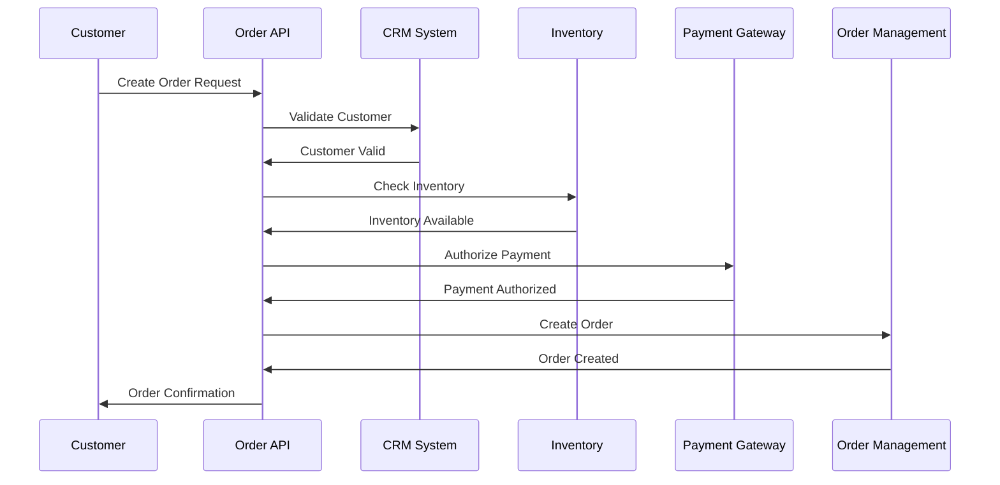
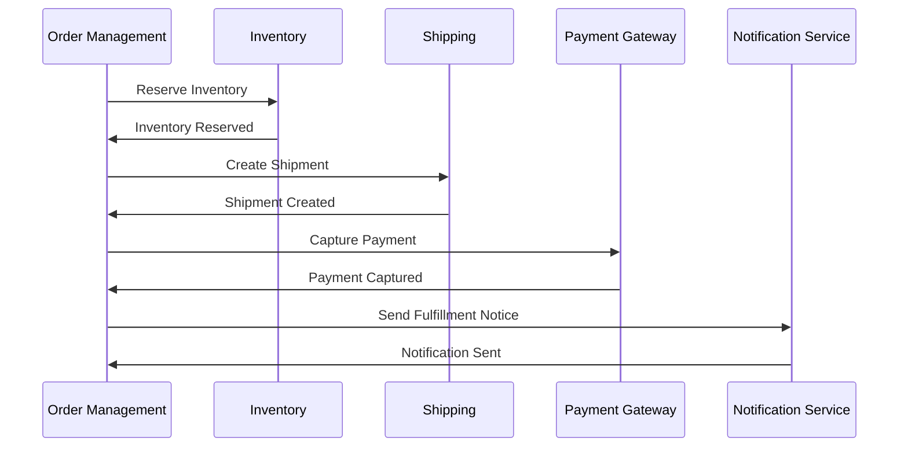

# Functional Design Document
## Order Management System Integration

---

### Document Information

| **Document Title** | Functional Design Document - Order Management System Integration |
|-------------------|----------------------------------------------------------------|
| **Version** | 1.0 |
| **Date** | March 23, 2026 |
| **Author** | Integration Team |
| **Status** | Draft |
| **Approver** | Solution Architect |

---

## Table of Contents

1. [Introduction](#1-introduction)
2. [System Overview](#2-system-overview)
3. [Functional Requirements](#3-functional-requirements)
4. [Integration Architecture](#4-integration-architecture)
5. [Data Flow Specifications](#5-data-flow-specifications)
6. [API Specifications](#6-api-specifications)
7. [Error Handling & Exception Management](#7-error-handling--exception-management)
8. [Security & Governance](#8-security--governance)
9. [Performance Requirements](#9-performance-requirements)
10. [Testing Strategy](#10-testing-strategy)
11. [Deployment Architecture](#11-deployment-architecture)
12. [Appendices](#12-appendices)

---

## 1. Introduction

### 1.1 Purpose
This Functional Design Document (FSD) provides detailed functional specifications for the Order Management System Integration project. It serves as a blueprint for developers, testers, and stakeholders to understand the system behavior, integration patterns, and technical implementation approach.

### 1.2 Scope
The document covers the integration between the Order Management System and various external systems including:
- Customer Management System (CRM)
- Inventory Management System
- Payment Processing System
- Shipping & Logistics System
- Enterprise Resource Planning (ERP) System
- Notification Services

### 1.3 Objectives
- Enable real-time order processing and fulfillment
- Ensure data consistency across all integrated systems
- Provide comprehensive order tracking capabilities
- Implement robust error handling and recovery mechanisms
- Establish secure and scalable integration patterns

### 1.4 Business Context
The Order Management System serves as the central hub for all order-related activities, coordinating between multiple backend systems to provide seamless customer experience and operational efficiency.

---

## 2. System Overview

### 2.1 High-Level Architecture

```
┌─────────────────┐    ┌─────────────────┐    ┌─────────────────┐
│   Web Portal    │    │  Mobile App     │    │  Call Center    │
└─────────┬───────┘    └─────────┬───────┘    └─────────┬───────┘
          │                      │                      │
          └──────────────────────┼──────────────────────┘
                                 │
                    ┌────────────┴────────────┐
                    │   API Gateway Layer     │
                    └────────────┬────────────┘
                                 │
                    ┌────────────┴────────────┐
                    │  Order Management API   │
                    └────────────┬────────────┘
                                 │
         ┌───────────────────────┼───────────────────────┐
         │                       │                       │
    ┌────┴────┐            ┌────┴────┐            ┌────┴────┐
    │   CRM   │            │   ERP   │            │ Payment │
    │ System  │            │ System  │            │ Gateway │
    └─────────┘            └─────────┘            └─────────┘
```

### 2.2 Integration Patterns
- **Synchronous Integration**: Real-time order validation and processing
- **Asynchronous Integration**: Order status updates and notifications
- **Batch Processing**: Bulk order updates and reconciliation
- **Event-Driven Architecture**: Order state change notifications

### 2.3 Technology Stack
- **Integration Platform**: MuleSoft Anypoint Platform
- **Runtime**: Mule 4.x
- **API Management**: Anypoint API Manager
- **Message Queuing**: Apache Kafka / Amazon SQS
- **Database**: PostgreSQL / Oracle
- **Cache**: Redis
- **Monitoring**: Splunk / ELK Stack

---

## 3. Functional Requirements

### 3.1 Order Processing Requirements

#### 3.1.1 Order Creation (FR-001)
**Description**: Create new orders in the system through multiple channels

**Functional Flow**:
1. Receive order request from channel (Web, Mobile, Call Center)
2. Validate order data structure and business rules
3. Check customer information against CRM system
4. Verify product availability in inventory system
5. Calculate pricing and apply discounts
6. Reserve inventory for the order
7. Create order record in Order Management System
8. Generate order confirmation number
9. Send order confirmation to customer
10. Trigger downstream processes

**Input Parameters**:
- Customer ID
- Product details (SKU, quantity, price)
- Shipping information
- Payment method
- Order channel source

**Output**:
- Order ID
- Order confirmation number
- Order status
- Estimated delivery date

**Business Rules**:
- Maximum order value: $50,000
- Minimum order value: $10
- Customer credit limit validation required
- Inventory availability check mandatory

#### 3.1.2 Order Modification (FR-002)
**Description**: Update existing orders with specific business constraints

**Functional Flow**:
1. Validate order modification request
2. Check order status (only allow modification for specific statuses)
3. Verify inventory availability for new items
4. Update pricing calculations
5. Release previous inventory reservations
6. Create new inventory reservations
7. Update order in Order Management System
8. Send modification confirmation
9. Update delivery estimates

**Business Rules**:
- Orders can only be modified in "Pending" or "Confirmed" status
- No modifications allowed after shipping
- Price changes require approval for amounts > $1,000

#### 3.1.3 Order Cancellation (FR-003)
**Description**: Cancel orders and handle associated business processes

**Functional Flow**:
1. Validate cancellation request
2. Check order status and cancellation eligibility
3. Process refund if payment was captured
4. Release inventory reservations
5. Update order status to "Cancelled"
6. Send cancellation confirmation
7. Update analytics and reporting systems

### 3.2 Inventory Management Integration

#### 3.2.1 Inventory Check (FR-004)
**Description**: Real-time inventory availability verification

**Functional Flow**:
1. Receive inventory check request
2. Query inventory management system
3. Check product availability across warehouses
4. Return availability status and quantities
5. Log inventory check for analytics

#### 3.2.2 Inventory Reservation (FR-005)
**Description**: Reserve inventory items for pending orders

**Functional Flow**:
1. Validate reservation request
2. Check current available inventory
3. Create inventory reservation record
4. Update available inventory quantities
5. Set reservation expiry time
6. Confirm reservation status

### 3.3 Payment Processing Integration

#### 3.3.1 Payment Authorization (FR-006)
**Description**: Authorize payments for orders

**Functional Flow**:
1. Receive payment authorization request
2. Validate payment information
3. Call payment gateway API
4. Handle authorization response
5. Update order payment status
6. Store payment reference
7. Handle authorization failures

#### 3.3.2 Payment Capture (FR-007)
**Description**: Capture authorized payments upon order fulfillment

**Functional Flow**:
1. Receive payment capture request
2. Validate authorization details
3. Call payment gateway capture API
4. Update payment status
5. Generate receipt
6. Handle capture failures and retries

### 3.4 Shipping Integration

#### 3.4.1 Shipping Quote (FR-008)
**Description**: Get shipping cost estimates

**Functional Flow**:
1. Receive shipping quote request
2. Determine shipping origin warehouse
3. Call shipping carrier APIs
4. Compare shipping options
5. Return shipping options with costs
6. Cache shipping quotes

#### 3.4.2 Shipment Creation (FR-009)
**Description**: Create shipments with carriers

**Functional Flow**:
1. Receive shipment creation request
2. Select optimal shipping method
3. Create shipment with carrier
4. Generate shipping label
5. Update order with tracking information
6. Send shipping confirmation

---

## 4. Integration Architecture

### 4.1 API-Led Connectivity Architecture

```
┌─────────────────────────────────────────────────────────────┐
│                    Experience Layer                          │
├─────────────────────────────────────────────────────────────┤
│  Order Management API  │  Customer API  │  Product API      │
└─────────────────────────────────────────────────────────────┘
                                │
┌─────────────────────────────────────────────────────────────┐
│                    Process Layer                             │
├─────────────────────────────────────────────────────────────┤
│ Order Processing API │ Payment Process API │ Fulfillment API│
└─────────────────────────────────────────────────────────────┘
                                │
┌─────────────────────────────────────────────────────────────┐
│                     System Layer                             │
├─────────────────────────────────────────────────────────────┤
│    CRM API    │    ERP API    │ Inventory API │ Payment API │
└─────────────────────────────────────────────────────────────┘
```

### 4.2 Integration Patterns

#### 4.2.1 Synchronous Integration Patterns
- **Request-Response**: Real-time order validation
- **Scatter-Gather**: Parallel inventory checks across warehouses
- **Content-Based Routing**: Route orders based on product type

#### 4.2.2 Asynchronous Integration Patterns
- **Publish-Subscribe**: Order status change notifications
- **Message Queuing**: Batch order processing
- **Event Streaming**: Real-time analytics updates

### 4.3 Data Transformation

#### 4.3.1 Order Data Mapping
```json
{
  "sourceSystem": "WebPortal",
  "orderRequest": {
    "customerId": "string",
    "items": [
      {
        "productId": "string",
        "quantity": "number",
        "unitPrice": "number"
      }
    ],
    "shippingAddress": {
      "street": "string",
      "city": "string",
      "state": "string",
      "zipCode": "string"
    },
    "paymentMethod": {
      "type": "string",
      "cardNumber": "string",
      "expiryDate": "string"
    }
  }
}
```

#### 4.3.2 System-Specific Transformations
- **CRM Integration**: Customer data normalization
- **ERP Integration**: Order format conversion
- **Inventory Integration**: Product code mapping
- **Payment Integration**: Payment method standardization

---

## 5. Data Flow Specifications

### 5.1 Order Creation Data Flow



### 5.2 Order Fulfillment Data Flow



### 5.3 Data Validation Rules

#### 5.3.1 Input Validation
- **Order Amount**: Must be between $10 and $50,000
- **Customer ID**: Must exist in CRM system
- **Product SKU**: Must be valid and active
- **Shipping Address**: Must be deliverable location
- **Payment Method**: Must pass validation checks

#### 5.3.2 Business Rule Validation
- **Credit Limit**: Customer orders cannot exceed credit limit
- **Inventory**: Products must be available in sufficient quantity
- **Geographic**: Delivery must be to supported regions
- **Compliance**: Orders must comply with regulatory requirements

---

## 6. API Specifications

### 6.1 Order Management API

#### 6.1.1 Create Order Endpoint
```yaml
POST /api/v1/orders
Content-Type: application/json

Request Body:
{
  "customerId": "string",
  "orderDate": "datetime",
  "items": [
    {
      "productId": "string",
      "quantity": "integer",
      "unitPrice": "decimal"
    }
  ],
  "shippingAddress": {
    "addressLine1": "string",
    "addressLine2": "string",
    "city": "string",
    "state": "string",
    "postalCode": "string",
    "country": "string"
  },
  "billingAddress": {
    "addressLine1": "string",
    "addressLine2": "string",
    "city": "string",
    "state": "string",
    "postalCode": "string",
    "country": "string"
  },
  "paymentMethod": {
    "type": "CREDIT_CARD",
    "cardNumber": "string",
    "expiryMonth": "integer",
    "expiryYear": "integer",
    "cvv": "string"
  }
}

Response:
{
  "orderId": "string",
  "orderNumber": "string",
  "status": "PENDING",
  "totalAmount": "decimal",
  "estimatedDeliveryDate": "date",
  "createdAt": "datetime"
}
```

#### 6.1.2 Get Order Details Endpoint
```yaml
GET /api/v1/orders/{orderId}

Response:
{
  "orderId": "string",
  "orderNumber": "string",
  "customerId": "string",
  "status": "string",
  "orderDate": "datetime",
  "totalAmount": "decimal",
  "items": [
    {
      "productId": "string",
      "productName": "string",
      "quantity": "integer",
      "unitPrice": "decimal",
      "totalPrice": "decimal"
    }
  ],
  "shippingAddress": {},
  "billingAddress": {},
  "trackingInformation": {
    "carrier": "string",
    "trackingNumber": "string",
    "estimatedDeliveryDate": "date"
  }
}
```

#### 6.1.3 Update Order Status Endpoint
```yaml
PUT /api/v1/orders/{orderId}/status

Request Body:
{
  "status": "string",
  "statusReason": "string",
  "updatedBy": "string"
}

Response:
{
  "orderId": "string",
  "status": "string",
  "updatedAt": "datetime"
}
```

### 6.2 Inventory Integration API

#### 6.2.1 Check Inventory Availability
```yaml
POST /api/v1/inventory/check

Request Body:
{
  "items": [
    {
      "productId": "string",
      "quantity": "integer"
    }
  ]
}

Response:
{
  "items": [
    {
      "productId": "string",
      "requestedQuantity": "integer",
      "availableQuantity": "integer",
      "isAvailable": "boolean",
      "warehouseLocation": "string"
    }
  ]
}
```

### 6.3 Payment Integration API

#### 6.3.1 Authorize Payment
```yaml
POST /api/v1/payments/authorize

Request Body:
{
  "orderId": "string",
  "amount": "decimal",
  "currency": "string",
  "paymentMethod": {
    "type": "CREDIT_CARD",
    "cardNumber": "string",
    "expiryMonth": "integer",
    "expiryYear": "integer",
    "cvv": "string"
  },
  "billingAddress": {}
}

Response:
{
  "authorizationId": "string",
  "status": "AUTHORIZED",
  "amount": "decimal",
  "authorizedAt": "datetime",
  "expiresAt": "datetime"
}
```

---

## 7. Error Handling & Exception Management

### 7.1 Error Classification

#### 7.1.1 System Errors
- **Connection Timeouts**: Network connectivity issues
- **Service Unavailable**: Backend system downtime
- **Authentication Failures**: Security credential issues
- **Rate Limiting**: API quota exceeded

#### 7.1.2 Business Errors
- **Validation Errors**: Invalid input data
- **Business Rule Violations**: Credit limit exceeded
- **Insufficient Inventory**: Product not available
- **Payment Declined**: Payment processing failed

### 7.2 Error Handling Patterns

#### 7.2.1 Retry Pattern
```yaml
Retry Configuration:
  - Initial Retry Delay: 1 second
  - Maximum Retry Attempts: 3
  - Backoff Strategy: Exponential
  - Maximum Delay: 30 seconds
```

#### 7.2.2 Circuit Breaker Pattern
```yaml
Circuit Breaker Configuration:
  - Failure Threshold: 50%
  - Timeout: 30 seconds
  - Recovery Time: 60 seconds
  - Minimum Request Volume: 10
```

### 7.3 Error Response Format
```json
{
  "error": {
    "code": "ORD_001",
    "message": "Invalid customer ID provided",
    "details": "Customer ID 'CUST123' does not exist in the system",
    "timestamp": "2026-03-23T13:28:24Z",
    "traceId": "abc123-def456-ghi789"
  }
}
```

### 7.4 Error Codes Dictionary

| Error Code | Description | HTTP Status | Retry Strategy |
|------------|-------------|-------------|----------------|
| ORD_001 | Invalid Customer ID | 400 | No Retry |
| ORD_002 | Insufficient Inventory | 409 | Retry After Delay |
| ORD_003 | Payment Authorization Failed | 402 | No Retry |
| ORD_004 | System Unavailable | 503 | Retry with Backoff |
| ORD_005 | Request Timeout | 504 | Retry with Backoff |

---

## 8. Security & Governance

### 8.1 Authentication & Authorization

#### 8.1.1 API Security
- **Authentication Method**: OAuth 2.0 / JWT tokens
- **Token Expiry**: 1 hour for access tokens, 24 hours for refresh tokens
- **Scope-Based Authorization**: Role-based access control
- **Rate Limiting**: 1000 requests per minute per client

#### 8.1.2 Data Encryption
- **Transport Security**: TLS 1.3 for all API communications
- **Data at Rest**: AES-256 encryption for sensitive data
- **Key Management**: AWS KMS / Azure Key Vault integration
- **PII Protection**: Tokenization of sensitive customer data

### 8.2 Compliance Requirements

#### 8.2.1 Data Privacy
- **GDPR Compliance**: Data subject rights implementation
- **CCPA Compliance**: California consumer privacy requirements
- **Data Retention**: 7-year retention policy for financial records
- **Right to Erasure**: Customer data deletion capabilities

#### 8.2.2 Audit & Monitoring
- **API Logging**: All API calls logged with correlation IDs
- **Transaction Audit**: Complete order lifecycle tracking
- **Security Monitoring**: Real-time threat detection
- **Compliance Reporting**: Automated compliance status reports

### 8.3 API Governance

#### 8.3.1 API Standards
- **Naming Conventions**: RESTful API design principles
- **Versioning Strategy**: Semantic versioning (v1.0.0)
- **Documentation**: OpenAPI 3.0 specifications
- **Testing Standards**: Contract testing with Pact

#### 8.3.2 Change Management
- **API Lifecycle**: Design → Develop → Test → Deploy → Monitor
- **Breaking Changes**: Minimum 90-day deprecation notice
- **Backward Compatibility**: Support for N-1 API versions
- **Release Process**: Blue-green deployment strategy

---

## 9. Performance Requirements

### 9.1 Response Time Requirements

| Operation | Target Response Time | Maximum Response Time |
|-----------|---------------------|----------------------|
| Create Order | < 2 seconds | < 5 seconds |
| Get Order Details | < 500 ms | < 1 second |
| Inventory Check | < 1 second | < 3 seconds |
| Payment Authorization | < 3 seconds | < 10 seconds |
| Order Status Update | < 1 second | < 3 seconds |

### 9.2 Throughput Requirements

| Metric | Peak Load | Average Load |
|--------|-----------|--------------|
| Orders per Second | 1000 | 200 |
| API Calls per Minute | 60,000 | 12,000 |
| Concurrent Users | 10,000 | 2,000 |
| Data Transfer Rate | 100 MB/s | 20 MB/s |

### 9.3 Scalability Requirements

#### 9.3.1 Horizontal Scaling
- **Auto-scaling**: CPU-based scaling (70% threshold)
- **Load Balancing**: Round-robin distribution
- **Session Management**: Stateless API design
- **Database Scaling**: Read replicas for query optimization

#### 9.3.2 Capacity Planning
- **Growth Projection**: 50% annual growth in order volume
- **Resource Allocation**: 2x capacity during peak seasons
- **Storage Requirements**: 1TB storage growth per quarter

---

## 10. Testing Strategy

### 10.1 Test Approach

#### 10.1.1 Testing Levels
- **Unit Testing**: Individual API endpoint testing
- **Integration Testing**: System-to-system integration validation
- **End-to-End Testing**: Complete order lifecycle testing
- **Performance Testing**: Load and stress testing
- **Security Testing**: Vulnerability and penetration testing

#### 10.1.2 Testing Tools
- **API Testing**: Postman, REST Assured
- **Performance Testing**: JMeter, LoadRunner
- **Security Testing**: OWASP ZAP, Burp Suite
- **Automation**: Selenium, MUnit for MuleSoft

### 10.2 Test Scenarios

#### 10.2.1 Functional Test Cases

| Test Case ID | Test Scenario | Expected Result |
|--------------|---------------|-----------------|
| TC_001 | Create order with valid data | Order created successfully |
| TC_002 | Create order with invalid customer | Order creation fails with error |
| TC_003 | Create order with insufficient inventory | Order creation fails with inventory error |
| TC_004 | Process payment authorization | Payment authorized successfully |
| TC_005 | Handle payment failure | Order status updated with payment failure |
| TC_006 | Update order status | Order status updated successfully |
| TC_007 | Cancel order before shipping | Order cancelled and inventory released |
| TC_008 | Retrieve order details | Order details returned correctly |

#### 10.2.2 Integration Test Cases

| Test Case ID | Integration Scenario | Validation Points |
|--------------|---------------------|-------------------|
| INT_001 | Order creation with CRM validation | Customer validation successful |
| INT_002 | Inventory check integration | Real-time inventory status returned |
| INT_003 | Payment gateway integration | Payment processing end-to-end |
| INT_004 | Shipping system integration | Shipment creation and tracking |
| INT_005 | Error handling across systems | Proper error propagation |

#### 10.2.3 Performance Test Cases

| Test Case ID | Load Scenario | Success Criteria |
|--------------|---------------|------------------|
| PERF_001 | Normal load testing | 200 orders/second with <2s response |
| PERF_002 | Peak load testing | 1000 orders/second with <5s response |
| PERF_003 | Stress testing | System graceful degradation at 150% load |
| PERF_004 | Spike testing | Handle sudden traffic spikes |
| PERF_005 | Volume testing | Process 1 million orders per day |

### 10.3 Test Data Management

#### 10.3.1 Test Data Requirements
- **Customer Data**: 1000 test customer records
- **Product Data**: 500 test product records
- **Inventory Data**: Real-time inventory simulation
- **Payment Data**: Mock payment gateway responses

#### 10.3.2 Test Environment Setup
- **Development**: Unit and integration testing
- **QA**: System and user acceptance testing
- **Staging**: Performance and security testing
- **Pre-Production**: Final validation testing

### 10.4 Test Execution Strategy

#### 10.4.1 Test Phases
1. **Phase 1**: Unit and component testing
2. **Phase 2**: Integration testing
3. **Phase 3**: End-to-end testing
4. **Phase 4**: Performance testing
5. **Phase 5**: Security and compliance testing
6. **Phase 6**: User acceptance testing

#### 10.4.2 Entry and Exit Criteria

**Entry Criteria**:
- Development code complete
- Test environment ready
- Test data available
- Test cases reviewed and approved

**Exit Criteria**:
- All test cases executed
- Critical defects resolved
- Performance benchmarks met
- Security vulnerabilities addressed

---

## 11. Deployment Architecture

### 11.1 Deployment Overview

#### 11.1.1 Environment Strategy
- **Development**: Individual developer workspaces
- **QA**: Shared testing environment
- **Staging**: Production-like environment for final testing
- **Production**: Live environment serving customer traffic

#### 11.1.2 Deployment Model
- **Blue-Green Deployment**: Zero-downtime deployments
- **Rolling Updates**: Gradual rollout strategy
- **Canary Releases**: Limited exposure for risk mitigation
- **Feature Toggles**: Runtime feature control

### 11.2 Infrastructure Architecture

#### 11.2.1 MuleSoft Runtime Deployment

```
┌─────────────────────────────────────────────────────────────┐
│                     Load Balancer                           │
└─────────────────────┬───────────────────────────────────────┘
                      │
        ┌─────────────┼─────────────┐
        │             │             │
   ┌────▼────┐   ┌────▼────┐   ┌────▼────┐
   │  Mule   │   │  Mule   │   │  Mule   │
   │Runtime 1│   │Runtime 2│   │Runtime 3│
   └─────────┘   └─────────┘   └─────────┘
        │             │             │
        └─────────────┼─────────────┘
                      │
   ┌──────────────────▼──────────────────┐
   │          Shared Services            │
   ├─────────────────────────────────────┤
   │  • Database Cluster                 │
   │  • Message Queue                    │
   │  • Cache Layer                      │
   │  • Monitoring Tools                 │
   └─────────────────────────────────────┘
```

#### 11.2.2 Cloud Infrastructure
- **Container Orchestration**: Kubernetes/OpenShift
- **Service Mesh**: Istio for service communication
- **API Gateway**: Kong/AWS API Gateway
- **Database**: PostgreSQL with read replicas
- **Caching**: Redis cluster
- **Message Queue**: Apache Kafka cluster

### 11.3 Configuration Management

#### 11.3.1 Environment-Specific Configurations
```yaml
# Development Environment
api:
  baseUrl: "https://dev-api.company.com"
  timeout: 5000
database:
  host: "dev-db.company.com"
  maxConnections: 10
logging:
  level: "DEBUG"

# Production Environment  
api:
  baseUrl: "https://api.company.com"
  timeout: 3000
database:
  host: "prod-db.company.com"
  maxConnections: 100
logging:
  level: "INFO"
```

#### 11.3.2 Secret Management
- **Vault Integration**: HashiCorp Vault for secrets
- **Environment Variables**: Runtime configuration
- **Encrypted Properties**: Sensitive data encryption
- **Key Rotation**: Automatic key rotation policies

### 11.4 Monitoring and Alerting

#### 11.4.1 Application Monitoring
- **APM**: Application Performance Monitoring
- **Business Metrics**: Order processing KPIs
- **Technical Metrics**: Response times, error rates
- **Infrastructure Metrics**: CPU, memory, disk usage

#### 11.4.2 Alerting Strategy
```yaml
Alert Categories:
  Critical:
    - System down alerts
    - Payment processing failures
    - Data corruption issues
  Warning:
    - High response times
    - Increased error rates
    - Capacity thresholds
  Info:
    - Deployment notifications
    - Scheduled maintenance
    - Configuration changes
```

### 11.5 Disaster Recovery

#### 11.5.1 Backup Strategy
- **Database Backups**: Daily full backups, hourly incremental
- **Configuration Backups**: Version-controlled configurations
- **Application Backups**: Container image repositories
- **Data Retention**: 30-day retention for backups

#### 11.5.2 Recovery Procedures
- **RTO (Recovery Time Objective)**: 4 hours
- **RPO (Recovery Point Objective)**: 1 hour
- **Failover Strategy**: Automated failover to secondary site
- **Data Synchronization**: Real-time replication

---

## 12. Appendices

### 12.1 Glossary

| Term | Definition |
|------|------------|
| API | Application Programming Interface |
| BRD | Business Requirements Document |
| CRUD | Create, Read, Update, Delete |
| ERP | Enterprise Resource Planning |
| FSD | Functional Specification Document |
| JSON | JavaScript Object Notation |
| JWT | JSON Web Token |
| OMS | Order Management System |
| REST | Representational State Transfer |
| SLA | Service Level Agreement |
| UUID | Universally Unique Identifier |

### 12.2 Reference Documents

| Document | Version | Location |
|----------|---------|----------|
| Integration Business Requirements Document | 1.0 | SharePoint/BRD |
| System Architecture Document | 1.0 | SharePoint/Architecture |
| API Design Standards | 2.0 | Confluence/Standards |
| Security Guidelines | 1.5 | SharePoint/Security |
| Testing Standards | 1.0 | Confluence/QA |

### 12.3 Sample Payloads

#### 12.3.1 Create Order Request
```json
{
  "customerId": "CUST_001234",
  "orderDate": "2026-03-23T13:30:00Z",
  "channel": "WEB_PORTAL",
  "items": [
    {
      "productId": "PROD_ABC123",
      "quantity": 2,
      "unitPrice": 29.99,
      "discount": 0.10
    },
    {
      "productId": "PROD_DEF456", 
      "quantity": 1,
      "unitPrice": 89.99,
      "discount": 0.00
    }
  ],
  "shippingAddress": {
    "addressLine1": "123 Main Street",
    "addressLine2": "Apt 4B",
    "city": "New York",
    "state": "NY",
    "postalCode": "10001",
    "country": "USA"
  },
  "billingAddress": {
    "addressLine1": "123 Main Street", 
    "addressLine2": "Apt 4B",
    "city": "New York",
    "state": "NY",
    "postalCode": "10001",
    "country": "USA"
  },
  "paymentMethod": {
    "type": "CREDIT_CARD",
    "cardNumber": "****-****-****-1234",
    "expiryMonth": 12,
    "expiryYear": 2028,
    "cardholderName": "John Doe"
  },
  "shippingPreference": "STANDARD"
}
```

#### 12.3.2 Create Order Response
```json
{
  "orderId": "ORD_789012345",
  "orderNumber": "ON-2026-001234",
  "status": "PENDING",
  "totalAmount": 143.97,
  "tax": 11.52,
  "shipping": 9.99,
  "discount": 5.99,
  "estimatedDeliveryDate": "2026-03-28",
  "trackingNumber": null,
  "createdAt": "2026-03-23T13:30:15Z",
  "items": [
    {
      "itemId": "ITEM_001",
      "productId": "PROD_ABC123",
      "productName": "Wireless Headphones",
      "quantity": 2,
      "unitPrice": 29.99,
      "discount": 5.99,
      "totalPrice": 53.99
    },
    {
      "itemId": "ITEM_002", 
      "productId": "PROD_DEF456",
      "productName": "Bluetooth Speaker",
      "quantity": 1,
      "unitPrice": 89.99,
      "discount": 0.00,
      "totalPrice": 89.99
    }
  ],
  "paymentStatus": "AUTHORIZED",
  "fulfillmentStatus": "PENDING"
}
```

#### 12.3.3 Error Response Sample
```json
{
  "error": {
    "code": "ORD_002",
    "message": "Insufficient inventory for requested items",
    "details": "Product PROD_ABC123 has only 1 unit available, but 2 units requested",
    "timestamp": "2026-03-23T13:30:15Z",
    "traceId": "abc123-def456-ghi789",
    "path": "/api/v1/orders",
    "method": "POST",
    "correlationId": "550e8400-e29b-41d4-a716-446655440000"
  },
  "validation": {
    "errors": [
      {
        "field": "items[0].quantity",
        "code": "INSUFFICIENT_INVENTORY",
        "message": "Requested quantity exceeds available inventory"
      }
    ]
  }
}
```

### 12.4 Integration Patterns

#### 12.4.1 Synchronous Pattern
```xml
<!-- MuleSoft Flow Configuration -->
<flow name="order-creation-flow">
  <http:listener path="/api/v1/orders" method="POST"/>
  <logger message="Order creation request received: #[payload]"/>
  
  <!-- Customer Validation -->
  <flow-ref name="validate-customer-subflow"/>
  
  <!-- Inventory Check -->
  <scatter-gather>
    <route>
      <flow-ref name="check-inventory-subflow"/>
    </route>
    <route>
      <flow-ref name="calculate-pricing-subflow"/>
    </route>
  </scatter-gather>
  
  <!-- Payment Authorization -->
  <flow-ref name="authorize-payment-subflow"/>
  
  <!-- Create Order -->
  <flow-ref name="create-order-subflow"/>
  
  <logger message="Order created successfully: #[payload.orderId]"/>
</flow>
```

#### 12.4.2 Asynchronous Pattern
```xml
<flow name="order-status-update-flow">
  <jms:listener queue="order.status.updates"/>
  
  <choice>
    <when expression="#[payload.status == 'SHIPPED']">
      <flow-ref name="send-shipping-notification"/>
    </when>
    <when expression="#[payload.status == 'DELIVERED']">
      <flow-ref name="send-delivery-notification"/>
    </when>
    <otherwise>
      <logger message="Status update processed: #[payload.status]"/>
    </otherwise>
  </choice>
</flow>
```

### 12.5 Change Log

| Version | Date | Changes | Author |
|---------|------|---------|--------|
| 1.0 | 2026-03-23 | Initial document creation | Integration Team |

---

*This document is confidential and proprietary to the organization. Distribution is limited to authorized personnel only.*
