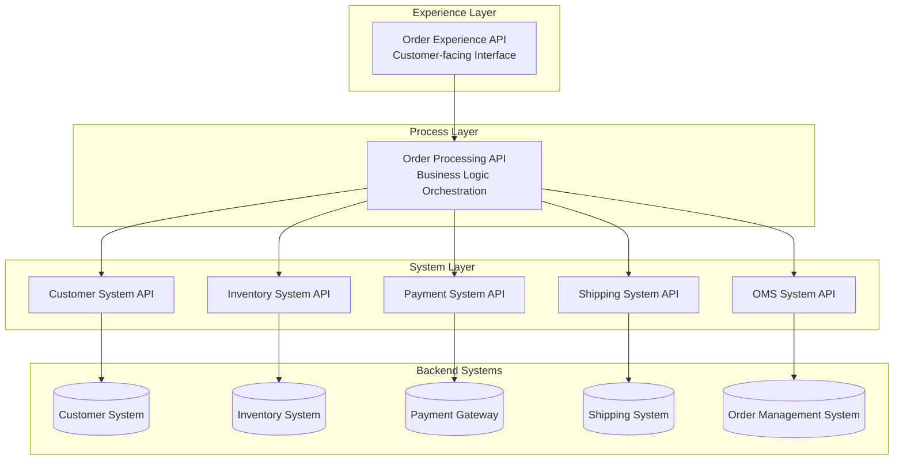
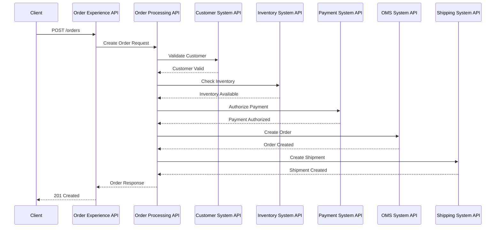

# Technical Specification
## Order Management System Integration

### Change History

| Date | Owner | Jira Case | Status |
|------|-------|-----------|--------|
| March 20, 2026 | Integration Team | OMS-INT-001 | In Progress |

---

## Table of Contents
1. [Introduction](#1-introduction)
2. [Solution Involve](#2-solution-involve)
3. [Technical Design Details](#3-technical-design-details)
4. [Error Handling Details](#4-error-handling-details)
5. [Connectivity Details](#5-connectivity-details)
6. [Volumetric Details](#6-volumetric-details)
7. [Application Details](#7-application-details)
8. [Mapping Details](#8-mapping-details)

---

## 1. Introduction

### 1.1 Business Objective

The organization requires an integrated Order Management System (OMS) that connects multiple enterprise systems to enable:

- **Real-time order creation and processing**
- **Integration with upstream and downstream enterprise systems**
- **Accurate inventory validation before order confirmation**
- **Order lifecycle tracking from creation to delivery**
- **Secure and scalable API-based integration architecture**

The objective is to enable real-time order processing, validation, fulfillment, and tracking across systems through a unified integration layer using MuleSoft Anypoint Platform.

### 1.2 References Link

| Document | Link/Location |
|----------|---------------|
| Integration BRD | Integration Business Requirements Document.docx |
| API Specifications | To be published in Exchange |
| GitHub Repository | To be provided |
| RAML Files | To be stored in Design Center |

---

## 2. Solution Involve

### 2.1 Integration Overview

The Order Management System integration follows **API-Led Connectivity architecture** with three layers:

- **Experience Layer:** Order Experience API - Customer-facing interfaces
- **Process Layer:** Order Processing API - Business logic orchestration  
- **System Layer:** Individual System APIs for backend connectivity

**Integration Platform:** MuleSoft Anypoint Platform 4.4+

### 2.2 Key Integration Objective

**In Scope:**
- Order creation, retrieval, and status updates
- Customer and inventory validation
- Payment processing integration
- Shipment initiation and tracking
- Real-time data synchronization

**Out of Scope:**
- Warehouse management system redesign
- Payment gateway internal processing
- Customer portal UI development

**Success Criteria:**
- Orders processed successfully end-to-end
- APIs meet performance SLAs (< 3 seconds response time)
- Order lifecycle tracking accuracy
- System synchronization maintained

---

## 3. Technical Design Details

### 3.1 Integration Architecture Diagram



### 3.2 Sequence Diagram

#### Order Creation Flow



### 3.3 Layer Responsibilities

#### Experience Layer (Order Experience API)
- **Responsibilities:**
  - Customer-facing order management interface
  - Request/response transformation
  - Rate limiting and throttling
  - Basic input validation
  - Response formatting

- **Endpoints:**
  - `POST /orders` - Create new order
  - `GET /orders/{orderId}` - Retrieve order details
  - `GET /orders` - List orders with pagination
  - `PATCH /orders/{orderId}/status` - Update order status

#### Process Layer (Order Processing API)  
- **Responsibilities:**
  - Business logic orchestration
  - Multi-system coordination
  - Transaction management
  - Error handling and compensation
  - Event publishing

- **Key Processes:**
  - Order validation workflow
  - Payment authorization process  
  - Inventory reservation logic
  - Shipment creation coordination
  - Status update propagation

#### System Layer (Individual System APIs)
- **Customer System API:**
  - Customer validation and profile retrieval
  - Customer data synchronization
  
- **Inventory System API:**
  - Product availability checking
  - Inventory reservation and updates
  
- **Payment System API:**
  - Payment authorization and processing
  - Payment status monitoring
  
- **Shipping System API:**
  - Shipment creation and tracking
  - Delivery status updates
  
- **OMS System API:**
  - Core order CRUD operations
  - Order status management

---

## 4. Error Handling Details

### 4.1 Error Classification

#### Standard Error Structure
```json
{
  "error": {
    "code": "ORDER_001",
    "message": "Invalid order data provided",
    "details": "Customer ID is required and must be a valid UUID",
    "timestamp": "2026-03-20T12:00:00Z",
    "traceId": "abc123-def456-ghi789",
    "path": "/api/v1/orders"
  }
}
```

#### Error Code Standards

| Code | Description | HTTP Status |
|------|-------------|-------------|
| 400 | Invalid request | Bad Request |
| 401 | Unauthorized | Unauthorized |
| 404 | Order not found | Not Found |
| 500 | Internal system error | Internal Server Error |

### 4.2 Retry Logic and Circuit Breaker

#### Retry Strategy
```yaml
retryPolicy:
  maxRetries: 3
  backoffStrategy: exponential
  initialDelay: 1000ms
  maxDelay: 30000ms
  retryableErrors:
    - connectionTimeout
    - serviceUnavailable
    - internalServerError
```

#### Circuit Breaker Configuration
```yaml
circuitBreaker:
  failureThreshold: 50% # Trip when 50% of requests fail
  timeout: 60000ms # 60 second timeout
  resetTimeout: 300000ms # 5 minute reset period
  minimumRequestThreshold: 10
```

### 4.3 Compensation Logic

For failed order processing scenarios:

1. **Payment Authorization Failed:**
   - Release inventory reservation
   - Update order status to "payment_failed"
   - Send notification to customer

2. **Inventory Unavailable:**
   - Cancel payment authorization
   - Update order status to "inventory_unavailable"
   - Notify customer of backorder options

3. **Shipment Creation Failed:**
   - Maintain order in "confirmed" status
   - Retry shipment creation
   - Manual intervention for persistent failures

---

## 5. Connectivity Details

### 5.1 Connection Specifications

#### Customer System Integration
- **Protocol:** HTTPS REST
- **Authentication:** OAuth 2.0
- **Endpoint:** `https://crm-api.company.com/api/v1/customers`
- **Timeout:** 30 seconds
- **Connection Pool:** Max 50 connections

#### Inventory System Integration
- **Protocol:** HTTPS REST
- **Authentication:** API Key + Basic Auth
- **Endpoint:** `https://inventory-api.company.com/api/v2/products`
- **Timeout:** 15 seconds
- **Connection Pool:** Max 100 connections

#### Payment Gateway Integration
- **Protocol:** HTTPS REST
- **Authentication:** API Key + Digital Signatures
- **Endpoint:** `https://payment-gateway.provider.com/api/v1/payments`
- **Timeout:** 45 seconds
- **Connection Pool:** Max 25 connections

#### Shipping System Integration
- **Protocol:** HTTPS REST
- **Authentication:** Bearer Token
- **Endpoint:** `https://shipping-api.logistics.com/api/v1/shipments`
- **Timeout:** 30 seconds
- **Connection Pool:** Max 50 connections

### 5.2 Security Requirements

- **Encryption:** TLS 1.3 for data in transit
- **Client Authentication:** OAuth 2.0 / Client ID enforcement
- **Token Management:** JWT tokens with 1-hour expiry
- **Data Masking:** PII fields masked in logs
- **IP Whitelisting:** Configured at API Gateway level

---

## 6. Volumetric Details

### 6.1 Performance Requirements

| Metric | Peak Load | Average Load | SLA |
|--------|-----------|--------------|-----|
| Orders per Hour | 10,000 | 2,500 | < 3 seconds response |
| Concurrent Users | 1,000 | 250 | 99.9% availability |
| API Requests/Second | 100 | 25 | < 200ms (95th percentile) |
| Database Transactions | 50,000/hour | 12,500/hour | < 100ms query time |

### 6.2 Scalability Specifications

#### Horizontal Scaling
- **API Gateway:** Auto-scale 2-20 instances
- **Mule Applications:** 4-50 workers per application
- **Database:** Read replicas for query distribution
- **Cache Layer:** Redis cluster with 3-10 nodes

#### Resource Allocation
- **Memory:** 2-8 GB per Mule worker
- **CPU:** 2-8 vCores per worker
- **Storage:** 100 GB minimum, auto-expand to 1 TB
- **Network:** 1 Gbps minimum bandwidth

---

## 7. Application Details

### 7.1 Environment Details

#### Development Environment
- **Platform:** MuleSoft CloudHub 2.0 Sandbox
- **Workers:** 2 x 0.2 vCore workers
- **Region:** US East (N. Virginia)
- **Runtime:** Mule 4.4.0-20220824

#### Test Environment
- **Platform:** MuleSoft CloudHub 2.0
- **Workers:** 4 x 0.5 vCore workers  
- **Region:** US East (N. Virginia)
- **Runtime:** Mule 4.4.0-20220824

#### Production Environment
- **Platform:** MuleSoft CloudHub 2.0
- **Workers:** 8 x 1.0 vCore workers
- **Region:** US East (N. Virginia) + US West (Oregon)
- **Runtime:** Mule 4.4.0-20220824

### 7.2 RAML Specifications

#### Order Experience API RAML
```yaml
#%RAML 1.0
title: Order Experience API
version: v1
baseUri: https://api.company.com/orders/v1
protocols: [HTTPS]

securitySchemes:
  oauth2: !include security/oauth2.raml

/orders:
  post:
    displayName: Create Order
    description: Creates a new customer order
    securedBy: [oauth2]
    body:
      application/json:
        type: CreateOrderRequest
        example: !include examples/create-order-request.json
    responses:
      201:
        body:
          application/json:
            type: OrderResponse
            example: !include examples/order-response.json
      400:
        body:
          application/json:
            type: ErrorResponse
      500:
        body:
          application/json:
            type: ErrorResponse

  get:
    displayName: List Orders
    description: Retrieves a list of orders with pagination
    securedBy: [oauth2]
    queryParameters:
      customerId?: string
      status?: string
      limit?: 
        type: integer
        default: 20
        maximum: 100
      offset?:
        type: integer
        default: 0
    responses:
      200:
        body:
          application/json:
            type: OrderListResponse

  /{orderId}:
    get:
      displayName: Get Order
      description: Retrieves details of a specific order
      securedBy: [oauth2]
      responses:
        200:
          body:
            application/json:
              type: OrderResponse
        404:
          body:
            application/json:
              type: ErrorResponse

types:
  CreateOrderRequest: !include types/create-order-request.raml
  OrderResponse: !include types/order-response.raml
  OrderListResponse: !include types/order-list-response.raml
  ErrorResponse: !include types/error-response.raml
```

### 7.3 GitHub Repository Structure

```
oms-integration/
├── src/
│   ├── main/
│   │   ├── mule/
│   │   │   ├── order-experience-api.xml
│   │   │   ├── order-processing-api.xml
│   │   │   ├── customer-system-api.xml
│   │   │   ├── inventory-system-api.xml
│   │   │   ├── payment-system-api.xml
│   │   │   └── shipping-system-api.xml
│   │   └── resources/
│   │       ├── application.yaml
│   │       ├── application-dev.yaml
│   │       ├── application-test.yaml
│   │       └── application-prod.yaml
│   └── test/
│       └── munit/
│           ├── order-experience-api-test.xml
│           └── order-processing-api-test.xml
├── exchange_modules/
├── pom.xml
├── README.md
└── .gitignore
```

---

## 8. Mapping Details

### 8.1 Data Transformation Specifications

#### Order Request Transformation (Experience → Process Layer)

**Input:** Order Experience API Request
```json
{
  "customer": {
    "id": "cust-123",
    "email": "customer@email.com"
  },
  "items": [
    {
      "productCode": "PROD-001",
      "quantity": 2,
      "price": 29.99
    }
  ],
  "shipping": {
    "address": "123 Main St, City, State 12345",
    "method": "standard"
  },
  "payment": {
    "method": "credit_card",
    "token": "pay-token-456"
  }
}
```

**Output:** Order Processing API Format
```json
{
  "orderId": "ORD-2026032012001",
  "customerId": "cust-123",
  "customerEmail": "customer@email.com",
  "orderItems": [
    {
      "productId": "PROD-001",
      "quantity": 2,
      "unitPrice": 29.99,
      "totalPrice": 59.98
    }
  ],
  "shippingDetails": {
    "address": {
      "street": "123 Main St",
      "city": "City", 
      "state": "State",
      "zipCode": "12345"
    },
    "method": "STANDARD_SHIPPING"
  },
  "paymentDetails": {
    "method": "CREDIT_CARD",
    "authorizationToken": "pay-token-456"
  },
  "orderTotal": 59.98,
  "currency": "USD",
  "status": "PENDING",
  "createdAt": "2026-03-20T12:00:00Z"
}
```

#### DataWeave Transformation Script

```dataweave
%dw 2.0
output application/json
---
{
  orderId: "ORD-" ++ now() as String {format: "yyyyMMddHHmmss"} ++ (random() * 1000) as Number as String,
  customerId: payload.customer.id,
  customerEmail: payload.customer.email,
  orderItems: payload.items map ((item, index) -> {
    productId: item.productCode,
    quantity: item.quantity,
    unitPrice: item.price,
    totalPrice: item.quantity * item.price
  }),
  shippingDetails: {
    address: do {
      var addressParts = payload.shipping.address splitBy ", "
      ---
      {
        street: addressParts[0],
        city: addressParts[1],
        state: addressParts[2] splitBy " "[0],
        zipCode: addressParts[2] splitBy " "[1]
      }
    },
    method: upper(payload.shipping.method) ++ "_SHIPPING"
  },
  paymentDetails: {
    method: upper(payload.payment.method),
    authorizationToken: payload.payment.token
  },
  orderTotal: sum(payload.items map ($.quantity * $.price)),
  currency: "USD",
  status: "PENDING",
  createdAt: now()
}
```

### 8.2 System-Specific Mappings

#### Customer System API Mapping
```dataweave
%dw 2.0
output application/json
---
{
  // Input: Order Processing API format
  // Output: Customer System API format
  customerId: payload.customerId,
  emailAddress: payload.customerEmail,
  validationRequired: true,
  includeProfile: true
}
```

#### Inventory System API Mapping
```dataweave
%dw 2.0
output application/json
---
{
  // Input: Order Processing API format  
  // Output: Inventory System API format
  products: payload.orderItems map {
    productId: $.productId,
    requestedQuantity: $.quantity,
    reservationId: payload.orderId ++ "-" ++ $.productId
  }
}
```

#### Payment System API Mapping
```dataweave
%dw 2.0
output application/json
---
{
  // Input: Order Processing API format
  // Output: Payment Gateway format
  transactionId: payload.orderId,
  amount: payload.orderTotal,
  currency: payload.currency,
  paymentMethod: payload.paymentDetails.method,
  authToken: payload.paymentDetails.authorizationToken,
  merchantId: p('payment.merchant.id'),
  description: "Order payment for " ++ payload.orderId
}
```

#### Shipping System API Mapping  
```dataweave
%dw 2.0
output application/json
---
{
  // Input: Order Processing API format
  // Output: Shipping System format
  orderId: payload.orderId,
  customerId: payload.customerId,
  shipmentItems: payload.orderItems map {
    productId: $.productId,
    quantity: $.quantity,
    description: "Product " ++ $.productId
  },
  shippingAddress: {
    street1: payload.shippingDetails.address.street,
    city: payload.shippingDetails.address.city,
    state: payload.shippingDetails.address.state,
    postalCode: payload.shippingDetails.address.zipCode,
    country: "US"
  },
  serviceLevel: payload.shippingDetails.method,
  instructions: "Handle with care"
}
```

### 8.3 Error Response Mappings

#### Standardized Error Response Format
```dataweave
%dw 2.0
output application/json
---
{
  error: {
    code: vars.errorCode default "SYSTEM_ERROR",
    message: error.description default "An unexpected error occurred",
    details: error.detailedDescription default "",
    timestamp: now(),
    traceId: correlationId,
    path: attributes.requestPath default ""
  }
}
```

---

## Appendix

### A.1 Sample Payloads

#### Create Order Request Sample
```json
{
  "customer": {
    "id": "cust-12345",
    "email": "john.doe@email.com"
  },
  "items": [
    {
      "productCode": "LAPTOP-001",
      "quantity": 1,
      "price": 999.99
    },
    {
      "productCode": "MOUSE-001", 
      "quantity": 2,
      "price": 29.99
    }
  ],
  "shipping": {
    "address": "123 Technology Drive, San Francisco, CA 94105",
    "method": "express"
  },
  "payment": {
    "method": "credit_card",
    "token": "tok_1234567890abcdef"
  }
}
```

#### Order Response Sample
```json
{
  "orderId": "ORD-20260320120001",
  "customerId": "cust-12345",
  "status": "confirmed",
  "items": [
    {
      "productId": "LAPTOP-001",
      "productName": "Business Laptop Pro",
      "quantity": 1,
      "unitPrice": 999.99,
      "totalPrice": 999.99
    },
    {
      "productId": "MOUSE-001",
      "productName": "Wireless Mouse",
      "quantity": 2,
      "unitPrice": 29.99,
      "totalPrice": 59.98
    }
  ],
  "totalAmount": 1059.97,
  "currency": "USD",
  "paymentStatus": "authorized",
  "shipmentStatus": "pending",
  "createdAt": "2026-03-20T12:00:01Z",
  "updatedAt": "2026-03-20T12:00:05Z",
  "trackingInfo": {
    "shipmentId": "SHIP-20260320001",
    "estimatedDelivery": "2026-03-22T18:00:00Z"
  }
}
```

### A.2 Technology Stack Summary

| Component | Technology | Version |
|-----------|------------|---------|
| Integration Platform | MuleSoft Anypoint Platform | 4.4+ |
| Runtime | Mule Runtime | 4.4.0 |
| Deployment | CloudHub 2.0 | Latest |
| API Specification | RAML | 1.0 |
| Data Format | JSON | - |
| Authentication | OAuth 2.0 | - |
| Monitoring | Anypoint Monitoring | - |
| Version Control | Git | 2.x |

---

**Document Status:** In Progress  
**Next Review Date:** March 27, 2026  
**Approval Required:** Architecture Review Board