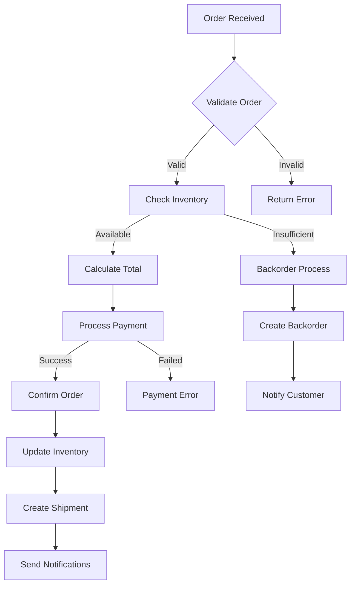
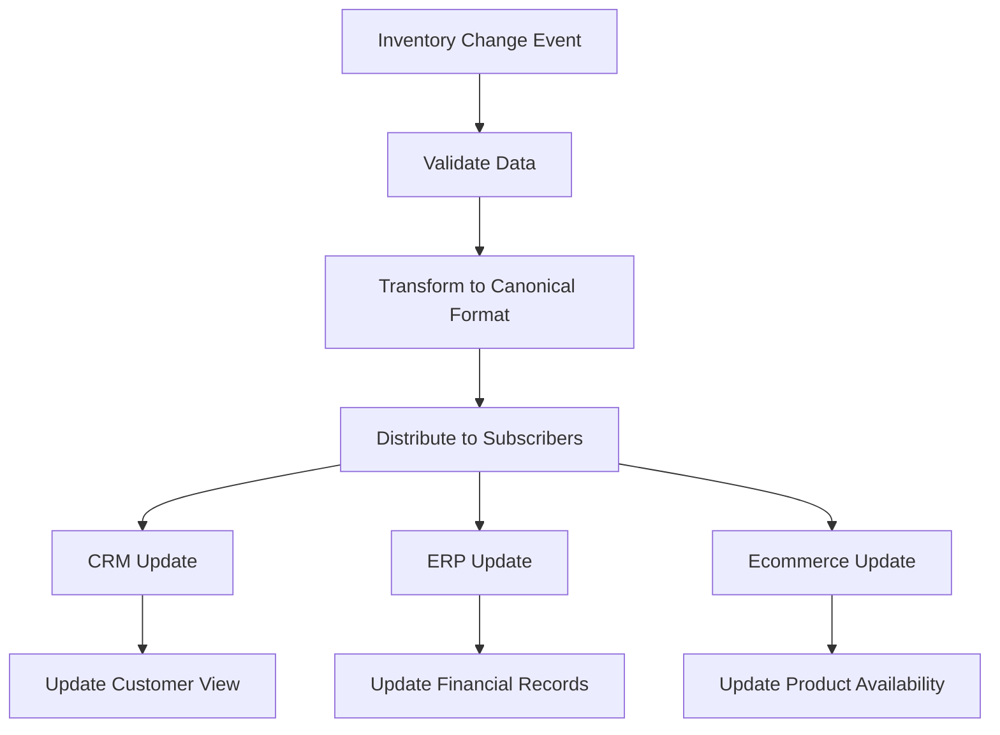
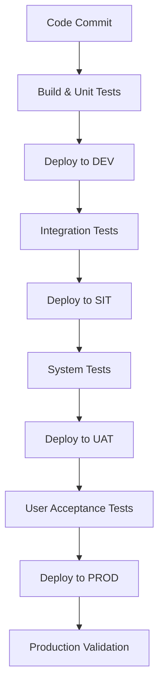

# Functional Design Document
## Order Management System Integration

---

### Document Information

| Field | Details |
|-------|---------|
| **Project Name** | Order Management System Integration |
| **Document Type** | Functional Design Document (FSD) |
| **Version** | 1.0 |
| **Date** | March 24, 2026 |
| **Author** | Integration Team |
| **Status** | Draft |

---

## Table of Contents

1. [Introduction](#1-introduction)
2. [Scope and Objectives](#2-scope-and-objectives)
3. [System Architecture Overview](#3-system-architecture-overview)
4. [Functional Requirements](#4-functional-requirements)
5. [Integration Design](#5-integration-design)
6. [Data Flow and Processing](#6-data-flow-and-processing)
7. [Error Handling and Exception Management](#7-error-handling-and-exception-management)
8. [Security and Compliance](#8-security-and-compliance)
9. [Performance and Scalability](#9-performance-and-scalability)
10. [Testing Strategy](#10-testing-strategy)
11. [Deployment and Configuration](#11-deployment-and-configuration)
12. [Monitoring and Maintenance](#12-monitoring-and-maintenance)
13. [Assumptions and Dependencies](#13-assumptions-and-dependencies)
14. [Appendices](#14-appendices)

---

## 1. Introduction

### 1.1 Purpose
This Functional Design Document (FSD) provides a comprehensive technical specification for the Order Management System Integration project. It details the functional requirements, system architecture, integration patterns, and technical implementation approach for connecting multiple systems in the order management ecosystem.

### 1.2 Document Scope
This document covers:
- Functional requirements derived from business requirements
- Integration architecture and design patterns
- Data transformation and mapping specifications
- Error handling and exception management strategies
- Security and compliance considerations
- Performance requirements and scalability design

### 1.3 Target Audience
- Integration Developers
- System Architects
- Quality Assurance Team
- Business Analysts
- Project Managers
- Operations Team

### 1.4 References
- Integration Business Requirements Document
- Order Management System Integration Epic
- System Architecture Guidelines
- Enterprise Integration Standards

---

## 2. Scope and Objectives

### 2.1 Project Scope
The Order Management System Integration project encompasses the development of a comprehensive integration solution that connects:

- **Customer Relationship Management (CRM) System**
- **Enterprise Resource Planning (ERP) System**  
- **Inventory Management System**
- **Payment Processing Gateway**
- **Shipping and Logistics Platform**
- **Business Intelligence and Reporting Tools**

### 2.2 Functional Objectives
1. **Real-time Order Processing**: Enable seamless order creation, modification, and tracking across systems
2. **Inventory Synchronization**: Maintain accurate inventory levels across all platforms
3. **Customer Data Consistency**: Ensure unified customer information across systems
4. **Payment Integration**: Facilitate secure payment processing and reconciliation
5. **Shipping Coordination**: Automate shipping calculations and tracking updates
6. **Business Intelligence**: Provide real-time reporting and analytics capabilities

### 2.3 Technical Objectives
1. **Scalability**: Support high-volume transaction processing
2. **Reliability**: Ensure 99.9% system availability
3. **Performance**: Process orders within 2 seconds end-to-end
4. **Security**: Implement enterprise-grade security measures
5. **Maintainability**: Design for easy maintenance and updates

---

## 3. System Architecture Overview

### 3.1 Integration Architecture Pattern
The solution follows a **Hub-and-Spoke Integration Pattern** with **Event-Driven Architecture** components:

```
┌─────────────────┐    ┌─────────────────────────┐    ┌─────────────────┐
│   CRM System    │◄──►│                         │◄──►│   ERP System    │
└─────────────────┘    │                         │    └─────────────────┘
                       │                         │
┌─────────────────┐    │    MuleSoft Anypoint   │    ┌─────────────────┐
│  Inventory      │◄──►│    Integration Hub      │◄──►│   Payment       │
│  Management     │    │                         │    │   Gateway       │
└─────────────────┘    │                         │    └─────────────────┘
                       │                         │
┌─────────────────┐    │                         │    ┌─────────────────┐
│   Shipping &    │◄──►│                         │◄──►│   Business      │
│   Logistics     │    │                         │    │   Intelligence  │
└─────────────────┘    └─────────────────────────┘    └─────────────────┘
```

### 3.2 Core Components

#### 3.2.1 Integration Platform
- **Platform**: MuleSoft Anypoint Platform
- **Runtime**: Mule 4.x Runtime Engine
- **Deployment**: CloudHub 2.0 / Runtime Fabric
- **API Management**: Anypoint API Manager

#### 3.2.2 Message Broker
- **Primary**: Anypoint MQ for reliable messaging
- **Backup**: Apache Kafka for high-throughput scenarios

#### 3.2.3 Data Storage
- **Cache**: Redis for session and temporary data
- **Database**: PostgreSQL for transactional data
- **Data Lake**: AWS S3 for analytics and archival

### 3.3 Integration Patterns
1. **Request-Response**: Synchronous operations for real-time data
2. **Publish-Subscribe**: Event notifications across systems
3. **Message Queuing**: Asynchronous processing for high-volume operations
4. **Batch Processing**: Scheduled data synchronization

---

## 4. Functional Requirements

### 4.1 Order Processing Requirements

#### 4.1.1 Order Creation (FR-001)
- **Description**: Process new order creation from multiple channels
- **Input**: Order details, customer information, product specifications
- **Processing**: 
  - Validate customer data against CRM
  - Check inventory availability
  - Calculate pricing and taxes
  - Initiate payment processing
- **Output**: Order confirmation with unique order ID
- **SLA**: Response time < 2 seconds

#### 4.1.2 Order Modification (FR-002)
- **Description**: Handle order updates and modifications
- **Capabilities**:
  - Add/remove line items
  - Update quantities
  - Modify shipping information
  - Cancel orders
- **Validation**: Business rule validation before updates
- **Notification**: Real-time updates to relevant systems

#### 4.1.3 Order Tracking (FR-003)
- **Description**: Provide real-time order status tracking
- **Status Types**:
  - Order Received
  - Payment Confirmed
  - In Production
  - Shipped
  - Delivered
  - Completed
- **Integration**: Update status across all connected systems

### 4.2 Inventory Management Requirements

#### 4.2.1 Real-time Inventory Sync (FR-004)
- **Description**: Maintain accurate inventory levels across systems
- **Frequency**: Real-time updates for critical items, batch updates for others
- **Scope**: Available quantities, reserved stock, backordered items
- **Conflict Resolution**: Last-write-wins with audit trail

#### 4.2.2 Low Stock Alerts (FR-005)
- **Description**: Generate alerts for low inventory levels
- **Triggers**: Configurable thresholds per product category
- **Recipients**: Procurement team, inventory managers
- **Integration**: ERP system for automatic reorder processing

### 4.3 Customer Data Management Requirements

#### 4.3.1 Customer Profile Sync (FR-006)
- **Description**: Synchronize customer information across systems
- **Data Elements**:
  - Contact information
  - Preferences
  - Purchase history
  - Credit limits
  - Loyalty status
- **Conflict Resolution**: CRM system as master data source

#### 4.3.2 Customer 360 View (FR-007)
- **Description**: Provide comprehensive customer view for service teams
- **Integration**: Aggregate data from CRM, ERP, and order history
- **Real-time**: Support real-time customer inquiries

### 4.4 Payment Processing Requirements

#### 4.4.1 Payment Gateway Integration (FR-008)
- **Description**: Process payments securely across multiple gateways
- **Support**:
  - Credit/Debit cards
  - Digital wallets
  - Bank transfers
  - Corporate payment terms
- **Security**: PCI DSS compliance
- **Reconciliation**: Automated payment matching

#### 4.4.2 Refund and Credit Processing (FR-009)
- **Description**: Handle returns and credit processing
- **Workflow**:
  - Return authorization
  - Inventory update
  - Credit issuance
  - Customer notification
- **Integration**: Update financial records in ERP

### 4.5 Shipping and Logistics Requirements

#### 4.5.1 Shipping Rate Calculation (FR-010)
- **Description**: Calculate shipping costs in real-time
- **Integration**: Multiple carrier APIs (FedEx, UPS, DHL)
- **Factors**: Weight, dimensions, destination, service level
- **Caching**: Cache rates for performance optimization

#### 4.5.2 Tracking Integration (FR-011)
- **Description**: Provide unified tracking across carriers
- **Capabilities**:
  - Track shipments across multiple carriers
  - Proactive delivery notifications
  - Exception handling for delays
- **Customer Interface**: Self-service tracking portal

---

## 5. Integration Design

### 5.1 API Design Standards

#### 5.1.1 RESTful API Design
- **Protocol**: HTTP/HTTPS
- **Format**: JSON for data exchange
- **Authentication**: OAuth 2.0 / JWT tokens
- **Versioning**: URI versioning (v1, v2, etc.)
- **Error Handling**: Standardized HTTP status codes

#### 5.1.2 Event-Driven Design
- **Event Format**: CloudEvents specification
- **Message Broker**: Anypoint MQ
- **Event Types**:
  - OrderCreated
  - OrderUpdated
  - PaymentProcessed
  - InventoryUpdated
  - ShipmentCreated

### 5.2 Data Transformation and Mapping

#### 5.2.1 Canonical Data Model
Central data models for key entities:

**Order Entity**:
```json
{
  "orderId": "string",
  "customerId": "string",
  "orderDate": "datetime",
  "status": "string",
  "totalAmount": "decimal",
  "currency": "string",
  "lineItems": [
    {
      "productId": "string",
      "quantity": "integer",
      "unitPrice": "decimal",
      "totalPrice": "decimal"
    }
  ],
  "shippingAddress": {
    "street": "string",
    "city": "string",
    "state": "string",
    "zipCode": "string",
    "country": "string"
  },
  "paymentInfo": {
    "paymentMethod": "string",
    "transactionId": "string",
    "status": "string"
  }
}
```

**Customer Entity**:
```json
{
  "customerId": "string",
  "firstName": "string",
  "lastName": "string",
  "email": "string",
  "phone": "string",
  "addresses": [
    {
      "type": "string",
      "street": "string",
      "city": "string",
      "state": "string",
      "zipCode": "string",
      "country": "string"
    }
  ],
  "preferences": {
    "communicationMethod": "string",
    "loyaltyTier": "string"
  }
}
```

#### 5.2.2 Transformation Rules
- **Date/Time**: ISO 8601 format standardization
- **Currency**: Decimal precision handling
- **Address**: Standardized format validation
- **Product Codes**: Cross-system mapping tables

### 5.3 Integration Patterns Implementation

#### 5.3.1 Synchronous Integration
- **Use Cases**: Real-time inventory checks, payment processing
- **Implementation**: HTTP-based REST APIs
- **Timeout**: 5 seconds maximum
- **Retry Logic**: Exponential backoff

#### 5.3.2 Asynchronous Integration
- **Use Cases**: Order updates, inventory synchronization
- **Implementation**: Message queues with Anypoint MQ
- **Reliability**: Guaranteed delivery with dead letter queues
- **Ordering**: FIFO queues where sequence matters

---

## 6. Data Flow and Processing

### 6.1 Order Processing Flow



### 6.2 Inventory Synchronization Flow



### 6.3 Customer Data Synchronization

1. **Master Data Source**: CRM system maintains customer master data
2. **Change Detection**: Real-time change data capture
3. **Distribution**: Publish changes to subscriber systems
4. **Conflict Resolution**: Timestamp-based with audit trail
5. **Data Quality**: Validation rules enforcement

---

## 7. Error Handling and Exception Management

### 7.1 Error Classification

#### 7.1.1 System Errors
- **Connection Timeouts**: Network connectivity issues
- **Service Unavailable**: Downstream system outages
- **Authentication Failures**: Security token issues
- **Data Format Errors**: Invalid data structure

#### 7.1.2 Business Errors
- **Validation Failures**: Business rule violations
- **Insufficient Inventory**: Stock availability issues
- **Payment Declined**: Payment processing failures
- **Address Validation**: Shipping address problems

### 7.2 Error Handling Strategies

#### 7.2.1 Retry Mechanisms
- **Immediate Retry**: For transient network errors (max 3 attempts)
- **Exponential Backoff**: For system overload scenarios
- **Circuit Breaker**: Prevent cascade failures
- **Dead Letter Queue**: For unprocessable messages

#### 7.2.2 Compensation Patterns
- **Saga Pattern**: For distributed transaction management
- **Compensating Actions**: Reverse completed operations
- **Idempotency**: Ensure operations can be safely retried

### 7.3 Error Monitoring and Alerting

#### 7.3.1 Real-time Monitoring
- **Error Rate Thresholds**: Alert on error rate > 5%
- **Response Time Monitoring**: Alert on response time > 5 seconds
- **System Health Checks**: Automated endpoint monitoring

#### 7.3.2 Alerting Framework
- **Severity Levels**: Critical, High, Medium, Low
- **Notification Channels**: Email, SMS, Slack, PagerDuty
- **Escalation Matrix**: Automated escalation procedures

---

## 8. Security and Compliance

### 8.1 Authentication and Authorization

#### 8.1.1 API Security
- **Authentication**: OAuth 2.0 with JWT tokens
- **Authorization**: Role-based access control (RBAC)
- **API Keys**: Client identification and rate limiting
- **Certificate-based**: Mutual TLS for system-to-system

#### 8.1.2 Token Management
- **Token Lifetime**: Access tokens expire in 1 hour
- **Refresh Tokens**: Valid for 24 hours
- **Token Revocation**: Immediate token invalidation capability
- **Secure Storage**: Encrypted token storage

### 8.2 Data Protection

#### 8.2.1 Encryption
- **Data in Transit**: TLS 1.3 minimum
- **Data at Rest**: AES-256 encryption
- **Key Management**: AWS KMS or Azure Key Vault
- **Certificate Management**: Automated certificate rotation

#### 8.2.2 Sensitive Data Handling
- **PII Protection**: Personal data encryption and masking
- **Payment Data**: PCI DSS compliance
- **Data Retention**: Automated data purging policies
- **Access Logging**: Comprehensive audit trails

### 8.3 Compliance Requirements

#### 8.3.1 Regulatory Compliance
- **GDPR**: Data protection and privacy rights
- **PCI DSS**: Payment card industry standards
- **SOX**: Financial reporting accuracy
- **HIPAA**: Healthcare data protection (if applicable)

#### 8.3.2 Audit and Governance
- **Access Controls**: Regular access reviews
- **Change Management**: Controlled deployment processes
- **Data Lineage**: Track data flow across systems
- **Compliance Reporting**: Automated compliance dashboards

---

## 9. Performance and Scalability

### 9.1 Performance Requirements

#### 9.1.1 Response Time Requirements
- **Order Creation**: < 2 seconds end-to-end
- **Order Retrieval**: < 500 milliseconds
- **Inventory Check**: < 1 second
- **Payment Processing**: < 3 seconds
- **Shipment Creation**: < 1.5 seconds

#### 9.1.2 Throughput Requirements
- **Peak Order Volume**: 10,000 orders per hour
- **Concurrent Users**: 1,000 simultaneous API calls
- **Inventory Updates**: 50,000 updates per hour
- **Event Processing**: 100,000 events per hour

### 9.2 Scalability Design

#### 9.2.1 Horizontal Scaling
- **Auto-scaling**: Automatic instance scaling based on load
- **Load Balancing**: Distribute traffic across multiple instances
- **Stateless Design**: Enable seamless horizontal scaling
- **Caching Strategy**: Implement distributed caching

#### 9.2.2 Resource Optimization
- **Connection Pooling**: Optimize database connections
- **Async Processing**: Use asynchronous patterns for non-critical operations
- **Batch Operations**: Group related operations for efficiency
- **Resource Monitoring**: Continuous performance monitoring

### 9.3 Caching Strategy

#### 9.3.1 Cache Layers
- **Application Cache**: In-memory caching for frequently accessed data
- **Distributed Cache**: Redis for shared cache across instances
- **Database Cache**: Query result caching
- **API Response Cache**: Cache API responses where appropriate

#### 9.3.2 Cache Management
- **TTL Strategy**: Time-based cache expiration
- **Cache Invalidation**: Event-driven cache updates
- **Cache Warming**: Pre-load frequently accessed data
- **Cache Monitoring**: Track cache hit/miss ratios

---

## 10. Testing Strategy

### 10.1 Testing Approach

#### 10.1.1 Unit Testing
- **Coverage Target**: Minimum 80% code coverage
- **Framework**: MUnit for MuleSoft applications
- **Scope**: Individual components and transformations
- **Automation**: Integrated with CI/CD pipeline

#### 10.1.2 Integration Testing
- **API Testing**: Validate API contracts and responses
- **End-to-End Testing**: Complete business process validation
- **System Integration**: Test interactions between systems
- **Data Validation**: Verify data transformation accuracy

#### 10.1.3 Performance Testing
- **Load Testing**: Validate performance under expected load
- **Stress Testing**: Test system limits and breaking points
- **Volume Testing**: Validate with realistic data volumes
- **Scalability Testing**: Test auto-scaling capabilities

### 10.2 Test Data Management

#### 10.2.1 Test Data Strategy
- **Synthetic Data**: Generated test data for development
- **Anonymized Production Data**: Masked real data for testing
- **Test Data Refresh**: Regular updates to test datasets
- **Data Consistency**: Maintain referential integrity

#### 10.2.2 Test Environment Management
- **Environment Isolation**: Separate test environments
- **Configuration Management**: Environment-specific configurations
- **Data Reset**: Automated test data cleanup
- **Environment Monitoring**: Health checks for test environments

### 10.3 Test Cases

#### 10.3.1 Functional Test Cases
| Test Case ID | Description | Expected Result |
|--------------|-------------|-----------------|
| TC-001 | Create order with valid data | Order created successfully |
| TC-002 | Create order with insufficient inventory | Backorder created |
| TC-003 | Payment processing failure | Order creation fails with proper error |
| TC-004 | Invalid customer data | Validation error returned |
| TC-005 | Order status update | Status propagated to all systems |

#### 10.3.2 Non-Functional Test Cases
| Test Case ID | Description | Acceptance Criteria |
|--------------|-------------|-------------------|
| TC-NF-001 | Response time validation | < 2 seconds for order creation |
| TC-NF-002 | Concurrent user testing | Support 1,000 simultaneous users |
| TC-NF-003 | System recovery testing | Recovery within 5 minutes |
| TC-NF-004 | Security penetration testing | No vulnerabilities identified |

---

## 11. Deployment and Configuration

### 11.1 Deployment Architecture

#### 11.1.1 Environment Strategy
- **Development**: Individual developer environments
- **System Integration Testing (SIT)**: Integrated testing environment
- **User Acceptance Testing (UAT)**: Business validation environment
- **Production**: Live production environment

#### 11.1.2 Deployment Pipeline


### 11.2 Configuration Management

#### 11.2.1 Environment-Specific Configuration
- **Database Connections**: Environment-specific connection strings
- **API Endpoints**: Different endpoints per environment
- **Security Credentials**: Environment-specific certificates and keys
- **Feature Toggles**: Enable/disable features per environment

#### 11.2.2 Configuration Storage
- **Secure Vault**: Store sensitive configuration data
- **Version Control**: Track configuration changes
- **Automated Deployment**: Deploy configurations with applications
- **Configuration Validation**: Validate configurations on deployment

### 11.3 Rollback Strategy

#### 11.3.1 Rollback Procedures
- **Blue-Green Deployment**: Zero-downtime rollback capability
- **Database Rollback**: Database schema and data rollback procedures
- **Configuration Rollback**: Revert to previous configuration versions
- **Monitoring**: Automated detection of deployment issues

---

## 12. Monitoring and Maintenance

### 12.1 Monitoring Strategy

#### 12.1.1 Application Monitoring
- **API Metrics**: Response times, throughput, error rates
- **Business Metrics**: Order processing rates, success rates
- **System Health**: CPU, memory, disk usage
- **Custom Dashboards**: Business-specific monitoring views

#### 12.1.2 Infrastructure Monitoring
- **Server Monitoring**: Infrastructure health and performance
- **Network Monitoring**: Network latency and connectivity
- **Database Monitoring**: Database performance and connections
- **Storage Monitoring**: Disk space and I/O performance

### 12.2 Logging Strategy

#### 12.2.1 Log Management
- **Structured Logging**: JSON-based log format
- **Log Levels**: Debug, Info, Warn, Error, Fatal
- **Log Aggregation**: Centralized log collection
- **Log Retention**: 90-day retention policy

#### 12.2.2 Log Analysis
- **Real-time Analytics**: Real-time log analysis and alerting
- **Search Capabilities**: Full-text search across logs
- **Correlation**: Link related log entries across systems
- **Reporting**: Automated log-based reports

### 12.3 Maintenance Procedures

#### 12.3.1 Preventive Maintenance
- **Regular Updates**: Security patches and updates
- **Performance Tuning**: Regular performance optimization
- **Capacity Planning**: Monitor and plan for growth
- **Health Checks**: Regular system health assessments

#### 12.3.2 Incident Management
- **Incident Response**: Defined procedures for incident handling
- **Escalation Matrix**: Clear escalation procedures
- **Root Cause Analysis**: Post-incident analysis process
- **Knowledge Base**: Document solutions and workarounds

---

## 13. Assumptions and Dependencies

### 13.1 Assumptions

| ID | Assumption | Impact | Status |
|----|------------|---------|--------|
| A-001 | OMS system provides REST APIs for order operations | High | Confirmed |
| A-002 | Inventory system supports real-time validation | High | To be confirmed |
| A-003 | Payment gateway provides authorization APIs | High | Confirmed |
| A-004 | Network connectivity is reliable between systems | Medium | Assumed |
| A-005 | Systems support OAuth 2.0 authentication | High | To be confirmed |

### 13.2 Dependencies

| ID | Dependency | Owner | Due Date | Status |
|----|------------|-------|----------|--------|
| D-001 | OMS API documentation and access | OMS Team | March 30, 2026 | In Progress |
| D-002 | Inventory system API specifications | Inventory Team | April 5, 2026 | Pending |
| D-003 | Payment gateway integration guide | Payment Team | March 28, 2026 | Complete |
| D-004 | Shipping system API access | Logistics Team | April 10, 2026 | Pending |
| D-005 | Security certificates and credentials | Security Team | April 1, 2026 | In Progress |

### 13.3 Constraints

| ID | Constraint | Description | Impact |
|----|------------|-------------|---------|
| C-001 | Budget | Limited budget for third-party tools | Medium |
| C-002 | Timeline | Fixed project deadline | High |
| C-003 | Resources | Limited development resources | Medium |
| C-004 | Technology | Must use MuleSoft Anypoint Platform | Low |
| C-005 | Compliance | Must comply with PCI DSS standards | High |

### 13.4 Risks and Mitigation

| Risk ID | Risk Description | Probability | Impact | Mitigation Strategy |
|---------|------------------|-------------|---------|-------------------|
| R-001 | Inventory system latency causes order delays | Medium | High | Implement retry mechanism and caching |
| R-002 | Payment processing failures | Medium | High | Implement compensation logic and fallback |
| R-003 | System downtime affects order processing | Low | Critical | Implement circuit breaker and failover |
| R-004 | Data synchronization conflicts | Medium | Medium | Implement conflict resolution algorithms |
| R-005 | Security vulnerabilities | Low | Critical | Regular security audits and penetration testing |

---

## 14. Appendices

### 14.1 API Specifications

#### 14.1.1 Order Experience API

**Base URL**: `https://api.company.com/orders/v1`

**Endpoints**:

| Method | Endpoint | Description | Request | Response |
|--------|----------|-------------|---------|----------|
| POST | `/orders` | Create a new order | Order object | Created order with ID |
| GET | `/orders/{orderId}` | Retrieve order by ID | Order ID | Order object |
| GET | `/orders` | List orders with pagination | Query parameters | Order list |
| PATCH | `/orders/{orderId}/status` | Update order status | Status update | Updated order |

**Sample Payloads**:

**Create Order Request**:
```json
{
  "customerId": "CUST-12345",
  "orderDate": "2026-03-24T10:30:00Z",
  "items": [
    {
      "productId": "PROD-001",
      "quantity": 2,
      "unitPrice": 99.99
    },
    {
      "productId": "PROD-002",
      "quantity": 1,
      "unitPrice": 149.99
    }
  ],
  "shippingAddress": {
    "street": "123 Main St",
    "city": "Anytown",
    "state": "CA",
    "zipCode": "12345",
    "country": "US"
  },
  "paymentMethod": "credit_card"
}
```

**Create Order Response**:
```json
{
  "orderId": "ORD-789012",
  "customerId": "CUST-12345",
  "orderDate": "2026-03-24T10:30:00Z",
  "status": "confirmed",
  "totalAmount": 349.97,
  "currency": "USD",
  "items": [
    {
      "productId": "PROD-001",
      "quantity": 2,
      "unitPrice": 99.99,
      "totalPrice": 199.98
    },
    {
      "productId": "PROD-002",
      "quantity": 1,
      "unitPrice": 149.99,
      "totalPrice": 149.99
    }
  ],
  "shippingAddress": {
    "street": "123 Main St",
    "city": "Anytown",
    "state": "CA",
    "zipCode": "12345",
    "country": "US"
  },
  "paymentInfo": {
    "paymentMethod": "credit_card",
    "transactionId": "TXN-456789",
    "status": "authorized"
  },
  "estimatedDelivery": "2026-03-28T18:00:00Z"
}
```

### 14.2 Error Response Format

**Standard Error Response**:
```json
{
  "error": {
    "code": "INVALID_REQUEST",
    "message": "The request contains invalid data",
    "details": [
      {
        "field": "customerId",
        "issue": "Customer ID is required"
      }
    ],
    "timestamp": "2026-03-24T10:30:00Z",
    "correlationId": "550e8400-e29b-41d4-a716-446655440000"
  }
}
```

### 14.3 Integration Flow Diagrams

#### 14.3.1 MuleSoft Flow - Order Creation
```xml
<!-- High-level MuleSoft flow structure -->
<flow name="order-creation-flow">
    <http:listener config-ref="order-listener-config" path="/orders" allowedMethods="POST"/>
    
    <!-- Input Validation -->
    <validation:is-not-empty value="#[payload.customerId]" message="Customer ID is required"/>
    
    <!-- Customer Validation -->
    <flow-ref name="validate-customer-subflow"/>
    
    <!-- Inventory Check -->
    <flow-ref name="check-inventory-subflow"/>
    
    <!-- Payment Processing -->
    <flow-ref name="process-payment-subflow"/>
    
    <!-- Order Creation -->
    <flow-ref name="create-order-subflow"/>
    
    <!-- Success Response -->
    <set-payload value="#[output application/json --- payload]"/>
    
    <!-- Error Handling -->
    <error-handler>
        <on-error-continue type="VALIDATION">
            <set-payload value="#[{error: 'Validation failed', message: error.description}]"/>
            <set-variable variableName="httpStatus" value="400"/>
        </on-error-continue>
    </error-handler>
</flow>
```

### 14.4 Data Mapping Examples

#### 14.4.1 Customer Data Transformation
**Source (CRM System)**:
```json
{
  "customer_id": "12345",
  "first_name": "John",
  "last_name": "Doe",
  "email_address": "john.doe@email.com",
  "primary_phone": "+1-555-123-4567",
  "billing_address": {
    "address_line_1": "123 Main St",
    "city_name": "Anytown",
    "state_code": "CA",
    "postal_code": "12345"
  }
}
```

**Target (Canonical Format)**:
```json
{
  "customerId": "12345",
  "firstName": "John",
  "lastName": "Doe",
  "email": "john.doe@email.com",
  "phone": "+1-555-123-4567",
  "addresses": [
    {
      "type": "billing",
      "street": "123 Main St",
      "city": "Anytown",
      "state": "CA",
      "zipCode": "12345",
      "country": "US"
    }
  ]
}
```

**DataWeave Transformation**:
```dataweave
%dw 2.0
output application/json
---
{
  customerId: payload.customer_id,
  firstName: payload.first_name,
  lastName: payload.last_name,
  email: payload.email_address,
  phone: payload.primary_phone,
  addresses: [
    {
      type: "billing",
      street: payload.billing_address.address_line_1,
      city: payload.billing_address.city_name,
      state: payload.billing_address.state_code,
      zipCode: payload.billing_address.postal_code,
      country: "US"
    }
  ]
}
```

#### 14.4.2 Order Data Transformation
**Source (E-commerce System)**:
```json
{
  "order_number": "WEB-12345",
  "customer_ref": "CUST-67890",
  "order_timestamp": "2026-03-24T10:30:00.000Z",
  "line_items": [
    {
      "sku": "PROD-001",
      "qty": 2,
      "unit_cost": 99.99,
      "line_total": 199.98
    }
  ],
  "shipping_info": {
    "address_1": "456 Oak Ave",
    "city": "Springfield",
    "state": "IL",
    "zip": "62701"
  },
  "payment_details": {
    "method": "VISA",
    "transaction_ref": "TXN-ABC123"
  }
}
```

**Target (OMS System)**:
```json
{
  "orderId": "WEB-12345",
  "customerId": "CUST-67890",
  "orderDate": "2026-03-24T10:30:00Z",
  "status": "pending",
  "lineItems": [
    {
      "productId": "PROD-001",
      "quantity": 2,
      "unitPrice": 99.99,
      "totalPrice": 199.98
    }
  ],
  "shippingAddress": {
    "street": "456 Oak Ave",
    "city": "Springfield",
    "state": "IL",
    "zipCode": "62701",
    "country": "US"
  },
  "paymentInfo": {
    "paymentMethod": "credit_card",
    "transactionId": "TXN-ABC123",
    "status": "pending"
  }
}
```

### 14.5 System Integration Points

#### 14.5.1 Integration Matrix

| Source System | Target System | Integration Type | Protocol | Frequency | Data Volume |
|---------------|---------------|------------------|----------|-----------|-------------|
| E-commerce | OMS | Real-time | REST API | On-demand | 1,000 orders/hour |
| OMS | Inventory | Real-time | REST API | Per order | 5,000 checks/hour |
| OMS | Payment Gateway | Real-time | REST API | Per order | 1,000 payments/hour |
| OMS | Shipping | Real-time | REST API | Per order | 800 shipments/hour |
| Inventory | All Systems | Event-driven | Anypoint MQ | Real-time | 10,000 updates/hour |
| CRM | All Systems | Batch | REST API | Daily | 100,000 records |

#### 14.5.2 Interface Specifications

**Customer Validation Interface**:
- **Endpoint**: `GET /customers/{customerId}/validate`
- **Authentication**: OAuth 2.0
- **Response Time**: < 500ms
- **Error Handling**: Standard HTTP error codes
- **Retry Logic**: 3 attempts with exponential backoff

**Inventory Check Interface**:
- **Endpoint**: `POST /inventory/check`
- **Request Format**: JSON array of product/quantity pairs
- **Response**: Available quantities and reservations
- **Caching**: 5-minute cache for product availability
- **Fallback**: Return last known inventory levels

### 14.6 Configuration Parameters

#### 14.6.1 Environment Configuration

**Development Environment**:
```properties
# API Endpoints
oms.api.baseurl=https://dev-oms.company.com/api/v1
crm.api.baseurl=https://dev-crm.company.com/api/v2
inventory.api.baseurl=https://dev-inventory.company.com/api/v1
payment.api.baseurl=https://dev-payment.company.com/api/v1

# Database Configuration
db.host=dev-db.company.com
db.port=5432
db.name=order_integration_dev
db.username=${DB_USERNAME}
db.password=${DB_PASSWORD}

# Message Queue Configuration
mq.broker.url=ssl://dev-mq.company.com:61617
mq.username=${MQ_USERNAME}
mq.password=${MQ_PASSWORD}

# Security Configuration
oauth.client.id=${OAUTH_CLIENT_ID}
oauth.client.secret=${OAUTH_CLIENT_SECRET}
oauth.token.endpoint=https://auth.company.com/oauth/token
```

**Production Environment**:
```properties
# API Endpoints
oms.api.baseurl=https://oms.company.com/api/v1
crm.api.baseurl=https://crm.company.com/api/v2
inventory.api.baseurl=https://inventory.company.com/api/v1
payment.api.baseurl=https://payment.company.com/api/v1

# Database Configuration
db.host=prod-db.company.com
db.port=5432
db.name=order_integration
db.username=${DB_USERNAME}
db.password=${DB_PASSWORD}

# Message Queue Configuration
mq.broker.url=ssl://mq.company.com:61617
mq.username=${MQ_USERNAME}
mq.password=${MQ_PASSWORD}

# Security Configuration
oauth.client.id=${OAUTH_CLIENT_ID}
oauth.client.secret=${OAUTH_CLIENT_SECRET}
oauth.token.endpoint=https://auth.company.com/oauth/token
```

### 14.7 Success Criteria and Acceptance Criteria

#### 14.7.1 Functional Success Criteria
1. **Order Processing**: 95% of orders processed successfully end-to-end
2. **Data Accuracy**: 99.9% data consistency across all systems
3. **Real-time Updates**: Order status updates propagated within 30 seconds
4. **Error Handling**: All errors properly logged and handled with appropriate user messages
5. **Integration Completeness**: All defined integration points functioning correctly

#### 14.7.2 Non-Functional Success Criteria
1. **Performance**: API response times meet SLA requirements
2. **Scalability**: System handles peak load without degradation
3. **Availability**: 99.9% uptime during business hours
4. **Security**: No security vulnerabilities identified in penetration testing
5. **Monitoring**: Complete visibility into system health and performance

#### 14.7.3 Business Success Criteria
1. **Process Efficiency**: 50% reduction in manual order processing time
2. **Customer Experience**: Improved order tracking and status visibility
3. **Data Quality**: Elimination of data inconsistencies between systems
4. **Operational Efficiency**: Reduced support tickets related to order issues
5. **Business Agility**: Faster time-to-market for new order processing features

---

## Document Approval

### Review and Sign-Off

| Name and Function | Signature | Date | Comments |
|-------------------|-----------|------|----------|
| **Business Owner** | | | |
| **Integration Architect** | | | |
| **Technical Lead** | | | |
| **Quality Assurance Lead** | | | |
| **Security Officer** | | | |
| **Operations Manager** | | | |

### Change History

| Version | Date | Author | Description of Changes |
|---------|------|--------|----------------------|
| 0.1 | March 20, 2026 | Integration Team | Initial draft |
| 0.2 | March 22, 2026 | Integration Team | Added technical specifications |
| 0.3 | March 23, 2026 | Integration Team | Incorporated stakeholder feedback |
| 1.0 | March 24, 2026 | Integration Team | Final version for approval |

---

**Document Status**: Draft  
**Next Review Date**: April 24, 2026  
**Document Owner**: Integration Team  
**Classification**: Internal Use Only

---

*This document is confidential and proprietary to the organization. Distribution is restricted to authorized personnel only.*
