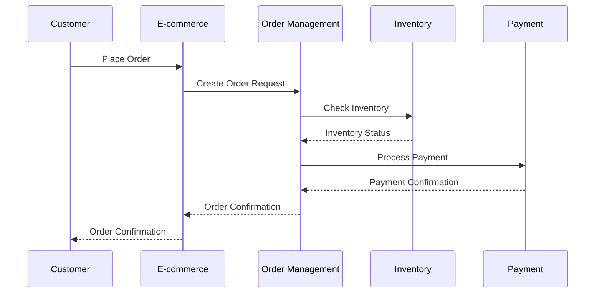
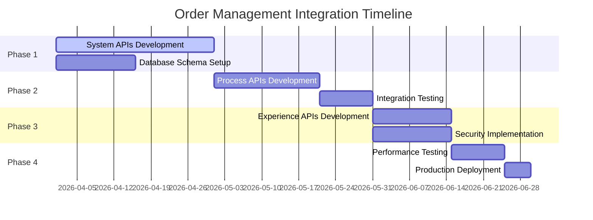
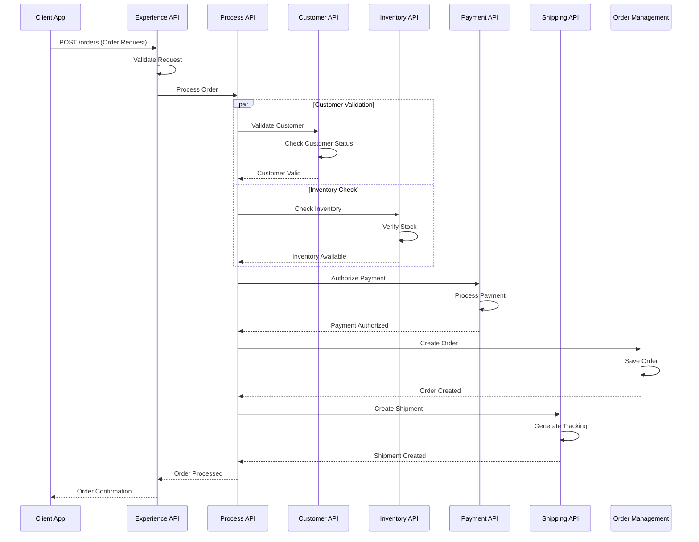
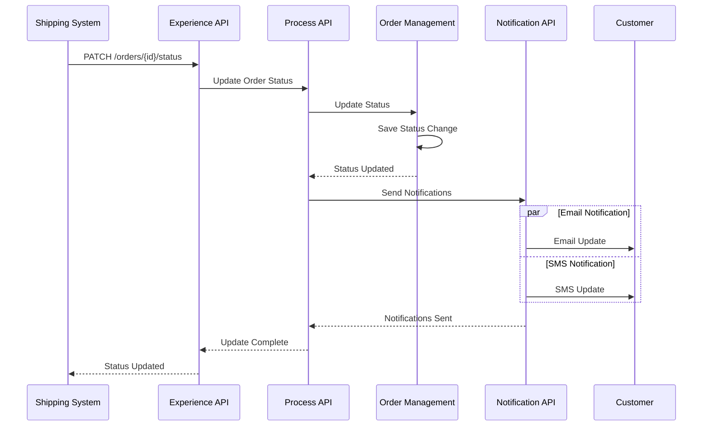

# Technical Design Document
## Order Management System Integration

---

### Document Information
| Field | Value |
|-------|-------|
| **Document Title** | Technical Design Document - Order Management System Integration |
| **Version** | 1.0 |
| **Date** | March 24, 2026 |
| **Author** | Integration Team |
| **Status** | Draft |
| **Project** | Order Management System Integration |

---

## 1. Executive Summary

### 1.1 Purpose
This Technical Design Document (TDD) provides the detailed technical architecture and implementation approach for integrating the Order Management System with various internal and external systems. The integration aims to create a unified, real-time order processing ecosystem that enhances operational efficiency and customer experience.

### 1.2 Scope
The document covers:
- System architecture and integration patterns
- Data flow specifications
- API design and interfaces
- Security implementation
- Error handling and monitoring strategies
- Performance and scalability considerations

### 1.3 Business Context
Based on the Integration Business Requirements Document, this solution addresses the need for seamless order processing across multiple channels, real-time inventory management, and automated fulfillment workflows.

---

## 2. System Architecture

### 2.1 High-Level Architecture

```
┌─────────────────────────────────────────────────────────────────┐
│                    Integration Layer (MuleSoft)                 │
├─────────────────────────────────────────────────────────────────┤
│  ┌─────────────┐  ┌─────────────┐  ┌─────────────┐            │
│  │   API Led   │  │ Experience  │  │   System    │            │
│  │Connectivity │  │    APIs     │  │    APIs     │            │
│  └─────────────┘  └─────────────┘  └─────────────┘            │
└─────────────────────────────────────────────────────────────────┘
           │                    │                    │
┌──────────▼─────────┐ ┌─────────▼──────────┐ ┌────▼─────────────┐
│   E-commerce       │ │    Mobile App      │ │  Customer Portal │
│   Platform         │ │                    │ │                  │
└────────────────────┘ └────────────────────┘ └──────────────────┘

┌─────────────────────────────────────────────────────────────────┐
│                    Core Systems                                 │
├─────────────┬─────────────┬─────────────┬─────────────────────┤
│    Order    │ Inventory   │  Payment    │     Fulfillment     │
│ Management  │ Management  │ Processing  │     Center          │
│   System    │   System    │   System    │                     │
└─────────────┴─────────────┴─────────────┴─────────────────────┘
```

### 2.2 Integration Architecture Patterns

#### 2.2.1 API-Led Connectivity
- **Experience APIs**: Customer-facing interfaces optimized for specific channels
- **Process APIs**: Orchestration layer for business processes
- **System APIs**: Direct system integrations with standardized interfaces

#### 2.2.2 Event-Driven Architecture
- Asynchronous processing for order events
- Real-time notifications and updates
- Decoupled system interactions

### 2.3 Technology Stack

| Layer | Technology | Purpose |
|-------|------------|---------|
| **Integration Platform** | MuleSoft Anypoint Platform | API management and integration |
| **API Gateway** | MuleSoft API Manager | API security, rate limiting, analytics |
| **Message Queue** | Apache Kafka / RabbitMQ | Asynchronous messaging |
| **Database** | PostgreSQL / MongoDB | Data persistence |
| **Monitoring** | MuleSoft Anypoint Monitoring | Performance and health monitoring |
| **Security** | OAuth 2.0 / JWT | Authentication and authorization |

---

## 3. Integration Specifications

### 3.1 Order Processing Flow

#### 3.1.1 Order Creation Process


#### 3.1.2 Data Models

**Order Entity Structure:**
```json
{
  "orderId": "ORD-2026-001",
  "customerId": "CUST-12345",
  "orderDate": "2026-03-24T16:30:00Z",
  "status": "CONFIRMED",
  "channel": "ECOMMERCE",
  "items": [
    {
      "productId": "PROD-789",
      "quantity": 2,
      "unitPrice": 29.99,
      "totalPrice": 59.98
    }
  ],
  "totalAmount": 59.98,
  "shippingAddress": {
    "street": "123 Main St",
    "city": "New York",
    "state": "NY",
    "zipCode": "10001"
  },
  "paymentInfo": {
    "method": "CREDIT_CARD",
    "transactionId": "TXN-456789"
  }
}
```

### 3.2 API Specifications

#### 3.2.1 Order Management APIs

| API | Method | Endpoint | Description |
|-----|--------|----------|-------------|
| Create Order | POST | `/api/v1/orders` | Create a new order |
| Get Order | GET | `/api/v1/orders/{orderId}` | Retrieve order details |
| Update Order | PUT | `/api/v1/orders/{orderId}` | Update order information |
| Cancel Order | DELETE | `/api/v1/orders/{orderId}` | Cancel an existing order |
| List Orders | GET | `/api/v1/orders` | List orders with filters |

#### 3.2.2 Inventory Management APIs

| API | Method | Endpoint | Description |
|-----|--------|----------|-------------|
| Check Inventory | GET | `/api/v1/inventory/{productId}` | Check product availability |
| Reserve Inventory | POST | `/api/v1/inventory/reserve` | Reserve inventory for order |
| Release Inventory | POST | `/api/v1/inventory/release` | Release reserved inventory |
| Update Inventory | PUT | `/api/v1/inventory/{productId}` | Update inventory levels |

### 3.3 Integration Patterns

#### 3.3.1 Synchronous Integration
- **Use Cases**: Real-time inventory checks, payment processing
- **Protocol**: REST APIs over HTTPS
- **Response Time**: < 2 seconds
- **Error Handling**: Immediate error response with retry logic

#### 3.3.2 Asynchronous Integration
- **Use Cases**: Order status updates, fulfillment notifications
- **Protocol**: Message queues (Kafka/RabbitMQ)
- **Delivery**: At-least-once delivery guarantee
- **Error Handling**: Dead letter queues for failed messages

---

## 4. Security Architecture

### 4.1 Authentication and Authorization

#### 4.1.1 OAuth 2.0 Implementation
```
┌─────────────┐    ┌─────────────┐    ┌─────────────┐
│   Client    │    │    Auth     │    │   Resource  │
│ Application │    │   Server    │    │   Server    │
└─────────────┘    └─────────────┘    └─────────────┘
        │                   │                   │
        │ 1. Auth Request   │                   │
        ├──────────────────►│                   │
        │                   │                   │
        │ 2. Access Token   │                   │
        │◄──────────────────┤                   │
        │                   │                   │
        │ 3. API Request    │                   │
        │   (with token)    │                   │
        ├───────────────────┼──────────────────►│
        │                   │                   │
        │ 4. API Response   │                   │
        │◄──────────────────┼───────────────────┤
```

#### 4.1.2 Security Policies
- **API Key Management**: Unique API keys for each system
- **Rate Limiting**: Per-client rate limits to prevent abuse
- **IP Whitelisting**: Restrict access to known IP addresses
- **Encryption**: TLS 1.3 for data in transit, AES-256 for data at rest

### 4.2 Data Protection
- **PII Encryption**: Sensitive customer data encrypted
- **Audit Logging**: All API calls logged for security auditing
- **Data Masking**: Sensitive data masked in logs and non-production environments

---

## 5. Error Handling and Monitoring

### 5.1 Error Handling Strategy

#### 5.1.1 Error Categories
| Category | Response Code | Action |
|----------|---------------|--------|
| **Client Errors** | 4xx | Return error details to client |
| **Server Errors** | 5xx | Log error, return generic message |
| **Timeout Errors** | 408/504 | Retry with exponential backoff |
| **Business Errors** | 422 | Return business error details |

#### 5.1.2 Retry Mechanisms
- **Synchronous APIs**: 3 retry attempts with exponential backoff
- **Asynchronous Messages**: Configurable retry with dead letter queues
- **Circuit Breaker**: Prevent cascade failures

### 5.2 Monitoring and Alerting

#### 5.2.1 Key Performance Indicators (KPIs)
- **API Response Time**: Target < 2 seconds (95th percentile)
- **Throughput**: Support 1000+ requests per minute
- **Error Rate**: Maintain < 1% error rate
- **Availability**: 99.9% uptime SLA

#### 5.2.2 Monitoring Tools
- **Application Monitoring**: MuleSoft Anypoint Monitoring
- **Infrastructure Monitoring**: CloudWatch/Datadog
- **Log Aggregation**: ELK Stack (Elasticsearch, Logstash, Kibana)
- **Alerting**: PagerDuty for critical incidents

---

## 6. Performance and Scalability

### 6.1 Performance Requirements

| Metric | Requirement | Current Baseline |
|--------|-------------|------------------|
| **Peak Throughput** | 5000 orders/hour | 2000 orders/hour |
| **API Response Time** | < 2 seconds (95th percentile) | 3-5 seconds |
| **Concurrent Users** | 1000+ users | 500 users |
| **Data Processing** | Real-time (< 5 seconds) | Near real-time (30 seconds) |

### 6.2 Scalability Design

#### 6.2.1 Horizontal Scaling
- **API Gateway**: Auto-scaling based on request volume
- **Message Queues**: Partitioned topics for parallel processing
- **Database**: Read replicas for improved performance

#### 6.2.2 Caching Strategy
- **API Response Caching**: Redis for frequently accessed data
- **Database Query Caching**: Application-level caching
- **CDN**: Static content delivery optimization

---

## 7. Data Management

### 7.1 Data Flow Architecture

```
┌─────────────┐    ┌─────────────┐    ┌─────────────┐
│   Source    │    │ Integration │    │ Target      │
│   Systems   │───►│    Layer    │───►│ Systems     │
└─────────────┘    └─────────────┘    └─────────────┘
                           │
                           ▼
                   ┌─────────────┐
                   │ Data Lake / │
                   │ Analytics   │
                   └─────────────┘
```

### 7.2 Data Transformation

#### 7.2.1 Transformation Rules
- **Data Mapping**: Field-level mapping between systems
- **Data Validation**: Schema validation and business rules
- **Data Enrichment**: Lookup and enhancement of data
- **Format Conversion**: JSON, XML, CSV format handling

#### 7.2.2 Data Quality
- **Validation Rules**: Required fields, data types, formats
- **Cleansing Rules**: Data standardization and normalization
- **Error Handling**: Invalid data quarantine and notification

---

## 8. Deployment Architecture

### 8.1 Environment Strategy

| Environment | Purpose | Configuration |
|-------------|---------|---------------|
| **Development** | Feature development | Single instance, test data |
| **Testing** | Integration testing | Multi-instance, production-like data |
| **Staging** | Pre-production validation | Production configuration, sanitized data |
| **Production** | Live system | High availability, real data |

### 8.2 CI/CD Pipeline

```
┌─────────────┐    ┌─────────────┐    ┌─────────────┐    ┌─────────────┐
│   Source    │    │    Build    │    │    Test     │    │   Deploy    │
│   Control   │───►│   & Package │───►│ & Validate  │───►│ To Target   │
└─────────────┘    └─────────────┘    └─────────────┘    └─────────────┘
      │                    │                    │                    │
      │                    │                    │                    │
    Git              Maven/Gradle         JUnit           MuleSoft
   Commit              Build            API Tests        Deployment
```

### 8.3 Infrastructure Requirements

#### 8.3.1 Compute Resources
- **API Gateway**: 2 vCPU, 4GB RAM per instance
- **Integration Apps**: 4 vCPU, 8GB RAM per instance
- **Database**: 8 vCPU, 32GB RAM, SSD storage
- **Message Queue**: 4 vCPU, 16GB RAM per broker

#### 8.3.2 Network Requirements
- **Bandwidth**: 1Gbps minimum between systems
- **Latency**: < 50ms between integrated systems
- **Security**: VPN/private networks for system communication

---

## 9. Testing Strategy

### 9.1 Testing Approach

| Test Type | Scope | Tools | Frequency |
|-----------|-------|-------|-----------|
| **Unit Testing** | Individual components | JUnit, Mockito | Per commit |
| **Integration Testing** | API integrations | Postman, REST Assured | Daily |
| **Performance Testing** | Load and stress | JMeter, LoadRunner | Weekly |
| **Security Testing** | Vulnerability assessment | OWASP ZAP, Nessus | Monthly |
| **End-to-End Testing** | Complete workflows | Selenium, Cucumber | Pre-release |

### 9.2 Test Data Management
- **Test Data Creation**: Automated generation of test scenarios
- **Data Privacy**: Anonymization of production data for testing
- **Data Refresh**: Regular refresh of test environments

---

## 10. Risk Assessment and Mitigation

### 10.1 Technical Risks

| Risk | Impact | Probability | Mitigation Strategy |
|------|--------|-------------|-------------------|
| **System Downtime** | High | Medium | Implement redundancy and failover |
| **Data Loss** | High | Low | Regular backups and disaster recovery |
| **Performance Degradation** | Medium | Medium | Performance monitoring and optimization |
| **Security Breaches** | High | Low | Multi-layered security implementation |
| **Integration Failures** | Medium | Medium | Circuit breakers and retry mechanisms |

### 10.2 Business Continuity
- **Disaster Recovery**: RTO < 4 hours, RPO < 1 hour
- **Backup Strategy**: Daily automated backups with 30-day retention
- **Failover Procedures**: Automated failover to secondary systems

---

## 11. Implementation Timeline

### 11.1 Project Phases



### 11.2 Milestones

| Phase | Milestone | Target Date | Deliverables |
|-------|-----------|-------------|--------------|
| **Phase 1** | System APIs Complete | May 1, 2026 | System APIs, Database schema |
| **Phase 2** | Process Layer Complete | May 25, 2026 | Process APIs, Integration tests |
| **Phase 3** | Experience Layer Complete | June 15, 2026 | Experience APIs, Security |
| **Phase 4** | Production Ready | June 30, 2026 | Performance validated, Deployed |

---

## 12. Connectivity Details

### 12.1 System Connectivity Overview

| System | Protocol | Authentication | Connection Type | Endpoint |
|--------|----------|----------------|-----------------|----------|
| **Order Management System** | REST/HTTP | OAuth 2.0 | Synchronous | https://oms-api.company.com/v1 |
| **Customer System** | REST/HTTP | API Key | Synchronous | https://customer-api.company.com/v1 |
| **Inventory System** | REST/HTTP | OAuth 2.0 | Synchronous | https://inventory-api.company.com/v1 |
| **Payment Gateway** | REST/HTTP | OAuth 2.0 | Synchronous | https://payment-gateway.company.com/v1 |
| **Shipping System** | REST/HTTP | API Key | Asynchronous | https://shipping-api.company.com/v1 |
| **Notification Service** | Message Queue | Service Account | Asynchronous | kafka://messaging.company.com:9092 |

### 12.2 Network Configuration

#### 12.2.1 Firewall Rules
- **Inbound**: Allow HTTPS (443) from API Gateway
- **Outbound**: Allow HTTPS (443) to backend systems
- **Message Queue**: Allow TCP 9092 for Kafka communication

#### 12.2.2 Load Balancing
- **API Gateway**: Round-robin with health checks
- **Backend Systems**: Weighted round-robin based on capacity
- **Failover**: Automatic failover to secondary endpoints

---

## 13. Volumetric Details

### 13.1 Transaction Volume Projections

| Metric | Current | Year 1 Target | Peak Load |
|--------|---------|---------------|-----------|
| **Orders per Day** | 10,000 | 50,000 | 100,000 |
| **Peak Orders per Hour** | 2,000 | 10,000 | 20,000 |
| **API Calls per Day** | 100,000 | 500,000 | 1,000,000 |
| **Data Storage (Monthly)** | 50 GB | 250 GB | 500 GB |

### 13.2 System Capacity Planning

#### 13.2.1 Processing Capacity
- **Concurrent Transactions**: 1,000 per minute
- **Message Queue Throughput**: 10,000 messages/second
- **Database Connections**: 100 concurrent connections per instance

#### 13.2.2 Storage Requirements
- **Order Data**: 1 KB per order record
- **Log Data**: 100 MB per day
- **Backup Storage**: 3x production data size

---

## 14. Application Details

### 14.1 Environment Configuration

#### 14.1.1 Development Environment
| Component | Configuration | Location |
|-----------|---------------|----------|
| **MuleSoft Runtime** | Anypoint Studio | Local Developer Machines |
| **Database** | PostgreSQL 13 | dev-db.company.com |
| **Message Queue** | Embedded ActiveMQ | Local Studio |
| **API Testing** | Postman/Newman | CI/CD Pipeline |

#### 14.1.2 Test Environment
| Component | Configuration | Location |
|-----------|---------------|----------|
| **MuleSoft Runtime** | CloudHub 2.0 (0.2 vCores) | test-oms-api.cloudhub.io |
| **Database** | PostgreSQL 13 (Shared) | test-db.company.com |
| **Message Queue** | Apache Kafka | test-kafka.company.com |
| **Monitoring** | Anypoint Monitoring | Anypoint Platform |

#### 14.1.3 Production Environment
| Component | Configuration | Location |
|-----------|---------------|----------|
| **MuleSoft Runtime** | CloudHub 2.0 (2 vCores, HA) | prod-oms-api.cloudhub.io |
| **Database** | PostgreSQL 13 (Cluster) | prod-db.company.com |
| **Message Queue** | Apache Kafka (Cluster) | prod-kafka.company.com |
| **Load Balancer** | AWS Application Load Balancer | prod-lb.company.com |
| **Monitoring** | Anypoint Monitoring + Splunk | 24/7 Monitoring |

### 14.2 RAML Specifications

#### 14.2.1 Order Experience API RAML
```yaml
#%RAML 1.0
title: Order Experience API
version: v1
baseUri: https://api.company.com/orders/v1

types:
  Order: !include types/order.raml
  OrderRequest: !include types/order-request.raml
  ErrorResponse: !include types/error-response.raml

/orders:
  get:
    displayName: List Orders
    description: Retrieve list of orders with pagination
    queryParameters:
      limit:
        type: integer
        default: 20
        maximum: 100
      offset:
        type: integer
        default: 0
      status:
        type: string
        enum: [PENDING, CONFIRMED, SHIPPED, DELIVERED, CANCELLED]
    responses:
      200:
        body:
          application/json:
            type: Order[]
            example: !include examples/orders-list-response.json
      400:
        body:
          application/json:
            type: ErrorResponse
      401:
        body:
          application/json:
            type: ErrorResponse
  
  post:
    displayName: Create Order
    description: Create a new order
    body:
      application/json:
        type: OrderRequest
        example: !include examples/order-create-request.json
    responses:
      201:
        body:
          application/json:
            type: Order
            example: !include examples/order-create-response.json
      400:
        body:
          application/json:
            type: ErrorResponse
      422:
        body:
          application/json:
            type: ErrorResponse

  /{orderId}:
    get:
      displayName: Get Order
      description: Retrieve order details by ID
      responses:
        200:
          body:
            application/json:
              type: Order
              example: !include examples/order-get-response.json
        404:
          body:
            application/json:
              type: ErrorResponse
    
    put:
      displayName: Update Order
      description: Update order information
      body:
        application/json:
          type: OrderRequest
      responses:
        200:
          body:
            application/json:
              type: Order
        404:
          body:
            application/json:
              type: ErrorResponse
    
    delete:
      displayName: Cancel Order
      description: Cancel an existing order
      responses:
        204:
        404:
          body:
            application/json:
              type: ErrorResponse
```

### 14.3 GitHub Repository Structure
```
order-management-integration/
├── src/
│   ├── main/
│   │   ├── mule/
│   │   │   ├── order-experience-api.xml
│   │   │   ├── order-process-api.xml
│   │   │   ├── customer-system-api.xml
│   │   │   ├── inventory-system-api.xml
│   │   │   ├── payment-system-api.xml
│   │   │   └── shipping-system-api.xml
│   │   ├── resources/
│   │   │   ├── api/
│   │   │   │   └── order-experience-api.raml
│   │   │   ├── properties/
│   │   │   │   ├── dev.properties
│   │   │   │   ├── test.properties
│   │   │   │   └── prod.properties
│   │   │   └── dwl/
│   │   │       └── transformations/
│   │   └── java/ (if needed)
│   └── test/
│       ├── munit/
│       └── resources/
├── docs/
│   ├── technical-design.md
│   ├── api-specifications/
│   └── deployment-guide.md
├── pom.xml
├── mule-artifact.json
└── README.md
```

---

## 15. Data Mapping Details

### 15.1 Order Creation Mapping

#### 15.1.1 Input to Order Management System
**Source: Order Experience API Request**
```json
{
  "customerId": "CUST-12345",
  "items": [
    {
      "productId": "PROD-789",
      "quantity": 2,
      "unitPrice": 29.99
    }
  ],
  "shippingAddress": {
    "street": "123 Main St",
    "city": "New York",
    "state": "NY",
    "zipCode": "10001"
  }
}
```

**Target: OMS Internal Format**
```json
{
  "order": {
    "customerReference": "CUST-12345",
    "orderLines": [
      {
        "sku": "PROD-789",
        "requestedQuantity": 2,
        "listPrice": 29.99,
        "lineTotal": 59.98
      }
    ],
    "deliveryAddress": {
      "addressLine1": "123 Main St",
      "locality": "New York",
      "administrativeArea": "NY",
      "postalCode": "10001",
      "countryCode": "US"
    }
  }
}
```

#### 15.1.2 DataWeave Transformation
```dataweave
%dw 2.0
output application/json
---
{
  order: {
    customerReference: payload.customerId,
    orderDate: now(),
    orderLines: payload.items map (item, index) -> {
      lineNumber: index + 1,
      sku: item.productId,
      requestedQuantity: item.quantity,
      listPrice: item.unitPrice,
      lineTotal: item.quantity * item.unitPrice
    },
    deliveryAddress: {
      addressLine1: payload.shippingAddress.street,
      locality: payload.shippingAddress.city,
      administrativeArea: payload.shippingAddress.state,
      postalCode: payload.shippingAddress.zipCode,
      countryCode: "US"
    },
    totalAmount: sum(payload.items map ($.quantity * $.unitPrice))
  }
}
```

### 15.2 Customer Validation Mapping

#### 15.2.1 Customer System API Response
**Source: Customer System**
```json
{
  "customerData": {
    "id": "CUST-12345",
    "firstName": "John",
    "lastName": "Doe",
    "email": "john.doe@email.com",
    "status": "ACTIVE",
    "creditLimit": 5000.00,
    "preferredShipping": "STANDARD"
  }
}
```

**Target: Order Context Enhancement**
```json
{
  "customer": {
    "customerId": "CUST-12345",
    "fullName": "John Doe",
    "contactEmail": "john.doe@email.com",
    "isActive": true,
    "availableCredit": 5000.00,
    "shippingPreference": "STANDARD"
  }
}
```

### 15.3 Inventory Validation Mapping

#### 15.3.1 Inventory Check Request
**Source: Order Items**
```json
{
  "items": [
    {
      "productId": "PROD-789",
      "quantity": 2
    }
  ]
}
```

**Target: Inventory System Format**
```json
{
  "stockInquiry": {
    "requestId": "REQ-789456",
    "items": [
      {
        "sku": "PROD-789",
        "requestedQty": 2,
        "reservationRequired": true
      }
    ]
  }
}
```

### 15.4 Payment Processing Mapping

#### 15.4.1 Payment Request Transformation
**Source: Order Payment Info**
```json
{
  "orderId": "ORD-2026-001",
  "totalAmount": 59.98,
  "paymentMethod": "CREDIT_CARD",
  "cardInfo": {
    "last4Digits": "1234",
    "expiryMonth": "12",
    "expiryYear": "2028"
  }
}
```

**Target: Payment Gateway Format**
```json
{
  "transaction": {
    "merchantTransactionId": "ORD-2026-001",
    "amount": {
      "value": 5998,
      "currency": "USD"
    },
    "paymentInstrument": {
      "type": "CARD",
      "cardNumber": "****1234",
      "expiry": "12/28"
    },
    "merchantInfo": {
      "merchantId": "MERCHANT-001",
      "terminalId": "TERM-001"
    }
  }
}
```

### 15.5 Error Response Mapping

#### 15.5.1 Standardized Error Format
**Source: Various System Errors**
```json
{
  "error": {
    "code": "INVENTORY_UNAVAILABLE",
    "message": "Insufficient inventory for product PROD-789",
    "details": {
      "productId": "PROD-789",
      "requestedQty": 2,
      "availableQty": 1
    }
  }
}
```

**Target: Standard API Error Response**
```json
{
  "errors": [
    {
      "errorCode": "BUSINESS_ERROR",
      "errorType": "INVENTORY_VALIDATION",
      "errorMessage": "Insufficient inventory available",
      "errorDetails": {
        "productId": "PROD-789",
        "requested": 2,
        "available": 1
      },
      "timestamp": "2026-03-24T16:30:00Z",
      "correlationId": "CORR-789456"
    }
  ]
}
```

---

## 16. Sample Payload Examples

### 16.1 Order Creation Flow

#### 16.1.1 Create Order Request
```json
{
  "customerId": "CUST-12345",
  "channel": "ECOMMERCE",
  "priority": "STANDARD",
  "items": [
    {
      "productId": "PROD-789",
      "productName": "Wireless Headphones",
      "quantity": 2,
      "unitPrice": 29.99,
      "tax": 2.40
    },
    {
      "productId": "PROD-456",
      "productName": "Phone Case",
      "quantity": 1,
      "unitPrice": 15.99,
      "tax": 1.28
    }
  ],
  "shippingAddress": {
    "firstName": "John",
    "lastName": "Doe",
    "street": "123 Main St",
    "apartment": "Apt 4B",
    "city": "New York",
    "state": "NY",
    "zipCode": "10001",
    "country": "US"
  },
  "billingAddress": {
    "firstName": "John",
    "lastName": "Doe",
    "street": "123 Main St",
    "apartment": "Apt 4B",
    "city": "New York",
    "state": "NY",
    "zipCode": "10001",
    "country": "US"
  },
  "paymentInfo": {
    "method": "CREDIT_CARD",
    "cardLast4": "1234",
    "expiryMonth": "12",
    "expiryYear": "2028"
  },
  "shippingMethod": "STANDARD",
  "promoCode": "SAVE10"
}
```

#### 16.1.2 Create Order Response
```json
{
  "orderId": "ORD-2026-001",
  "orderNumber": "ORD-2026-001",
  "customerId": "CUST-12345",
  "orderDate": "2026-03-24T16:30:00Z",
  "status": "CONFIRMED",
  "channel": "ECOMMERCE",
  "items": [
    {
      "lineId": "LINE-001",
      "productId": "PROD-789",
      "productName": "Wireless Headphones",
      "quantity": 2,
      "unitPrice": 29.99,
      "lineTotal": 59.98,
      "tax": 2.40,
      "status": "CONFIRMED"
    },
    {
      "lineId": "LINE-002",
      "productId": "PROD-456",
      "productName": "Phone Case",
      "quantity": 1,
      "unitPrice": 15.99,
      "lineTotal": 15.99,
      "tax": 1.28,
      "status": "CONFIRMED"
    }
  ],
  "subtotal": 75.97,
  "taxTotal": 3.68,
  "shippingCost": 5.99,
  "discount": 7.60,
  "totalAmount": 78.04,
  "shippingAddress": {
    "firstName": "John",
    "lastName": "Doe",
    "street": "123 Main St",
    "apartment": "Apt 4B",
    "city": "New York",
    "state": "NY",
    "zipCode": "10001",
    "country": "US"
  },
  "paymentInfo": {
    "method": "CREDIT_CARD",
    "status": "AUTHORIZED",
    "transactionId": "TXN-456789",
    "cardLast4": "1234"
  },
  "estimatedDelivery": "2026-03-28T17:00:00Z",
  "trackingNumber": "TRACK-123456789"
}
```

### 16.2 Order Status Update Flow

#### 16.2.1 Order Status Update Request
```json
{
  "orderId": "ORD-2026-001",
  "status": "SHIPPED",
  "statusReason": "Package dispatched from fulfillment center",
  "updatedBy": "SHIPPING_SYSTEM",
  "updateTimestamp": "2026-03-26T14:30:00Z",
  "trackingInfo": {
    "carrier": "UPS",
    "trackingNumber": "1Z999AA1234567890",
    "estimatedDelivery": "2026-03-28T17:00:00Z",
    "shippingMethod": "GROUND"
  },
  "fulfillmentCenter": "FC-EAST-001"
}
```

#### 16.2.2 Order Status Update Response
```json
{
  "orderId": "ORD-2026-001",
  "previousStatus": "CONFIRMED",
  "currentStatus": "SHIPPED",
  "statusHistory": [
    {
      "status": "PENDING",
      "timestamp": "2026-03-24T16:30:00Z",
      "updatedBy": "SYSTEM"
    },
    {
      "status": "CONFIRMED",
      "timestamp": "2026-03-24T16:35:00Z",
      "updatedBy": "ORDER_SYSTEM"
    },
    {
      "status": "SHIPPED",
      "timestamp": "2026-03-26T14:30:00Z",
      "updatedBy": "SHIPPING_SYSTEM"
    }
  ],
  "updateResult": "SUCCESS",
  "notificationsSent": [
    {
      "type": "EMAIL",
      "recipient": "john.doe@email.com",
      "status": "SENT",
      "timestamp": "2026-03-26T14:31:00Z"
    },
    {
      "type": "SMS",
      "recipient": "+1234567890",
      "status": "SENT",
      "timestamp": "2026-03-26T14:31:00Z"
    }
  ]
}
```

### 16.3 Error Response Examples

#### 16.3.1 Validation Error Response
```json
{
  "errors": [
    {
      "errorCode": "VALIDATION_ERROR",
      "errorType": "REQUIRED_FIELD",
      "errorMessage": "Customer ID is required",
      "field": "customerId",
      "timestamp": "2026-03-24T16:30:00Z",
      "correlationId": "CORR-789456"
    },
    {
      "errorCode": "VALIDATION_ERROR",
      "errorType": "INVALID_FORMAT",
      "errorMessage": "Invalid email format",
      "field": "customerEmail",
      "providedValue": "invalid-email",
      "timestamp": "2026-03-24T16:30:00Z",
      "correlationId": "CORR-789456"
    }
  ],
  "requestId": "REQ-123456",
  "timestamp": "2026-03-24T16:30:00Z"
}
```

#### 16.3.2 Business Error Response
```json
{
  "errors": [
    {
      "errorCode": "BUSINESS_ERROR",
      "errorType": "INVENTORY_UNAVAILABLE",
      "errorMessage": "Insufficient inventory for requested products",
      "errorDetails": {
        "unavailableItems": [
          {
            "productId": "PROD-789",
            "requestedQuantity": 5,
            "availableQuantity": 2,
            "reservedQuantity": 1
          }
        ]
      },
      "suggestedAction": "Reduce quantity or choose alternative products"
    }
  ],
  "requestId": "REQ-123456",
  "timestamp": "2026-03-24T16:30:00Z"
}
```

#### 16.3.3 System Error Response
```json
{
  "errors": [
    {
      "errorCode": "SYSTEM_ERROR",
      "errorType": "SERVICE_UNAVAILABLE",
      "errorMessage": "Payment service is temporarily unavailable",
      "service": "PAYMENT_GATEWAY",
      "timestamp": "2026-03-24T16:30:00Z",
      "correlationId": "CORR-789456",
      "retryAfter": 300
    }
  ],
  "requestId": "REQ-123456",
  "timestamp": "2026-03-24T16:30:00Z"
}
```

---

## 17. MuleSoft Flow Diagrams

### 17.1 Order Experience API Flow

```xml
<?xml version="1.0" encoding="UTF-8"?>
<mule xmlns:http="http://www.mulesoft.org/schema/mule/http"
      xmlns:ee="http://www.mulesoft.org/schema/mule/ee/core"
      xmlns="http://www.mulesoft.org/schema/mule/core">

    <!-- Order Experience API Main Flow -->
    <flow name="order-experience-api-main">
        <http:listener config-ref="httpListenerConfig" path="/orders/*" />
        <choice>
            <when expression="#[attributes.method == 'POST' and attributes.requestPath == '/orders']">
                <flow-ref name="create-order-flow"/>
            </when>
            <when expression="#[attributes.method == 'GET' and attributes.requestPath matches '/orders/[^/]+']">
                <flow-ref name="get-order-flow"/>
            </when>
            <when expression="#[attributes.method == 'GET' and attributes.requestPath == '/orders']">
                <flow-ref name="list-orders-flow"/>
            </when>
            <when expression="#[attributes.method == 'PUT' and attributes.requestPath matches '/orders/[^/]+']">
                <flow-ref name="update-order-flow"/>
            </when>
            <when expression="#[attributes.method == 'DELETE' and attributes.requestPath matches '/orders/[^/]+']">
                <flow-ref name="cancel-order-flow"/>
            </when>
            <otherwise>
                <set-payload value='{"error": "Method not allowed"}' mimeType="application/json"/>
                <set-variable variableName="httpStatus" value="405"/>
            </otherwise>
        </choice>
        <error-handler>
            <on-error-continue type="ANY">
                <flow-ref name="global-error-handler"/>
            </on-error-continue>
        </error-handler>
    </flow>

    <!-- Create Order Flow -->
    <flow name="create-order-flow">
        <logger level="INFO" message="Starting order creation for customer: #[payload.customerId]"/>
        
        <!-- Input Validation -->
        <flow-ref name="validate-order-request"/>
        
        <!-- Customer Validation -->
        <flow-ref name="validate-customer"/>
        
        <!-- Inventory Check -->
        <flow-ref name="check-inventory"/>
        
        <!-- Order Processing -->
        <flow-ref name="process-order"/>
        
        <!-- Payment Processing -->
        <flow-ref name="process-payment"/>
        
        <!-- Create Shipment -->
        <flow-ref name="create-shipment"/>
        
        <!-- Transform Response -->
        <ee:transform>
            <ee:message>
                <ee:set-payload><![CDATA[%dw 2.0
output application/json
---
{
    orderId: payload.orderId,
    status: "CONFIRMED",
    message: "Order created successfully",
    estimatedDelivery: payload.estimatedDelivery
}]]></ee:set-payload>
            </ee:message>
        </ee:transform>
        
        <set-variable variableName="httpStatus" value="201"/>
        <logger level="INFO" message="Order created successfully: #[payload.orderId]"/>
    </flow>

</mule>
```

### 17.2 Order Process API Flow

```xml
<?xml version="1.0" encoding="UTF-8"?>
<mule xmlns:http="http://www.mulesoft.org/schema/mule/http"
      xmlns:ee="http://www.mulesoft.org/schema/mule/ee/core">

    <!-- Order Processing Orchestration Flow -->
    <flow name="order-processing-flow">
        <logger level="INFO" message="Processing order: #[payload.orderId]"/>
        
        <!-- Parallel Processing for Efficiency -->
        <scatter-gather>
            <route>
                <!-- Customer Validation -->
                <flow-ref name="customer-system-api-validate"/>
            </route>
            <route>
                <!-- Inventory Validation -->
                <flow-ref name="inventory-system-api-check"/>
            </route>
        </scatter-gather>
        
        <!-- Process Results -->
        <ee:transform>
            <ee:message>
                <ee:set-payload><![CDATA[%dw 2.0
output application/json
---
{
    customerValid: payload[0].isValid,
    inventoryAvailable: payload[1].available,
    customerData: payload[0],
    inventoryData: payload[1]
}]]></ee:set-payload>
            </ee:message>
        </ee:transform>
        
        <!-- Business Logic Validation -->
        <choice>
            <when expression="#[payload.customerValid and payload.inventoryAvailable]">
                <flow-ref name="proceed-with-order"/>
            </when>
            <otherwise>
                <flow-ref name="handle-validation-failure"/>
            </otherwise>
        </choice>
        
        <logger level="INFO" message="Order processing completed: #[payload.orderId]"/>
    </flow>

</mule>
```

### 17.3 System API Integration Flows

```xml
<?xml version="1.0" encoding="UTF-8"?>
<mule xmlns:http="http://www.mulesoft.org/schema/mule/http">

    <!-- Customer System API Flow -->
    <flow name="customer-system-api-validate">
        <logger level="INFO" message="Validating customer: #[vars.customerId]"/>
        
        <http:request config-ref="customerSystemConfig" 
                     path="/customers/{customerId}" 
                     method="GET">
            <http:uri-params>
                <http:uri-param paramName="customerId" value="#[vars.customerId]"/>
            </http:uri-params>
        </http:request>
        
        <!-- Transform Response -->
        <ee:transform>
            <ee:message>
                <ee:set-payload><![CDATA[%dw 2.0
output application/json
---
{
    customerId: payload.customerData.id,
    isValid: payload.customerData.status == "ACTIVE",
    creditLimit: payload.customerData.creditLimit,
    fullName: payload.customerData.firstName ++ " " ++ payload.customerData.lastName
}]]></ee:set-payload>
            </ee:message>
        </ee:transform>
        
        <logger level="INFO" message="Customer validation result: #[payload.isValid]"/>
    </flow>

    <!-- Inventory System API Flow -->
    <flow name="inventory-system-api-check">
        <logger level="INFO" message="Checking inventory for products"/>
        
        <ee:transform>
            <ee:message>
                <ee:set-payload><![CDATA[%dw 2.0
output application/json
---
{
    stockInquiry: {
        requestId: uuid(),
        items: vars.orderItems map (item) -> {
            sku: item.productId,
            requestedQty: item.quantity,
            reservationRequired: true
        }
    }
}]]></ee:set-payload>
            </ee:message>
        </ee:transform>
        
        <http:request config-ref="inventorySystemConfig" 
                     path="/inventory/check" 
                     method="POST"/>
        
        <!-- Process Inventory Response -->
        <ee:transform>
            <ee:message>
                <ee:set-payload><![CDATA[%dw 2.0
output application/json
---
{
    available: payload.stockResponse.allItemsAvailable,
    items: payload.stockResponse.items map (item) -> {
        productId: item.sku,
        available: item.availableQty,
        reserved: item.reservedQty
    }
}]]></ee:set-payload>
            </ee:message>
        </ee:transform>
        
        <logger level="INFO" message="Inventory check result: #[payload.available]"/>
    </flow>

</mule>
```

---

## 18. Integration Architecture Diagrams

### 18.1 API-Led Connectivity Architecture

```
┌─────────────────────────────────────────────────────────────────┐
│                    EXPERIENCE LAYER                             │
├─────────────────────────────────────────────────────────────────┤
│  ┌─────────────────┐  ┌─────────────────┐  ┌─────────────────┐  │
│  │ Order Experience│  │Mobile Experience│  │Partner Experience│  │
│  │      API        │  │      API        │  │       API       │  │
│  │                 │  │                 │  │                 │  │
│  │ • Order CRUD    │  │ • Mobile Opt    │  │ • B2B Orders    │  │
│  │ • Order Status  │  │ • Push Notify   │  │ • Bulk Orders   │  │
│  │ • Order History │  │ • Geo Location  │  │ • EDI Support   │  │
│  └─────────────────┘  └─────────────────┘  └─────────────────┘  │
└─────────────────────────────────────────────────────────────────┘
                             │
                             ▼
┌─────────────────────────────────────────────────────────────────┐
│                    PROCESS LAYER                                │
├─────────────────────────────────────────────────────────────────┤
│  ┌─────────────────┐  ┌─────────────────┐  ┌─────────────────┐  │
│  │  Order Process  │  │Fulfillment Proc │  │ Payment Process │  │
│  │      API        │  │      API        │  │      API        │  │
│  │                 │  │                 │  │                 │  │
│  │ • Order Orchest │  │ • Ship Orchest  │  │ • Pay Orchest   │  │
│  │ • Business Rules│  │ • Carrier Mgmt  │  │ • Fraud Check   │  │
│  │ • Validation    │  │ • Track & Trace │  │ • Settlements   │  │
│  └─────────────────┘  └─────────────────┘  └─────────────────┘  │
└─────────────────────────────────────────────────────────────────┘
                             │
                             ▼
┌─────────────────────────────────────────────────────────────────┐
│                    SYSTEM LAYER                                 │
├─────────────────────────────────────────────────────────────────┤
│ ┌─────────────┐ ┌─────────────┐ ┌─────────────┐ ┌─────────────┐ │
│ │ Customer    │ │ Inventory   │ │ Payment     │ │ Shipping    │ │
│ │System API   │ │System API   │ │System API   │ │System API   │ │
│ │             │ │             │ │             │ │             │ │
│ │• CRUD Ops   │ │• Stock Check│ │• Authorize  │ │• Create Ship│ │
│ │• Validation │ │• Reserve    │ │• Capture    │ │• Track      │ │
│ │• Status     │ │• Release    │ │• Refund     │ │• Notify     │ │
│ └─────────────┘ └─────────────┘ └─────────────┘ └─────────────┘ │
└─────────────────────────────────────────────────────────────────┘
```

### 18.2 Data Flow Architecture

```
┌─────────────────┐    ┌─────────────────┐    ┌─────────────────┐
│   Client Apps   │    │  Experience     │    │   Process       │
│                 │───▶│     Layer       │───▶│   Layer         │
│ • Web Portal    │    │                 │    │                 │
│ • Mobile App    │    │ • Data Aggreg   │    │ • Orchestration │
│ • Partner APIs  │    │ • Channel Opt   │    │ • Business Logic│
└─────────────────┘    └─────────────────┘    └─────────────────┘
                                                       │
                                                       ▼
┌─────────────────────────────────────────────────────────────────┐
│                    System Layer                                 │
├─────────────┬─────────────┬─────────────┬─────────────────────┤
│             │             │             │                     │
│             ▼             ▼             ▼                     ▼
│  ┌─────────────┐ ┌─────────────┐ ┌─────────────┐ ┌─────────────┐
│  │ Customer    │ │ Inventory   │ │ Payment     │ │ Shipping    │
│  │   System    │ │   System    │ │  Gateway    │ │   System    │
│  └─────────────┘ └─────────────┘ └─────────────┘ └─────────────┘
```

### 18.3 Security Architecture

```
┌─────────────────────────────────────────────────────────────────┐
│                    Security Architecture                        │
└─────────────────────────────────────────────────────────────────┘

┌─────────────┐    ┌─────────────┐    ┌─────────────┐
│   Client    │    │     API     │    │Integration  │
│Application  │───▶│   Gateway   │───▶│   Layer     │
│             │    │             │    │             │
│• Auth Token │    │• Rate Limit │    │• Token Valid│
│• SSL/TLS    │    │• IP Filter  │    │• Encryption │
└─────────────┘    └─────────────┘    └─────────────┘
                          │
                          ▼
┌─────────────────────────────────────────────────────────────────┐
│                 OAuth 2.0 / Identity Provider                  │
├─────────────────────────────────────────────────────────────────┤
│ • Client Registration                                           │
│ • Token Generation & Validation                                │
│ • Scope Management                                             │
│ • Refresh Token Handling                                       │
└─────────────────────────────────────────────────────────────────┘
```

---

## 19. Sequence Diagrams

### 19.1 Complete Order Creation Sequence



### 19.2 Order Status Update Sequence



---

## 20. Conclusion and Next Steps

### 20.1 Document Summary

This Technical Design Document provides a comprehensive blueprint for implementing the Order Management System Integration using MuleSoft Anypoint Platform. The solution follows industry best practices including:

- **API-Led Connectivity**: Three-layer architecture ensuring reusability and maintainability
- **Event-Driven Architecture**: Asynchronous processing for improved performance
- **Security-First Approach**: OAuth 2.0, encryption, and comprehensive security policies
- **Scalable Design**: Horizontal scaling capabilities and caching strategies
- **Monitoring & Observability**: Comprehensive monitoring and alerting framework

### 20.2 Key Benefits

| Benefit | Description | Impact |
|---------|-------------|--------|
| **Improved Performance** | API response times < 2 seconds | Enhanced user experience |
| **Scalability** | Support for 5000+ orders/hour | Business growth accommodation |
| **Reliability** | 99.9% uptime SLA | Reduced business disruption |
| **Security** | Multi-layered security implementation | Risk mitigation |
| **Maintainability** | Modular API design | Reduced development costs |

### 20.3 Implementation Roadmap

#### Phase 1: Foundation (April 2026)
- [ ] Set up MuleSoft Anypoint Platform environments
- [ ] Implement System APIs
- [ ] Set up database schemas and connectivity
- [ ] Implement basic security policies

#### Phase 2: Core Integration (May 2026)
- [ ] Develop Process APIs
- [ ] Implement business logic and orchestration
- [ ] Set up message queues and event handling
- [ ] Complete integration testing

#### Phase 3: Experience Layer (June 2026)
- [ ] Develop Experience APIs
- [ ] Implement security enhancements
- [ ] Set up monitoring and alerting
- [ ] Conduct performance testing

#### Phase 4: Production Deployment (July 2026)
- [ ] Production environment setup
- [ ] User acceptance testing
- [ ] Go-live preparation and deployment
- [ ] Post-deployment monitoring and support

### 20.4 Success Metrics

The success of this integration will be measured against the following KPIs:

| Metric | Target | Measurement Period |
|--------|--------|--------------------|
| API Response Time | < 2 seconds (95th percentile) | Continuous |
| Order Processing Throughput | 5000+ orders/hour | Peak periods |
| System Availability | 99.9% uptime | Monthly |
| Error Rate | < 1% | Daily |
| Customer Satisfaction | > 90% | Quarterly surveys |

### 20.5 Risk Mitigation

Key risks and mitigation strategies have been identified:

- **Technical Risk**: Comprehensive testing and staged deployment
- **Performance Risk**: Load testing and performance optimization
- **Security Risk**: Multi-layered security implementation
- **Integration Risk**: Circuit breakers and retry mechanisms
- **Business Continuity**: Disaster recovery and backup strategies

### 20.6 Support and Maintenance

Post-implementation support structure:

- **Level 1 Support**: Basic monitoring and incident response (24/7)
- **Level 2 Support**: Technical issue resolution and troubleshooting
- **Level 3 Support**: Complex system issues and architecture changes
- **Maintenance Windows**: Scheduled monthly maintenance with 48-hour notice

### 20.7 Documentation Deliverables

This Technical Design Document is part of a comprehensive documentation suite:

| Document | Status | Owner | Purpose |
|----------|--------|-------|---------|
| **Business Requirements Document** | Complete | Business Team | Business objectives and requirements |
| **Technical Design Document** | Complete | Integration Team | Technical architecture and implementation |
| **API Specifications** | In Progress | API Team | Detailed API contracts and schemas |
| **Deployment Guide** | Planned | DevOps Team | Production deployment procedures |
| **User Manual** | Planned | Documentation Team | End-user operational guidance |
| **Runbook** | Planned | Operations Team | Operational procedures and troubleshooting |

---

**Document Approval**

| Role | Name | Signature | Date |
|------|------|-----------|------|
| **Business Owner** | | | |
| **Integration Architect** | | | |
| **Security Architect** | | | |
| **DevOps Lead** | | | |

---

**Change History**

| Date | Version | Author | Description |
|------|---------|--------|-------------|
| March 24, 2026 | 1.0 | Integration Team | Initial Technical Design Document |
| | | | |
| | | | |

---

*This document contains confidential and proprietary information. Distribution is restricted to authorized personnel only.*

---

**End of Document**


