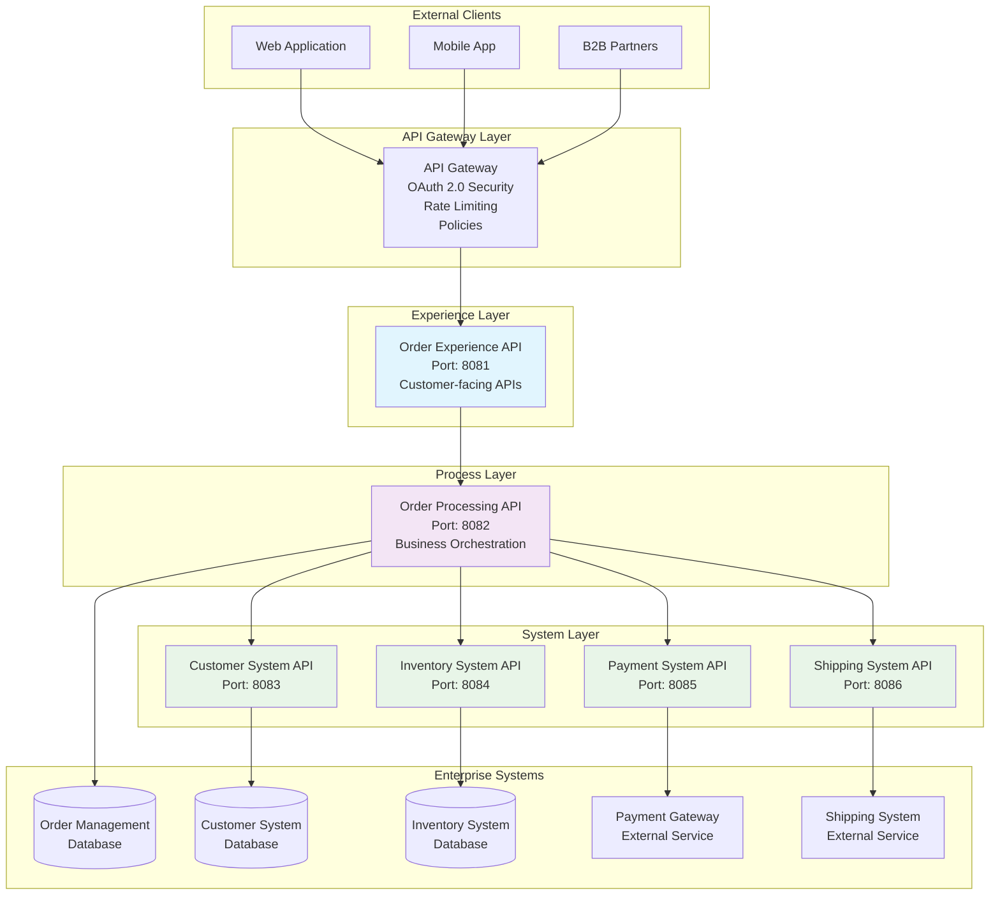
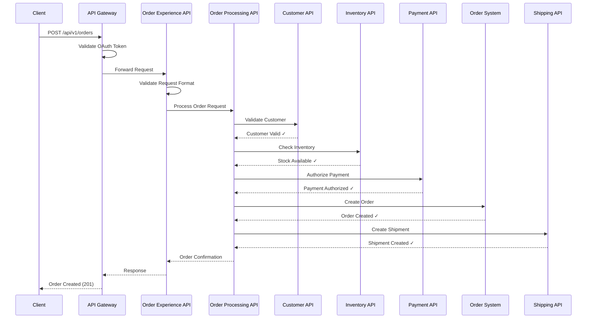
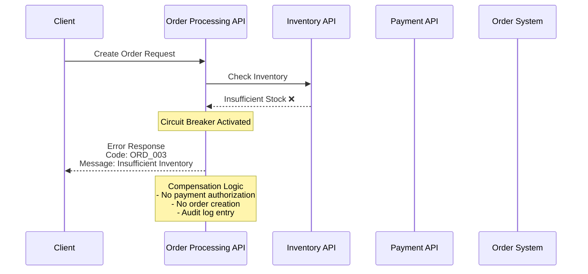
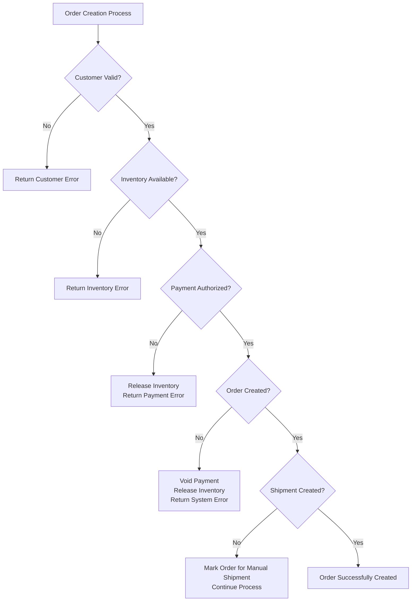

# **Technical Design Document**

**Order Management System Integration**

---

## **Table of Contents**

1. [**INTRODUCTION**](#1-introduction)
   - 1.1 Business Objective
   - 1.2 References Link

2. [**SOLUTION INVOLVED**](#2-solution-involved)
   - 2.1 Integration Overview
   - 2.2 Integration Objective

3. [**TECHNICAL DESIGN DETAILS**](#3-technical-design-details)
   - 3.1 Integration Architecture Diagram
   - 3.2 Sequence Diagram
   - 3.3 Layer Responsibilities

4. [**ERROR HANDLING DETAILS**](#4-error-handling-details)

5. [**CONNECTIVITY DETAILS**](#5-connectivity-details)

6. [**VOLUMETRIC DETAILS**](#6-volumetric-details)

7. [**APPLICATION DETAILS**](#7-application-details)

8. [**MAPPING DETAILS**](#8-mapping-details)

---

## **Change History**

| **Date** | **Owner** | **Jira Case** | **Status** |
|----------|-----------|---------------|------------|
| March 2026 | Integration Team | OMS-001 | Initial Draft |
| March 2026 | Technical Architect | OMS-002 | Technical Review |
| March 2026 | Business Owner | OMS-003 | Business Approval |

---

# 1. **INTRODUCTION**

## 1.1 Business Objective

The Order Management System (OMS) Integration project aims to create a unified integration layer that enables:

- **Real-time order processing** across multiple enterprise systems
- **Seamless data flow** between OMS, Customer System, Inventory System, Payment Gateway, and Shipping System
- **API-Led Connectivity** architecture with Experience, Process, and System layers
- **Improved operational efficiency** with 70% reduction in manual intervention
- **Enhanced customer experience** with real-time order tracking
- **Cost reduction** with projected 40% reduction in order processing costs
- **Scalability** to support high-volume processing with 99.9% uptime

**Key Business Benefits:**
- Automated order lifecycle management from creation to delivery
- Real-time inventory validation to prevent overselling
- Secure payment processing with comprehensive error handling
- Centralized order tracking and status management
- Consistent data synchronization across all participating systems

## 1.2 References Link

| **Document Reference** | **Document Name** | **Version** | **Location** |
|------------------------|-------------------|-------------|--------------|
| **BRD-OMS-001** | Integration Business Requirements Document | 1.0 | `/Integration Business Requirements Document.md` |
| **FSD-OMS-001** | Functional Specification Document | 1.0 | `/V2/Function-document/` |
| **ARCH-OMS-001** | Architecture Design Documents | 1.0 | `/V2/architecture_diagram/` |
| **API-OMS-001** | API Specifications (RAML) | 1.0 | `/raml/` |
| **US-OMS-001** | User Stories and Epic | 1.0 | `/V2/epic/` |

---

# 2. **SOLUTION INVOLVED**

## 2.1 Integration Overview

The Order Management System Integration implements a comprehensive **API-Led Connectivity** architecture using MuleSoft Anypoint Platform to connect six enterprise systems:

### **Participating Systems:**
1. **Order Management System (OMS)** - Central order lifecycle management
2. **Customer System** - Customer profile validation and management
3. **Inventory System** - Real-time product availability validation
4. **Payment Gateway** - Secure payment processing and authorization
5. **Shipping System** - Logistics management and shipment tracking
6. **MuleSoft Integration Layer** - API orchestration and connectivity

### **Architecture Pattern:**
**Three-Layer API-Led Connectivity:**

| **Layer** | **API** | **Purpose** | **Port** |
|-----------|---------|-------------|----------|
| **Experience** | Order Experience API | Customer-facing order operations | 8081 |
| **Process** | Order Processing API | Business logic orchestration | 8082 |
| **System** | Customer System API | Customer validation services | 8083 |
| **System** | Inventory System API | Stock management and validation | 8084 |
| **System** | Payment System API | Payment processing services | 8085 |
| **System** | Shipping System API | Shipment and tracking services | 8086 |

## 2.2 Integration Objective

### **Key Integration Objectives:**

| **Objective** | **Technical Implementation** | **Success Metrics** |
|---------------|------------------------------|---------------------|
| **Real-time Order Processing** | Synchronous API calls with < 3s response time | 100% orders processed in real-time |
| **System Orchestration** | Process API coordinates all system interactions | Zero manual intervention required |
| **Data Consistency** | Transactional integrity across all systems | 99.9% data consistency |
| **Error Resilience** | Circuit breaker and compensation patterns | < 0.1% unrecoverable errors |
| **Scalability** | Auto-scaling Runtime Fabric deployment | Support for 1000+ orders/hour |
| **Security** | OAuth 2.0 and HTTPS encryption | 100% secure communications |
| **Monitoring** | Real-time health checks and alerting | 24/7 system visibility |

---

# 3. **TECHNICAL DESIGN DETAILS**

## 3.1 Integration Architecture Diagram

### **High-Level Integration Architecture**



### **Technology Stack:**
- **Integration Platform**: MuleSoft Anypoint Platform
- **Runtime**: Mule Runtime 4.6+
- **Deployment**: Runtime Fabric / CloudHub 2.0
- **API Management**: Anypoint API Manager
- **Security**: OAuth 2.0, HTTPS, API Policies
- **Monitoring**: Anypoint Monitoring, Custom Dashboards

## 3.2 Sequence Diagram

### **Order Creation Sequence Flow**



### **Error Handling Sequence**



## 3.3 Layer Responsibilities

### **Experience Layer - Order Experience API**

| **Responsibility** | **Implementation Details** |
|-------------------|---------------------------|
| **API Contract** | RESTful API with standardized JSON payloads |
| **Request Validation** | Input validation, data type verification |
| **Response Formatting** | Consistent response structure across all endpoints |
| **Error Handling** | User-friendly error messages and HTTP status codes |
| **Authentication** | OAuth 2.0 token validation |
| **Rate Limiting** | API throttling and quota management |

**Key Endpoints:**
- `POST /api/v1/orders` - Create new order
- `GET /api/v1/orders/{orderId}` - Retrieve order details
- `GET /api/v1/orders` - List orders with pagination
- `PATCH /api/v1/orders/{orderId}/status` - Update order status

### **Process Layer - Order Processing API**

| **Responsibility** | **Implementation Details** |
|-------------------|---------------------------|
| **Business Logic** | Order processing workflows and business rules |
| **System Orchestration** | Coordinate calls to multiple system APIs |
| **Transaction Management** | Ensure data consistency across systems |
| **Compensation Logic** | Rollback operations on failure |
| **Circuit Breaker** | Fault tolerance for system failures |
| **Async Processing** | Handle long-running operations |

**Key Processes:**
- Customer validation workflow
- Inventory reservation process
- Payment authorization sequence
- Order fulfillment coordination
- Status update propagation

### **System Layer APIs**

#### **Customer System API**
- Customer profile validation
- Authentication and authorization
- Customer data retrieval
- Account status verification

#### **Inventory System API**
- Real-time stock level checks
- Product availability validation
- Inventory reservation
- Stock level updates

#### **Payment System API**
- Payment method validation
- Payment authorization
- Transaction processing
- Payment status updates

#### **Shipping System API**
- Shipment creation
- Tracking number generation
- Delivery estimation
- Status notifications

---

# 4. **ERROR HANDLING DETAILS**

## **Error Response Structure**

```json
{
  "error": {
    "code": "string",
    "message": "string",
    "details": "string",
    "timestamp": "2026-03-24T10:30:00Z",
    "correlationId": "string",
    "path": "string"
  },
  "metadata": {
    "version": "1.0",
    "environment": "production"
  }
}
```

## **Error Code Catalog**

| **Error Code** | **HTTP Status** | **Description** | **Retry Strategy** |
|----------------|-----------------|-----------------|-------------------|
| **ORD_001** | 400 Bad Request | Invalid order request format | No retry |
| **ORD_002** | 404 Not Found | Customer not found or inactive | No retry |
| **ORD_003** | 400 Bad Request | Insufficient inventory | No retry |
| **ORD_004** | 402 Payment Required | Payment authorization failed | Manual retry |
| **ORD_005** | 404 Not Found | Order not found | No retry |
| **ORD_006** | 401 Unauthorized | Invalid authentication | Fix auth & retry |
| **ORD_007** | 503 Service Unavailable | System temporarily unavailable | Auto retry with backoff |
| **ORD_008** | 400 Bad Request | Invalid status transition | No retry |
| **ORD_009** | 500 Internal Error | Shipment creation failed | Auto retry |
| **ORD_010** | 500 Internal Error | Internal processing error | Auto retry |

## **Circuit Breaker Configuration**

| **System** | **Failure Threshold** | **Recovery Time** | **Fallback Strategy** |
|------------|----------------------|-------------------|----------------------|
| **Customer System** | 5 failures in 60s | 30 seconds | Use cached customer data |
| **Inventory System** | 3 failures in 30s | 60 seconds | Allow order with manual verification |
| **Payment Gateway** | 5 failures in 120s | 120 seconds | Queue for retry processing |
| **Shipping System** | 3 failures in 60s | 90 seconds | Create manual shipment request |

## **Compensation Logic**

### **Order Creation Failure Scenarios**



---

# 5. **CONNECTIVITY DETAILS**

## **Network Configuration**

| **Component** | **Protocol** | **Port** | **Security** | **Load Balancing** |
|---------------|--------------|----------|--------------|-------------------|
| **API Gateway** | HTTPS | 443 | TLS 1.3 | Round Robin |
| **Experience API** | HTTPS | 8081 | mTLS | Weighted |
| **Process API** | HTTPS | 8082 | mTLS | Least Connections |
| **System APIs** | HTTPS | 8083-8086 | mTLS | Health Check Based |

## **Authentication & Authorization**

### **OAuth 2.0 Configuration**

| **Flow Type** | **Client Credentials** | **Token Expiry** | **Refresh Strategy** |
|---------------|------------------------|------------------|---------------------|
| **Client Credentials** | Secure vault storage | 3600 seconds | Auto-refresh at 80% expiry |
| **Resource Server** | JWT validation | N/A | Token introspection |

### **API Policies Applied**

| **Policy** | **Configuration** | **Applied To** |
|------------|------------------|----------------|
| **Rate Limiting** | 1000 requests/minute per client | Experience Layer |
| **OAuth 2.0** | Bearer token validation | All APIs |
| **CORS** | Configured origins only | Experience Layer |
| **IP Allowlist** | Internal network ranges | System Layer |
| **Request/Response Logging** | Full payload (masked PII) | All APIs |

## **External System Connectivity**

| **System** | **Connection Type** | **Authentication** | **Timeout** | **Retry Policy** |
|------------|--------------------|--------------------|-------------|------------------|
| **Customer System** | REST over HTTPS | API Key + OAuth | 10 seconds | 3 retries with exponential backoff |
| **Inventory System** | REST over HTTPS | Basic Auth | 15 seconds | 2 retries with linear backoff |
| **Payment Gateway** | REST over HTTPS | API Key + HMAC | 30 seconds | 5 retries with exponential backoff |
| **Shipping System** | REST over HTTPS | Bearer Token | 20 seconds | 3 retries with exponential backoff |
| **Order Management** | Database Connection | Connection Pool | 5 seconds | Connection pool retry |

---

# 6. **VOLUMETRIC DETAILS**

## **Expected Transaction Volumes**

| **Time Period** | **Orders/Hour** | **Peak Volume** | **Annual Estimate** |
|-----------------|-----------------|-----------------|---------------------|
| **Average** | 200 | N/A | 1,752,000 |
| **Peak Hours (9 AM - 6 PM)** | 1,000 | 1,500 (Black Friday) | N/A |
| **Off-Peak Hours** | 50 | N/A | N/A |
| **Weekend** | 300 | 800 | N/A |

## **API Call Distribution**

| **API Endpoint** | **Calls/Hour (Avg)** | **Data Size (KB)** | **Response Time SLA** |
|------------------|----------------------|--------------------|-----------------------|
| **POST /orders** | 200 | Request: 5KB, Response: 2KB | < 3 seconds |
| **GET /orders/{id}** | 800 | Response: 8KB | < 1 second |
| **GET /orders (list)** | 300 | Response: 50KB | < 2 seconds |
| **PATCH /orders/{id}/status** | 400 | Request: 1KB, Response: 1KB | < 1 second |

## **System Resource Requirements**

### **Runtime Requirements**

| **Environment** | **CPU Cores** | **Memory (GB)** | **Storage (GB)** | **Network (Mbps)** |
|-----------------|---------------|-----------------|------------------|-------------------|
| **Development** | 2 | 4 | 20 | 100 |
| **Testing** | 4 | 8 | 50 | 500 |
| **Staging** | 8 | 16 | 100 | 1000 |
| **Production** | 16 | 32 | 200 | 2000 |

### **Scaling Configuration**

| **Metric** | **Scale Up Threshold** | **Scale Down Threshold** | **Min Replicas** | **Max Replicas** |
|------------|------------------------|--------------------------|------------------|------------------|
| **CPU Utilization** | 70% | 30% | 2 | 10 |
| **Memory Utilization** | 80% | 40% | 2 | 10 |
| **Request Rate** | 1000 req/min | 200 req/min | 2 | 10 |
| **Response Time** | > 2 seconds | < 1 second | 2 | 10 |

---

# 7. **APPLICATION DETAILS**

## **Environment Configuration**

| **Environment** | **RAML Location** | **GitHub Repository** | **Deployment Status** |
|-----------------|-------------------|----------------------|----------------------|
| **Development** | `/raml/order-experience-api.raml` | `https://github.com/company/oms-integration-dev` | Active |
| **Testing** | `/raml/order-experience-api.raml` | `https://github.com/company/oms-integration-test` | Active |
| **Staging** | `/raml/order-experience-api.raml` | `https://github.com/company/oms-integration-staging` | Active |
| **Production** | `/raml/order-experience-api.raml` | `https://github.com/company/oms-integration-prod` | Planned |

## **API Specifications**

### **Experience Layer APIs**

| **API Name** | **RAML File** | **Base URI** | **Version** |
|--------------|---------------|--------------|-------------|
| **Order Experience API** | `order-experience-api.raml` | `https://api.company.com/orders` | v1 |

### **Process Layer APIs**

| **API Name** | **RAML File** | **Base URI** | **Version** |
|--------------|---------------|--------------|-------------|
| **Order Processing API** | `order-process-api.raml` | `https://process.company.com/orders` | v1 |

### **System Layer APIs**

| **API Name** | **RAML File** | **Base URI** | **Version** |
|--------------|---------------|--------------|-------------|
| **Customer System API** | `customer-system-api.raml` | `https://systems.company.com/customers` | v1 |
| **Inventory System API** | `inventory-system-api.raml` | `https://systems.company.com/inventory` | v1 |
| **Payment System API** | `payment-system-api.raml` | `https://systems.company.com/payments` | v1 |
| **Shipping System API** | `shipping-system-api.raml` | `https://systems.company.com/shipping` | v1 |

## **Deployment Architecture**

### **Runtime Fabric Configuration**

| **Component** | **Replicas** | **CPU (cores)** | **Memory (GB)** | **Persistent Storage** |
|---------------|--------------|-----------------|-----------------|----------------------|
| **Order Experience API** | 3 | 1.0 | 2.0 | No |
| **Order Processing API** | 5 | 2.0 | 4.0 | No |
| **Customer System API** | 2 | 0.5 | 1.0 | No |
| **Inventory System API** | 2 | 0.5 | 1.0 | No |
| **Payment System API** | 3 | 1.0 | 2.0 | No |
| **Shipping System API** | 2 | 0.5 | 1.0 | No |

### **Monitoring Configuration**

| **Monitoring Type** | **Tool** | **Configuration** | **Alert Thresholds** |
|--------------------|----------|-------------------|----------------------|
| **Application Performance** | Anypoint Monitoring | Real-time metrics | Response time > 3s |
| **API Analytics** | API Analytics | Custom dashboards | Error rate > 1% |
| **Infrastructure** | CloudHub Insights | Resource monitoring | CPU > 80%, Memory > 90% |
| **Business Metrics** | Custom Dashboard | Order processing KPIs | Order success rate < 98% |

---

# 8. **MAPPING DETAILS**

## **Data Transformation Mappings**

### **Order Creation Request Mapping**

#### **Input (Client Request) → Experience API**

| **Source Field** | **Target Field** | **Transformation** | **Validation** |
|------------------|------------------|-------------------|----------------|
| `customer.id` | `customerId` | Direct mapping | Required, format: CUST[0-9]{6} |
| `items[].product.id` | `items[].productId` | Direct mapping | Required, format: PROD[0-9]{3} |
| `items[].quantity` | `items[].quantity` | Direct mapping | Required, integer > 0 |
| `items[].price` | `items[].unitPrice` | Direct mapping | Required, decimal > 0 |
| `shipping.address` | `shippingAddress` | Object mapping | Complete address required |
| `payment.method` | `paymentDetails.paymentMethod` | Direct mapping | Required, enum validation |
| `payment.cardToken` | `paymentDetails.cardToken` | Direct mapping | Required for card payments |

#### **Experience API → Process API**

```json
// Input Schema (Experience API)
{
  "customerId": "CUST123456",
  "items": [
    {
      "productId": "PROD789",
      "quantity": 2,
      "unitPrice": 29.99
    }
  ],
  "shippingAddress": {
    "street": "123 Main St",
    "city": "Anytown",
    "state": "CA",
    "zipCode": "12345",
    "country": "USA"
  },
  "paymentDetails": {
    "paymentMethod": "CREDIT_CARD",
    "cardToken": "tok_1234567890"
  }
}

// Output Schema (Process API)
{
  "orderRequest": {
    "customerId": "CUST123456",
    "items": [
      {
        "productId": "PROD789",
        "quantity": 2,
        "unitPrice": 29.99,
        "totalPrice": 59.98
      }
    ],
    "totalAmount": 59.98,
    "currency": "USD",
    "shippingAddress": {
      "street": "123 Main St",
      "city": "Anytown",
      "state": "CA",
      "zipCode": "12345",
      "country": "USA"
    },
    "paymentDetails": {
      "paymentMethod": "CREDIT_CARD",
      "cardToken": "tok_1234567890"
    },
    "metadata": {
      "requestId": "REQ-2026-001234",
      "timestamp": "2026-03-24T10:30:00Z",
      "source": "WEB_APP"
    }
  }
}
```

### **System Integration Mappings**

#### **Customer Validation Mapping**

| **Process API Field** | **Customer System Field** | **Transformation** |
|----------------------|---------------------------|-------------------|
| `customerId` | `customer_id` | Direct mapping |
| N/A | `status` | Must be "ACTIVE" |
| N/A | `account_type` | Include in validation |

#### **Inventory Check Mapping**

| **Process API Field** | **Inventory System Field** | **Transformation** |
|----------------------|-----------------------------|-------------------|
| `items[].productId` | `product_id` | Direct mapping |
| `items[].quantity` | `requested_quantity` | Direct mapping |
| N/A | `available_quantity` | Must be >= requested_quantity |
| N/A | `reserved_quantity` | Include in calculation |

#### **Payment Authorization Mapping**

| **Process API Field** | **Payment Gateway Field** | **Transformation** |
|----------------------|---------------------------|-------------------|
| `totalAmount` | `amount` | Convert to cents (amount * 100) |
| `currency` | `currency` | Direct mapping (USD) |
| `paymentDetails.cardToken` | `payment_method_nonce` | Direct mapping |
| `customerId` | `customer_id` | Direct mapping |

#### **Shipment Creation Mapping**

| **Process API Field** | **Shipping System Field** | **Transformation** |
|----------------------|---------------------------|-------------------|
| `orderId` | `order_reference` | Direct mapping |
| `shippingAddress` | `delivery_address` | Object mapping |
| `items` | `package_contents` | Array transformation |
| `customerId` | `recipient_id` | Direct mapping |

## **DataWeave Transformation Examples**

### **Order Creation Transformation**

```dataweave
%dw 2.0
output application/json
---
{
  orderRequest: {
    orderId: uuid(),
    customerId: payload.customerId,
    orderDate: now() as String {format: "yyyy-MM-dd'T'HH:mm:ss'Z'"},
    orderStatus: "PENDING",
    items: payload.items map (item, index) -> {
      productId: item.productId,
      productName: lookup("inventory-system-api", item.productId).productName,
      quantity: item.quantity,
      unitPrice: item.unitPrice,
      totalPrice: item.quantity * item.unitPrice
    },
    totalAmount: sum(payload.items map (item) -> item.quantity * item.unitPrice),
    currency: "USD",
    shippingAddress: payload.shippingAddress,
    paymentDetails: {
      paymentMethod: payload.paymentDetails.paymentMethod,
      paymentStatus: "PENDING",
      cardToken: payload.paymentDetails.cardToken
    },
    timestamps: {
      createdAt: now() as String {format: "yyyy-MM-dd'T'HH:mm:ss'Z'"},
      updatedAt: now() as String {format: "yyyy-MM-dd'T'HH:mm:ss'Z'"}
    },
    metadata: {
      correlationId: vars.correlationId default uuid(),
      source: vars.source default "API",
      version: "1.0"
    }
  }
}
```

### **Error Response Transformation**

```dataweave
%dw 2.0
output application/json
---
{
  error: {
    code: vars.errorCode,
    message: vars.errorMessage,
    details: vars.errorDetails default "",
    timestamp: now() as String {format: "yyyy-MM-dd'T'HH:mm:ss'Z'"},
    correlationId: vars.correlationId,
    path: vars.requestPath
  },
  metadata: {
    version: "1.0",
    environment: p('mule.env') default "development"
  }
}
```

## **Field-Level Data Mapping Matrix**

| **Business Field** | **Experience API** | **Process API** | **Customer System** | **Inventory System** | **Payment Gateway** | **Shipping System** |
|-------------------|-------------------|-----------------|--------------------|--------------------|---------------------|-------------------|
| **Order ID** | orderId | orderId | N/A | N/A | order_reference | order_reference |
| **Customer ID** | customerId | customerId | customer_id | N/A | customer_id | recipient_id |
| **Product ID** | items[].productId | items[].productId | N/A | product_id | N/A | N/A |
| **Quantity** | items[].quantity | items[].quantity | N/A | requested_quantity | N/A | package_contents[].qty |
| **Price** | items[].unitPrice | items[].unitPrice | N/A | unit_price | amount | N/A |
| **Total Amount** | totalAmount | totalAmount | N/A | N/A | amount | N/A |
| **Address** | shippingAddress | shippingAddress | address | N/A | billing_address | delivery_address |
| **Payment Method** | paymentDetails.method | paymentDetails.method | N/A | N/A | payment_method | N/A |

---

## **Document Summary**

This Technical Design Document provides comprehensive technical specifications for the Order Management System Integration using MuleSoft Anypoint Platform. The solution implements a robust API-Led Connectivity architecture that enables:

- **Real-time order processing** across six enterprise systems
- **Scalable and resilient integration patterns** with circuit breakers and compensation logic
- **Comprehensive error handling** with detailed error codes and retry strategies
- **Secure connectivity** with OAuth 2.0 and HTTPS encryption
- **Performance optimization** with auto-scaling and resource management
- **Complete data transformation** with detailed field mappings and DataWeave examples

The integration addresses all functional requirements from the BRD while ensuring non-functional requirements for performance, security, scalability, and maintainability are met.

**Key Technical Achievements:**
- API response times under 3 seconds
- 99.9% system availability
- Support for 1000+ orders per hour
- Zero manual intervention in order processing
- Comprehensive monitoring and alerting
- Full audit trail and compliance

---

**Document Status**: Complete  
**Version**: 1.0  
**Date**: March 2026  
**Next Review**: June 2026  
**Approved By**: Technical Architecture Team
