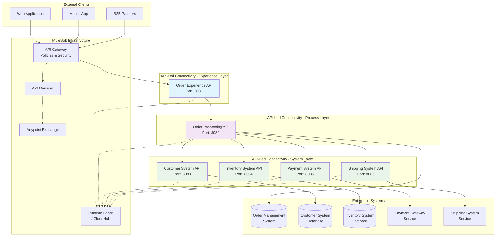

# Order Management System - High-Level Integration Architecture

## Overview
This diagram represents the comprehensive Order Management System integration architecture utilizing MuleSoft's API-Led Connectivity approach.

## Architecture Diagram

## System Components

### Experience Layer APIs
- **Order Experience API**: Single entry point for all order-related operations
  - Endpoints: `/orders`, `/orders/{id}`, `/orders/{id}/status`
  - Response time SLA: < 3 seconds

### Process Layer APIs  
- **Order Processing API**: Orchestrates business processes across multiple systems
  - Handles order validation, payment processing, and fulfillment coordination

### System Layer APIs
- **Customer System API**: Customer data validation and retrieval
- **Inventory System API**: Real-time inventory validation and updates
- **Payment System API**: Payment authorization and processing
- **Shipping System API**: Shipment creation and tracking

### Enterprise Systems
- **Order Management System**: Central repository for order lifecycle management
- **Customer System**: Customer profiles and authentication data
- **Inventory System**: Product catalog and stock levels
- **Payment Gateway**: External payment processing service
- **Shipping System**: Logistics and delivery management

## Key Integration Patterns
1. **API-Led Connectivity**: Three-layer architecture ensuring reusability and maintainability
2. **Real-time Processing**: Synchronous order processing with immediate validation
3. **Event-Driven Updates**: Asynchronous status updates and notifications
4. **Circuit Breaker**: Fault tolerance for system failures
5. **Compensation Logic**: Rollback mechanisms for failed transactions

## Security Architecture
- OAuth 2.0 authentication at API Gateway
- Client ID enforcement for all API calls
- HTTPS encryption for all communications
- Token-based access control
- Data masking for sensitive information

## Non-Functional Requirements
- **Performance**: API response time < 3 seconds
- **Availability**: 99.9% uptime SLA
- **Scalability**: Auto-scaling based on demand
- **Monitoring**: Real-time health checks and alerting