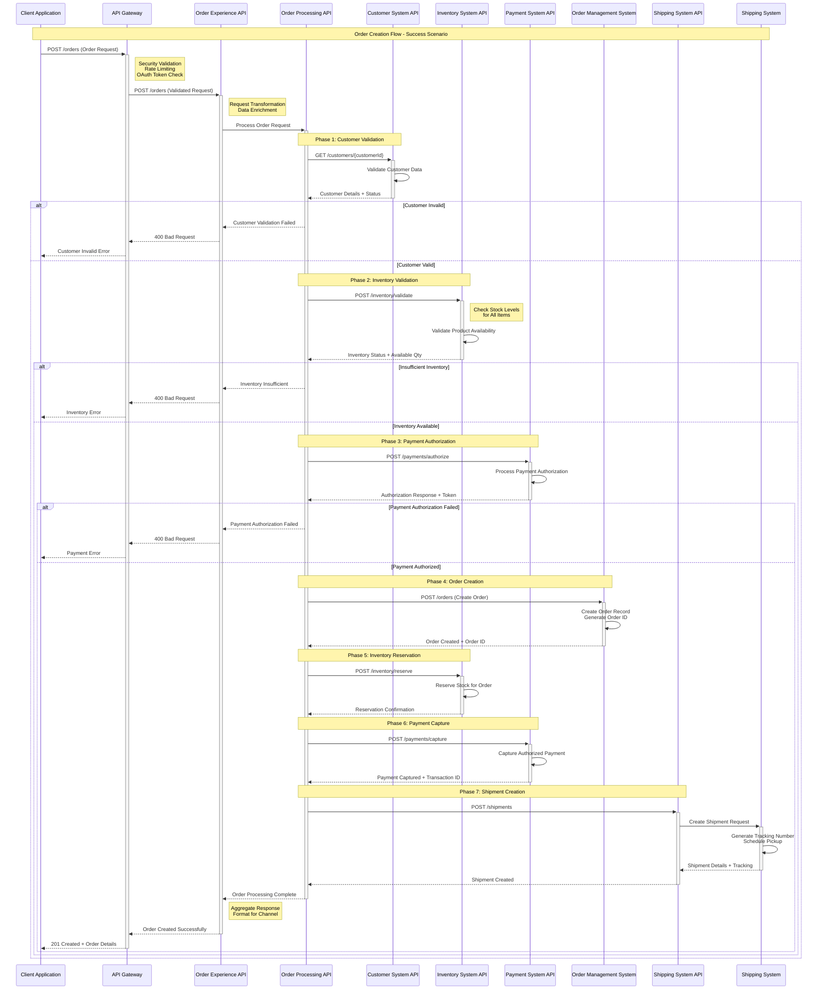
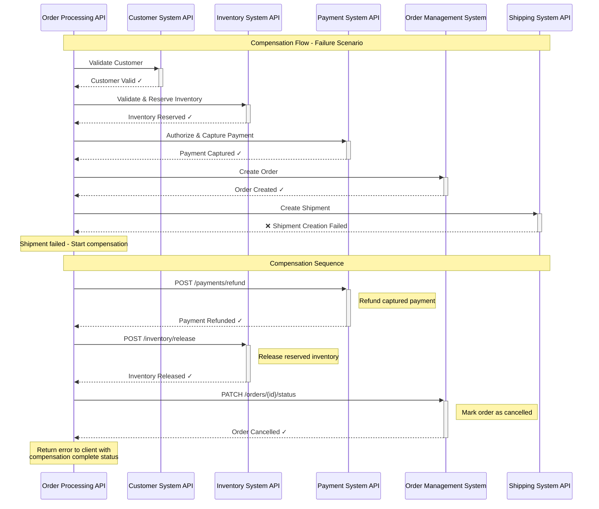

# Order Creation Flow - Detailed System Interaction

## Order Creation Sequence Diagram

## Error Handling and Compensation Flow

## Business Rules and Validation

### Customer Validation Rules
- Customer must exist in customer system
- Customer must have active status
- Customer credit limit must be sufficient (if applicable)
- Customer address must be complete and valid

### Inventory Validation Rules  
- All products must exist in catalog
- Sufficient quantity must be available
- Products must be active/sellable
- No discontinued or restricted items

### Payment Validation Rules
- Payment method must be valid and active
- Payment amount must match order total
- Payment authorization must be successful
- Fraud check must pass (if enabled)

### Order Creation Rules
- Order total must be calculated correctly
- Tax calculation must be accurate  
- Shipping costs must be determined
- Order must have unique identifier

## Performance Considerations

### Parallel Processing Opportunities
- Customer and inventory validation can run in parallel
- Non-dependent system calls can be executed concurrently
- Caching can be implemented for frequently accessed data

### Timeout Configuration
- Customer validation: 2 seconds timeout
- Inventory check: 3 seconds timeout  
- Payment authorization: 5 seconds timeout
- Order creation: 2 seconds timeout
- Shipment creation: 4 seconds timeout

### Circuit Breaker Configuration
- Failure threshold: 5 consecutive failures
- Recovery timeout: 30 seconds
- Half-open state testing: 10% of requests