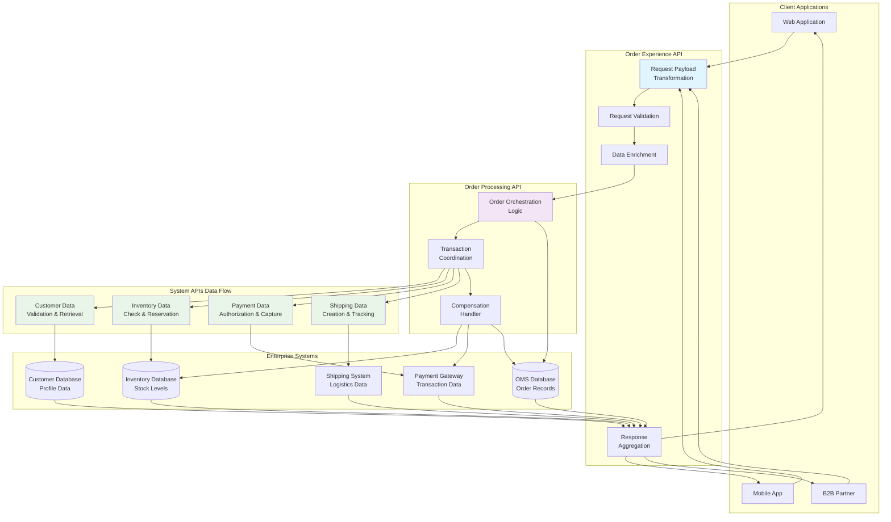
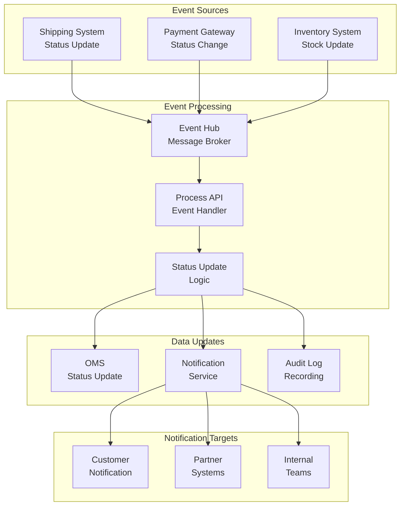

# Order Management System - Data Flow Diagrams

## Order Data Flow Architecture



## Order Retrieval Data Flow

```mermaid
graph LR
    subgraph "Request Flow"
        CLIENT[Client Request<br/>GET /orders/{id}]
        EXP[Experience API<br/>Request Processing]
        PROC[Process API<br/>Order Lookup]
    end

    subgraph "Data Sources"
        OMS[(OMS<br/>Order Details)]
        CUST[(Customer<br/>Profile)]
        INV[(Inventory<br/>Status)]
        PAY[(Payment<br/>History)]
        SHIP[(Shipping<br/>Tracking)]
    end

    subgraph "Response Processing"
        AGG[Data Aggregation<br/>& Transformation]
        ENR[Response<br/>Enrichment]
        RESP[Final Response<br/>to Client]
    end

    CLIENT --> EXP
    EXP --> PROC
    
    PROC --> OMS
    PROC --> CUST
    PROC --> INV
    PROC --> PAY
    PROC --> SHIP

    OMS --> AGG
    CUST --> AGG
    INV --> AGG
    PAY --> AGG
    SHIP --> AGG

    AGG --> ENR
    ENR --> RESP
    RESP --> CLIENT
```

## Order Status Update Data Flow



## Data Transformation Patterns

### Request Transformation Examples

#### Client Request to System API Format
```json
// Client Request Format
{
  "customer": {
    "id": "CUST001",
    "email": "customer@email.com"
  },
  "items": [
    {
      "productCode": "PROD001", 
      "qty": 2,
      "unitPrice": 29.99
    }
  ],
  "shipping": {
    "address": "123 Main St, City, State",
    "method": "STANDARD"
  },
  "payment": {
    "method": "CREDIT_CARD",
    "cardToken": "tok_abc123"
  }
}

// Transformed to Customer System API
{
  "customerId": "CUST001",
  "validationRequired": true,
  "includeCreditCheck": true
}

// Transformed to Inventory System API  
{
  "items": [
    {
      "productId": "PROD001",
      "requestedQuantity": 2,
      "reservationRequired": true
    }
  ]
}

// Transformed to Payment System API
{
  "amount": 59.98,
  "currency": "USD",
  "paymentMethod": "CREDIT_CARD",
  "token": "tok_abc123",
  "merchantId": "MERCHANT001",
  "orderId": "ORD-2026-001"
}
```

### Response Aggregation Pattern

```json
// Aggregated Response from Multiple Systems
{
  "orderId": "ORD-2026-001",
  "status": "CONFIRMED",
  "customer": {
    // From Customer System API
    "id": "CUST001",
    "name": "John Doe",
    "tier": "PREMIUM"
  },
  "items": [
    {
      // From Inventory System API
      "productId": "PROD001",
      "name": "Product Name",
      "quantity": 2,
      "unitPrice": 29.99,
      "reservationId": "RES001"
    }
  ],
  "payment": {
    // From Payment System API
    "status": "AUTHORIZED",
    "transactionId": "TXN123",
    "authCode": "AUTH456"
  },
  "shipping": {
    // From Shipping System API
    "trackingNumber": "TRACK789",
    "estimatedDelivery": "2026-03-27",
    "carrier": "UPS"
  },
  "timestamps": {
    "created": "2026-03-24T11:47:58Z",
    "confirmed": "2026-03-24T11:48:02Z"
  }
}
```

## Data Quality and Validation

### Input Validation Rules
- **Customer ID**: Must exist in customer system
- **Product IDs**: Must be valid catalog items
- **Quantities**: Must be positive integers
- **Prices**: Must match catalog prices
- **Payment Data**: Must pass validation rules
- **Shipping Address**: Must be complete and deliverable

### Data Enrichment Process
1. **Customer Enrichment**: Add customer tier, preferences, history
2. **Product Enrichment**: Add current price, availability, descriptions
3. **Tax Calculation**: Apply appropriate tax rates based on location
4. **Shipping Calculation**: Determine costs and delivery estimates
5. **Promotional Pricing**: Apply available discounts and coupons

### Data Consistency Patterns
- **Eventually Consistent**: Order status across systems
- **Strongly Consistent**: Payment transactions
- **Cached Data**: Customer profiles and product catalogs
- **Real-time Data**: Inventory levels and pricing

## Performance Optimization

### Caching Strategy
- **Customer Data**: 15-minute TTL
- **Product Catalog**: 60-minute TTL  
- **Inventory Levels**: Real-time (no caching)
- **Pricing Data**: 30-minute TTL
- **Tax Rates**: 24-hour TTL

### Data Compression
- Response payload compression (gzip)
- Batch processing for bulk updates
- Pagination for large result sets
- Field filtering based on client requirements

### Database Optimization
- Read replicas for query distribution
- Connection pooling for database efficiency
- Query optimization and indexing
- Partitioning for large tables