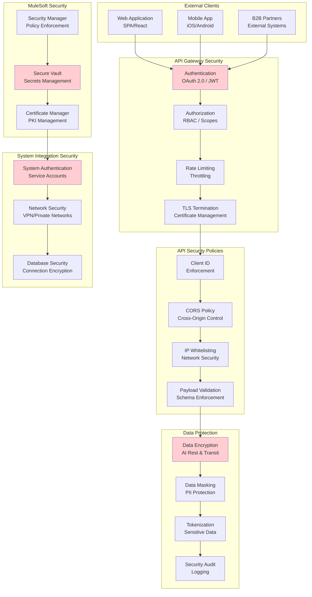
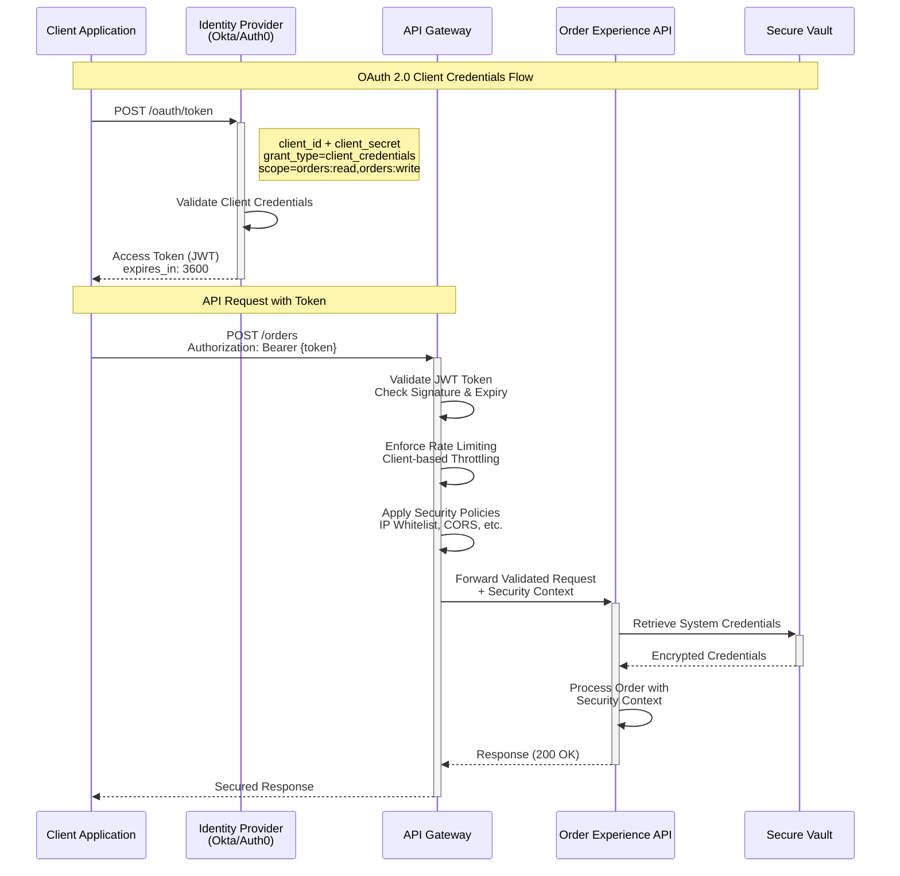
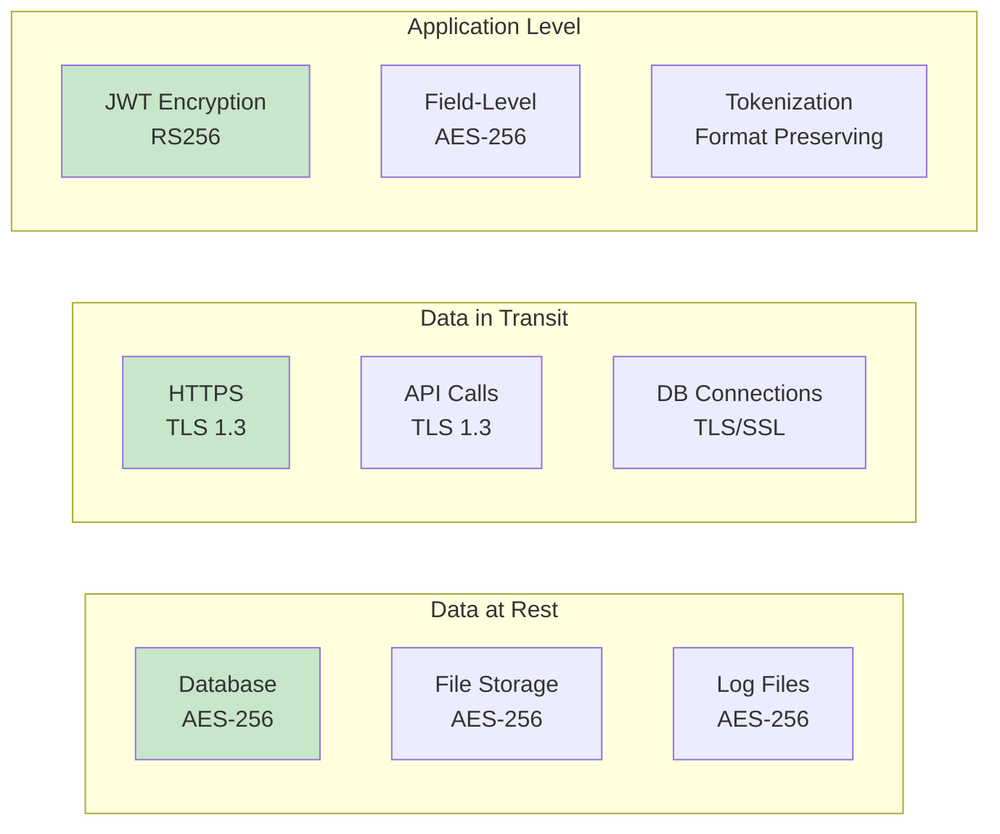
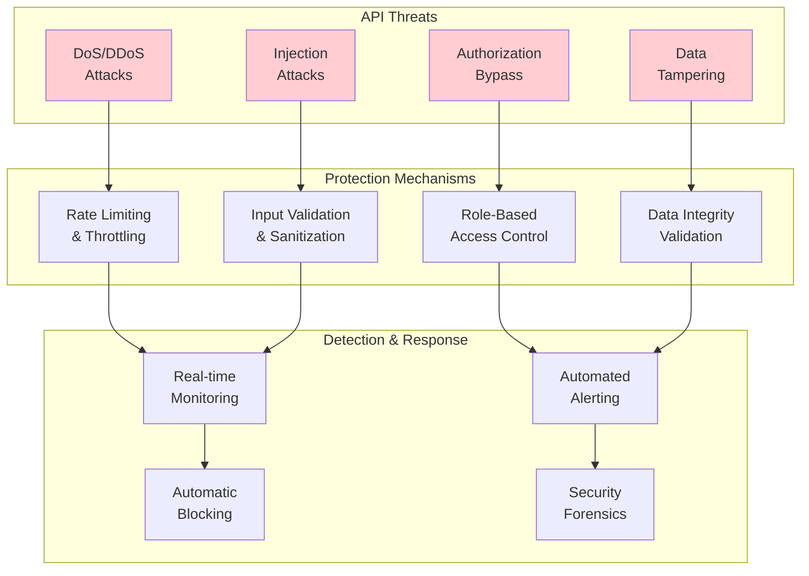
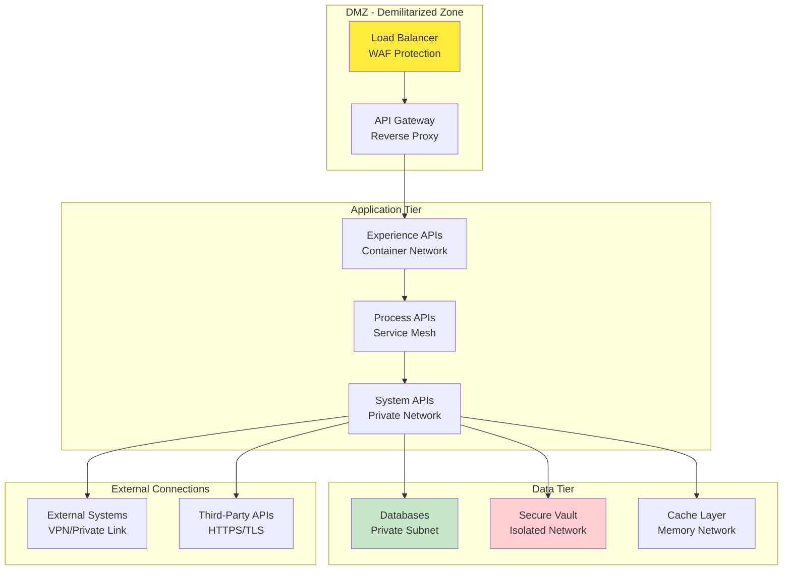
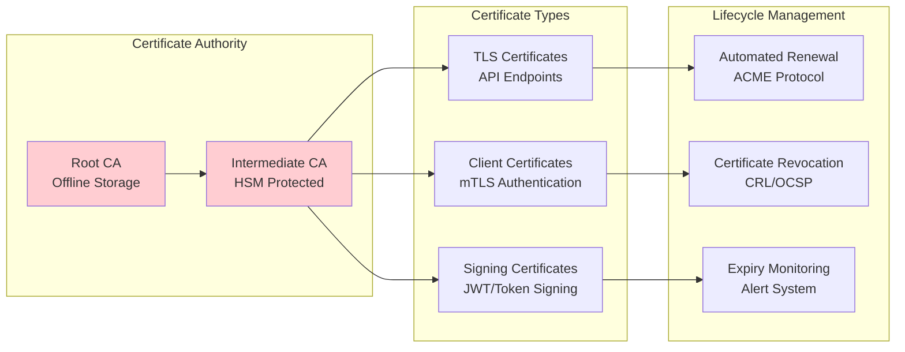
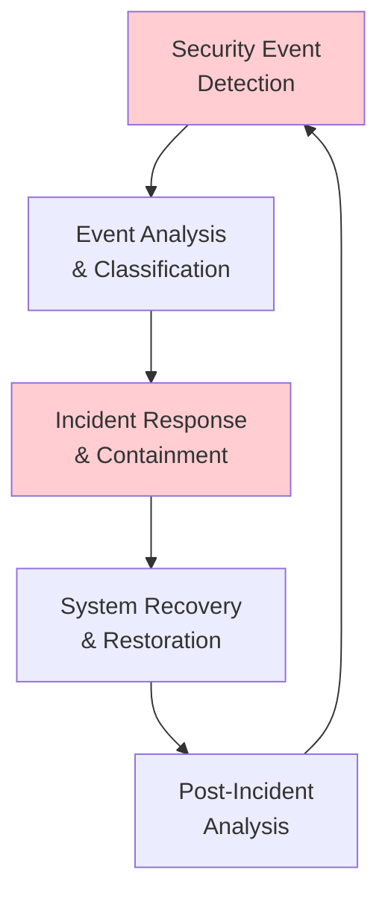

# Security Architecture - Order Management Integration

## Security Architecture Overview



## Authentication & Authorization Flow



## Data Security Patterns

### Data Classification Matrix

| Data Type | Classification | Protection Level | Retention |
|-----------|---------------|------------------|-----------|
| Customer PII | Confidential | Encryption + Masking | 7 years |
| Payment Data | Restricted | Tokenization + Vault | 1 year |
| Order Details | Internal | Encryption in Transit | 5 years |
| Product Catalog | Public | Standard Encryption | Indefinite |
| System Logs | Internal | Encryption + Access Control | 2 years |

### Encryption Standards



## Security Policies Configuration

### API Gateway Policies

```yaml
# Rate Limiting Policy
rate-limiting:
  limits:
    - identifier: client-id
      requests: 1000
      window: 3600s  # 1 hour
      
    - identifier: ip-address  
      requests: 100
      window: 60s    # 1 minute

# CORS Policy  
cors:
  allowedOrigins:
    - https://company.com
    - https://*.company.com
  allowedMethods: [GET, POST, PATCH, PUT, DELETE]
  allowedHeaders: [Authorization, Content-Type]
  maxAge: 3600

# IP Whitelisting
ip-whitelist:
  allowedIps:
    - "10.0.0.0/8"      # Internal network
    - "172.16.0.0/12"   # Private network
    - "192.168.0.0/16"  # Local network
    - "203.0.113.0/24"  # Partner network

# Client ID Enforcement
client-id-enforcement:
  required: true
  errorMessage: "Valid client ID required"
  
# JWT Token Validation  
jwt-validation:
  issuer: "https://auth.company.com"
  audience: "order-api"
  algorithm: "RS256"
  clockSkew: 300  # 5 minutes
```

## Threat Model and Mitigations

### OWASP Top 10 Coverage

| Threat | Risk Level | Mitigation Strategy |
|--------|------------|-------------------|
| Injection | High | Input validation, parameterized queries, sanitization |
| Broken Authentication | High | OAuth 2.0, MFA, session management |
| Sensitive Data Exposure | High | Encryption, tokenization, data masking |
| XXE (XML External Entities) | Medium | XML parsing restrictions, disable DTDs |
| Broken Access Control | High | RBAC, API scopes, authorization checks |
| Security Misconfiguration | Medium | Security hardening, regular audits |
| XSS (Cross-Site Scripting) | Medium | Input validation, output encoding |
| Insecure Deserialization | Medium | Secure serialization, integrity checks |
| Known Vulnerabilities | High | Dependency scanning, patch management |
| Insufficient Logging | Medium | Comprehensive audit logging, monitoring |

### API-Specific Security Threats



## Security Monitoring and Compliance

### Security Logging Requirements

```yaml
security-logging:
  authentication:
    - login_attempts
    - failed_authentications
    - token_validation_failures
    
  authorization:
    - access_denied_events
    - privilege_escalation_attempts
    - unauthorized_resource_access
    
  data_access:
    - sensitive_data_access
    - data_modification_events
    - data_export_activities
    
  api_security:
    - rate_limit_violations
    - malformed_requests
    - suspicious_patterns
```

### Compliance Framework Alignment

| Regulation | Applicable Requirements | Implementation |
|------------|------------------------|----------------|
| PCI DSS | Payment card data protection | Tokenization, encryption, network segmentation |
| GDPR | Personal data protection | Data masking, consent management, right to erasure |
| SOX | Financial data integrity | Audit trails, access controls, data retention |
| HIPAA | Healthcare data privacy | Access logging, encryption, minimum necessary access |
| SOC 2 | Security controls | Monitoring, incident response, vulnerability management |

## Network Security Architecture



## Secrets Management

### Vault Configuration

```yaml
vault-configuration:
  storage:
    type: "database"
    encryption: "AES-256-GCM"
    
  authentication:
    methods:
      - "kubernetes"
      - "cert"
      - "ldap"
      
  secrets-engines:
    - path: "database"
      type: "database"
      config:
        max_ttl: "24h"
        default_ttl: "12h"
        
    - path: "pki"
      type: "pki"
      config:
        max_ttl: "8760h"  # 1 year
        
  policies:
    order-api-policy:
      path: "database/creds/order-db"
      capabilities: ["read"]
      
    payment-api-policy:
      path: "database/creds/payment-db" 
      capabilities: ["read"]
```

### Certificate Management



## Security Testing Strategy

### Automated Security Testing

| Test Type | Frequency | Tools | Scope |
|-----------|-----------|-------|--------|
| SAST (Static) | Every build | SonarQube, Checkmarx | Source code analysis |
| DAST (Dynamic) | Nightly | OWASP ZAP, Burp Suite | Running application |
| Dependency Scan | Every build | OWASP Dependency Check | Third-party libraries |
| Container Scan | Every image | Clair, Trivy | Container vulnerabilities |
| API Security Test | Weekly | Postman, REST Assured | API-specific tests |
| Penetration Test | Quarterly | External firm | Full system assessment |

### Security Incident Response



## Security Metrics and KPIs

### Security Dashboard Metrics

- **Authentication Success Rate**: > 99.5%
- **Authorization Failures**: < 0.1% of requests
- **Security Incident MTTR**: < 4 hours
- **Vulnerability Patch Time**: < 7 days (Critical), < 30 days (High)
- **Security Audit Compliance**: 100%
- **Failed Login Attempts**: Monitor for patterns
- **API Rate Limit Violations**: Track and analyze
- **Certificate Expiry**: 30-day advance warning
