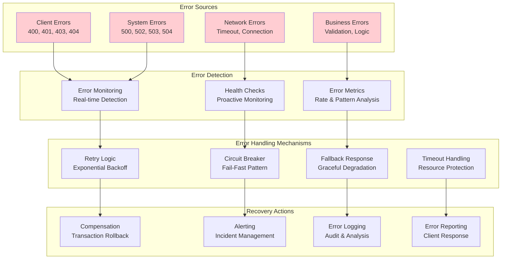
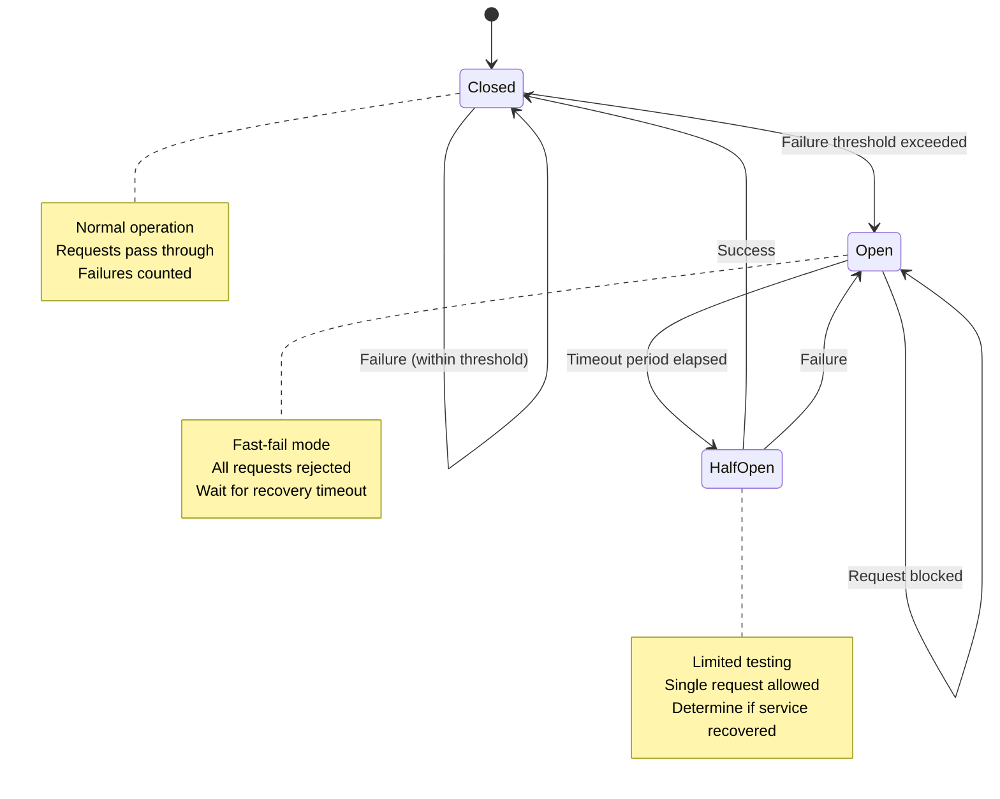
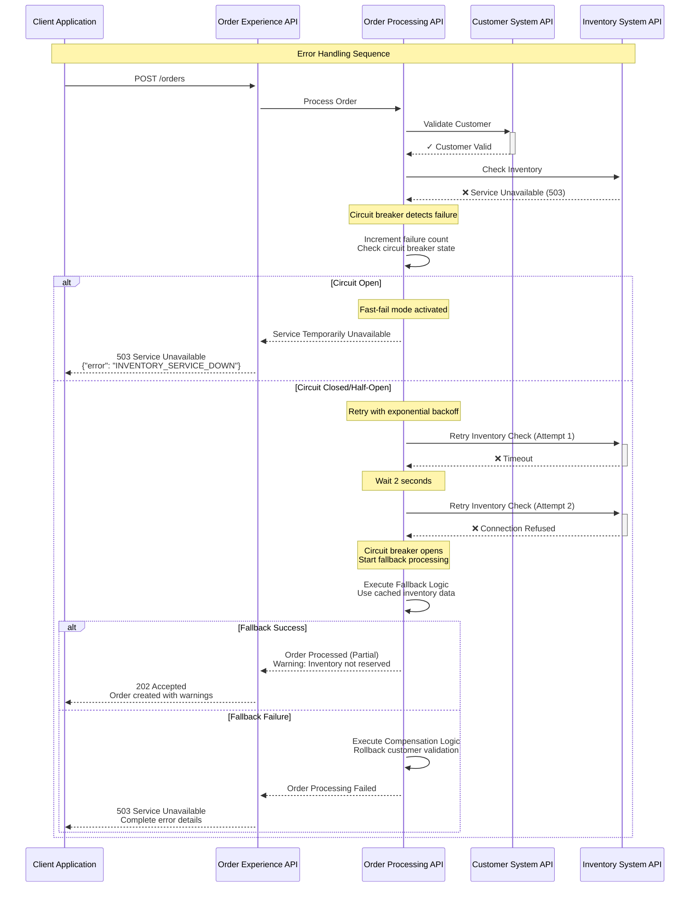
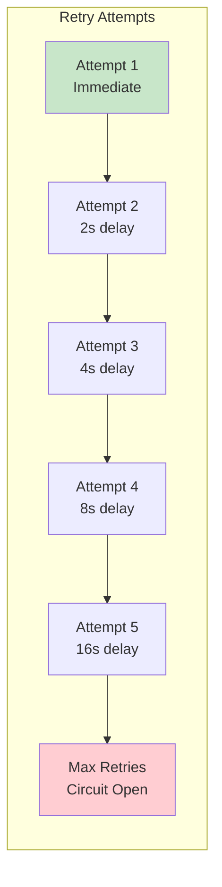
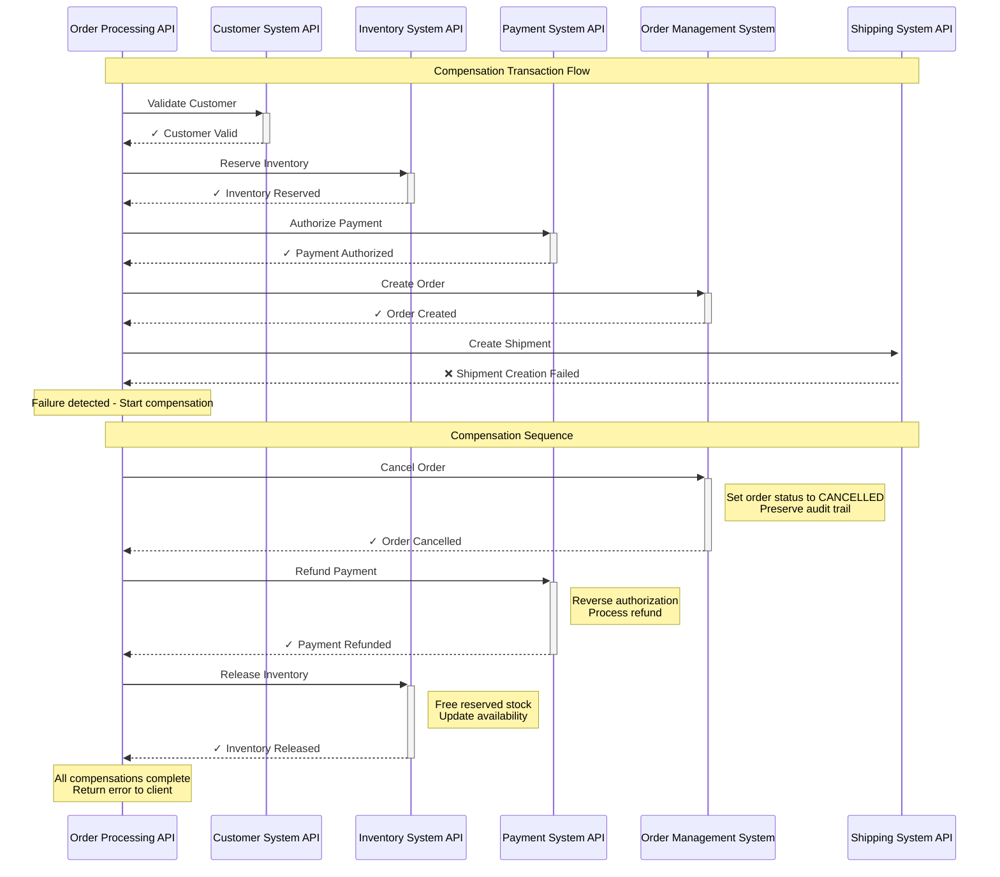
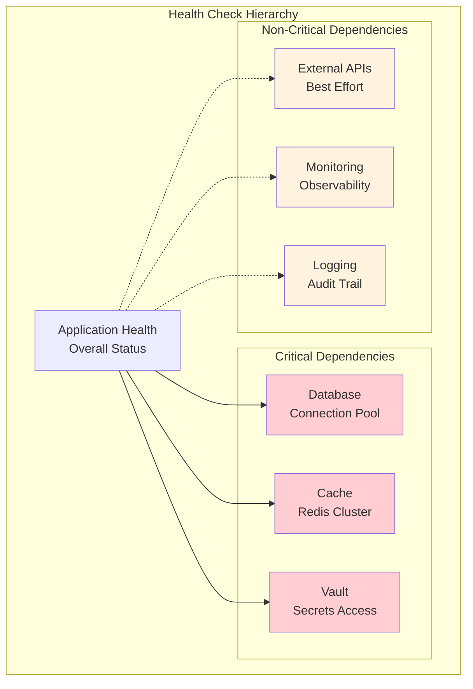
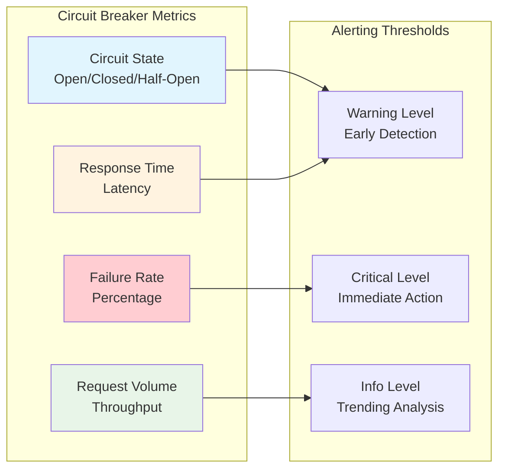
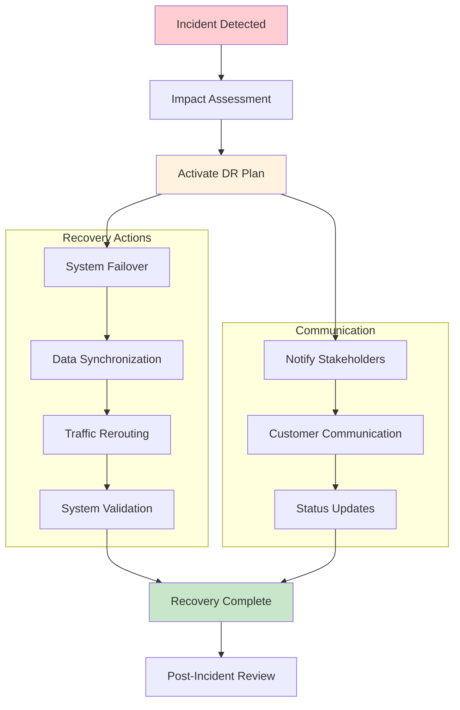

# Error Handling and Resilience Architecture

## Error Handling Strategy Overview



## Circuit Breaker Pattern Implementation



### Circuit Breaker Configuration

```yaml
circuit-breaker-config:
  customer-api:
    failure-threshold: 5
    recovery-timeout: 30s
    success-threshold: 3
    request-volume-threshold: 10
    
  inventory-api:
    failure-threshold: 3
    recovery-timeout: 60s
    success-threshold: 2
    request-volume-threshold: 5
    
  payment-api:
    failure-threshold: 2
    recovery-timeout: 120s
    success-threshold: 1
    request-volume-threshold: 3
    
  shipping-api:
    failure-threshold: 4
    recovery-timeout: 45s
    success-threshold: 2
    request-volume-threshold: 8
```

## Error Handling Flow Diagram



## Retry Strategy Configuration

### Exponential Backoff Pattern



### Retry Configuration by Service

```yaml
retry-configuration:
  customer-service:
    max-attempts: 3
    initial-delay: 1000ms
    multiplier: 2.0
    max-delay: 10000ms
    retryable-exceptions:
      - ConnectException
      - SocketTimeoutException
      - HttpTimeoutException
      
  inventory-service:
    max-attempts: 5
    initial-delay: 500ms
    multiplier: 1.5
    max-delay: 8000ms
    retryable-exceptions:
      - ConnectException
      - ReadTimeoutException
      - ServiceUnavailableException
      
  payment-service:
    max-attempts: 2  # Lower retry for financial operations
    initial-delay: 2000ms
    multiplier: 2.0
    max-delay: 5000ms
    retryable-exceptions:
      - ConnectException
      - SocketTimeoutException
    non-retryable-exceptions:
      - InvalidCardException
      - InsufficientFundsException
```

## Compensation Transaction Pattern



## Standardized Error Response Format

### Error Response Schema

```json
{
  "error": {
    "code": "ERROR_CODE",
    "message": "Human readable error message",
    "details": "Detailed technical information",
    "timestamp": "2026-03-24T11:47:58.123Z",
    "traceId": "trace-12345-67890",
    "path": "/api/orders",
    "method": "POST"
  },
  "validationErrors": [
    {
      "field": "customer.email",
      "code": "INVALID_FORMAT",
      "message": "Email format is invalid"
    }
  ],
  "supportInfo": {
    "contactUrl": "https://support.company.com",
    "documentationUrl": "https://docs.api.company.com/errors"
  }
}
```

### Error Code Categories

| Category | Code Range | Description | Examples |
|----------|------------|-------------|----------|
| Client Errors | 4000-4999 | Invalid requests, authentication | 4001: Invalid JSON, 4002: Missing Auth |
| Business Logic | 5000-5999 | Business rule violations | 5001: Insufficient Inventory, 5002: Invalid Customer |
| System Errors | 6000-6999 | Internal system failures | 6001: Database Error, 6002: Service Unavailable |
| Integration Errors | 7000-7999 | External system failures | 7001: Payment Gateway Down, 7002: Shipping API Error |
| Security Errors | 8000-8999 | Security violations | 8001: Access Denied, 8002: Rate Limit Exceeded |

## Health Check Implementation

### Health Check Endpoints

```yaml
health-checks:
  liveness-probe:
    endpoint: "/health/live"
    timeout: 5s
    interval: 30s
    failure-threshold: 3
    
  readiness-probe:
    endpoint: "/health/ready" 
    timeout: 10s
    interval: 15s
    failure-threshold: 2
    
  startup-probe:
    endpoint: "/health/startup"
    timeout: 30s
    interval: 10s
    failure-threshold: 10
```

### Dependency Health Checks



## Monitoring and Alerting

### Error Rate Monitoring

```yaml
monitoring-rules:
  error-rate-alerts:
    - name: "High Error Rate"
      condition: "error_rate > 5%"
      window: "5m"
      severity: "warning"
      
    - name: "Critical Error Rate"
      condition: "error_rate > 10%"
      window: "2m"
      severity: "critical"
      
  response-time-alerts:
    - name: "High Response Time"
      condition: "p95_response_time > 3s"
      window: "5m"
      severity: "warning"
      
    - name: "Critical Response Time"
      condition: "p99_response_time > 10s"
      window: "1m"
      severity: "critical"
```

### Circuit Breaker Monitoring



## Disaster Recovery Strategy

### Recovery Time Objectives (RTO)

| Component | RTO Target | Recovery Strategy |
|-----------|------------|-------------------|
| API Gateway | 5 minutes | Active-Active deployment |
| Experience APIs | 10 minutes | Auto-scaling, health checks |
| Process APIs | 15 minutes | Circuit breaker, fallback |
| System APIs | 20 minutes | Retry logic, cached responses |
| Databases | 30 minutes | Master-slave replication |
| External Systems | Variable | Graceful degradation |

### Recovery Point Objectives (RPO)

| Data Type | RPO Target | Backup Strategy |
|-----------|------------|----------------|
| Order Transactions | 0 minutes | Synchronous replication |
| Customer Data | 15 minutes | Continuous backup |
| Inventory Data | 5 minutes | Near real-time sync |
| System Logs | 1 hour | Batch processing |
| Configuration | 4 hours | Version control backup |

### Disaster Recovery Procedures



## Performance and Resilience Testing

### Load Testing Strategy

| Test Type | Purpose | Tool | Frequency |
|-----------|---------|------|-----------|
| Load Test | Normal capacity validation | JMeter, Gatling | Weekly |
| Stress Test | Breaking point identification | Artillery, k6 | Monthly |
| Spike Test | Sudden load handling | LoadRunner | Quarterly |
| Volume Test | Large data processing | Custom scripts | Monthly |
| Endurance Test | Memory leaks, stability | Continuous monitoring | Quarterly |

### Chaos Engineering

```yaml
chaos-experiments:
  network-partitions:
    description: "Simulate network connectivity issues"
    targets: ["database", "external-apis"]
    duration: "10m"
    
  service-failures:
    description: "Random service instance termination"
    targets: ["order-processing-api"]
    frequency: "weekly"
    
  resource-exhaustion:
    description: "CPU and memory pressure"
    targets: ["all-services"]
    intensity: "moderate"
    
  latency-injection:
    description: "Artificial response delays"
    targets: ["payment-service", "shipping-service"]
    delay-range: "1s-10s"
```

## Resilience Metrics and KPIs

### Service Level Objectives (SLOs)

- **Availability**: 99.9% uptime (8.76 hours downtime/year)
- **Response Time**: 95% of requests < 2 seconds
- **Error Rate**: < 0.1% of requests result in errors
- **Throughput**: Handle 1000 requests/second peak load
- **Recovery Time**: < 5 minutes for critical failures

### Key Resilience Metrics

```yaml
resilience-metrics:
  availability:
    calculation: "(uptime / total_time) * 100"
    target: "> 99.9%"
    
  mean-time-to-recovery:
    calculation: "sum(recovery_time) / incident_count"
    target: "< 5 minutes"
    
  error-budget:
    calculation: "(1 - availability_target) * total_requests"
    monitoring: "consumption_rate"
    
  blast-radius:
    calculation: "affected_users / total_users"
    target: "< 10% for any single failure"
```
