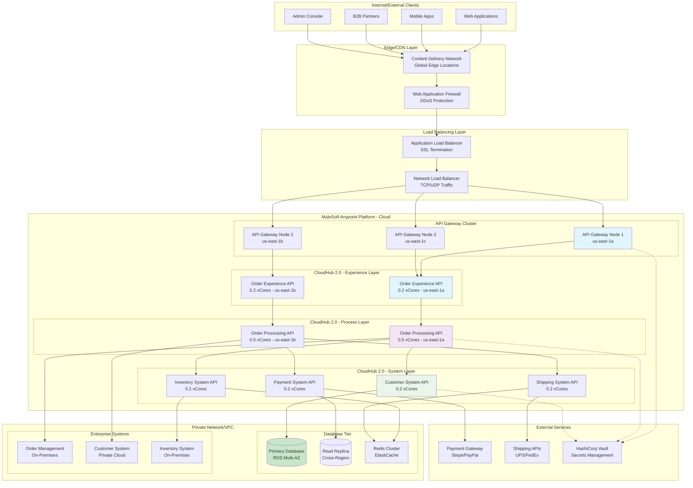
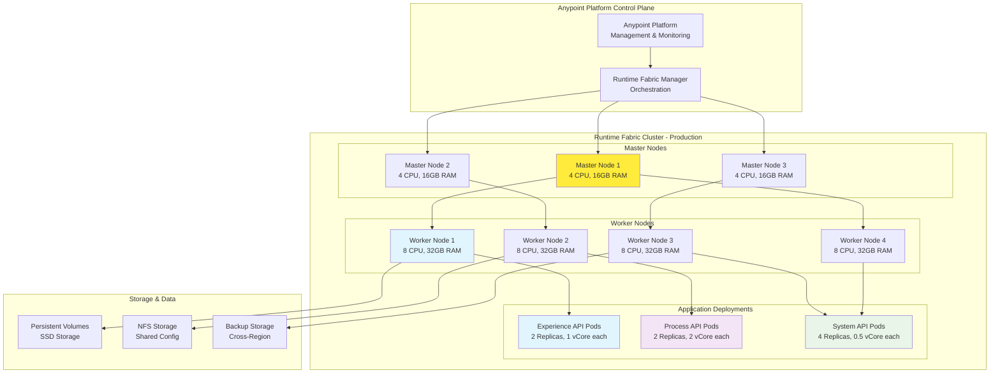
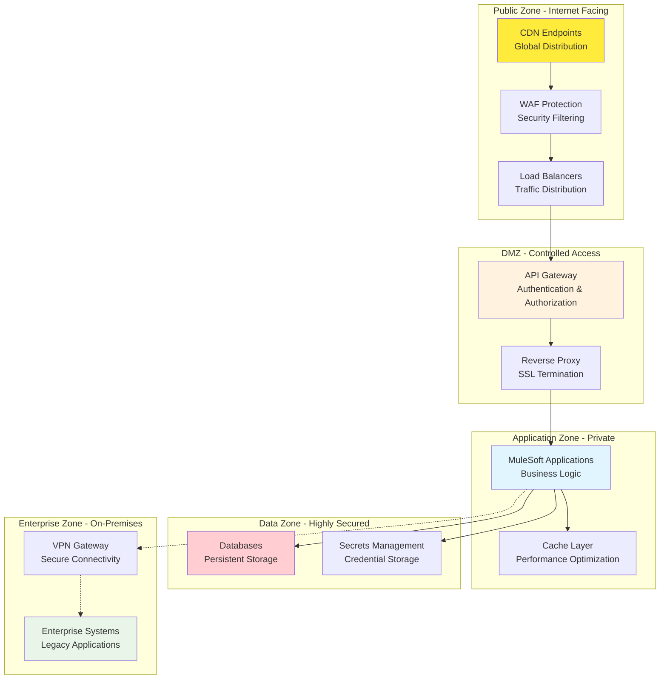
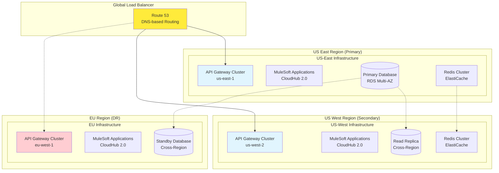
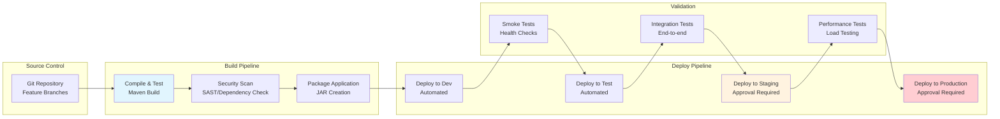
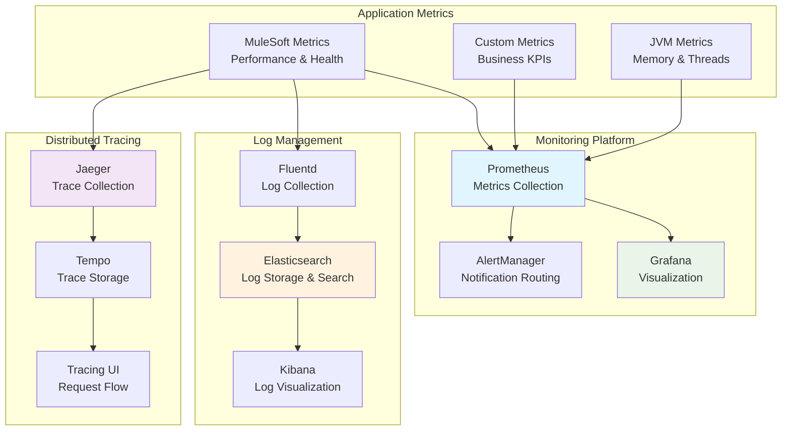

# Deployment Architecture - Order Management Integration

## Cloud Deployment Overview



## Runtime Fabric Deployment (Alternative/Hybrid)



## Environment Configuration Matrix

| Environment | Purpose | Resources | Availability | Data Retention |
|-------------|---------|-----------|--------------|----------------|
| **Development** | Feature development, unit testing | 0.1 vCores per API, Single AZ | 95% (Business hours) | 7 days |
| **Test** | Integration testing, QA validation | 0.2 vCores per API, Single AZ | 98% (Extended hours) | 30 days |
| **Staging** | Pre-production validation, load testing | Production-like sizing, Multi-AZ | 99% (24/7) | 90 days |
| **Production** | Live customer traffic | Auto-scaling, Multi-AZ/Region | 99.9% (24/7) | 7 years |

## Resource Allocation Strategy

### CloudHub 2.0 Sizing

```yaml
resource-allocation:
  experience-layer:
    order-experience-api:
      dev: 0.1 vCores
      test: 0.1 vCores  
      staging: 0.2 vCores
      production: 0.2 vCores (auto-scale to 1.0)
      
  process-layer:
    order-processing-api:
      dev: 0.1 vCores
      test: 0.2 vCores
      staging: 0.5 vCores  
      production: 0.5 vCores (auto-scale to 2.0)
      
  system-layer:
    customer-system-api:
      dev: 0.1 vCores
      test: 0.1 vCores
      staging: 0.2 vCores
      production: 0.2 vCores (auto-scale to 0.5)
      
    inventory-system-api:
      dev: 0.1 vCores
      test: 0.1 vCores
      staging: 0.2 vCores
      production: 0.2 vCores (auto-scale to 0.5)
      
    payment-system-api:
      dev: 0.1 vCores
      test: 0.1 vCores
      staging: 0.2 vCores
      production: 0.2 vCores (auto-scale to 0.5)
      
    shipping-system-api:
      dev: 0.1 vCores
      test: 0.1 vCores
      staging: 0.2 vCores
      production: 0.2 vCores (auto-scale to 0.5)
```

### Auto-Scaling Configuration

```yaml
auto-scaling:
  triggers:
    cpu-utilization:
      threshold: 70%
      scale-up-cooldown: 300s
      scale-down-cooldown: 600s
      
    memory-utilization:
      threshold: 80%
      scale-up-cooldown: 300s
      scale-down-cooldown: 600s
      
    request-rate:
      threshold: 100 rps
      scale-up-cooldown: 180s
      scale-down-cooldown: 900s
      
  limits:
    min-replicas: 1
    max-replicas: 5
    max-cpu: 2.0 vCores
    max-memory: 4GB
```

## Network Architecture

### Network Security Zones



## Multi-Region Deployment Strategy

### Active-Active Configuration



## Infrastructure as Code

### Terraform Configuration Structure

```
infrastructure/
├── environments/
│   ├── dev/
│   │   ├── main.tf
│   │   ├── variables.tf
│   │   └── terraform.tfvars
│   ├── test/
│   ├── staging/
│   └── production/
├── modules/
│   ├── mulesoft-cloudhub/
│   │   ├── main.tf
│   │   ├── variables.tf
│   │   └── outputs.tf
│   ├── api-gateway/
│   ├── database/
│   └── networking/
└── shared/
    ├── backend.tf
    └── provider.tf
```

### Sample CloudHub Deployment

```hcl
# CloudHub Application Deployment
resource "mulesoft_cloudhub_application" "order_experience_api" {
  name = "${var.environment}-order-experience-api"
  
  application {
    source_url = var.application_source_url
  }
  
  worker {
    count = var.worker_count
    type  = var.worker_type  # "MICRO", "SMALL", "MEDIUM", "LARGE"
    size  = var.worker_size  # 0.1, 0.2, 0.5, 1.0, 2.0 vCores
  }
  
  network {
    static_ips_enabled = var.static_ips_enabled
    vpc_id            = var.vpc_id
  }
  
  properties = {
    "env"                    = var.environment
    "api.base.uri"          = var.api_base_uri
    "secure.key"            = var.secure_key
    "anypoint.platform.client_id"     = var.client_id
    "anypoint.platform.client_secret" = var.client_secret
  }
  
  tags = {
    Environment = var.environment
    Project     = "order-management"
    Team        = "integration"
    Layer       = "experience"
  }
}
```

## CI/CD Pipeline Architecture

### Pipeline Stages



### Deployment Strategies

| Strategy | Use Case | Rollback Time | Risk Level |
|----------|----------|---------------|------------|
| **Blue-Green** | Production deployments | < 2 minutes | Low |
| **Rolling** | Non-critical updates | 5-10 minutes | Medium |
| **Canary** | High-risk changes | < 5 minutes | Low |
| **Recreate** | Development/test | 2-5 minutes | High |

## Monitoring and Observability

### Monitoring Stack



## Cost Optimization

### Resource Cost Analysis

| Component | Monthly Cost (Prod) | Optimization Strategy |
|-----------|-------------------|---------------------|
| CloudHub vCores | $2,400 | Auto-scaling, right-sizing |
| API Gateway | $500 | Efficient routing policies |
| Database (RDS) | $800 | Reserved instances, read replicas |
| Load Balancers | $200 | Consolidation where possible |
| Data Transfer | $150 | CDN usage, regional optimization |
| **Total Estimated** | **$4,050** | **~30% savings with optimization** |

### Cost Optimization Strategies

1. **Right-sizing**: Monitor actual resource utilization and adjust vCore allocation
2. **Auto-scaling**: Implement intelligent scaling based on traffic patterns
3. **Reserved Capacity**: Use reserved instances for predictable workloads
4. **Regional Optimization**: Place resources closer to users and data
5. **Caching Strategy**: Reduce external API calls and database queries
6. **Lifecycle Management**: Automate resource cleanup in non-production environments

## Deployment Checklist

### Pre-Deployment Validation
- [ ] Code review completed and approved
- [ ] Security scan passed (SAST, DAST, dependency check)
- [ ] Unit tests passed (>90% coverage)
- [ ] Integration tests passed
- [ ] Performance tests passed
- [ ] Infrastructure provisioned and validated
- [ ] Configuration management updated
- [ ] Secrets and credentials rotated

### Deployment Execution
- [ ] Maintenance window scheduled (if required)
- [ ] Stakeholders notified
- [ ] Backup created
- [ ] Deployment executed
- [ ] Health checks validated
- [ ] Smoke tests completed
- [ ] Traffic routing verified
- [ ] Monitoring alerts configured

### Post-Deployment Validation
- [ ] Application functionality verified
- [ ] Performance metrics within SLA
- [ ] Error rates within acceptable limits
- [ ] Log aggregation working
- [ ] Monitoring dashboards updated
- [ ] Documentation updated
- [ ] Team training completed (if needed)
- [ ] Rollback plan validated
