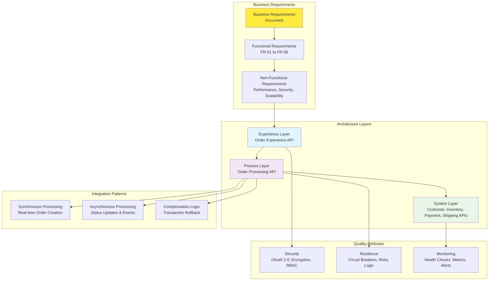
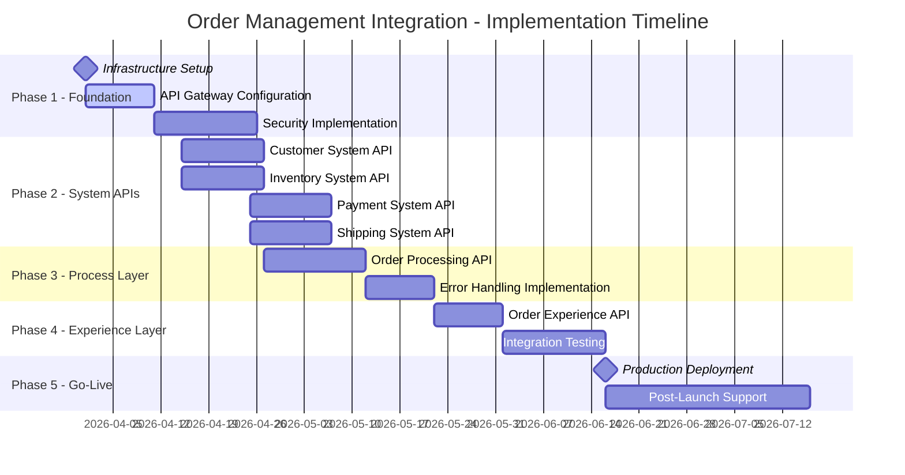

# Order Management Integration - Architecture Documentation Index

## Document Overview

This comprehensive architecture documentation provides detailed technical specifications for the Order Management System integration using MuleSoft Anypoint Platform. The documentation follows enterprise architecture best practices and addresses all aspects from high-level design to deployment strategies.

## Architecture Documentation Structure

| Document | Purpose | Audience | Complexity |
|----------|---------|----------|------------|
| [01_high_level_architecture.md](./01_high_level_architecture.md) | System overview and component relationships | Architects, Stakeholders | ⭐⭐ |
| [02_api_led_connectivity.md](./02_api_led_connectivity.md) | Three-layer API architecture details | Developers, Architects | ⭐⭐⭐ |
| [03_order_creation_flow.md](./03_order_creation_flow.md) | Detailed business process flows | Business Analysts, Developers | ⭐⭐⭐ |
| [04_data_flow_diagrams.md](./04_data_flow_diagrams.md) | Data transformation and flow patterns | Integration Specialists | ⭐⭐⭐⭐ |
| [05_security_architecture.md](./05_security_architecture.md) | Security policies and threat mitigation | Security Teams, Architects | ⭐⭐⭐⭐ |
| [06_error_handling_resilience.md](./06_error_handling_resilience.md) | Fault tolerance and recovery strategies | Operations Teams, SRE | ⭐⭐⭐⭐⭐ |
| [07_deployment_architecture.md](./07_deployment_architecture.md) | Infrastructure and deployment strategies | DevOps, Platform Teams | ⭐⭐⭐⭐ |
| [08_comprehensive_index.md](./08_comprehensive_index.md) | Documentation index and component mapping | All Audiences | ⭐ |

## Component Relationship Matrix

### System Components and Dependencies

## API Inventory and Relationships

### Experience Layer APIs

| API | Port | Dependencies | Consumers | Documentation |
|-----|------|--------------|-----------|---------------|
| Order Experience API | 8081 | Order Processing API | Web App, Mobile App, B2B Partners | [API-Led Connectivity](./02_api_led_connectivity.md#experience-layer) |

### Process Layer APIs

| API | Port | Dependencies | Consumers | Documentation |
|-----|------|--------------|-----------|---------------|
| Order Processing API | 8082 | Customer, Inventory, Payment, Shipping System APIs | Order Experience API | [Order Creation Flow](./03_order_creation_flow.md) |

### System Layer APIs

| API | Port | Dependencies | Consumers | Documentation |
|-----|------|--------------|-----------|---------------|
| Customer System API | 8083 | Customer Database | Order Processing API | [API-Led Connectivity](./02_api_led_connectivity.md#system-layer) |
| Inventory System API | 8084 | Inventory Database, Cache | Order Processing API | [Data Flow Diagrams](./04_data_flow_diagrams.md) |
| Payment System API | 8085 | Payment Gateway | Order Processing API | [Security Architecture](./05_security_architecture.md) |
| Shipping System API | 8086 | Shipping System | Order Processing API | [Error Handling](./06_error_handling_resilience.md) |

## Enterprise Systems Integration

### Backend Systems Mapping

| System | Type | Integration Pattern | API Dependencies | Documentation |
|--------|------|-------------------|------------------|---------------|
| Order Management System (OMS) | Core Business System | Direct API Calls | Order Processing API | [High-Level Architecture](./01_high_level_architecture.md) |
| Customer System | Database System | System API | Customer System API | [Data Flow](./04_data_flow_diagrams.md) |
| Inventory System | Database System | System API | Inventory System API | [Data Flow](./04_data_flow_diagrams.md) |
| Payment Gateway | External Service | System API | Payment System API | [Security](./05_security_architecture.md) |
| Shipping System | External Service | System API | Shipping System API | [Resilience](./06_error_handling_resilience.md) |

## Quality Attributes Implementation

### Non-Functional Requirements Coverage

| Quality Attribute | Requirement | Implementation | Documentation Reference |
|-------------------|-------------|----------------|------------------------|
| **Performance** | API response time < 3 seconds | Caching, load balancing, auto-scaling | [Deployment Architecture](./07_deployment_architecture.md#auto-scaling-configuration) |
| **Availability** | 99.9% uptime | Multi-AZ deployment, health checks | [Error Handling](./06_error_handling_resilience.md#health-check-implementation) |
| **Scalability** | Support high volume processing | Auto-scaling, horizontal scaling | [Deployment Architecture](./07_deployment_architecture.md#resource-allocation-strategy) |
| **Security** | OAuth 2.0, encryption, access control | API Gateway policies, data encryption | [Security Architecture](./05_security_architecture.md) |
| **Reliability** | Circuit breakers, retry logic | Fault tolerance patterns | [Error Handling](./06_error_handling_resilience.md#circuit-breaker-pattern-implementation) |
| **Monitoring** | Real-time health and performance | Comprehensive observability stack | [Deployment Architecture](./07_deployment_architecture.md#monitoring-and-observability) |

## Implementation Roadmap

### Phase-wise Delivery Plan

### Success Criteria and Metrics

| Phase | Success Criteria | Key Metrics | Validation Method |
|-------|------------------|-------------|-------------------|
| **Foundation** | Infrastructure operational | 99.9% availability | Health checks, monitoring |
| **System APIs** | All backend integrations working | < 2s response time | Load testing, functional testing |
| **Process Layer** | Business logic implemented | 0% data loss | End-to-end testing |
| **Experience Layer** | Client integrations complete | < 3s end-to-end response | User acceptance testing |
| **Production** | Live traffic processing | All SLAs met | Production monitoring |

## Architectural Decision Records (ADRs)

### Key Design Decisions

| Decision | Context | Options Considered | Chosen Solution | Rationale |
|----------|---------|-------------------|----------------|-----------|
| **API Architecture** | Need for scalable API design | Monolithic vs Microservices vs API-Led | API-Led Connectivity | Reusability, maintainability, clear separation of concerns |
| **Deployment Model** | Cloud vs On-premises vs Hybrid | CloudHub vs Runtime Fabric vs Hybrid | CloudHub 2.0 for APIs, hybrid for enterprise systems | Balance of control, scalability, and cost |
| **Security Model** | Authentication and authorization | Basic Auth vs OAuth 2.0 vs mTLS | OAuth 2.0 with JWT | Industry standard, scalable, token-based |
| **Error Handling** | Fault tolerance strategy | Fail-fast vs Retry vs Circuit breaker | Circuit breaker with retry logic | Prevents cascade failures, improves resilience |
| **Data Consistency** | Transaction management | 2PC vs Saga vs Event Sourcing | Saga pattern with compensation | Better for distributed systems, eventual consistency |

## Compliance and Governance

### Enterprise Architecture Alignment

| Governance Area | Requirement | Implementation | Compliance Status |
|----------------|-------------|----------------|-------------------|
| **API Design Standards** | RESTful API design, OpenAPI specs | Consistent API patterns across layers | ✅ Compliant |
| **Security Standards** | OAuth 2.0, encryption, audit logging | Comprehensive security implementation | ✅ Compliant |
| **Monitoring Standards** | Structured logging, health checks, metrics | Full observability stack | ✅ Compliant |
| **Data Standards** | Data classification, retention policies | Proper data handling and lifecycle | ✅ Compliant |
| **Change Management** | Version control, CI/CD, approval processes | Automated deployment pipeline | ✅ Compliant |

## Operational Runbooks

### Common Scenarios and Procedures

| Scenario | Procedure | Responsible Team | Documentation |
|----------|-----------|------------------|---------------|
| **System Outage** | Incident response and recovery | Operations Team | [Error Handling](./06_error_handling_resilience.md#disaster-recovery-procedures) |
| **Performance Issues** | Performance tuning and scaling | Platform Team | [Deployment](./07_deployment_architecture.md#auto-scaling-configuration) |
| **Security Incident** | Security response and mitigation | Security Team | [Security](./05_security_architecture.md#security-incident-response) |
| **Deployment Issues** | Rollback and recovery procedures | DevOps Team | [Deployment](./07_deployment_architecture.md#deployment-strategies) |
| **Integration Failures** | Circuit breaker and compensation logic | Development Team | [Error Handling](./06_error_handling_resilience.md#compensation-transaction-pattern) |

## Useful Links and References

### Documentation Links

- **Source BRD**: [Integration Business Requirements Document.md](../../../Integration%20Business%20Requirements%20Document.md)
- **MuleSoft Documentation**: [Anypoint Platform Documentation](https://docs.mulesoft.com/)
- **API Standards**: [RESTful API Design Guidelines](https://restfulapi.net/)
- **Security Standards**: [OAuth 2.0 Specification](https://oauth.net/2/)

### Tool and Platform Links

- **Anypoint Platform**: Access to runtime management and monitoring
- **API Manager**: Policy configuration and analytics
- **Runtime Manager**: Application deployment and monitoring  
- **Anypoint Exchange**: Asset discovery and documentation
- **Design Center**: API specification and flow design

## Version History

| Version | Date | Author | Changes |
|---------|------|--------|---------|
| 1.0 | 2026-03-24 | Integration Team | Initial architecture documentation |
| 1.1 | TBD | Architecture Review Board | Architecture review updates |
| 2.0 | TBD | Implementation Team | Post-implementation updates |

## Contact Information

| Role | Team/Person | Email | Responsibility |
|------|-------------|-------|----------------|
| **Solution Architect** | Architecture Team | architecture@company.com | Overall design and technical decisions |
| **Integration Lead** | Integration Team | integration@company.com | Implementation and technical delivery |
| **Security Architect** | Security Team | security@company.com | Security design and compliance |
| **DevOps Lead** | Platform Team | devops@company.com | Infrastructure and deployment |
| **Business Analyst** | Business Team | business@company.com | Requirements and business alignment |

---

## Summary

This comprehensive architecture documentation provides a complete technical blueprint for implementing the Order Management System integration using MuleSoft Anypoint Platform. The documentation covers:

- ✅ **High-level architecture** with system relationships
- ✅ **API-Led Connectivity** three-layer design
- ✅ **Detailed business flows** with error scenarios
- ✅ **Data transformation** and flow patterns
- ✅ **Security architecture** with threat mitigation
- ✅ **Error handling** and resilience patterns
- ✅ **Deployment architecture** with multi-environment strategy
- ✅ **Component relationships** and dependencies

The architecture follows enterprise best practices, addresses all functional and non-functional requirements from the BRD, and provides a robust foundation for scalable, secure, and maintainable integration solutions.

**Next Steps:**
1. Review and approve architecture documents
2. Set up development environments
3. Begin implementation following the phased delivery plan
4. Establish monitoring and operational procedures
5. Conduct regular architecture reviews and updates
