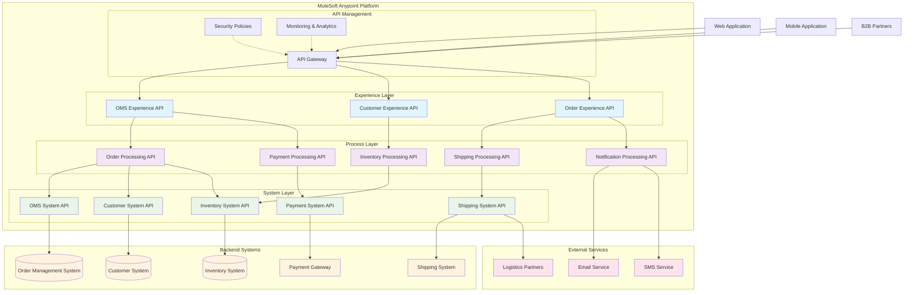

# High-Level Integration Architecture

## Overview

The Order Management Integration Architecture implements an API-Led Connectivity approach using MuleSoft Anypoint Platform to integrate multiple backend systems with the Order Management System (OMS).

## Architecture Diagram

## Architecture Layers

### 1. Experience Layer
- **Purpose**: Provides optimized APIs for specific user experiences
- **APIs**:
  - **OMS Experience API**: Unified interface for order management operations
  - **Customer Experience API**: Customer-centric operations and profiles
  - **Order Experience API**: Order lifecycle and tracking operations

### 2. Process Layer
- **Purpose**: Orchestrates business processes across multiple systems
- **APIs**:
  - **Order Processing API**: End-to-end order processing workflow
  - **Payment Processing API**: Payment validation and processing
  - **Inventory Processing API**: Stock management and reservation
  - **Shipping Processing API**: Logistics and delivery orchestration
  - **Notification Processing API**: Multi-channel communication

### 3. System Layer
- **Purpose**: Provides standardized access to backend systems
- **APIs**:
  - **OMS System API**: Direct integration with Order Management System
  - **Customer System API**: Customer data system integration
  - **Inventory System API**: Inventory management system access
  - **Payment System API**: Payment gateway integration
  - **Shipping System API**: Shipping and logistics system integration

## Key Integration Patterns

### API-Led Connectivity
- **Three-tier architecture** ensuring reusability and maintainability
- **Loose coupling** between consumer applications and backend systems
- **Standardized interfaces** with consistent data models

### Event-Driven Architecture
- **Real-time notifications** for order status changes
- **Asynchronous processing** for non-critical operations
- **Event streaming** for data synchronization

### Security & Governance
- **Centralized API Gateway** for security policy enforcement
- **OAuth 2.0 and JWT** for authentication and authorization
- **Rate limiting and throttling** for API protection
- **Comprehensive monitoring** and analytics

## Business Benefits

### Operational Excellence
- **Reduced integration complexity** through API reuse
- **Faster time-to-market** for new customer experiences
- **Improved system reliability** with circuit breaker patterns

### Scalability & Performance
- **Independent scaling** of API layers
- **Caching strategies** for frequently accessed data
- **Load balancing** across multiple runtime instances

### Maintainability
- **Clear separation of concerns** across architectural layers
- **Version management** for backward compatibility
- **Centralized configuration** and policy management

## Technology Stack

- **Integration Platform**: MuleSoft Anypoint Platform
- **API Gateway**: Anypoint API Manager
- **Runtime Engine**: Mule Runtime 4.x
- **Security**: OAuth 2.0, JWT, API Policies
- **Monitoring**: Anypoint Monitoring, Splunk
- **Message Queuing**: Anypoint MQ
- **Data Storage**: Object Store, Database Connectors