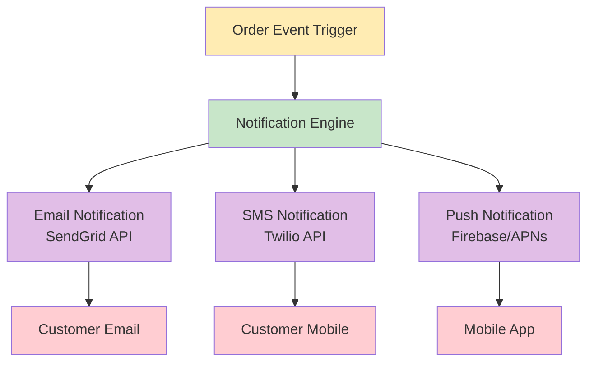

# System Connectivity Diagram

## Overview

This diagram shows the detailed connections and data flow between the Order Management System (OMS) and all integrated backend systems through the MuleSoft integration layer.

## System Connectivity Architecture

```mermaid
graph LR
    %% Client Applications
    subgraph "Client Applications"
        WEB[Web Portal]
        MOBILE[Mobile App]
        B2B_PORTAL[B2B Portal]
        ADMIN[Admin Dashboard]
    end
    
    %% MuleSoft Integration Hub
    subgraph "MuleSoft Integration Layer"
        APIGW[API Gateway<br/>Security & Routing]
        
        subgraph "API Orchestration"
            ORDER_ORCH[Order Orchestration<br/>Service]
            CUSTOMER_ORCH[Customer Data<br/>Orchestration]
            PAYMENT_ORCH[Payment<br/>Orchestration]
            INVENTORY_ORCH[Inventory<br/>Orchestration]
            SHIPPING_ORCH[Shipping<br/>Orchestration]
        end
        
        subgraph "Data Transformation"
            DATA_MAPPER[Data Mapping<br/>& Transformation]
            PROTOCOL_ADAPTER[Protocol<br/>Adapters]
            ERROR_HANDLER[Error Handling<br/>& Retry Logic]
        end
    end
    
    %% Core Systems
    subgraph "Core Business Systems"
        OMS_CORE[(Order Management<br/>System)]
        CUSTOMER_CORE[(Customer<br/>Management System)]
        INVENTORY_CORE[(Inventory<br/>Management System)]
    end
    
    %% External Systems
    subgraph "External Payment Systems"
        STRIPE[Stripe Payment<br/>Gateway]
        PAYPAL[PayPal<br/>Gateway]
        BANK_API[Bank API<br/>Integration]
    end
    
    subgraph "Shipping & Logistics"
        FEDEX[FedEx API]
        UPS[UPS API]
        DHL[DHL API]
        WAREHOUSE[Warehouse<br/>Management System]
    end
    
    subgraph "Communication Services"
        EMAIL_SVC[Email Service<br/>(SendGrid)]
        SMS_SVC[SMS Service<br/>(Twilio)]
        PUSH_NOTIF[Push Notification<br/>Service]
    end
    
    subgraph "Analytics & Monitoring"
        ANALYTICS[Analytics<br/>Platform]
        AUDIT[Audit<br/>System]
        MONITORING[System<br/>Monitoring]
    end
    
    %% Client to API Gateway Connections
    WEB -->|HTTPS/REST| APIGW
    MOBILE -->|HTTPS/REST| APIGW
    B2B_PORTAL -->|HTTPS/REST| APIGW
    ADMIN -->|HTTPS/REST| APIGW
    
    %% API Gateway to Orchestration Services
    APIGW -->|Route & Secure| ORDER_ORCH
    APIGW -->|Route & Secure| CUSTOMER_ORCH
    APIGW -->|Route & Secure| PAYMENT_ORCH
    APIGW -->|Route & Secure| INVENTORY_ORCH
    APIGW -->|Route & Secure| SHIPPING_ORCH
    
    %% Orchestration to Data Layer
    ORDER_ORCH --> DATA_MAPPER
    CUSTOMER_ORCH --> DATA_MAPPER
    PAYMENT_ORCH --> PROTOCOL_ADAPTER
    INVENTORY_ORCH --> DATA_MAPPER
    SHIPPING_ORCH --> PROTOCOL_ADAPTER
    
    %% Data Layer to Core Systems
    DATA_MAPPER -->|SQL/JDBC| OMS_CORE
    DATA_MAPPER -->|REST API| CUSTOMER_CORE
    DATA_MAPPER -->|REST/SOAP| INVENTORY_CORE
    
    %% Protocol Adapters to External Systems
    PROTOCOL_ADAPTER -->|HTTPS/REST| STRIPE
    PROTOCOL_ADAPTER -->|HTTPS/REST| PAYPAL
    PROTOCOL_ADAPTER -->|HTTPS/SOAP| BANK_API
    
    PROTOCOL_ADAPTER -->|REST API| FEDEX
    PROTOCOL_ADAPTER -->|REST API| UPS
    PROTOCOL_ADAPTER -->|REST API| DHL
    PROTOCOL_ADAPTER -->|REST/EDI| WAREHOUSE
    
    %% Communication Services
    ORDER_ORCH -->|REST API| EMAIL_SVC
    ORDER_ORCH -->|REST API| SMS_SVC
    ORDER_ORCH -->|REST API| PUSH_NOTIF
    
    %% Analytics and Monitoring
    APIGW -.->|Metrics| ANALYTICS
    ORDER_ORCH -.->|Events| AUDIT
    DATA_MAPPER -.->|Logs| MONITORING
    ERROR_HANDLER -.->|Alerts| MONITORING
    
    %% Error Handling Connections
    DATA_MAPPER --> ERROR_HANDLER
    PROTOCOL_ADAPTER --> ERROR_HANDLER
    ERROR_HANDLER -.->|Retry| DATA_MAPPER
    ERROR_HANDLER -.->|Retry| PROTOCOL_ADAPTER
    
    classDef clientApp fill:#e3f2fd
    classDef mulesoft fill:#f1f8e9
    classDef coreSystem fill:#fff3e0
    classDef external fill:#fce4ec
    classDef communication fill:#f3e5f5
    classDef analytics fill:#e0f2f1
    
    class WEB,MOBILE,B2B_PORTAL,ADMIN clientApp
    class APIGW,ORDER_ORCH,CUSTOMER_ORCH,PAYMENT_ORCH,INVENTORY_ORCH,SHIPPING_ORCH,DATA_MAPPER,PROTOCOL_ADAPTER,ERROR_HANDLER mulesoft
    class OMS_CORE,CUSTOMER_CORE,INVENTORY_CORE coreSystem
    class STRIPE,PAYPAL,BANK_API,FEDEX,UPS,DHL,WAREHOUSE external
    class EMAIL_SVC,SMS_SVC,PUSH_NOTIF communication
    class ANALYTICS,AUDIT,MONITORING analytics
```

## Connection Details

### Client Application Connections

| Client Type | Protocol | Authentication | Purpose |
|-------------|----------|----------------|---------|
| Web Portal | HTTPS/REST | OAuth 2.0 | Customer self-service |
| Mobile App | HTTPS/REST | OAuth 2.0 + JWT | Mobile commerce |
| B2B Portal | HTTPS/REST | API Key + OAuth | Partner integration |
| Admin Dashboard | HTTPS/REST | SAML/OAuth 2.0 | Internal operations |

### Core System Integration

#### Order Management System (OMS)
- **Protocol**: JDBC/SQL for database operations
- **Connection Type**: Direct database connection
- **Data Format**: Relational data structures
- **Frequency**: Real-time synchronous calls
- **Error Handling**: Database transaction rollback

#### Customer Management System
- **Protocol**: HTTPS/REST API
- **Connection Type**: Service-to-service calls
- **Data Format**: JSON payload
- **Frequency**: On-demand and scheduled sync
- **Error Handling**: Retry with exponential backoff

#### Inventory Management System
- **Protocol**: REST API with SOAP fallback
- **Connection Type**: Hybrid integration
- **Data Format**: JSON/XML transformation
- **Frequency**: Real-time for availability, batch for updates
- **Error Handling**: Circuit breaker pattern

### External System Integration

#### Payment Gateway Integration

| Provider | Protocol | Authentication | Features |
|----------|----------|----------------|----------|
| Stripe | HTTPS/REST | API Key | Card processing, subscriptions |
| PayPal | HTTPS/REST | OAuth 2.0 | Digital wallet, express checkout |
| Bank API | HTTPS/SOAP | Certificate-based | ACH, wire transfers |

#### Shipping & Logistics Integration

| Provider | Protocol | Data Format | Capabilities |
|----------|----------|-------------|--------------|
| FedEx | REST API | JSON | Tracking, shipping rates, labels |
| UPS | REST API | JSON | Tracking, shipping rates, pickup |
| DHL | REST API | JSON | International shipping, tracking |
| Warehouse | REST/EDI | JSON/X12 | Inventory sync, fulfillment |

### Communication Services

#### Multi-Channel Notifications



## Data Flow Patterns

### Synchronous Flows
- **Order Validation**: Real-time inventory and customer verification
- **Payment Processing**: Immediate payment authorization
- **Address Validation**: Real-time shipping address verification

### Asynchronous Flows
- **Order Status Updates**: Event-driven notifications
- **Inventory Synchronization**: Scheduled batch updates
- **Analytics Data**: Stream processing for reporting

### Event-Driven Patterns
- **Order Created**: Triggers inventory reservation and payment processing
- **Payment Confirmed**: Initiates fulfillment and shipping processes
- **Shipment Created**: Generates tracking notifications and updates

## Security & Compliance

### Security Layers
1. **Network Security**: VPN, firewalls, DMZ configuration
2. **API Security**: OAuth 2.0, JWT tokens, rate limiting
3. **Data Security**: Encryption at rest and in transit
4. **Application Security**: Input validation, SQL injection prevention

### Compliance Requirements
- **PCI DSS**: Payment card data protection
- **GDPR**: Customer data privacy and consent
- **SOX**: Financial data audit trails
- **HIPAA**: Healthcare-related customer information (if applicable)

## Performance & Scalability

### Connection Pooling
- **Database Connections**: Optimized pool sizes for core systems
- **HTTP Connections**: Keep-alive and connection reuse
- **Message Queue Connections**: Persistent connections for high throughput

### Load Balancing
- **API Gateway**: Multiple instances with load balancer
- **Service Mesh**: Service-to-service load distribution
- **Database**: Read replicas for query load distribution

### Caching Strategy
- **API Response Caching**: Frequently accessed reference data
- **Database Query Caching**: Customer and product information
- **Session Caching**: User authentication and authorization data

## Monitoring & Observability

### Connection Health Monitoring
- **Heartbeat Checks**: Regular connectivity validation
- **Response Time Monitoring**: Performance baseline tracking
- **Error Rate Tracking**: Connection failure analysis
- **Capacity Planning**: Connection usage trending

### Integration Metrics
- **Transaction Volume**: API call frequency and patterns
- **Data Throughput**: Message size and processing speed
- **System Availability**: Uptime tracking across all connections
- **Business KPIs**: Order completion rates, payment success rates