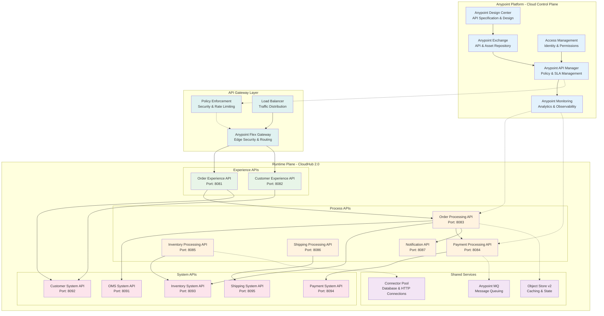
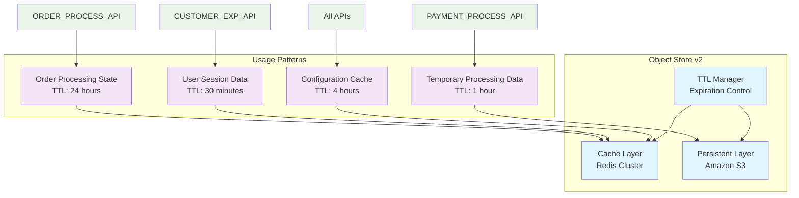
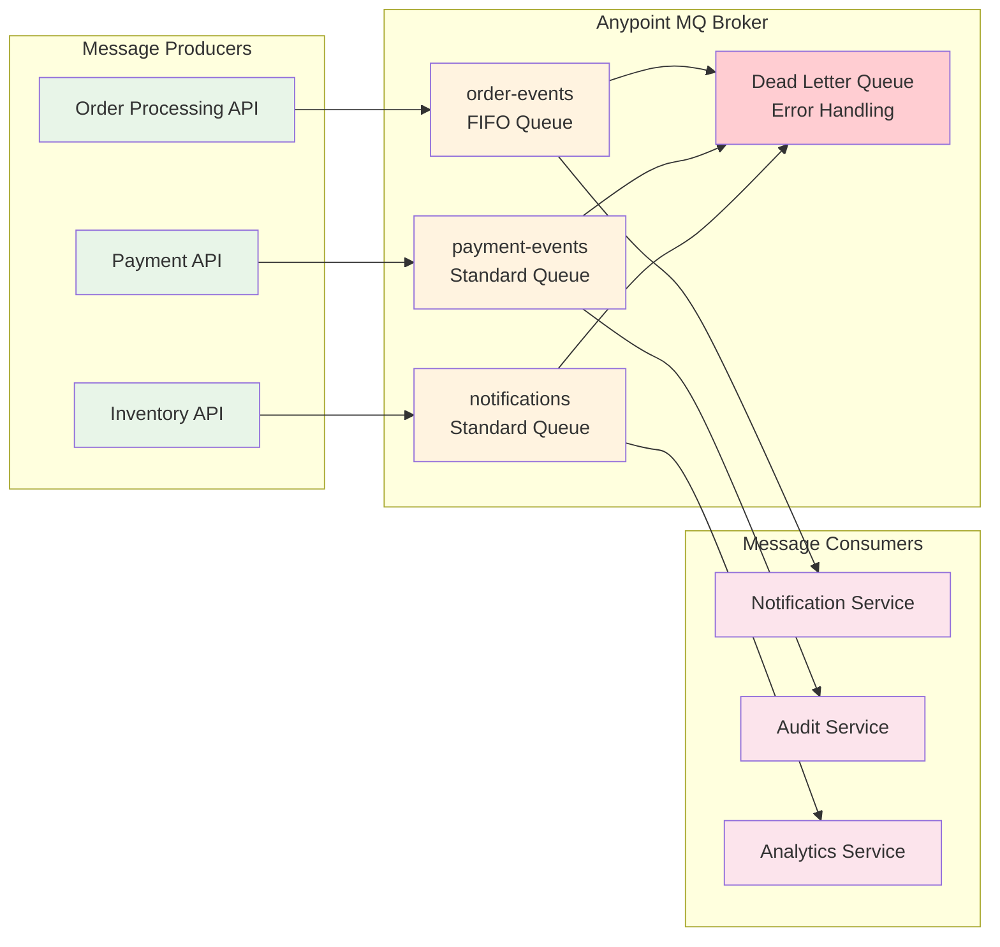
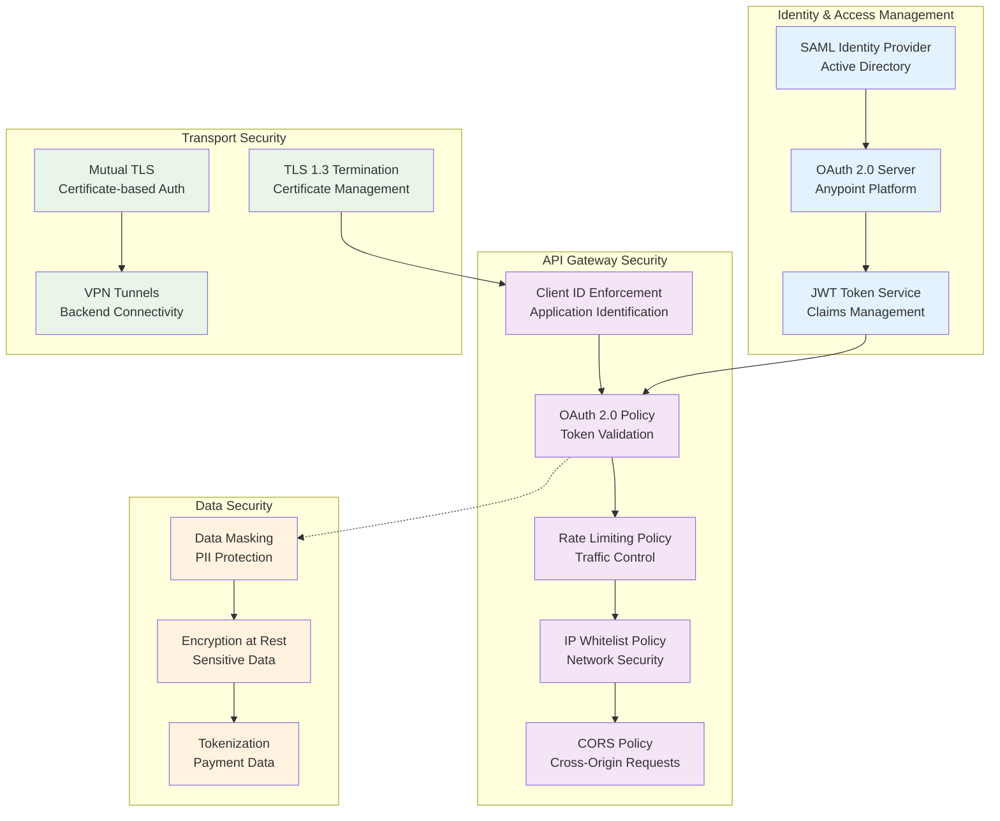
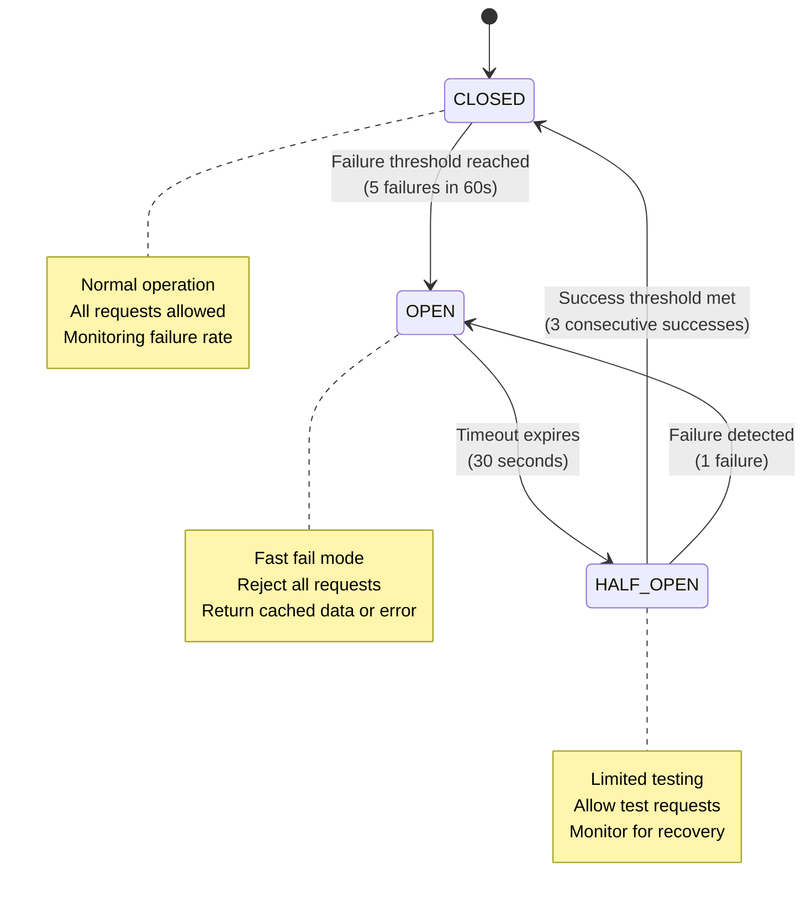
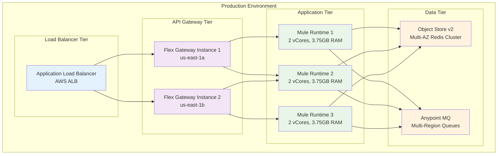

# MuleSoft Integration Layer Architecture

## Overview

This document details the internal architecture of the MuleSoft integration layer, showing how the Anypoint Platform components work together to provide seamless integration between the Order Management System and all connected backend systems.

## MuleSoft Anypoint Platform Architecture

## API Layer Details

### Experience Layer APIs

#### Order Experience API
- **Purpose**: Provides customer-facing order operations
- **Endpoints**:
  - `POST /api/orders` - Create new order
  - `GET /api/orders/{orderId}` - Retrieve order details
  - `GET /api/orders` - List customer orders
  - `PATCH /api/orders/{orderId}/status` - Update order status
- **Features**: Request/response transformation, customer context enrichment
- **Security**: OAuth 2.0, rate limiting (1000 req/hour per user)
- **Caching**: Order details cached for 5 minutes

#### Customer Experience API
- **Purpose**: Customer profile and preferences management
- **Endpoints**:
  - `GET /api/customers/{customerId}` - Customer profile
  - `PUT /api/customers/{customerId}` - Update profile
  - `GET /api/customers/{customerId}/preferences` - Get preferences
- **Features**: Data aggregation from multiple customer sources
- **Security**: OAuth 2.0, data masking for PII
- **Caching**: Profile data cached for 15 minutes

### Process Layer APIs

#### Order Processing API
- **Purpose**: Orchestrates end-to-end order processing workflow
- **Key Flows**:
  - Customer validation
  - Inventory reservation
  - Payment authorization
  - Order creation in OMS
  - Shipment initiation
- **Error Handling**: Compensation patterns for rollback
- **Async Processing**: Long-running operations via Anypoint MQ
- **State Management**: Order state stored in Object Store

#### Payment Processing API
- **Purpose**: Manages payment authorization and processing
- **Integrations**: Multiple payment gateways (Stripe, PayPal, Bank APIs)
- **Features**: 
  - Payment method routing
  - Fraud detection integration
  - PCI DSS compliance
- **Retry Logic**: Exponential backoff for failed payments
- **Monitoring**: Real-time payment success/failure metrics

#### Inventory Processing API
- **Purpose**: Real-time inventory validation and reservation
- **Features**:
  - Multi-location inventory check
  - Stock reservation with TTL
  - Backorder management
- **Performance**: Sub-second response time requirement
- **Circuit Breaker**: Fallback to cached inventory data

### System Layer APIs

#### OMS System API
- **Purpose**: Standardized interface to Order Management System
- **Protocol**: REST API with database connectivity fallback
- **Data Model**: Canonical order schema with field mapping
- **Connection Pool**: 20 concurrent connections to OMS database
- **Transaction Management**: XA transactions for data consistency

#### Customer System API
- **Purpose**: Customer data system integration
- **Protocol**: HTTPS/REST with OAuth 2.0 authentication
- **Features**:
  - Customer profile CRUD operations
  - Address validation
  - Communication preferences
- **Rate Limiting**: 2000 requests per minute
- **Data Sync**: Real-time updates with change data capture

## Shared Services Architecture

### Object Store v2

### Anypoint MQ Integration

## Security Architecture

### Anypoint Platform Security Model

## Error Handling & Resilience

### Circuit Breaker Pattern Implementation

### Retry Strategy Configuration

| System | Max Retries | Backoff Strategy | Timeout | Circuit Breaker |
|--------|-------------|------------------|---------|-----------------|
| OMS System | 3 | Exponential (1s, 2s, 4s) | 30s | Yes |
| Payment Gateway | 2 | Fixed (2s, 2s) | 15s | Yes |
| Inventory System | 5 | Linear (1s, 2s, 3s, 4s, 5s) | 45s | Yes |
| Customer System | 3 | Exponential (0.5s, 1s, 2s) | 20s | No |
| Shipping System | 2 | Fixed (3s, 3s) | 25s | Yes |

## Monitoring & Observability

### Comprehensive Monitoring Stack

```mermaid
graph TB
    subgraph "Application Monitoring"
        APP_METRICS[Application Metrics<br/>Custom Business KPIs]
        API_ANALYTICS[API Analytics<br/>Request/Response Tracking]
        PERFORMANCE_METRICS[Performance Metrics<br/>Latency & Throughput]
    end
    
    subgraph "Infrastructure Monitoring"
        RUNTIME_HEALTH[Runtime Health<br/>CPU, Memory, Disk]
        NETWORK_METRICS[Network Metrics<br/>Connectivity & Bandwidth]
        RESOURCE_USAGE[Resource Usage<br/>Connection Pools & Queues]
    end
    
    subgraph "Anypoint Monitoring"
        FLOW_METRICS[Flow Execution Metrics<br/>Success/Failure Rates]
        CONNECTOR_METRICS[Connector Metrics<br/>Database & HTTP Performance]
        ERROR_TRACKING[Error Tracking<br/>Exception Analysis]
    end
    
    subgraph "External Monitoring"
        SPLUNK[Splunk Enterprise<br/>Log Aggregation & Analysis]
        DATADOG[DataDog<br/>Infrastructure Monitoring]
        PAGERDUTY[PagerDuty<br/>Incident Management]
    end
    
    APP_METRICS --> ANYPOINT_MONITORING
    API_ANALYTICS --> ANYPOINT_MONITORING
    PERFORMANCE_METRICS --> ANYPOINT_MONITORING
    
    RUNTIME_HEALTH --> DATADOG
    NETWORK_METRICS --> DATADOG
    RESOURCE_USAGE --> DATADOG
    
    FLOW_METRICS --> SPLUNK
    CONNECTOR_METRICS --> SPLUNK
    ERROR_TRACKING --> SPLUNK
    
    SPLUNK --> PAGERDUTY
    DATADOG --> PAGERDUTY
    ANYPOINT_MONITORING --> PAGERDUTY
    
    classDef application fill:#e8f5e8
    classDef infrastructure fill:#fff3e0
    classDef anypoint fill:#e3f2fd
    classDef external fill:#fce4ec
    
    class APP_METRICS,API_ANALYTICS,PERFORMANCE_METRICS application
    class RUNTIME_HEALTH,NETWORK_METRICS,RESOURCE_USAGE infrastructure
    class FLOW_METRICS,CONNECTOR_METRICS,ERROR_TRACKING anypoint
    class SPLUNK,DATADOG,PAGERDUTY external
```

## Performance Optimization

### Caching Strategy

| Data Type | Cache Location | TTL | Refresh Strategy |
|-----------|----------------|-----|------------------|
| Customer Profile | Object Store | 15 minutes | On-demand refresh |
| Product Catalog | Object Store | 1 hour | Scheduled refresh |
| Inventory Levels | Object Store | 5 minutes | Event-driven refresh |
| Payment Tokens | Object Store | 30 minutes | Auto-refresh before expiry |
| System Configuration | Object Store | 4 hours | Manual refresh |

### Connection Pooling Configuration

| Target System | Pool Size | Max Wait | Idle Timeout | Validation Query |
|---------------|-----------|----------|--------------|------------------|
| OMS Database | 20 | 5s | 30s | SELECT 1 |
| Customer API | 15 | 3s | 60s | GET /health |
| Payment Gateway | 10 | 2s | 45s | GET /status |
| Inventory System | 25 | 4s | 30s | GET /ping |

## Deployment Architecture

### CloudHub 2.0 Deployment Model

## Technology Specifications

### Runtime Environment
- **Mule Runtime**: 4.6.x Enterprise Edition
- **Java Version**: OpenJDK 17 LTS
- **CloudHub 2.0**: Multi-region deployment (us-east-1, us-west-2)
- **High Availability**: Active-active configuration with 99.99% SLA

### Integration Connectors
- **Database Connector**: 1.14.x for OMS integration
- **HTTP Connector**: 1.9.x for REST API calls
- **Salesforce Connector**: 10.18.x for CRM integration
- **Object Store Connector**: 1.2.x for caching
- **Anypoint MQ Connector**: 4.0.x for messaging

### Security Standards
- **TLS**: 1.3 for all external communications
- **OAuth 2.0**: RFC 6749 compliant implementation
- **JWT**: RS256 algorithm for token signing
- **API Policies**: Client ID enforcement, rate limiting, CORS
- **Data Protection**: PCI DSS Level 1, GDPR compliant

This comprehensive MuleSoft integration layer provides the robust, scalable, and secure foundation needed for the Order Management System integration, ensuring high performance, reliability, and maintainability across all connected systems.