# Data Flow Diagrams

## Overview

This document presents detailed data flow diagrams for key business processes in the Order Management System integration, showing end-to-end data movement, transformation, and system interactions.

## 1. Order Creation Data Flow

### Complete Order Creation Process

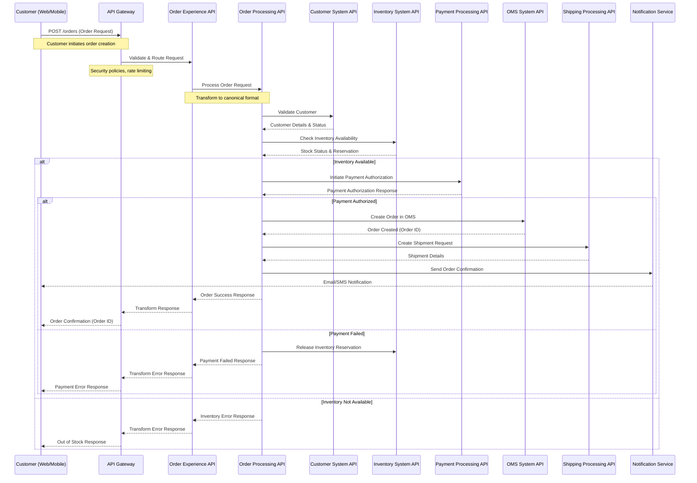

### Order Request Data Transformation

```mermaid
graph LR
    subgraph "Customer Request Format"
        CR[Customer Request<br/>{<br/>  customerId: "12345",<br/>  items: [<br/>    {<br/>      productId: "P001",<br/>      quantity: 2,<br/>      price: 29.99<br/>    }<br/>  ],<br/>  shippingAddress: {...}<br/>}]
    end
    
    subgraph "MuleSoft Transformation"
        DW[DataWeave Transformation<br/>- Validate request structure<br/>- Enrich with customer data<br/>- Calculate totals<br/>- Add timestamps]
    end
    
    subgraph "Canonical Order Format"
        CO[Canonical Order<br/>{<br/>  orderId: "ORD-2026-001",<br/>  customerId: "12345",<br/>  orderDate: "2026-03-23T...",<br/>  items: [...],<br/>  totalAmount: 59.98,<br/>  status: "PENDING",<br/>  workflow: "STANDARD"<br/>}]
    end
    
    subgraph "Backend System Formats"
        OMS_F[OMS Format<br/>Database Schema]
        INV_F[Inventory Format<br/>REST API JSON]
        PAY_F[Payment Format<br/>Gateway Specific]
    end
    
    CR --> DW
    DW --> CO
    CO --> OMS_F
    CO --> INV_F
    CO --> PAY_F
    
    classDef input fill:#e3f2fd
    classDef transform fill:#f3e5f5
    classDef canonical fill:#e8f5e8
    classDef output fill:#fff3e0
    
    class CR input
    class DW transform
    class CO canonical
    class OMS_F,INV_F,PAY_F output
```

## 2. Order Status Update Data Flow

### Real-time Order Status Updates

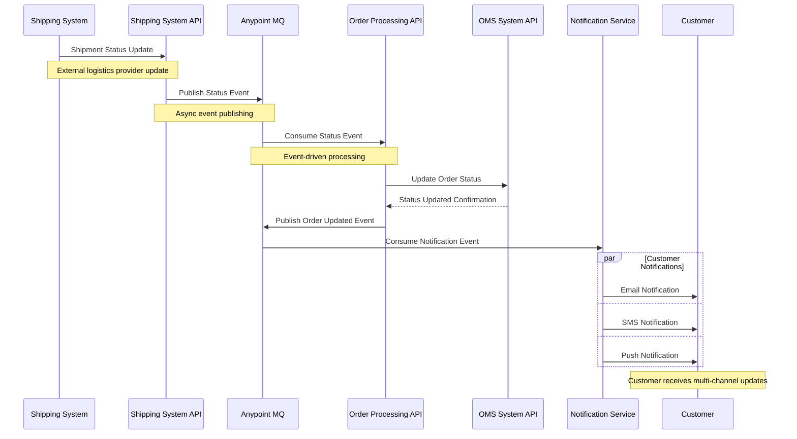

### Event-Driven Status Flow

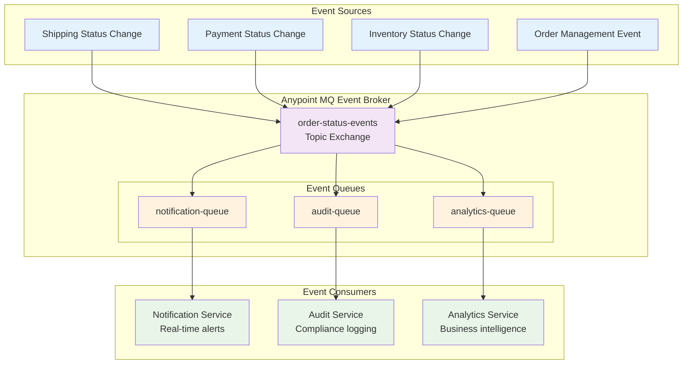

## 3. Payment Processing Data Flow

### Secure Payment Authorization Flow

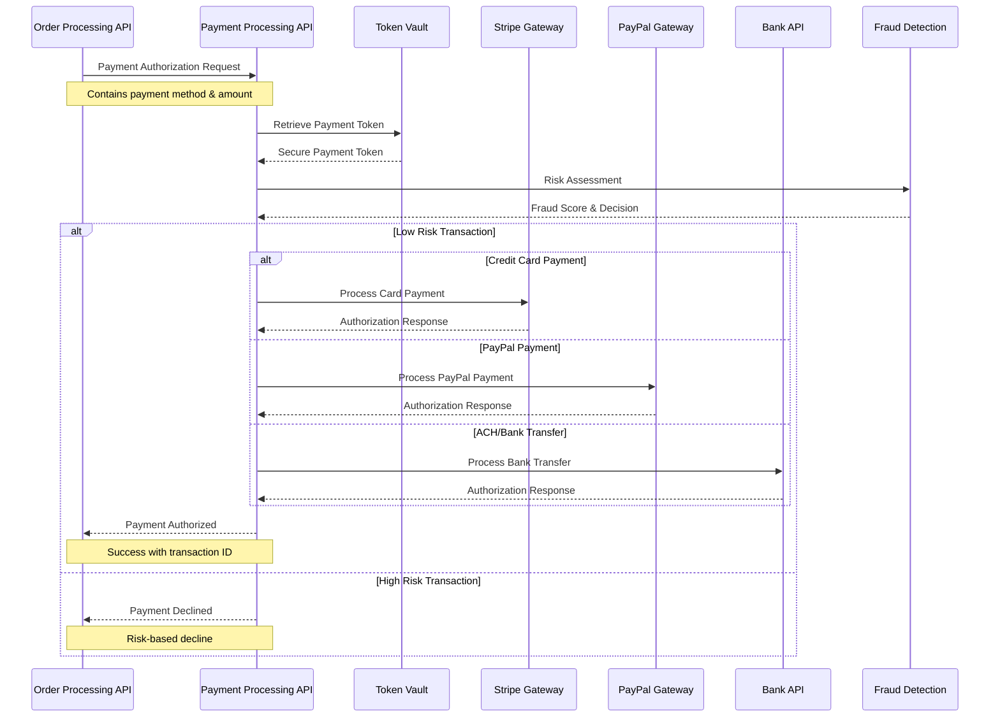

### Payment Data Security Flow

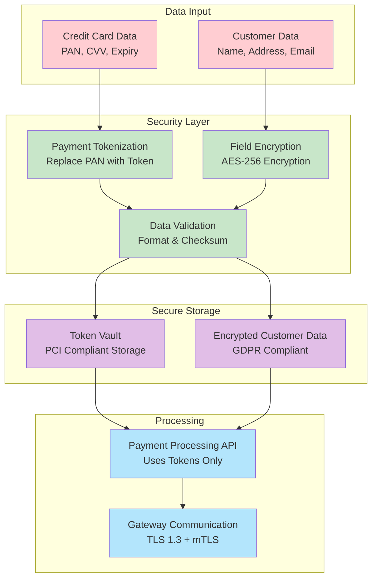

## 4. Inventory Synchronization Data Flow

### Real-time Inventory Updates

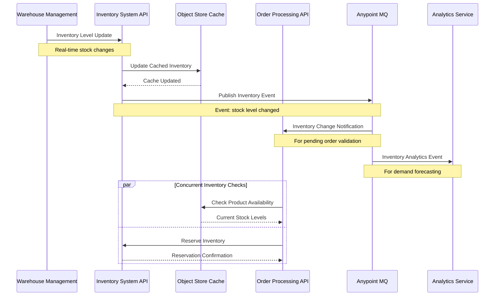

### Multi-Location Inventory Aggregation

```mermaid
graph TB
    subgraph "Warehouse Locations"
        WH1[Warehouse East<br/>NYC - 150 units]
        WH2[Warehouse West<br/>LA - 200 units]
        WH3[Warehouse Central<br/>CHI - 75 units]
        WH4[Warehouse South<br/>ATL - 125 units]
    end
    
    subgraph "Inventory Aggregation Layer"
        AGG[Inventory Aggregation Service<br/>Real-time Consolidation]
        RULES[Business Rules Engine<br/>- Location preferences<br/>- Shipping costs<br/>- Delivery time]
    end
    
    subgraph "Availability Response"
        TOTAL[Total Available: 550 units]
        ALLOCATION[Optimal Allocation:<br/>Primary: NYC (150)<br/>Secondary: LA (200)<br/>Tertiary: ATL (125)]
    end
    
    subgraph "Caching Layer"
        L1_CACHE[L1 Cache<br/>Individual Locations<br/>TTL: 30 seconds]
        L2_CACHE[L2 Cache<br/>Aggregated View<br/>TTL: 5 minutes]
    end
    
    WH1 --> AGG
    WH2 --> AGG
    WH3 --> AGG
    WH4 --> AGG
    
    AGG --> RULES
    AGG --> L1_CACHE
    
    RULES --> TOTAL
    RULES --> ALLOCATION
    
    L1_CACHE --> L2_CACHE
    L2_CACHE --> ALLOCATION
    
    classDef warehouse fill:#e3f2fd
    classDef aggregation fill:#f3e5f5
    classDef result fill:#e8f5e8
    classDef cache fill:#fff3e0
    
    class WH1,WH2,WH3,WH4 warehouse
    class AGG,RULES aggregation
    class TOTAL,ALLOCATION result
    class L1_CACHE,L2_CACHE cache
```

## 5. Customer Data Synchronization

### Customer Profile Data Flow

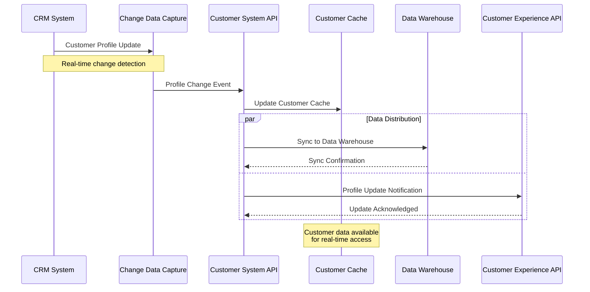

### Customer Data Consistency Model

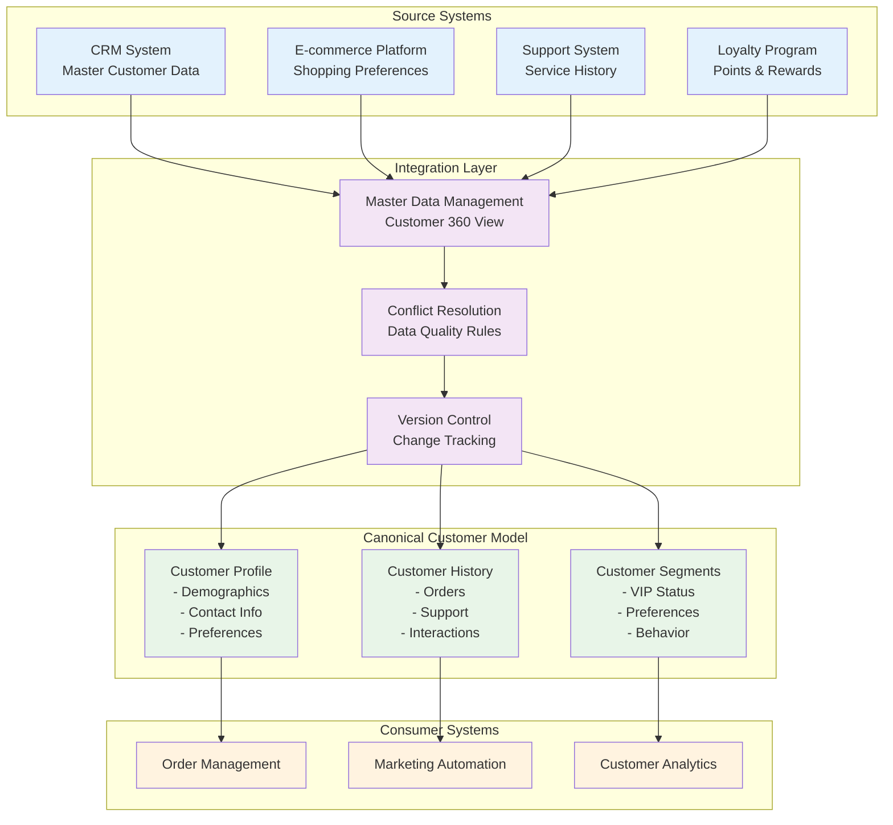

## 6. Error Handling & Compensation Flow

### Transaction Compensation Pattern

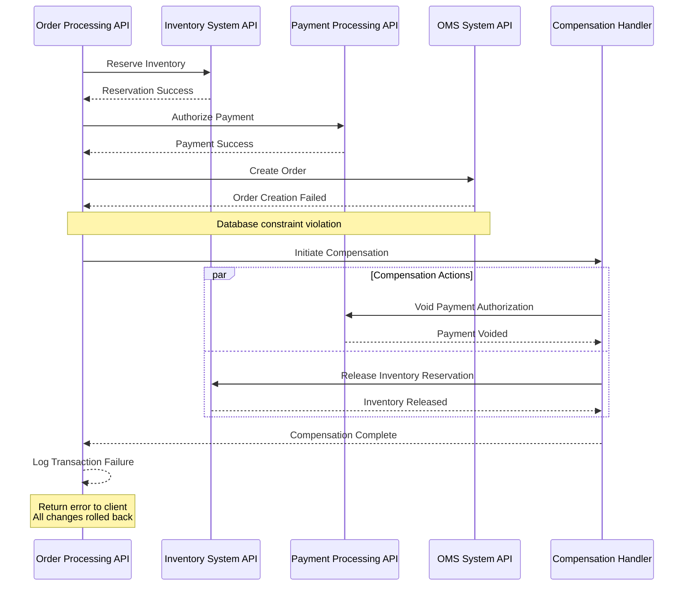

### Circuit Breaker Data Flow

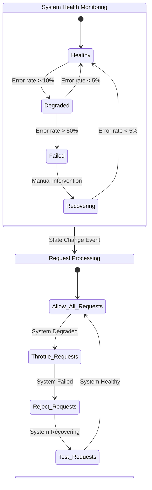

## Data Quality & Validation

### Input Validation Pipeline

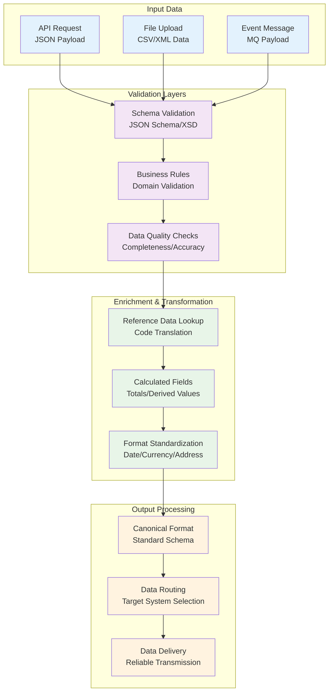

These comprehensive data flow diagrams illustrate the detailed movement and transformation of data throughout the Order Management System integration, providing clear visibility into how information flows between systems, is transformed, validated, and processed to ensure data integrity and business process execution.
