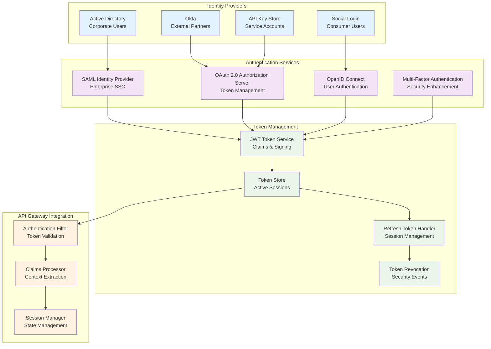
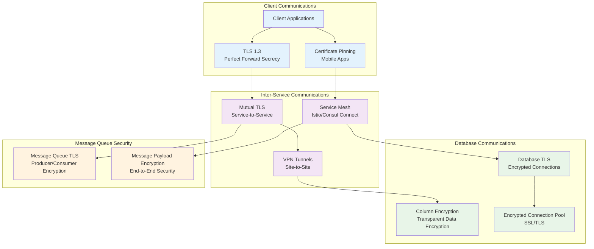
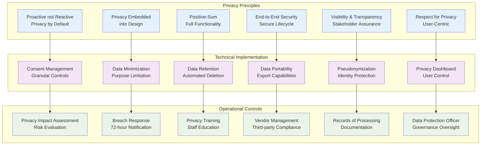
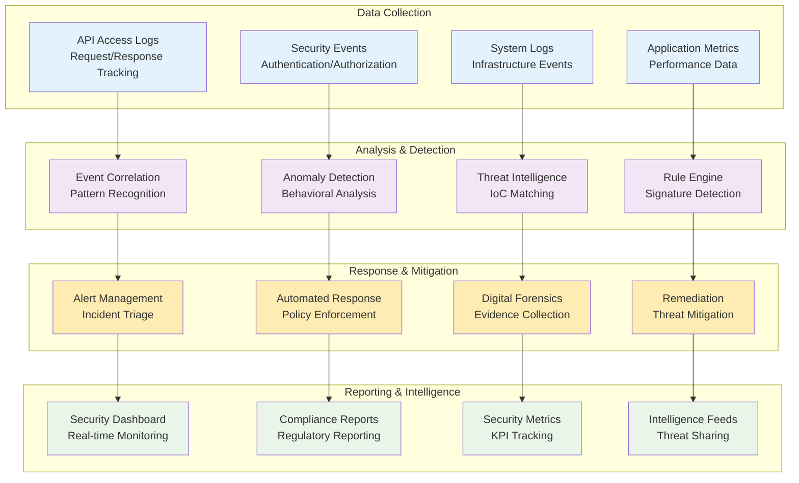
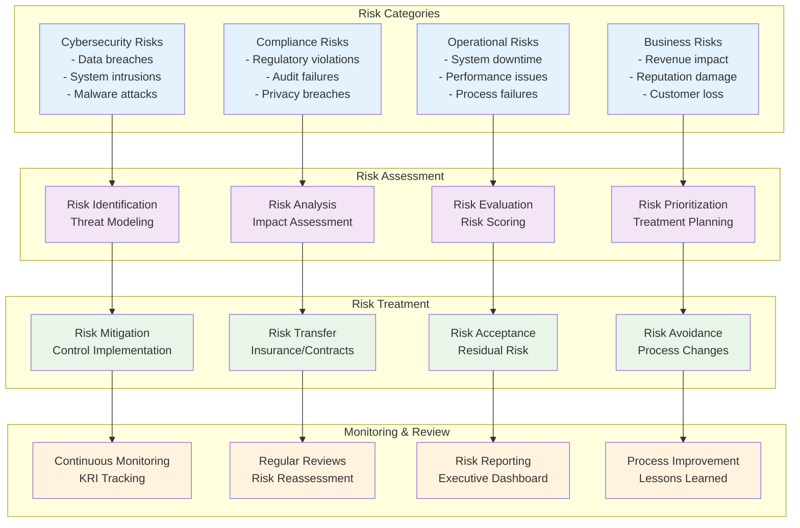
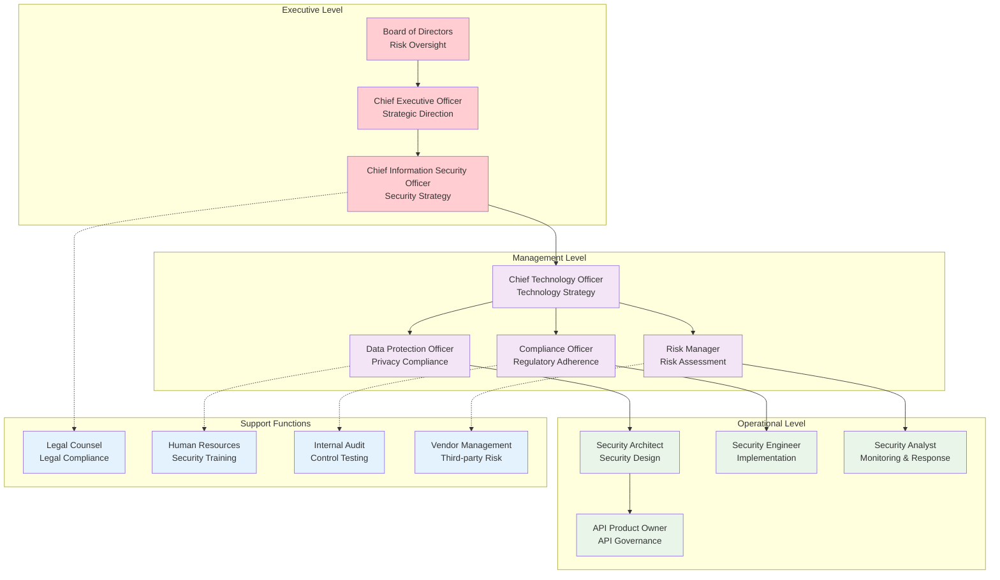

# Security & Governance Architecture

## Overview

This document outlines the comprehensive security and governance framework for the Order Management System integration, covering authentication, authorization, data protection, compliance, and governance policies implemented through MuleSoft Anypoint Platform.

## Security Architecture Overview

```mermaid
graph TB
    subgraph "External Clients"
        WEB[Web Application]
        MOBILE[Mobile App]
        B2B[B2B Partners]
        INTERNAL[Internal Systems]
    end
    
    subgraph "Security Perimeter"
        subgraph "Edge Security"
            FIREWALL[Web Application Firewall<br/>DDoS Protection]
            DDOS[DDoS Mitigation<br/>Rate Limiting]
            GEO_FILTER[Geo-blocking<br/>IP Filtering]
        end
        
        subgraph "API Gateway Security"
            FLEX_GW[Anypoint Flex Gateway<br/>Policy Enforcement Point]
            
            subgraph "Authentication Layer"
                OAUTH[OAuth 2.0 Server<br/>Token Validation]
                JWT[JWT Token Service<br/>Claims Processing]
                SAML[SAML Identity Provider<br/>Enterprise SSO]
            end
            
            subgraph "Authorization Layer"
                RBAC[Role-Based Access Control<br/>Permissions Management]
                SCOPE_CHECK[Scope Validation<br/>API Access Control]
                POLICY_ENGINE[Policy Engine<br/>Dynamic Authorization]
            end
        end
        
        subgraph "Data Security"
            ENCRYPTION[Data Encryption<br/>At Rest & In Transit]
            TOKENIZATION[Payment Tokenization<br/>PCI DSS Compliance]
            MASKING[Data Masking<br/>PII Protection]
            KEY_MGMT[Key Management<br/>Certificate Authority]
        end
        
        subgraph "Monitoring & Compliance"
            SIEM[Security Information<br/>Event Management]
            AUDIT[Audit Logging<br/>Compliance Tracking]
            THREAT_DETECT[Threat Detection<br/>Behavioral Analysis]
            COMPLIANCE[Compliance Dashboard<br/>Regulatory Reporting]
        end
    end
    
    subgraph "Backend Systems"
        OMS_DB[(OMS Database)]
        CUSTOMER_DB[(Customer System)]
        PAYMENT_SYS[Payment Gateway]
        INVENTORY_SYS[Inventory System]
    end
    
    %% Client to Edge Security
    WEB --> FIREWALL
    MOBILE --> DDOS
    B2B --> GEO_FILTER
    INTERNAL --> FIREWALL
    
    %% Edge Security to API Gateway
    FIREWALL --> FLEX_GW
    DDOS --> FLEX_GW
    GEO_FILTER --> FLEX_GW
    
    %% API Gateway Security Flow
    FLEX_GW --> OAUTH
    OAUTH --> JWT
    JWT --> SAML
    
    FLEX_GW --> RBAC
    RBAC --> SCOPE_CHECK
    SCOPE_CHECK --> POLICY_ENGINE
    
    %% Data Security Integration
    FLEX_GW -.-> ENCRYPTION
    POLICY_ENGINE -.-> TOKENIZATION
    ENCRYPTION --> MASKING
    MASKING --> KEY_MGMT
    
    %% Security Monitoring
    FLEX_GW -.-> SIEM
    OAUTH -.-> AUDIT
    POLICY_ENGINE -.-> THREAT_DETECT
    AUDIT --> COMPLIANCE
    
    %% Secure Backend Connections
    FLEX_GW ==>|Encrypted & Authenticated| OMS_DB
    FLEX_GW ==>|Encrypted & Authenticated| CUSTOMER_DB
    FLEX_GW ==>|Encrypted & Authenticated| PAYMENT_SYS
    FLEX_GW ==>|Encrypted & Authenticated| INVENTORY_SYS
    
    classDef client fill:#e3f2fd
    classDef edge fill:#ffcdd2
    classDef gateway fill:#c8e6c9
    classDef auth fill:#fff3e0
    classDef authz fill:#f3e5f5
    classDef data fill:#e1bee7
    classDef monitor fill:#e0f2f1
    classDef backend fill:#fce4ec
    
    class WEB,MOBILE,B2B,INTERNAL client
    class FIREWALL,DDOS,GEO_FILTER edge
    class FLEX_GW gateway
    class OAUTH,JWT,SAML auth
    class RBAC,SCOPE_CHECK,POLICY_ENGINE authz
    class ENCRYPTION,TOKENIZATION,MASKING,KEY_MGMT data
    class SIEM,AUDIT,THREAT_DETECT,COMPLIANCE monitor
    class OMS_DB,CUSTOMER_DB,PAYMENT_SYS,INVENTORY_SYS backend
```



## Identity & Access Management (IAM)

### Authentication Architecture



### Authorization Model

#### Role-Based Access Control (RBAC)

| Role | Permissions | API Scopes | Systems Access |
|------|-------------|-----------|----------------|
| **Customer** | Read own orders, Update profile | `orders:read:own`, `profile:write:own` | Order Experience API only |
| **Customer Service** | Read/Update orders, View customer profiles | `orders:read:all`, `orders:write`, `customers:read` | Order + Customer APIs |
| **Sales Manager** | Create orders, View reports, Manage customers | `orders:write`, `customers:write`, `reports:read` | All Experience APIs |
| **Operations** | System monitoring, Inventory management | `system:monitor`, `inventory:write` | All APIs + System Layer |
| **Admin** | Full system access, User management | `*:*` | All systems and APIs |
| **B2B Partner** | Limited order access for their account | `orders:read:partner`, `orders:write:partner` | Scoped Experience APIs |
| **Service Account** | System-to-system integration | `system:integrate` | Specific System APIs |

#### Dynamic Authorization Policies

```json
{
  "policyName": "order-access-policy",
  "version": "1.0",
  "rules": [
    {
      "condition": "user.role == 'customer'",
      "effect": "allow",
      "resources": ["orders/{customerId}/*"],
      "constraints": [
        "path.customerId == jwt.customerId"
      ]
    },
    {
      "condition": "user.role == 'customer-service'",
      "effect": "allow",
      "resources": ["orders/*", "customers/*"],
      "constraints": [
        "time.hour >= 8 && time.hour <= 18",
        "ip.address in allowed_ip_ranges"
      ]
    },
    {
      "condition": "user.role == 'b2b-partner'",
      "effect": "allow",
      "resources": ["orders/*"],
      "constraints": [
        "order.partnerId == jwt.partnerId",
        "rate_limit(100, '1hour')"
      ]
    }
  ]
}
```

## Data Protection & Privacy

### Data Classification Framework

```mermaid
graph TB
    subgraph "Data Classification Levels"
        PUBLIC[Public Data<br/>- Product catalogs<br/>- Marketing content<br/>- API documentation]
        
        INTERNAL[Internal Data<br/>- Order status<br/>- Inventory levels<br/>- System metrics]
        
        CONFIDENTIAL[Confidential Data<br/>- Customer profiles<br/>- Order details<br/>- Business reports]
        
        RESTRICTED[Restricted Data<br/>- Payment information<br/>- Personal identifiers<br/>- Authentication credentials]
    end
    
    subgraph "Protection Mechanisms"
        subgraph "Public Protection"
            BASIC_AUTH[Basic Authentication<br/>API Keys]
            RATE_LIMIT_PUB[Rate Limiting<br/>DDoS Protection]
        end
        
        subgraph "Internal Protection"
            OAUTH_INT[OAuth 2.0<br/>Service Authentication]
            VPN[VPN Tunnels<br/>Network Encryption]
        end
        
        subgraph "Confidential Protection"
            STRONG_AUTH[Strong Authentication<br/>MFA Required]
            FIELD_ENCRYPT[Field-Level Encryption<br/>AES-256]
            AUDIT_LOG[Audit Logging<br/>Access Tracking]
        end
        
        subgraph "Restricted Protection"
            VAULT[Secure Vault<br/>HSM Storage]
            TOKENIZATION[Tokenization<br/>Data Substitution]
            ZERO_TRUST[Zero Trust<br/>Continuous Verification]
            GDPR_CONTROLS[GDPR Controls<br/>Right to Delete]
        end
    end
    
    PUBLIC --> BASIC_AUTH
    PUBLIC --> RATE_LIMIT_PUB
    
    INTERNAL --> OAUTH_INT
    INTERNAL --> VPN
    
    CONFIDENTIAL --> STRONG_AUTH
    CONFIDENTIAL --> FIELD_ENCRYPT
    CONFIDENTIAL --> AUDIT_LOG
    
    RESTRICTED --> VAULT
    RESTRICTED --> TOKENIZATION
    RESTRICTED --> ZERO_TRUST
    RESTRICTED --> GDPR_CONTROLS
    
    classDef public fill:#e8f5e8
    classDef internal fill:#fff3e0
    classDef confidential fill:#ffecb3
    classDef restricted fill:#ffcdd2
    classDef protection fill:#e1f5fe
    
    class PUBLIC public
    class INTERNAL internal
    class CONFIDENTIAL confidential
    class RESTRICTED restricted
    class BASIC_AUTH,RATE_LIMIT_PUB,OAUTH_INT,VPN,STRONG_AUTH,FIELD_ENCRYPT,AUDIT_LOG,VAULT,TOKENIZATION,ZERO_TRUST,GDPR_CONTROLS protection
```



### Encryption Strategy

#### Data at Rest Encryption

| Data Type | Encryption Method | Key Management | Compliance |
|-----------|-------------------|----------------|------------|
| **Database Records** | AES-256-GCM | AWS KMS/Azure Key Vault | SOX, PCI DSS |
| **File Storage** | AES-256-CBC | Hardware Security Module | GDPR, HIPAA |
| **Object Store** | Server-Side Encryption | Customer Managed Keys | SOC 2, ISO 27001 |
| **Backup Data** | AES-256 with compression | Automated key rotation | All compliance frameworks |
| **Log Files** | ChaCha20-Poly1305 | Distributed key management | Audit requirements |

#### Data in Transit Encryption



### PII Data Handling

#### Data Masking Strategies

```json
{
  "maskingRules": {
    "creditCard": {
      "pattern": "****-****-****-{last4}",
      "algorithm": "preserve_last_4"
    },
    "email": {
      "pattern": "{first}***@{domain}",
      "algorithm": "preserve_first_last"
    },
    "phone": {
      "pattern": "***-***-{last4}",
      "algorithm": "preserve_format_last_4"
    },
    "ssn": {
      "pattern": "***-**-{last4}",
      "algorithm": "preserve_last_4"
    },
    "address": {
      "street": "*** *** Street",
      "city": "preserved",
      "state": "preserved",
      "zipCode": "{first3}**"
    }
  },
  "dynamicMasking": {
    "enabled": true,
    "basedOnRole": true,
    "contextAware": true
  }
}
```

## Compliance & Regulatory Framework

### Compliance Matrix

| Regulation | Applicable Areas | Implementation | Monitoring |
|------------|------------------|----------------|------------|
| **PCI DSS** | Payment processing, Card data storage | Tokenization, Network segmentation, Access controls | Quarterly scans, Annual assessment |
| **GDPR** | Customer data, EU residents | Consent management, Data portability, Right to deletion | Privacy impact assessments, Breach notifications |
| **SOX** | Financial reporting, Audit trails | Segregation of duties, Change management, Audit logging | Continuous monitoring, Annual compliance testing |
| **HIPAA** | Health-related customer data | Data encryption, Access controls, Audit trails | Regular risk assessments, Security training |
| **SOC 2 Type II** | System security, Availability | Security controls, Monitoring, Incident response | Third-party audits, Control testing |
| **ISO 27001** | Information security management | Risk management, Security policies, Training | Management reviews, Internal audits |

### Privacy by Design Implementation



## API Governance Framework

### API Lifecycle Governance

```mermaid
graph TB
    subgraph "Design Phase"
        API_DESIGN[API Design<br/>Anypoint Design Center]
        STANDARDS[Design Standards<br/>REST/OpenAPI Guidelines]
        REVIEW[Design Review<br/>Architecture Committee]
        APPROVAL[Design Approval<br/>Stakeholder Sign-off]
    end
    
    subgraph "Development Phase"
        IMPL[API Implementation<br/>MuleSoft Development]
        TESTING[Testing<br/>Unit/Integration/Security]
        CODE_REVIEW[Code Review<br/>Peer Review Process]
        QUALITY_GATE[Quality Gate<br/>SonarQube Analysis]
    end
    
    subgraph "Deployment Phase"
        STAGING[Staging Deployment<br/>Pre-production Testing]
        SECURITY_SCAN[Security Scanning<br/>SAST/DAST/IAST]
        PERF_TEST[Performance Testing<br/>Load/Stress Testing]
        PROD_DEPLOY[Production Deployment<br/>Blue/Green Strategy]
    end
    
    subgraph "Management Phase"
        MONITORING[API Monitoring<br/>Performance/Availability]
        ANALYTICS[API Analytics<br/>Usage/Trends]
        VERSION_MGMT[Version Management<br/>Deprecation Strategy]
        RETIREMENT[API Retirement<br/>End-of-Life Process]
    end
    
    API_DESIGN --> STANDARDS
    STANDARDS --> REVIEW
    REVIEW --> APPROVAL
    
    APPROVAL --> IMPL
    IMPL --> TESTING
    TESTING --> CODE_REVIEW
    CODE_REVIEW --> QUALITY_GATE
    
    QUALITY_GATE --> STAGING
    STAGING --> SECURITY_SCAN
    SECURITY_SCAN --> PERF_TEST
    PERF_TEST --> PROD_DEPLOY
    
    PROD_DEPLOY --> MONITORING
    MONITORING --> ANALYTICS
    ANALYTICS --> VERSION_MGMT
    VERSION_MGMT --> RETIREMENT
    
    classDef design fill:#e3f2fd
    classDef development fill:#f3e5f5
    classDef deployment fill:#e8f5e8
    classDef management fill:#fff3e0
    
    class API_DESIGN,STANDARDS,REVIEW,APPROVAL design
    class IMPL,TESTING,CODE_REVIEW,QUALITY_GATE development
    class STAGING,SECURITY_SCAN,PERF_TEST,PROD_DEPLOY deployment
    class MONITORING,ANALYTICS,VERSION_MGMT,RETIREMENT management
```



### API Policy Framework

#### Automated Policy Enforcement

| Policy Type | Implementation | Enforcement Point | Monitoring |
|-------------|----------------|-------------------|------------|
| **Authentication** | OAuth 2.0, JWT validation | API Gateway | Real-time token validation |
| **Rate Limiting** | Token bucket algorithm | API Gateway | Request rate monitoring |
| **Data Validation** | JSON Schema validation | API Gateway | Validation error tracking |
| **Security Headers** | OWASP recommended headers | API Gateway | Security posture monitoring |
| **CORS** | Cross-origin resource sharing | API Gateway | Cross-domain request tracking |
| **IP Filtering** | Whitelist/blacklist rules | API Gateway | Geographic access monitoring |
| **Payload Size** | Maximum request/response size | API Gateway | Bandwidth utilization tracking |
| **Content Type** | MIME type validation | API Gateway | Content format compliance |

#### Policy Configuration Example

```yaml
apiVersion: gateway.mulesoft.com/v1alpha1
kind: PolicyBinding
metadata:
  name: order-api-security-policies
spec:
  targetRef:
    name: order-experience-api
  policies:
    - policyRef:
        name: oauth-2-validation
      config:
        scopes:
          - orders:read
          - orders:write
        audiences:
          - order-management-api
    - policyRef:
        name: rate-limiting-sla-based
      config:
        rateLimits:
          - identifier: "client-id"
            limits:
              - maximumRequests: 1000
                timePeriodInMilliseconds: 3600000
              - maximumRequests: 50
                timePeriodInMilliseconds: 60000
    - policyRef:
        name: json-threat-protection
      config:
        maxContainerDepth: 10
        maxObjectEntryCount: 100
        maxArrayElementCount: 100
        maxStringValueLength: 1000
```

## Security Monitoring & Incident Response

### Security Operations Center (SOC)



### Incident Response Playbook

#### Security Incident Classification

| Severity | Response Time | Examples | Escalation |
|----------|---------------|----------|------------|
| **Critical** | 15 minutes | Data breach, System compromise | CISO, Legal, PR |
| **High** | 1 hour | Authentication bypass, DDoS attack | Security Team, IT Manager |
| **Medium** | 4 hours | Suspicious activity, Policy violation | Security Analyst |
| **Low** | 24 hours | Failed login attempts, Minor anomalies | Automated response |

#### Automated Response Actions

```json
{
  "incidentTypes": {
    "suspicious_authentication": {
      "triggers": [
        "multiple_failed_logins",
        "geographically_impossible_travel",
        "unusual_user_agent"
      ],
      "automaticActions": [
        "temporary_account_lock",
        "require_mfa_verification",
        "log_security_event"
      ],
      "notifications": ["security_team", "user_email"]
    },
    "api_abuse": {
      "triggers": [
        "rate_limit_exceeded",
        "unusual_request_patterns",
        "invalid_api_usage"
      ],
      "automaticActions": [
        "throttle_requests",
        "temporary_api_suspension",
        "capture_traffic_sample"
      ],
      "notifications": ["api_team", "client_contact"]
    },
    "data_exfiltration": {
      "triggers": [
        "large_data_downloads",
        "unusual_data_access_patterns",
        "after_hours_data_access"
      ],
      "automaticActions": [
        "block_user_session",
        "alert_dpo",
        "preserve_audit_logs"
      ],
      "notifications": ["legal_team", "privacy_officer", "ciso"]
    }
  }
}
```

## Risk Management Framework

### Risk Assessment Matrix



### Key Risk Indicators (KRIs)

| Risk Area | KRI | Threshold | Monitoring Frequency |
|-----------|-----|-----------|---------------------|
| **Authentication** | Failed login rate | >5% | Real-time |
| **API Security** | Unauthorized access attempts | >10/hour | Real-time |
| **Data Protection** | PII exposure incidents | 0 tolerance | Real-time |
| **System Availability** | API uptime | <99.9% | Continuous |
| **Performance** | Response time degradation | >3 seconds | Real-time |
| **Compliance** | Policy violations | >5/month | Daily |
| **Third-party Risk** | Vendor security score | <80/100 | Monthly |
| **Change Management** | Emergency changes | >2/month | Monthly |

## Governance Organizational Structure

### Security Governance Roles



### Security Governance Committees

#### Security Steering Committee
- **Charter**: Strategic security decisions and budget approval
- **Members**: CISO, CTO, Legal, Compliance, Business Leaders
- **Frequency**: Monthly
- **Responsibilities**:
  - Security strategy approval
  - Risk tolerance decisions
  - Security investment priorities
  - Incident response oversight

#### Architecture Review Board
- **Charter**: Technical security architecture decisions
- **Members**: Security Architect, API Architects, Lead Engineers
- **Frequency**: Bi-weekly
- **Responsibilities**:
  - Security architecture reviews
  - Technology security standards
  - API security guidelines
  - Security pattern library

#### Incident Response Team
- **Charter**: Security incident management and response
- **Members**: Security Engineers, System Administrators, Legal
- **Frequency**: On-demand + Monthly reviews
- **Responsibilities**:
  - Incident response execution
  - Forensic analysis
  - Recovery procedures
  - Lessons learned documentation

This comprehensive security and governance framework provides the foundation for maintaining a secure, compliant, and well-governed Order Management System integration ecosystem, ensuring protection of sensitive data and regulatory compliance across all operational aspects.
