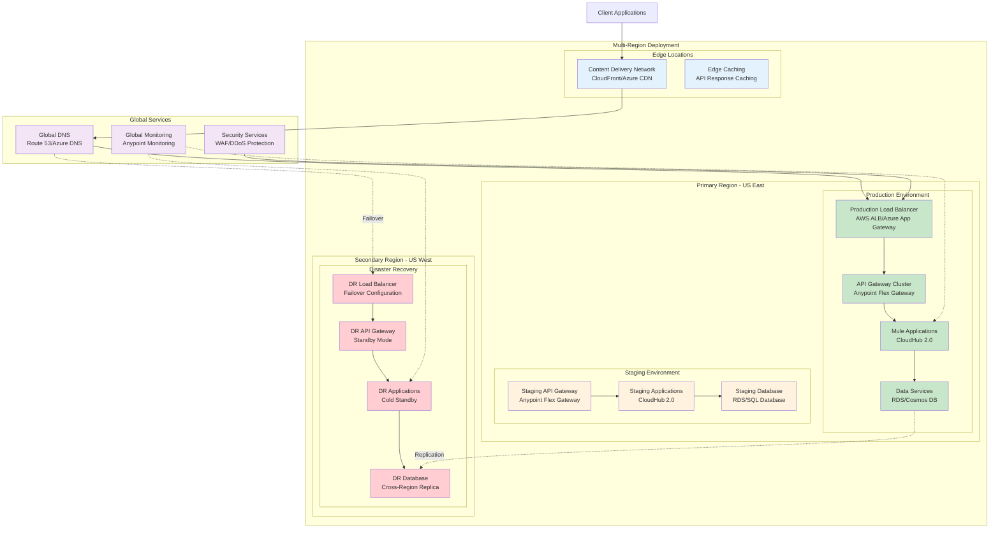
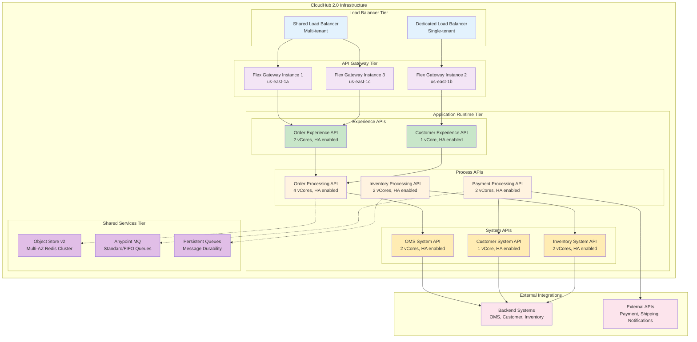
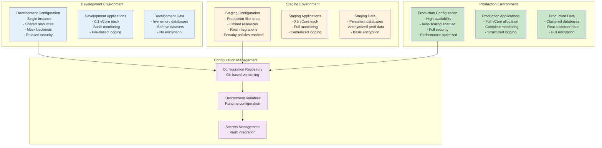
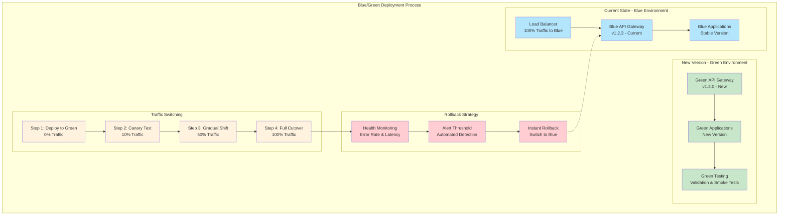
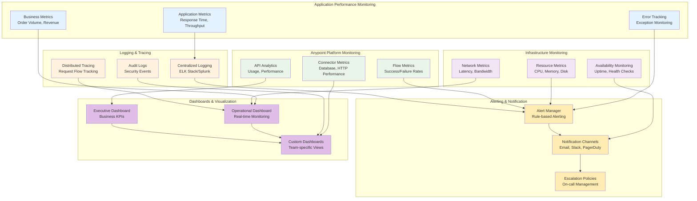
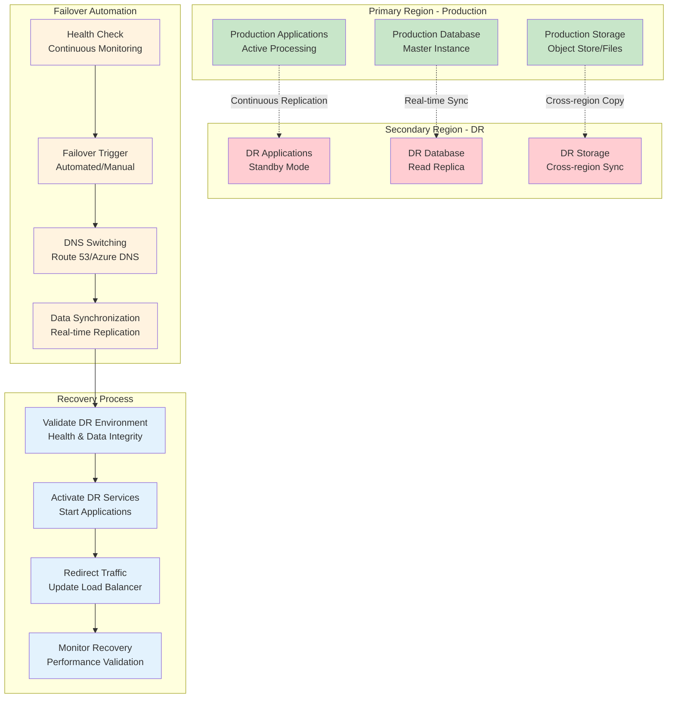

# Deployment Architecture

## Overview

This document outlines the comprehensive deployment architecture for the Order Management System integration, including infrastructure topology, environment configurations, deployment strategies, and operational considerations across multiple deployment models.

## Multi-Cloud Deployment Overview



## CloudHub 2.0 Deployment Architecture

### Application Deployment Topology



### Resource Allocation & Scaling Configuration

| API Layer | Application | vCores | Memory | Replicas | Auto-scaling |
|-----------|-------------|--------|--------|----------|--------------|
| **Experience** | Order Experience API | 2 | 3.75GB | 2-4 | CPU >70% |
| **Experience** | Customer Experience API | 1 | 1.75GB | 2-3 | CPU >70% |
| **Process** | Order Processing API | 4 | 7.5GB | 3-6 | CPU >80% |
| **Process** | Payment Processing API | 2 | 3.75GB | 2-4 | CPU >70% |
| **Process** | Inventory Processing API | 2 | 3.75GB | 2-4 | CPU >70% |
| **System** | OMS System API | 2 | 3.75GB | 2-3 | CPU >70% |
| **System** | Customer System API | 1 | 1.75GB | 2-3 | CPU >70% |
| **System** | Inventory System API | 2 | 3.75GB | 2-4 | CPU >70% |

## Environment Configuration Matrix

### Environment-Specific Configurations



### Environment Promotion Pipeline

| Stage | Validation Gates | Approval Required | Rollback Strategy |
|-------|------------------|-------------------|-------------------|
| **Development** | Unit tests, Code quality | Automated | Git revert |
| **Testing** | Integration tests, Security scan | Team lead | Previous build |
| **Staging** | Performance tests, UAT | Product owner | Blue/green switch |
| **Production** | Smoke tests, Health checks | Release manager | Automated rollback |

## Deployment Strategies

### Blue/Green Deployment Model



### Continuous Integration/Continuous Deployment (CI/CD)

```mermaid
graph LR
    subgraph "Source Control"
        COMMIT[Code Commit<br/>Feature Branch]
        PR[Pull Request<br/>Code Review]
        MERGE[Merge to Main<br/>Integration Branch]
    end
    
    subgraph "CI Pipeline"
        BUILD[Build Process<br/>Maven/Gradle]
        UNIT_TEST[Unit Tests<br/>JUnit/TestNG]
        SAST[Static Analysis<br/>SonarQube/Checkmarx]
        PACKAGE[Package Artifact<br/>JAR/Mule App]
    end
    
    subgraph "CD Pipeline"
        DEV_DEPLOY[Deploy to Dev<br/>Automated]
        INT_TEST[Integration Tests<br/>Automated]
        STAGE_DEPLOY[Deploy to Staging<br/>Manual Approval]
        UAT[User Acceptance Testing<br/>Manual]
        PROD_DEPLOY[Deploy to Production<br/>Scheduled/Manual]
    end
    
    subgraph "Post-Deployment"
        SMOKE_TEST[Smoke Tests<br/>Health Validation]
        MONITOR[Monitoring<br/>Performance Metrics]
        ALERT[Alerting<br/>Issue Detection]
    end
    
    COMMIT --> PR
    PR --> MERGE
    
    MERGE --> BUILD
    BUILD --> UNIT_TEST
    UNIT_TEST --> SAST
    SAST --> PACKAGE
    
    PACKAGE --> DEV_DEPLOY
    DEV_DEPLOY --> INT_TEST
    INT_TEST --> STAGE_DEPLOY
    STAGE_DEPLOY --> UAT
    UAT --> PROD_DEPLOY
    
    PROD_DEPLOY --> SMOKE_TEST
    SMOKE_TEST --> MONITOR
    MONITOR --> ALERT
    
    classDef source fill:#e3f2fd
    classDef ci fill:#f3e5f5
    classDef cd fill:#e8f5e8
    classDef post fill:#fff3e0
    
    class COMMIT,PR,MERGE source
    class BUILD,UNIT_TEST,SAST,PACKAGE ci
    class DEV_DEPLOY,INT_TEST,STAGE_DEPLOY,UAT,PROD_DEPLOY cd
    class SMOKE_TEST,MONITOR,ALERT post
```



## Infrastructure as Code (IaC)

### Terraform Configuration Structure

```
infrastructure/
├── environments/
│   ├── dev/
│   │   ├── main.tf
│   │   ├── variables.tf
│   │   └── terraform.tfvars
│   ├── staging/
│   │   ├── main.tf
│   │   ├── variables.tf
│   │   └── terraform.tfvars
│   └── production/
│       ├── main.tf
│       ├── variables.tf
│       └── terraform.tfvars
├── modules/
│   ├── cloudhub/
│   │   ├── main.tf
│   │   ├── variables.tf
│   │   └── outputs.tf
│   ├── flex-gateway/
│   │   ├── main.tf
│   │   ├── variables.tf
│   │   └── outputs.tf
│   └── anypoint-mq/
│       ├── main.tf
│       ├── variables.tf
│       └── outputs.tf
└── shared/
    ├── networking.tf
    ├── security.tf
    └── monitoring.tf
```

### Sample Terraform Configuration

```hcl
# CloudHub Application Configuration
resource "anypoint_cloudhub_application" "order_experience_api" {
  name   = "order-experience-api-${var.environment}"
  domain = "order-experience-api-${var.environment}-${var.org_id}"
  region = var.cloudhub_region
  
  mule_version = "4.6.0"
  
  workers {
    type   = "MICRO"
    amount = var.environment == "production" ? 2 : 1
  }
  
  auto_restart = true
  
  application_info {
    source       = "./target/order-experience-api-${var.app_version}.jar"
    filename     = "order-experience-api.jar"
    content_type = "application/java-archive"
  }
  
  properties = {
    "env"                    = var.environment
    "mule.env"              = var.environment
    "secure.key"            = var.mule_key
    "anypoint.platform.base_uri" = "https://anypoint.mulesoft.com"
  }
  
  tags = {
    Environment = var.environment
    Application = "OrderManagement"
    Layer       = "Experience"
  }
}

# Object Store Configuration
resource "anypoint_object_store" "order_processing_cache" {
  name            = "order-processing-cache-${var.environment}"
  default_ttl     = 300
  max_ttl         = 3600
  persistent      = var.environment == "production"
  
  tags = {
    Environment = var.environment
    Purpose     = "OrderProcessingCache"
  }
}

# Anypoint MQ Configuration
resource "anypoint_mq_queue" "order_events" {
  name               = "order-events-${var.environment}"
  default_ttl        = 86400
  max_deliveries     = 5
  fifo               = true
  encrypted          = true
  
  tags = {
    Environment = var.environment
    Purpose     = "OrderEventProcessing"
  }
}
```

## Monitoring & Observability

### Comprehensive Monitoring Stack



### Key Performance Indicators (KPIs)

#### Technical KPIs

| Metric | Target | Threshold | Alert Level |
|--------|--------|-----------|-------------|
| **API Response Time** | <500ms | <2s | Critical >3s |
| **API Availability** | 99.9% | 99.5% | Critical <99% |
| **Error Rate** | <0.1% | <1% | Critical >5% |
| **Throughput** | 1000 TPS | 800 TPS | Warning <500 TPS |
| **CPU Utilization** | <70% | <85% | Critical >90% |
| **Memory Usage** | <80% | <90% | Critical >95% |
| **Database Response** | <100ms | <500ms | Critical >1s |

#### Business KPIs

| Metric | Target | Measurement | Frequency |
|--------|--------|-------------|-----------|
| **Order Completion Rate** | >99% | Successful orders / Total orders | Real-time |
| **Payment Success Rate** | >99.5% | Successful payments / Total attempts | Real-time |
| **Customer Satisfaction** | >4.5/5 | Customer feedback scores | Daily |
| **Revenue Processing** | $1M+/day | Total transaction value | Real-time |
| **Integration Uptime** | 99.9% | Available time / Total time | Monthly |

## Disaster Recovery & Business Continuity

### Disaster Recovery Strategy



### Recovery Time & Point Objectives

| Component | RTO (Recovery Time Objective) | RPO (Recovery Point Objective) | Data Loss Tolerance |
|-----------|-------------------------------|--------------------------------|-------------------|
| **Critical APIs** | 15 minutes | 5 minutes | <1% transactions |
| **Order Processing** | 30 minutes | 15 minutes | <5% recent orders |
| **Customer Data** | 1 hour | 30 minutes | No customer data loss |
| **Payment Systems** | 5 minutes | 1 minute | No financial data loss |
| **Reporting Systems** | 4 hours | 1 hour | <24 hours data loss |

### Backup & Recovery Procedures

| Data Type | Backup Frequency | Retention Period | Recovery Method |
|-----------|------------------|------------------|-----------------|
| **Transaction Logs** | Real-time | 90 days | Point-in-time recovery |
| **Database Snapshots** | Daily | 30 days | Full restore |
| **Application Configs** | On-change | 1 year | Version-based restore |
| **Object Store Data** | Hourly | 7 days | Key-based recovery |
| **Audit Logs** | Real-time | 7 years | Compliance restore |

## Cost Optimization & Management

### Resource Cost Analysis

```mermaid
graph TB
    subgraph "CloudHub 2.0 Costs"
        COMPUTE[Compute Resources<br/>vCore Hours: $400/month]
        BANDWIDTH[Data Transfer<br/>Ingress/Egress: $50/month]
        STORAGE[Application Storage<br/>Persistent Data: $25/month]
    end
    
    subgraph "Shared Services Costs"
        OBJECT_STORE_COST[Object Store v2<br/>Operations + Storage: $75/month]
        ANYPOINT_MQ_COST[Anypoint MQ<br/>Message Volume: $100/month]
        MONITORING_COST[Monitoring & Analytics<br/>Platform Usage: $30/month]
    end
    
    subgraph "External Service Costs"
        LOAD_BALANCER[Load Balancer<br/>AWS ALB/Azure: $20/month]
        DNS_COST[Global DNS<br/>Route 53/Azure DNS: $5/month]
        CDN_COST[Content Delivery<br/>CloudFront/Azure CDN: $15/month]
    end
    
    subgraph "Cost Optimization Strategies"
        AUTO_SCALE[Auto-scaling<br/>Dynamic Resource Adjustment]
        RESERVED_CAPACITY[Reserved Capacity<br/>Predictable Workload Savings]
        RESOURCE_TAGGING[Resource Tagging<br/>Cost Allocation & Tracking]
        USAGE_MONITORING[Usage Monitoring<br/>Waste Identification]
    end
    
    COMPUTE --> AUTO_SCALE
    BANDWIDTH --> USAGE_MONITORING
    STORAGE --> RESERVED_CAPACITY
    
    OBJECT_STORE_COST --> RESOURCE_TAGGING
    ANYPOINT_MQ_COST --> USAGE_MONITORING
    MONITORING_COST --> AUTO_SCALE
    
    LOAD_BALANCER --> RESERVED_CAPACITY
    DNS_COST --> RESOURCE_TAGGING
    CDN_COST --> USAGE_MONITORING
    
    classDef cloudhub fill:#e3f2fd
    classDef shared fill:#f3e5f5
    classDef external fill:#e8f5e8
    classDef optimization fill:#fff3e0
    
    class COMPUTE,BANDWIDTH,STORAGE cloudhub
    class OBJECT_STORE_COST,ANYPOINT_MQ_COST,MONITORING_COST shared
    class LOAD_BALANCER,DNS_COST,CDN_COST external
    class AUTO_SCALE,RESERVED_CAPACITY,RESOURCE_TAGGING,USAGE_MONITORING optimization
```



### Cost Breakdown by Environment

| Environment | Monthly Cost | Annual Cost | Cost per Transaction |
|-------------|-------------|-------------|---------------------|
| **Development** | $200 | $2,400 | $0.001 |
| **Staging** | $500 | $6,000 | $0.002 |
| **Production** | $1,200 | $14,400 | $0.0005 |
| **Disaster Recovery** | $300 | $3,600 | N/A (standby) |
| **Total** | $2,200 | $26,400 | $0.0007 avg |

## Security & Compliance in Deployment

### Security Controls by Environment

| Security Control | Development | Staging | Production |
|-----------------|-------------|---------|------------|
| **Network Isolation** | Basic VPC | Private subnets | Full network segmentation |
| **Encryption** | TLS only | TLS + basic encryption | End-to-end encryption |
| **Access Control** | Developer access | Role-based access | Multi-factor authentication |
| **Monitoring** | Basic logging | Security monitoring | Full SIEM integration |
| **Vulnerability Scanning** | Weekly | Daily | Continuous |
| **Compliance** | None required | SOC 2 prep | PCI DSS, GDPR, SOX |

### Deployment Security Checklist

- [ ] **Pre-Deployment Security**
  - [ ] Security code scan (SAST/DAST) passed
  - [ ] Dependency vulnerability check completed
  - [ ] Configuration security review approved
  - [ ] Secrets properly managed in vault

- [ ] **Deployment Security**
  - [ ] Secure deployment pipeline used
  - [ ] Production secrets isolated
  - [ ] Network security groups configured
  - [ ] TLS certificates valid and current

- [ ] **Post-Deployment Security**
  - [ ] Security monitoring enabled
  - [ ] Audit logging configured
  - [ ] Incident response procedures active
  - [ ] Regular security assessments scheduled

## Operational Excellence

### Deployment Automation Framework

```yaml
# Example GitHub Actions Workflow
name: Order Management Deployment Pipeline

on:
  push:
    branches: [main]
    paths: ['src/**', 'pom.xml']

env:
  ANYPOINT_USERNAME: ${{ secrets.ANYPOINT_USERNAME }}
  ANYPOINT_PASSWORD: ${{ secrets.ANYPOINT_PASSWORD }}
  ANYPOINT_ORG_ID: ${{ secrets.ANYPOINT_ORG_ID }}
  ANYPOINT_ENV_ID: ${{ secrets.ANYPOINT_ENV_ID }}

jobs:
  build-and-test:
    runs-on: ubuntu-latest
    steps:
      - uses: actions/checkout@v3
      - uses: actions/setup-java@v3
        with:
          java-version: '17'
          distribution: 'temurin'
      
      - name: Build with Maven
        run: mvn clean compile
      
      - name: Run Unit Tests
        run: mvn test
      
      - name: Run Security Scan
        run: mvn sonar:sonar -Dsonar.token=${{ secrets.SONAR_TOKEN }}
      
      - name: Package Application
        run: mvn package
      
      - name: Upload Artifact
        uses: actions/upload-artifact@v3
        with:
          name: mule-application
          path: target/*.jar

  deploy-to-staging:
    needs: build-and-test
    runs-on: ubuntu-latest
    environment: staging
    steps:
      - name: Download Artifact
        uses: actions/download-artifact@v3
        with:
          name: mule-application
      
      - name: Deploy to CloudHub
        run: |
          mvn deploy -DmuleDeploy \
            -Dmule.version=4.6.0 \
            -Danypoint.username=$ANYPOINT_USERNAME \
            -Danypoint.password=$ANYPOINT_PASSWORD \
            -Denvironment=Staging \
            -Dworkers=1 \
            -DworkerType=MICRO

  deploy-to-production:
    needs: deploy-to-staging
    runs-on: ubuntu-latest
    environment: production
    if: github.ref == 'refs/heads/main'
    steps:
      - name: Deploy to Production
        run: |
          mvn deploy -DmuleDeploy \
            -Dmule.version=4.6.0 \
            -Danypoint.username=$ANYPOINT_USERNAME \
            -Danypoint.password=$ANYPOINT_PASSWORD \
            -Denvironment=Production \
            -Dworkers=2 \
            -DworkerType=SMALL
```

### Deployment Validation & Health Checks

#### Automated Health Check Endpoints

| Endpoint | Purpose | Expected Response | Timeout |
|----------|---------|-------------------|---------|
| `/health/ready` | Readiness probe | HTTP 200 | 5 seconds |
| `/health/live` | Liveness probe | HTTP 200 | 10 seconds |
| `/health/dependencies` | Dependency check | JSON status | 15 seconds |
| `/metrics` | Performance metrics | Prometheus format | 5 seconds |

#### Post-Deployment Validation Script

```bash
#!/bin/bash
# Post-deployment validation script

API_BASE_URL="https://order-api-prod.mulesoft.com"
HEALTH_ENDPOINT="${API_BASE_URL}/health"
TIMEOUT=30

echo "Starting post-deployment validation..."

# Health Check
echo "Checking API health..."
HEALTH_STATUS=$(curl -s -o /dev/null -w "%{http_code}" "${HEALTH_ENDPOINT}/ready")
if [ "$HEALTH_STATUS" -eq 200 ]; then
    echo "✓ Health check passed"
else
    echo "✗ Health check failed with status: $HEALTH_STATUS"
    exit 1
fi

# Dependency Check
echo "Checking dependencies..."
DEPS_STATUS=$(curl -s "${HEALTH_ENDPOINT}/dependencies" | jq -r '.status')
if [ "$DEPS_STATUS" = "UP" ]; then
    echo "✓ All dependencies healthy"
else
    echo "✗ Dependency check failed"
    exit 1
fi

# Smoke Tests
echo "Running smoke tests..."
ORDER_RESPONSE=$(curl -s -X GET "${API_BASE_URL}/api/orders/health-check")
if [[ "$ORDER_RESPONSE" == *"success"* ]]; then
    echo "✓ Order API smoke test passed"
else
    echo "✗ Order API smoke test failed"
    exit 1
fi

echo "All validation checks passed successfully!"
```

## Performance Optimization

### Performance Tuning Guidelines

| Component | Configuration | Optimization Target |
|-----------|---------------|-------------------|
| **JVM Settings** | `-Xms2g -Xmx2g -XX:+UseG1GC` | Memory efficiency |
| **Connection Pools** | Max 50, Min 5, Idle timeout 30min | Resource utilization |
| **Object Store** | TTL based on usage patterns | Cache hit ratio >90% |
| **Anypoint MQ** | Batch size 10, Prefetch 5 | Message throughput |
| **HTTP Connector** | Keep-alive enabled, Pool size 20 | Connection reuse |

### Capacity Planning Model

```mermaid
graph TB
    subgraph "Traffic Patterns"
        DAILY[Daily Pattern<br/>Peak: 2PM-4PM EST<br/>Low: 2AM-6AM EST]
        SEASONAL[Seasonal Pattern<br/>Peak: Nov-Dec (Holiday)<br/>Growth: 15% YoY]
        BURST[Burst Capacity<br/>Black Friday: 10x normal<br/>Flash Sales: 5x normal]
    end
    
    subgraph "Capacity Calculations"
        BASELINE[Baseline Capacity<br/>1000 TPS average<br/>2000 TPS peak hour]
        GROWTH[Growth Buffer<br/>25% additional capacity<br/>Quarterly reassessment]
        FAILOVER[Failover Capacity<br/>50% additional for DR<br/>Cross-region redundancy]
    end
    
    subgraph "Scaling Strategy"
        AUTO_SCALE_OUT[Horizontal Scaling<br/>Add workers at 70% CPU]
        VERTICAL_SCALE[Vertical Scaling<br/>Increase vCores for memory-intensive apps]
        PREDICTIVE[Predictive Scaling<br/>Pre-scale for known events]
    end
    
    DAILY --> BASELINE
    SEASONAL --> GROWTH
    BURST --> FAILOVER
    
    BASELINE --> AUTO_SCALE_OUT
    GROWTH --> VERTICAL_SCALE
    FAILOVER --> PREDICTIVE
    
    classDef pattern fill:#e3f2fd
    classDef capacity fill:#f3e5f5
    classDef scaling fill:#e8f5e8
    
    class DAILY,SEASONAL,BURST pattern
    class BASELINE,GROWTH,FAILOVER capacity
    class AUTO_SCALE_OUT,VERTICAL_SCALE,PREDICTIVE scaling
```

This comprehensive deployment architecture provides a robust foundation for deploying, managing, and scaling the Order Management System integration across multiple environments while ensuring security, reliability, and operational excellence throughout the entire application lifecycle.
