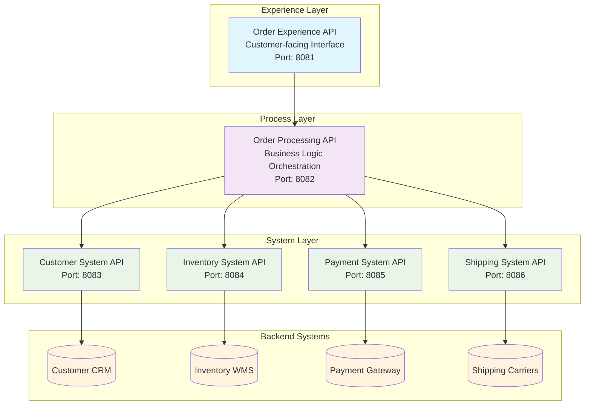
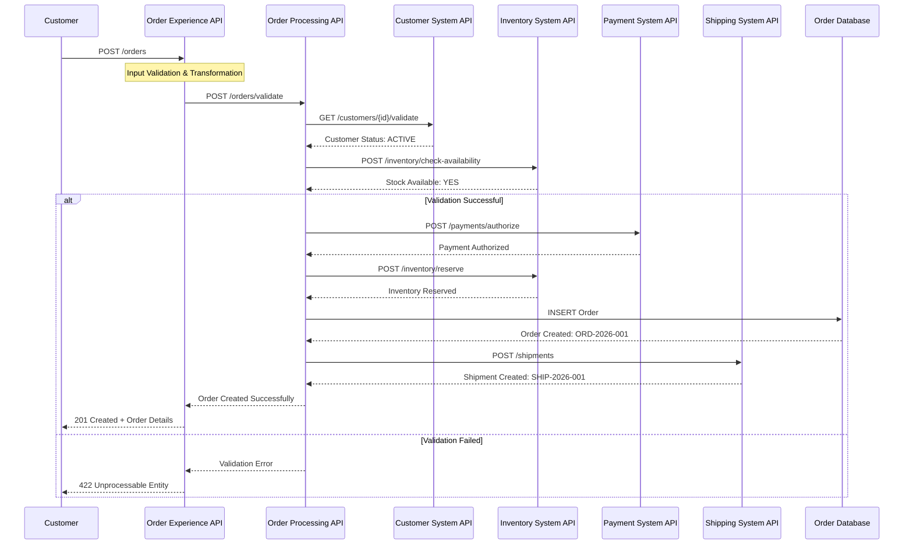
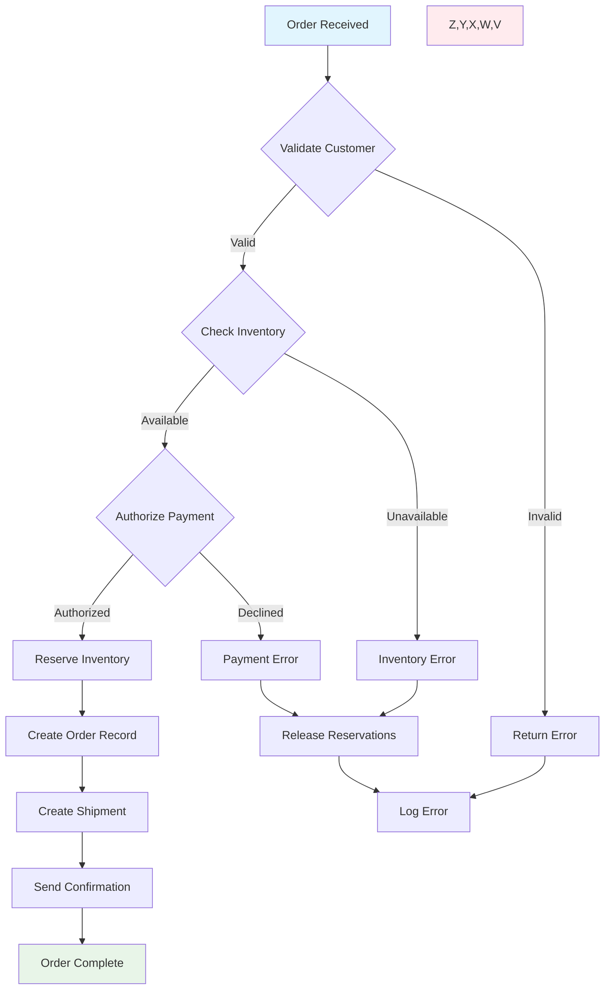

# Order Management System - MuleSoft Flow Diagrams and Implementation

## Table of Contents
1. [Architecture Overview](#architecture-overview)
2. [Business Process Flows](#business-process-flows)
3. [API Flow Implementations](#api-flow-implementations)
4. [Sequence Diagrams](#sequence-diagrams)
5. [Integration Patterns](#integration-patterns)
6. [Sample Payloads](#sample-payloads)
7. [Error Handling Strategy](#error-handling-strategy)

## Architecture Overview

### Layered API Architecture



## Business Process Flows

### Order Creation Process Flow (Based on BRD Section 8)



### Order Processing Workflow



## API Flow Implementations

### 1. Order Experience API Flows

#### POST /orders Flow
```xml
<flow name="post-orders-flow">
    <http:listener config-ref="HTTP_Listener_config" path="/orders" allowedMethods="POST"/>
    
    <!-- Input Validation -->
    <validation:is-not-null value="#[payload.customerId]" message="Customer ID is required"/>
    <validation:is-not-empty collection="#[payload.items]" message="Order items are required"/>
    
    <!-- Transform to Process API format -->
    <ee:transform>
        <ee:message>
            <ee:set-payload><![CDATA[%dw 2.0
output application/json
---
{
    customerId: payload.customerId,
    items: payload.items map {
        productId: $.productId,
        quantity: $.quantity,
        unitPrice: $.unitPrice
    },
    shippingAddress: payload.shippingAddress,
    paymentDetails: payload.paymentMethod,
    orderDate: now(),
    source: "EXPERIENCE_API"
}]]></ee:set-payload>
        </ee:message>
    </ee:transform>
    
    <!-- Call Process API -->
    <http:request config-ref="Order_Process_API_Config" path="/orders/process" method="POST">
        <http:headers><![CDATA[#[{
            'Content-Type': 'application/json',
            'X-Correlation-ID': correlationId
        }]]]></http:headers>
    </http:request>
    
    <!-- Transform Response -->
    <ee:transform>
        <ee:message>
            <ee:set-payload><![CDATA[%dw 2.0
output application/json
---
{
    orderId: payload.orderId,
    status: payload.status,
    totalAmount: payload.totalAmount,
    estimatedDelivery: payload.estimatedDelivery,
    message: "Order created successfully"
}]]></ee:set-payload>
        </ee:message>
    </ee:transform>
    
    <!-- Set HTTP Response -->
    <set-variable variableName="httpStatus" value="201"/>
</flow>
```

#### GET /orders/{orderId} Flow
```xml
<flow name="get-order-by-id-flow">
    <http:listener config-ref="HTTP_Listener_config" path="/orders/{orderId}" allowedMethods="GET"/>
    
    <!-- Extract Path Parameter -->
    <set-variable variableName="orderId" value="#[attributes.uriParams.orderId]"/>
    
    <!-- Validate Order ID Format -->
    <validation:matches-regex value="#[vars.orderId]" regex="^ORD-[0-9]{4}-[0-9]{3,}$" 
                              message="Invalid order ID format"/>
    
    <!-- Call Process API -->
    <http:request config-ref="Order_Process_API_Config" 
                  path="#['/orders/' ++ vars.orderId]" 
                  method="GET">
        <http:headers><![CDATA[#[{
            'X-Correlation-ID': correlationId,
            'Accept': 'application/json'
        }]]]></http:headers>
    </http:request>
    
    <!-- Transform Response for Customer View -->
    <ee:transform>
        <ee:message>
            <ee:set-payload><![CDATA[%dw 2.0
output application/json
---
{
    orderId: payload.orderId,
    customerId: payload.customerId,
    orderDate: payload.orderDate,
    status: payload.status,
    items: payload.items map {
        productId: $.productId,
        productName: $.productName,
        quantity: $.quantity,
        unitPrice: $.unitPrice,
        totalPrice: $.totalPrice
    },
    totalAmount: payload.totalAmount,
    currency: payload.currency default "USD",
    shippingAddress: payload.shippingAddress,
    trackingNumber: payload.trackingNumber,
    estimatedDelivery: payload.estimatedDelivery,
    orderHistory: payload.statusHistory default []
}]]></ee:set-payload>
        </ee:message>
    </ee:transform>
</flow>
```

### 2. Order Process API Flows

#### Order Validation Sub-flow
```xml
<sub-flow name="validate-order-subflow">
    <logger level="INFO" message="Starting order validation for order: #[vars.orderId]"/>
    
    <!-- Parallel Validation using Scatter-Gather -->
    <scatter-gather doc:name="Parallel Validation">
        <route>
            <!-- Customer Validation -->
            <logger level="DEBUG" message="Validating customer: #[payload.customerId]"/>
            <http:request config-ref="Customer_System_API_Config" 
                          path="#['/customers/' ++ payload.customerId ++ '/validate']" 
                          method="GET"/>
            <set-variable variableName="customerValidation" value="#[payload]"/>
        </route>
        <route>
            <!-- Inventory Validation -->
            <logger level="DEBUG" message="Checking inventory for items: #[payload.items]"/>
            <http:request config-ref="Inventory_System_API_Config" 
                          path="/inventory/check-availability" 
                          method="POST">
                <http:body><![CDATA[#[{
                    "items": payload.items map {
                        productId: $.productId,
                        quantity: $.quantity
                    }
                }]]]></http:body>
            </http:request>
            <set-variable variableName="inventoryValidation" value="#[payload]"/>
        </route>
        <route>
            <!-- Payment Validation -->
            <logger level="DEBUG" message="Validating payment method"/>
            <http:request config-ref="Payment_System_API_Config" 
                          path="/payments/validate" 
                          method="POST">
                <http:body><![CDATA[#[{
                    "paymentMethod": payload.paymentDetails.type,
                    "amount": sum(payload.items map ($.quantity * $.unitPrice))
                }]]]></http:body>
            </http:request>
            <set-variable variableName="paymentValidation" value="#[payload]"/>
        </route>
    </scatter-gather>
    
    <!-- Aggregate Validation Results -->
    <ee:transform>
        <ee:message>
            <ee:set-payload><![CDATA[%dw 2.0
output application/json
---
{
    valid: vars.customerValidation.valid and vars.inventoryValidation.valid and vars.paymentValidation.valid,
    customerValidation: vars.customerValidation,
    inventoryValidation: vars.inventoryValidation,
    paymentValidation: vars.paymentValidation,
    validationTimestamp: now()
}]]></ee:set-payload>
        </ee:message>
    </ee:transform>
    
    <logger level="INFO" message="Order validation completed. Result: #[payload.valid]"/>
</sub-flow>
```

#### Order Processing Main Flow
```xml
<flow name="process-order-flow">
    <http:listener config-ref="HTTP_Listener_config" path="/orders/process" allowedMethods="POST"/>
    
    <logger level="INFO" message="Processing order request: #[correlationId]"/>
    
    <!-- Generate Order ID -->
    <set-variable variableName="orderId" value="#['ORD-' ++ now() as String {format: 'yyyy'} ++ '-' ++ (randomInt(999) + 1)]"/>
    
    <!-- Validate Order -->
    <flow-ref name="validate-order-subflow"/>
    
    <choice>
        <when expression="#[payload.valid == true]">
            <!-- Begin Transaction Scope -->
            <try transactionalAction="ALWAYS_BEGIN">
                
                <!-- Step 1: Reserve Inventory -->
                <logger level="INFO" message="Reserving inventory for order: #[vars.orderId]"/>
                <http:request config-ref="Inventory_System_API_Config" 
                              path="/inventory/reserve" 
                              method="POST">
                    <http:body><![CDATA[#[{
                        "orderId": vars.orderId,
                        "items": payload.items map {
                            productId: $.productId,
                            quantity: $.quantity
                        }
                    }]]]></http:body>
                </http:request>
                <set-variable variableName="inventoryReservation" value="#[payload]"/>
                
                <!-- Step 2: Authorize Payment -->
                <logger level="INFO" message="Authorizing payment for order: #[vars.orderId]"/>
                <http:request config-ref="Payment_System_API_Config" 
                              path="/payments/authorize" 
                              method="POST">
                    <http:body><![CDATA[#[{
                        "orderId": vars.orderId,
                        "amount": sum(payload.items map ($.quantity * $.unitPrice)),
                        "currency": "USD",
                        "paymentMethod": payload.paymentDetails
                    }]]]></http:body>
                </http:request>
                <set-variable variableName="paymentAuthorization" value="#[payload]"/>
                
                <!-- Step 3: Create Order Record -->
                <logger level="INFO" message="Creating order record: #[vars.orderId]"/>
                <db:insert config-ref="Database_Config">
                    <db:sql>INSERT INTO orders (order_id, customer_id, status, total_amount, created_at) 
                             VALUES (:orderId, :customerId, 'CONFIRMED', :totalAmount, NOW())</db:sql>
                    <db:input-parameters><![CDATA[#[{
                        orderId: vars.orderId,
                        customerId: payload.customerId,
                        totalAmount: sum(payload.items map ($.quantity * $.unitPrice))
                    }]]]></db:input-parameters>
                </db:insert>
                
                <!-- Step 4: Create Shipment -->
                <logger level="INFO" message="Creating shipment for order: #[vars.orderId]"/>
                <http:request config-ref="Shipping_System_API_Config" 
                              path="/shipments" 
                              method="POST">
                    <http:body><![CDATA[#[{
                        "orderId": vars.orderId,
                        "customerId": payload.customerId,
                        "shippingAddress": payload.shippingAddress,
                        "items": payload.items
                    }]]]></http:body>
                </http:request>
                <set-variable variableName="shipmentCreation" value="#[payload]"/>
                
                <!-- Success Response -->
                <ee:transform>
                    <ee:message>
                        <ee:set-payload><![CDATA[%dw 2.0
output application/json
---
{
    orderId: vars.orderId,
    status: "CONFIRMED",
    totalAmount: sum(payload.items map ($.quantity * $.unitPrice)),
    estimatedDelivery: vars.shipmentCreation.estimatedDelivery,
    trackingNumber: vars.shipmentCreation.trackingNumber,
    reservationId: vars.inventoryReservation.reservationId,
    paymentAuthId: vars.paymentAuthorization.authorizationId,
    processedAt: now()
}]]></ee:set-payload>
                    </ee:message>
                </ee:transform>
                
                <error-handler>
                    <on-error-propagate>
                        <logger level="ERROR" message="Order processing failed. Initiating compensation."/>
                        <flow-ref name="compensation-flow"/>
                    </on-error-propagate>
                </error-handler>
            </try>
        </when>
        <otherwise>
            <!-- Validation Failed Response -->
            <set-variable variableName="httpStatus" value="422"/>
            <ee:transform>
                <ee:message>
                    <ee:set-payload><![CDATA[%dw 2.0
output application/json
---
{
    error: "ORDER_VALIDATION_FAILED",
    message: "Order validation failed",
    validationResults: payload,
    timestamp: now()
}]]></ee:set-payload>
                </ee:message>
            </ee:transform>
        </otherwise>
    </choice>
</flow>
```

### 3. System API Flows

#### Customer System API - Customer Validation Flow
```xml
<flow name="get-customer-validation-flow">
    <http:listener config-ref="HTTP_Listener_config" path="/customers/{customerId}/validate" allowedMethods="GET"/>
    
    <set-variable variableName="customerId" value="#[attributes.uriParams.customerId]"/>
    
    <!-- Query Customer Database -->
    <db:select config-ref="Database_Config">
        <db:sql>SELECT customer_id, status, credit_limit, account_balance 
                 FROM customers WHERE customer_id = :customerId</db:sql>
        <db:input-parameters><![CDATA[#[{customerId: vars.customerId}]]]></db:input-parameters>
    </db:select>
    
    <choice>
        <when expression="#[sizeOf(payload) > 0]">
            <!-- Customer Found - Validate Status -->
            <ee:transform>
                <ee:message>
                    <ee:set-payload><![CDATA[%dw 2.0
output application/json
---
{
    customerId: payload[0].customer_id,
    valid: payload[0].status == "ACTIVE" and payload[0].account_balance < payload[0].credit_limit,
    status: payload[0].status,
    creditLimit: payload[0].credit_limit,
    accountBalance: payload[0].account_balance,
    validationRules: {
        statusCheck: payload[0].status == "ACTIVE",
        creditCheck: payload[0].account_balance < payload[0].credit_limit
    },
    validatedAt: now()
}]]></ee:set-payload>
                </ee:message>
            </ee:transform>
        </when>
        <otherwise>
            <!-- Customer Not Found -->
            <set-variable variableName="httpStatus" value="404"/>
            <ee:transform>
                <ee:message>
                    <ee:set-payload><![CDATA[%dw 2.0
output application/json
---
{
    error: "CUSTOMER_NOT_FOUND",
    message: "Customer not found",
    customerId: vars.customerId,
    valid: false
}]]></ee:set-payload>
                </ee:message>
            </ee:transform>
        </otherwise>
    </choice>
</flow>
```

#### Inventory System API - Stock Availability Flow
```xml
<flow name="check-inventory-availability-flow">
    <http:listener config-ref="HTTP_Listener_config" path="/inventory/check-availability" allowedMethods="POST"/>
    
    <logger level="INFO" message="Checking inventory availability for items: #[sizeOf(payload.items)]"/>
    
    <!-- Process Each Item -->
    <ee:transform>
        <ee:message>
            <ee:set-payload><![CDATA[%dw 2.0
output application/json
---
payload.items map ((item, index) -> {
    productId: item.productId,
    requestedQuantity: item.quantity,
    checkIndex: index
})]]></ee:set-payload>
        </ee:message>
    </ee:transform>
    
    <!-- Parallel Inventory Checks -->
    <parallel-foreach collection="#[payload]">
        <db:select config-ref="Database_Config">
            <db:sql>SELECT product_id, available_quantity, reserved_quantity, warehouse_location
                     FROM inventory WHERE product_id = :productId</db:sql>
            <db:input-parameters><![CDATA[#[{productId: payload.productId}]]]></db:input-parameters>
        </db:select>
        
        <ee:transform>
            <ee:message>
                <ee:set-payload><![CDATA[%dw 2.0
output application/json
---
{
    productId: payload.productId,
    requestedQuantity: payload.requestedQuantity,
    availableQuantity: if (sizeOf(payload) > 0) payload[0].available_quantity else 0,
    reservedQuantity: if (sizeOf(payload) > 0) payload[0].reserved_quantity else 0,
    warehouseLocation: if (sizeOf(payload) > 0) payload[0].warehouse_location else null,
    sufficient: if (sizeOf(payload) > 0) 
                  (payload[0].available_quantity >= payload.requestedQuantity) 
                else false
}]]></ee:set-payload>
            </ee:message>
        </ee:transform>
    </parallel-foreach>
    
    <!-- Aggregate Results -->
    <ee:transform>
        <ee:message>
            <ee:set-payload><![CDATA[%dw 2.0
output application/json
---
{
    valid: (payload filter ($.sufficient == false)) isEmpty,
    items: payload,
    totalItems: sizeOf(payload),
    availableItems: sizeOf(payload filter ($.sufficient == true)),
    unavailableItems: sizeOf(payload filter ($.sufficient == false)),
    checkedAt: now()
}]]></ee:set-payload>
        </ee:message>
    </ee:transform>
</flow>
```

#### Payment System API - Payment Authorization Flow
```xml
<flow name="authorize-payment-flow">
    <http:listener config-ref="HTTP_Listener_config" path="/payments/authorize" allowedMethods="POST"/>
    
    <logger level="INFO" message="Authorizing payment for order: #[payload.orderId]"/>
    
    <!-- Validate Payment Request -->
    <validation:is-not-null value="#[payload.orderId]" message="Order ID is required"/>
    <validation:is-not-null value="#[payload.amount]" message="Payment amount is required"/>
    <validation:is-not-null value="#[payload.paymentMethod]" message="Payment method is required"/>
    
    <!-- Generate Payment ID -->
    <set-variable variableName="paymentId" value="#['PAY-' ++ now() as String {format: 'yyyyMMddHHmmss'} ++ '-' ++ randomInt(999)]"/>
    
    <!-- Call Payment Gateway -->
    <http:request config-ref="Payment_Gateway_Config" 
                  path="/api/v1/payments/authorize" 
                  method="POST">
        <http:headers><![CDATA[#[{
            'Authorization': 'Bearer ' ++ p('payment.gateway.token'),
            'Content-Type': 'application/json'
        }]]]></http:headers>
        <http:body><![CDATA[#[{
            "merchant_id": p('payment.merchant.id'),
            "transaction_id": vars.paymentId,
            "amount": payload.amount,
            "currency": payload.currency default "USD",
            "payment_method": payload.paymentMethod,
            "order_reference": payload.orderId
        }]]]></http:body>
    </http:request>
    
    <!-- Transform Gateway Response -->
    <ee:transform>
        <ee:message>
            <ee:set-payload><![CDATA[%dw 2.0
output application/json
---
{
    paymentId: vars.paymentId,
    orderId: payload.order_reference,
    status: if (payload.status == "approved") "AUTHORIZED" else "DECLINED",
    authorizationId: payload.authorization_code,
    amount: payload.amount,
    currency: payload.currency,
    expiryTime: now() + |PT1H|,
    gatewayResponse: {
        transactionId: payload.transaction_id,
        responseCode: payload.response_code,
        responseMessage: payload.response_message
    },
    authorizedAt: now()
}]]></ee:set-payload>
        </ee:message>
    </ee:transform>
    
    <!-- Store Payment Record -->
    <db:insert config-ref="Database_Config">
        <db:sql>INSERT INTO payments (payment_id, order_id, status, amount, authorization_id, created_at) 
                 VALUES (:paymentId, :orderId, :status, :amount, :authId, NOW())</db:sql>
        <db:input-parameters><![CDATA[#[{
            paymentId: payload.paymentId,
            orderId: payload.orderId,
            status: payload.status,
            amount: payload.amount,
            authId: payload.authorizationId
        }]]]></db:input-parameters>
    </db:insert>
</flow>
```

#### Shipping System API - Create Shipment Flow
```xml
<flow name="create-shipment-flow">
    <http:listener config-ref="HTTP_Listener_config" path="/shipments" allowedMethods="POST"/>
    
    <logger level="INFO" message="Creating shipment for order: #[payload.orderId]"/>
    
    <!-- Generate Shipment ID -->
    <set-variable variableName="shipmentId" value="#['SHIP-' ++ now() as String {format: 'yyyyMMdd'} ++ '-' ++ randomInt(9999)]"/>
    
    <!-- Validate Shipping Address -->
    <flow-ref name="validate-shipping-address-subflow"/>
    
    <!-- Calculate Shipping Cost -->
    <flow-ref name="calculate-shipping-cost-subflow"/>
    
    <!-- Select Shipping Carrier -->
    <ee:transform>
        <ee:message>
            <ee:set-payload><![CDATA[%dw 2.0
output application/json
---
{
    shipmentId: vars.shipmentId,
    orderId: payload.orderId,
    carrier: "FedEx", // Default carrier selection logic
    serviceLevel: "GROUND",
    shippingCost: vars.shippingCost,
    estimatedDelivery: now() + |P3D|,
    items: payload.items,
    shippingAddress: payload.shippingAddress
}]]></ee:set-payload>
        </ee:message>
    </ee:transform>
    
    <!-- Create Shipment with Carrier -->
    <http:request config-ref="Shipping_Carrier_Config" 
                  path="/api/v1/shipments" 
                  method="POST">
        <http:headers><![CDATA[#[{
            'Authorization': 'Bearer ' ++ p('shipping.carrier.token'),
            'Content-Type': 'application/json'
        }]]]></http:headers>
        <http:body><![CDATA[#[payload]]]></http:body>
    </http:request>
    
    <!-- Transform Carrier Response -->
    <ee:transform>
        <ee:message>
            <ee:set-payload><![CDATA[%dw 2.0
output application/json
---
{
    shipmentId: vars.shipmentId,
    orderId: payload.orderId,
    trackingNumber: payload.tracking_number,
    carrier: payload.carrier,
    serviceLevel: payload.service_level,
    status: "CREATED",
    estimatedDelivery: payload.estimated_delivery,
    shippingCost: payload.shipping_cost,
    createdAt: now()
}]]></ee:set-payload>
        </ee:message>
    </ee:transform>
    
    <!-- Store Shipment Record -->
    <db:insert config-ref="Database_Config">
        <db:sql>INSERT INTO shipments (shipment_id, order_id, tracking_number, carrier, status, created_at) 
                 VALUES (:shipmentId, :orderId, :trackingNumber, :carrier, :status, NOW())</db:sql>
        <db:input-parameters><![CDATA[#[{
            shipmentId: payload.shipmentId,
            orderId: payload.orderId,
            trackingNumber: payload.trackingNumber,
            carrier: payload.carrier,
            status: payload.status
        }]]]></db:input-parameters>
    </db:insert>
</flow>
```

## Sample Payloads

### Order Creation Request (Experience API)
```json
{
  "customerId": "CUST-12345",
  "items": [
    {
      "productId": "PROD-001",
      "quantity": 2,
      "unitPrice": 299.99
    },
    {
      "productId": "PROD-002",
      "quantity": 1,
      "unitPrice": 149.50
    }
  ],
  "shippingAddress": {
    "street": "123 Main Street",
    "city": "New York",
    "state": "NY",
    "zipCode": "10001",
    "country": "USA"
  },
  "paymentMethod": {
    "type": "CREDIT_CARD",
    "cardNumber": "****-****-****-1234",
    "expiryMonth": "12",
    "expiryYear": "2025",
    "cvv": "***"
  }
}
```

### Order Response (Experience API)
```json
{
  "orderId": "ORD-2026-12345",
  "status": "CONFIRMED",
  "totalAmount": 749.48,
  "estimatedDelivery": "2026-03-26T18:00:00Z",
  "trackingNumber": "TRK-FDX-789012345",
  "message": "Order created successfully"
}
```

### Customer Validation Response (System API)
```json
{
  "customerId": "CUST-12345",
  "valid": true,
  "status": "ACTIVE",
  "creditLimit": 5000.00,
  "accountBalance": 1250.75,
  "validationRules": {
    "statusCheck": true,
    "creditCheck": true
  },
  "validatedAt": "2026-03-23T13:30:00Z"
}
```

### Inventory Check Response (System API)
```json
{
  "valid": true,
  "items": [
    {
      "productId": "PROD-001",
      "requestedQuantity": 2,
      "availableQuantity": 15,
      "reservedQuantity": 3,
      "warehouseLocation": "WH-NYC-01",
      "sufficient": true
    },
    {
      "productId": "PROD-002",
      "requestedQuantity": 1,
      "availableQuantity": 8,
      "reservedQuantity": 2,
      "warehouseLocation": "WH-NYC-01",
      "sufficient": true
    }
  ],
  "totalItems": 2,
  "availableItems": 2,
  "unavailableItems": 0,
  "checkedAt": "2026-03-23T13:30:00Z"
}
```

## Error Handling Strategy

### Global Error Handler
```xml
<error-handler name="global-error-handler">
    <on-error-propagate type="VALIDATION:INVALID_INPUT">
        <ee:transform>
            <ee:message>
                <ee:set-payload><![CDATA[%dw 2.0
output application/json
---
{
    error: {
        code: "VALIDATION_ERROR",
        message: error.description,
        details: error.detailedDescription,
        timestamp: now(),
        correlationId: correlationId
    }
}]]></ee:set-payload>
            </ee:message>
            <ee:variables>
                <ee:set-variable variableName="httpStatus">400</ee:set-variable>
            </ee:variables>
        </ee:transform>
    </on-error-propagate>
    
    <on-error-propagate type="HTTP:NOT_FOUND">
        <ee:transform>
            <ee:message>
                <ee:set-payload><![CDATA[%dw 2.0
output application/json
---
{
    error: {
        code: "RESOURCE_NOT_FOUND",
        message: "Requested resource not found",
        timestamp: now(),
        correlationId: correlationId
    }
}]]></ee:set-payload>
            </ee:message>
            <ee:variables>
                <ee:set-variable variableName="httpStatus">404</ee:set-variable>
            </ee:variables>
        </ee:transform>
    </on-error-propagate>
    
    <on-error-propagate type="ANY">
        <logger level="ERROR" message="Unexpected error occurred: #[error.description]"/>
        <ee:transform>
            <ee:message>
                <ee:set-payload><![CDATA[%dw 2.0
output application/json
---
{
    error: {
        code: "INTERNAL_SERVER_ERROR",
        message: "An unexpected error occurred",
        timestamp: now(),
        correlationId: correlationId
    }
}]]></ee:set-payload>
            </ee:message>
            <ee:variables>
                <ee:set-variable variableName="httpStatus">500</ee:set-variable>
            </ee:variables>
        </ee:transform>
    </on-error-propagate>
</error-handler>
```

### Compensation Flow
```xml
<flow name="compensation-flow">
    <logger level="ERROR" message="Executing compensation logic for failed order processing"/>
    
    <!-- Release Inventory Reservations -->
    <try>
        <http:request config-ref="Inventory_System_API_Config" 
                      path="#['/inventory/release/' ++ vars.inventoryReservation.reservationId]" 
                      method="DELETE"/>
        <logger level="INFO" message="Inventory reservation released successfully"/>
        <error-handler>
            <on-error-continue>
                <logger level="WARN" message="Failed to release inventory reservation"/>
            </on-error-continue>
        </error-handler>
    </try>
    
    <!-- Void Payment Authorization -->
    <try>
        <http:request config-ref="Payment_System_API_Config" 
                      path="#['/payments/' ++ vars.paymentAuthorization.paymentId ++ '/void']" 
                      method="POST"/>
        <logger level="INFO" message="Payment authorization voided successfully"/>
        <error-handler>
            <on-error-continue>
                <logger level="WARN" message="Failed to void payment authorization"/>
            </on-error-continue>
        </error-handler>
    </try>
    
    <!-- Update Order Status to Failed -->
    <try>
        <db:update config-ref="Database_Config">
            <db:sql>UPDATE orders SET status = 'FAILED', updated_at = NOW() WHERE order_id = :orderId</db:sql>
            <db:input-parameters><![CDATA[#[{orderId: vars.orderId}]]]></db:input-parameters>
        </db:update>
        <logger level="INFO" message="Order status updated to FAILED"/>
        <error-handler>
            <on-error-continue>
                <logger level="WARN" message="Failed to update order status"/>
            </on-error-continue>
        </error-handler>
    </try>
</flow>
```

## Integration Patterns

### Circuit Breaker Pattern
```xml
<flow name="circuit-breaker-example">
    <!-- Circuit Breaker for External Service Calls -->
    <until-successful maxRetries="3" millisBetweenRetries="2000">
        <http:request config-ref="External_Service_Config" 
                      path="/api/endpoint" 
                      method="GET"
                      responseTimeout="10000"/>
    </until-successful>
</flow>
```

### Retry Pattern with Exponential Backoff
```
