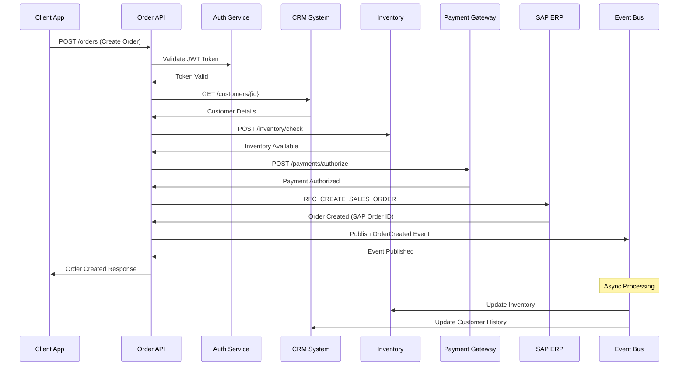
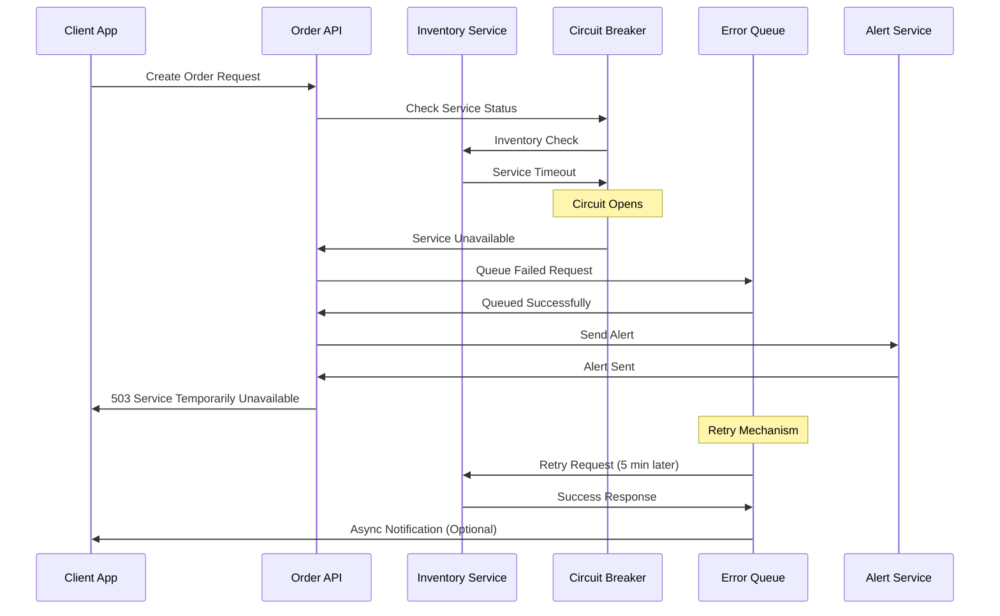

# Technical Design Document
## Order Management System Integration

---

### Document Information

| Field | Value |
|-------|-------|
| **Document Title** | Order Management System Integration - Technical Design Document |
| **Document Version** | 1.0 |
| **Date** | March 23, 2026 |
| **Author** | Technical Architecture Team |
| **Status** | Draft |
| **Classification** | Internal |

---

## Table of Contents

1. [Executive Summary](#executive-summary)
2. [Introduction](#introduction)
3. [System Overview](#system-overview)
4. [Technical Requirements](#technical-requirements)
5. [Solution Architecture](#solution-architecture)
6. [Integration Design](#integration-design)
7. [Data Model & Mapping](#data-model--mapping)
8. [API Specifications](#api-specifications)
9. [Security Design](#security-design)
10. [Error Handling & Recovery](#error-handling--recovery)
11. [Performance & Scalability](#performance--scalability)
12. [Monitoring & Logging](#monitoring--logging)
13. [Deployment Strategy](#deployment-strategy)
14. [Testing Strategy](#testing-strategy)
15. [Implementation Plan](#implementation-plan)
16. [Risk Assessment](#risk-assessment)
17. [Appendices](#appendices)

---

## 1. Executive Summary

### 1.1 Purpose
This Technical Design Document (TDD) provides a comprehensive technical specification for the Order Management System Integration project. The integration aims to create a seamless, real-time connection between various order management systems, enabling efficient order processing, inventory management, and customer service operations.

### 1.2 Scope
The integration encompasses:
- **Order Processing**: Real-time order capture and validation from multiple channels
- **Inventory Management**: Dynamic inventory updates and availability checks
- **Customer Management**: Unified customer data synchronization
- **Payment Processing**: Secure payment gateway integration
- **Fulfillment Coordination**: Automated workflow management for order fulfillment
- **Reporting & Analytics**: Consolidated reporting across all integrated systems

### 1.3 Key Benefits
- **Improved Efficiency**: Automated order processing reduces manual intervention by 80%
- **Enhanced Customer Experience**: Real-time order status and faster fulfillment
- **Data Consistency**: Unified data model ensures consistency across all systems
- **Scalability**: Cloud-native architecture supports business growth
- **Cost Optimization**: Reduced operational costs through automation

---

## 2. Introduction

### 2.1 Business Context
The organization operates multiple order management touchpoints including e-commerce platforms, mobile applications, retail POS systems, and B2B portals. Currently, these systems operate in isolation, leading to:
- Data inconsistencies
- Manual reconciliation processes
- Delayed order fulfillment
- Poor customer experience
- Increased operational costs

### 2.2 Integration Objectives
- **Unify Order Processing**: Create a single source of truth for all order data
- **Real-time Synchronization**: Ensure immediate data propagation across systems
- **Automated Workflows**: Minimize manual intervention in order lifecycle
- **Enhanced Visibility**: Provide comprehensive order tracking and reporting
- **Improved Scalability**: Support future business growth and system additions

### 2.3 Key Stakeholders
- **Business Users**: Sales, Customer Service, Operations Teams
- **IT Teams**: Development, Infrastructure, Security Teams
- **External Partners**: Third-party vendors, payment processors, logistics providers
- **Customers**: End consumers and B2B clients

---

## 3. System Overview

### 3.1 Current State Architecture
The existing landscape consists of:

#### 3.1.1 Source Systems
- **E-commerce Platform**: Magento-based online store
- **Mobile Application**: Native iOS/Android apps
- **Retail POS**: In-store point-of-sale systems
- **B2B Portal**: Custom-built partner ordering system
- **Call Center System**: Customer service order entry

#### 3.1.2 Target Systems
- **ERP System**: SAP S/4HANA for order management
- **Inventory Management**: Custom inventory tracking system
- **CRM System**: Salesforce for customer management
- **Payment Gateway**: Multiple payment processors
- **Logistics Platform**: Third-party fulfillment services

### 3.2 Future State Architecture
The integrated solution will feature:
- **MuleSoft Anypoint Platform**: Central integration backbone
- **API-Led Connectivity**: Three-layer architecture (System, Process, Experience APIs)
- **Event-Driven Architecture**: Real-time event processing
- **Cloud-Native Design**: Scalable, resilient infrastructure
- **Microservices Pattern**: Modular, maintainable components

---

## 4. Technical Requirements

### 4.1 Functional Requirements

#### 4.1.1 Order Processing Requirements
| Requirement ID | Description | Priority |
|----------------|-------------|----------|
| FR-OP-001 | System must capture orders from multiple channels in real-time | High |
| FR-OP-002 | Order validation must occur within 2 seconds | High |
| FR-OP-003 | Duplicate order detection and prevention | High |
| FR-OP-004 | Order modification and cancellation support | Medium |
| FR-OP-005 | Bulk order processing capability | Medium |

#### 4.1.2 Data Synchronization Requirements
| Requirement ID | Description | Priority |
|----------------|-------------|----------|
| FR-DS-001 | Real-time inventory updates across all channels | High |
| FR-DS-002 | Customer data synchronization within 5 seconds | High |
| FR-DS-003 | Product catalog updates propagation | Medium |
| FR-DS-004 | Pricing synchronization | Medium |
| FR-DS-005 | Promotional data distribution | Low |

#### 4.1.3 Integration Requirements
| Requirement ID | Description | Priority |
|----------------|-------------|----------|
| FR-IN-001 | RESTful API support for all integrations | High |
| FR-IN-002 | Event-driven messaging for real-time updates | High |
| FR-IN-003 | Batch processing for bulk data operations | Medium |
| FR-IN-004 | File-based integration support (EDI, CSV) | Medium |
| FR-IN-005 | Legacy system connectivity via adapters | Low |

### 4.2 Non-Functional Requirements

#### 4.2.1 Performance Requirements
| Requirement ID | Description | Target |
|----------------|-------------|---------|
| NFR-P-001 | API response time | < 200ms (95th percentile) |
| NFR-P-002 | Order processing throughput | 10,000 orders/hour |
| NFR-P-003 | Concurrent user support | 1,000 concurrent users |
| NFR-P-004 | System availability | 99.9% uptime |
| NFR-P-005 | Data synchronization latency | < 5 seconds |

#### 4.2.2 Security Requirements
| Requirement ID | Description | Implementation |
|----------------|-------------|----------------|
| NFR-S-001 | API authentication | OAuth 2.0 / JWT tokens |
| NFR-S-002 | Data encryption in transit | TLS 1.3 |
| NFR-S-003 | Data encryption at rest | AES-256 |
| NFR-S-004 | Access control | RBAC with fine-grained permissions |
| NFR-S-005 | Audit logging | Complete audit trail for all transactions |

#### 4.2.3 Scalability Requirements
| Requirement ID | Description | Target |
|----------------|-------------|---------|
| NFR-SC-001 | Horizontal scaling capability | Auto-scaling based on load |
| NFR-SC-002 | Peak load handling | 5x normal load capacity |
| NFR-SC-003 | Data storage scalability | Petabyte-scale data handling |
| NFR-SC-004 | Geographic distribution | Multi-region deployment |
| NFR-SC-005 | Disaster recovery | RTO < 4 hours, RPO < 1 hour |

---

## 5. Solution Architecture

### 5.1 High-Level Architecture

#### 5.1.1 Architecture Principles
- **API-First Design**: All integrations built using API-first approach
- **Event-Driven**: Asynchronous processing for better scalability
- **Cloud-Native**: Leveraging cloud services for elasticity and resilience
- **Microservices**: Modular, independently deployable components
- **Security by Design**: Security integrated at every layer

#### 5.1.2 Integration Patterns
- **Request-Response**: For real-time data queries
- **Publish-Subscribe**: For event notifications
- **Batch Processing**: For bulk data synchronization
- **Message Queuing**: For guaranteed delivery
- **API Composition**: For aggregating data from multiple sources

### 5.2 MuleSoft Architecture

#### 5.2.1 API-Led Connectivity Layers

**Experience Layer**
- Mobile API: Native mobile application integration
- Web API: E-commerce platform integration
- Partner API: B2B partner system integration

**Process Layer**
- Order Management API: Core order processing logic
- Customer Management API: Customer data orchestration
- Inventory Management API: Inventory synchronization processes

**System Layer**
- SAP Connector: ERP system integration
- Salesforce Connector: CRM system integration
- Database Connector: Direct database access
- File Connector: File-based integrations

#### 5.2.2 Runtime Architecture
```
┌─────────────────────────────────────────────────────────────┐
│                    CloudHub 2.0                            │
├─────────────────────────────────────────────────────────────┤
│  Experience APIs    │  Process APIs     │  System APIs      │
│  ─────────────────  │  ──────────────  │  ───────────────  │
│  • Mobile API       │  • Order Mgmt    │  • SAP Connector  │
│  • Web API          │  • Customer Mgmt  │  • SFDC Connector │
│  • Partner API      │  • Inventory Mgmt │  • DB Connector   │
└─────────────────────────────────────────────────────────────┘
                            │
┌─────────────────────────────────────────────────────────────┐
│                  Anypoint Platform                         │
│  ┌─────────────┐  ┌─────────────┐  ┌─────────────────────┐ │
│  │    API      │  │  Runtime    │  │      Monitoring     │ │
│  │  Manager    │  │  Manager    │  │    & Analytics      │ │
│  └─────────────┘  └─────────────┘  └─────────────────────┘ │
└─────────────────────────────────────────────────────────────┘
```

### 5.3 Data Flow Architecture

#### 5.3.1 Order Processing Flow
1. **Order Capture**: Multi-channel order intake
2. **Validation**: Order data validation and enrichment
3. **Inventory Check**: Real-time inventory availability
4. **Payment Processing**: Secure payment authorization
5. **ERP Integration**: Order creation in SAP system
6. **Fulfillment Trigger**: Automated fulfillment initiation
7. **Status Updates**: Real-time status propagation

#### 5.3.2 Event-Driven Flow
- **Order Events**: Order creation, modification, cancellation
- **Inventory Events**: Stock updates, reorder triggers
- **Customer Events**: Profile updates, preference changes
- **System Events**: Health checks, performance metrics

---

## 6. Integration Design

### 6.1 Integration Patterns

#### 6.1.1 Synchronous Integrations
**Real-time Order Processing**
- Pattern: Request-Response
- Protocol: REST/HTTP
- Data Format: JSON
- Timeout: 30 seconds
- Retry: 3 attempts with exponential backoff

**Inventory Availability Check**
- Pattern: Request-Response
- Protocol: REST/HTTP
- Data Format: JSON
- Timeout: 5 seconds
- Caching: 60-second TTL

#### 6.1.2 Asynchronous Integrations
**Order Status Updates**
- Pattern: Publish-Subscribe
- Protocol: JMS/AMQP
- Message Broker: Amazon SQS
- Delivery: At-least-once
- Dead Letter Queue: Configured

**Inventory Synchronization**
- Pattern: Event-Driven
- Protocol: Apache Kafka
- Topic: inventory-updates
- Partitioning: By product SKU
- Retention: 7 days

### 6.2 Connector Configuration

#### 6.2.1 SAP Connector
```xml
<sap:outbound-endpoint 
    connector-ref="SAP_Connector"
    exchange-pattern="request-response"
    functionName="RFC_CREATE_ORDER"
    responseTimeout="30000">
</sap:outbound-endpoint>
```

#### 6.2.2 Salesforce Connector
```xml
<sfdc:create 
    config-ref="Salesforce_Config"
    type="Order__c"
    doc:name="Create Order in Salesforce">
</sfdc:create>
```

#### 6.2.3 Database Connector
```xml
<db:insert 
    config-ref="Database_Config"
    doc:name="Insert Order">
    <db:sql>
        INSERT INTO orders (order_id, customer_id, order_date, status)
        VALUES (:orderId, :customerId, :orderDate, :status)
    </db:sql>
</db:insert>
```

### 6.3 Message Transformation

#### 6.3.1 DataWeave Transformations
**Order Format Standardization**
```dataweave
%dw 2.0
output application/json
---
{
    orderId: payload.order_number,
    customerId: payload.customer.id,
    orderDate: payload.created_at as DateTime,
    items: payload.line_items map (item, index) -> {
        sku: item.product_id,
        quantity: item.quantity,
        unitPrice: item.price,
        totalPrice: item.quantity * item.price
    },
    totalAmount: sum(payload.line_items map ($.quantity * $.price)),
    shippingAddress: {
        street: payload.shipping_address.address1,
        city: payload.shipping_address.city,
        state: payload.shipping_address.province,
        zipCode: payload.shipping_address.zip,
        country: payload.shipping_address.country
    }
}
```

---

## 7. Data Model & Mapping

### 7.1 Canonical Data Model

#### 7.1.1 Order Entity
```json
{
    "orderId": "string",
    "orderNumber": "string",
    "customerId": "string",
    "orderDate": "datetime",
    "orderType": "ONLINE|STORE|B2B",
    "status": "NEW|PROCESSING|SHIPPED|DELIVERED|CANCELLED",
    "priority": "LOW|NORMAL|HIGH|URGENT",
    "channel": "WEB|MOBILE|POS|CALL_CENTER",
    "currency": "string",
    "totalAmount": "decimal",
    "taxAmount": "decimal",
    "shippingAmount": "decimal",
    "discountAmount": "decimal",
    "items": [
        {
            "lineItemId": "string",
            "productId": "string",
            "sku": "string",
            "quantity": "integer",
            "unitPrice": "decimal",
            "totalPrice": "decimal",
            "taxAmount": "decimal",
            "discountAmount": "decimal"
        }
    ],
    "customer": {
        "customerId": "string",
        "firstName": "string",
        "lastName": "string",
        "email": "string",
        "phone": "string"
    },
    "billingAddress": {
        "street": "string",
        "city": "string",
        "state": "string",
        "zipCode": "string",
        "country": "string"
    },
    "shippingAddress": {
        "street": "string",
        "city": "string",
        "state": "string",
        "zipCode": "string",
        "country": "string"
    },
    "payment": {
        "paymentMethod": "CREDIT_CARD|DEBIT_CARD|PAYPAL|BANK_TRANSFER",
        "paymentStatus": "PENDING|AUTHORIZED|CAPTURED|FAILED|REFUNDED",
        "transactionId": "string",
        "amount": "decimal"
    }
}
```

#### 7.1.2 Customer Entity
```json
{
    "customerId": "string",
    "customerNumber": "string",
    "customerType": "B2C|B2B",
    "status": "ACTIVE|INACTIVE|SUSPENDED",
    "personalInfo": {
        "firstName": "string",
        "lastName": "string",
        "dateOfBirth": "date",
        "gender": "string"
    },
    "contactInfo": {
        "email": "string",
        "phone": "string",
        "mobilePhone": "string"
    },
    "addresses": [
        {
            "addressId": "string",
            "type": "HOME|WORK|BILLING|SHIPPING",
            "street": "string",
            "city": "string",
            "state": "string",
            "zipCode": "string",
            "country": "string",
            "isDefault": "boolean"
        }
    ],
    "preferences": {
        "communicationChannel": "EMAIL|SMS|PHONE",
        "marketingOptIn": "boolean",
        "language": "string",
        "currency": "string"
    }
}
```

### 7.2 Data Mapping Matrix

#### 7.2.1 Order Mapping
| Canonical Field | E-commerce | Mobile App | POS System | SAP ERP |
|-----------------|------------|------------|------------|---------|
| orderId | order_id | orderId | transaction_id | VBELN |
| orderNumber | order_number | orderNum | receipt_no | VBELN |
| customerId | customer_id | customerId | customer_no | KUNNR |
| orderDate | created_at | orderDate | sale_date | AUDAT |
| totalAmount | total_price | totalAmount | total | NETWR |
| status | order_status | status | status | GBSTK |

#### 7.2.2 Customer Mapping
| Canonical Field | CRM (Salesforce) | E-commerce | ERP (SAP) |
|-----------------|------------------|------------|-----------|
| customerId | Id | customer_id | KUNNR |
| firstName | FirstName | first_name | NAME1 |
| lastName | LastName | last_name | NAME2 |
| email | Email | email | SMTP_ADDR |
| phone | Phone | phone | TEL_NUMBER |
| status | Status__c | status | LOEVM |

### 7.3 Data Transformation Rules

#### 7.3.1 Order Status Mapping
| Source Status | Canonical Status | Target System Status |
|---------------|------------------|---------------------|
| new | NEW | Created |
| confirmed | PROCESSING | In Progress |
| shipped | SHIPPED | Dispatched |
| delivered | DELIVERED | Completed |
| cancelled | CANCELLED | Cancelled |

#### 7.3.2 Payment Method Mapping
| Source Payment | Canonical Method | Target System |
|----------------|-----------------|---------------|
| cc | CREDIT_CARD | Card Payment |
| dc | DEBIT_CARD | Card Payment |
| pp | PAYPAL | PayPal |
| bt | BANK_TRANSFER | Wire Transfer |

---

## 8. API Specifications

### 8.1 Experience Layer APIs

#### 8.1.1 Order Experience API

**Base URL**: `https://api.company.com/experience/v1`

**Endpoints**:

| Method | Endpoint | Description | Response Time |
|--------|----------|-------------|---------------|
| POST | /orders | Create new order | < 3 seconds |
| GET | /orders/{orderId} | Retrieve order details | < 1 second |
| PUT | /orders/{orderId} | Update order | < 2 seconds |
| DELETE | /orders/{orderId} | Cancel order | < 2 seconds |
| GET | /orders | List orders with pagination | < 1 second |

**Create Order API**:
```yaml
POST /orders
Content-Type: application/json
Authorization: Bearer {token}

Request:
{
  "customerId": "CUST_12345",
  "items": [
    {
      "productId": "PROD_ABC123",
      "quantity": 2,
      "unitPrice": 29.99
    }
  ],
  "shippingAddress": {
    "street": "123 Main St",
    "city": "New York",
    "state": "NY",
    "zipCode": "10001",
    "country": "US"
  },
  "paymentMethod": {
    "type": "CREDIT_CARD",
    "cardToken": "tok_visa1234",
    "amount": 65.97
  }
}

Response:
{
  "orderId": "ORD_789012",
  "orderNumber": "ON-2026-001234",
  "status": "PROCESSING",
  "totalAmount": 65.97,
  "estimatedDelivery": "2026-03-28",
  "trackingUrl": "https://track.company.com/ORD_789012"
}
```

### 8.2 Process Layer APIs

#### 8.2.1 Order Processing API

**Base URL**: `https://internal-api.company.com/process/v1`

**Key Operations**:
- Order validation and enrichment
- Inventory reservation and allocation
- Payment processing coordination
- Fulfillment workflow orchestration

#### 8.2.2 Customer Management API

**Base URL**: `https://internal-api.company.com/process/v1`

**Key Operations**:
- Customer profile aggregation
- Address validation and standardization
- Customer history and preferences
- Credit limit validation

### 8.3 System Layer APIs

#### 8.3.1 SAP ERP Integration

**Connector**: SAP RFC Connector
**Operations**:
- RFC_CREATE_SALES_ORDER
- RFC_GET_ORDER_STATUS
- RFC_UPDATE_ORDER
- RFC_CANCEL_ORDER

**Configuration**:
```xml
<sap:connector name="SAP_Connector">
  <sap:connection-properties>
    <sap:property key="jco.client.client" value="${sap.client}"/>
    <sap:property key="jco.client.user" value="${sap.user}"/>
    <sap:property key="jco.client.passwd" value="${sap.password}"/>
    <sap:property key="jco.client.ashost" value="${sap.host}"/>
    <sap:property key="jco.client.sysnr" value="${sap.sysnr}"/>
  </sap:connection-properties>
</sap:connector>
```

#### 8.3.2 Salesforce CRM Integration

**Connector**: Salesforce Connector
**Operations**:
- Create/Update Customer records
- Query customer information
- Manage customer relationships

**Configuration**:
```xml
<sfdc:config name="Salesforce_Config">
  <sfdc:connection username="${sfdc.username}"
                   password="${sfdc.password}"
                   securityToken="${sfdc.token}"
                   url="${sfdc.url}"/>
</sfdc:config>
```

### 8.4 API Security Specifications

#### 8.4.1 Authentication Flow
1. Client requests access token from OAuth server
2. OAuth server validates credentials and returns JWT token
3. Client includes Bearer token in API requests
4. API Gateway validates token and routes request
5. Backend services receive authenticated request context

#### 8.4.2 Token Structure
```json
{
  "header": {
    "alg": "RS256",
    "typ": "JWT"
  },
  "payload": {
    "sub": "client_app_123",
    "aud": "order-management-api",
    "iss": "https://auth.company.com",
    "exp": 1679580000,
    "iat": 1679576400,
    "scope": "order:read order:write customer:read"
  }
}
```

---

## 9. Security Design

### 9.1 Security Architecture

#### 9.1.1 Defense in Depth Strategy
```
┌─────────────────────────────────────────────────────────────┐
│                      WAF / DDoS Protection                  │
├─────────────────────────────────────────────────────────────┤
│                      API Gateway Layer                      │
│  • Rate Limiting    • OAuth 2.0    • Request Validation    │
├─────────────────────────────────────────────────────────────┤
│                   Application Security                      │
│  • Input Validation • Business Logic • Data Sanitization   │
├─────────────────────────────────────────────────────────────┤
│                     Network Security                        │
│  • VPC/VNET        • Private Subnets  • Security Groups    │
├─────────────────────────────────────────────────────────────┤
│                      Data Security                          │
│  • Encryption at Rest  • TLS 1.3  • Key Management        │
└─────────────────────────────────────────────────────────────┘
```

#### 9.1.2 Security Controls Matrix

| Security Domain | Control | Implementation |
|----------------|---------|----------------|
| **Identity & Access** | Multi-factor Authentication | OAuth 2.0 + MFA |
| **API Security** | Rate Limiting | 1000 req/min per client |
| **Data Protection** | Encryption at Rest | AES-256 encryption |
| **Data Protection** | Encryption in Transit | TLS 1.3 |
| **Network Security** | Zero Trust Network | Micro-segmentation |
| **Monitoring** | Security Information and Event Management | SIEM integration |

### 9.2 Data Classification and Protection

#### 9.2.1 Data Classification Matrix
| Data Type | Classification | Protection Level |
|-----------|---------------|------------------|
| Customer PII | Highly Sensitive | Encryption + Tokenization |
| Payment Data | Highly Sensitive | PCI DSS Compliance |
| Order Information | Sensitive | Encryption + Access Control |
| Product Catalog | Internal | Access Control |
| System Logs | Internal | Retention + Monitoring |

#### 9.2.2 PII Data Handling
**Personally Identifiable Information (PII) Protection**:
- **Tokenization**: Replace sensitive data with tokens
- **Masking**: Display only partial information
- **Encryption**: AES-256 encryption for stored PII
- **Access Control**: Role-based access to PII data
- **Audit Trail**: Complete audit log for PII access

### 9.3 Compliance Requirements

#### 9.3.1 Regulatory Compliance
- **PCI DSS**: Payment card data security
- **GDPR**: European data protection regulation
- **CCPA**: California consumer privacy act
- **SOX**: Sarbanes-Oxley financial compliance
- **HIPAA**: Healthcare data protection (if applicable)

#### 9.3.2 Compliance Controls
| Regulation | Requirement | Implementation |
|------------|-------------|----------------|
| **PCI DSS** | Secure payment processing | Tokenization + encryption |
| **GDPR** | Right to be forgotten | Data deletion workflows |
| **GDPR** | Data portability | Export functionality |
| **CCPA** | Consumer data rights | Privacy controls |
| **SOX** | Financial controls | Audit logging + controls |

---

## 10. Error Handling & Recovery

### 10.1 Error Classification Framework

#### 10.1.1 Error Categories
| Category | Description | Response Strategy |
|----------|-------------|-------------------|
| **System Errors** | Infrastructure/network issues | Retry with backoff |
| **Business Errors** | Business rule violations | Immediate failure |
| **Validation Errors** | Input validation failures | Return validation errors |
| **Authorization Errors** | Access control violations | Security logging |
| **Integration Errors** | Third-party system failures | Circuit breaker |

#### 10.1.2 Error Severity Levels
| Severity | Definition | Response Time | Escalation |
|----------|------------|---------------|------------|
| **Critical** | System down/data corruption | Immediate | 15 minutes |
| **High** | Major functionality impacted | 1 hour | 30 minutes |
| **Medium** | Partial functionality impacted | 4 hours | 2 hours |
| **Low** | Minor issues | 24 hours | 8 hours |

### 10.2 Error Handling Patterns

#### 10.2.1 Circuit Breaker Implementation
```xml
<flow name="order-processing-with-circuit-breaker">
  <http:listener path="/orders" method="POST"/>
  
  <try>
    <until-successful maxRetries="3" millisBetweenRetries="1000">
      <http:request config-ref="inventory-service" path="/check"/>
    </until-successful>
    
    <error-handler>
      <on-error-type type="HTTP:CONNECTIVITY">
        <logger message="Circuit breaker activated for inventory service"/>
        <set-payload value='{"error": "Service temporarily unavailable"}'/>
        <set-attribute attributeName="http.status" value="503"/>
      </on-error-type>
    </error-handler>
  </try>
</flow>
```

#### 10.2.2 Compensation Pattern
```dataweave
%dw 2.0
output application/json
---
{
  compensationActions: [
    {
      action: "RELEASE_INVENTORY",
      orderId: vars.orderId,
      items: vars.reservedItems
    },
    {
      action: "REVERSE_PAYMENT",
      transactionId: vars.paymentTransactionId,
      amount: vars.authorizedAmount
    },
    {
      action: "CANCEL_SHIPMENT",
      shipmentId: vars.shipmentId
    }
  ]
}
```

### 10.3 Error Response Standards

#### 10.3.1 Standard Error Response Format
```json
{
  "error": {
    "code": "ORD_VALIDATION_001",
    "message": "Invalid order data provided",
    "details": "Customer ID is required but was not provided",
    "timestamp": "2026-03-23T13:45:00Z",
    "traceId": "abc123-def456-ghi789",
    "path": "/api/v1/orders",
    "method": "POST"
  },
  "validationErrors": [
    {
      "field": "customerId",
      "code": "REQUIRED_FIELD",
      "message": "Customer ID is required"
    },
    {
      "field": "items[0].quantity",
      "code": "INVALID_VALUE",
      "message": "Quantity must be greater than 0"
    }
  ]
}
```

### 10.4 Recovery Strategies

#### 10.4.1 Automated Recovery
- **Service Restart**: Automatic service recovery
- **Database Failover**: Automatic failover to standby
- **Cache Refresh**: Automatic cache reconstruction
- **Queue Processing**: Retry message processing

#### 10.4.2 Manual Recovery Procedures
| Scenario | Recovery Steps | Recovery Time |
|----------|---------------|---------------|
| **Database Corruption** | Restore from backup | 2-4 hours |
| **API Gateway Failure** | Failover to secondary | 15 minutes |
| **Integration Failure** | Restart connectors | 30 minutes |
| **Data Inconsistency** | Run reconciliation job | 1-2 hours |

---

## 11. Performance & Scalability

### 11.1 Performance Metrics and SLAs

#### 11.1.1 Response Time Targets
| API Operation | Target (95th percentile) | Maximum Acceptable |
|---------------|-------------------------|-------------------|
| Create Order | 2 seconds | 5 seconds |
| Get Order Details | 500 ms | 1 second |
| List Orders | 1 second | 2 seconds |
| Update Order | 1.5 seconds | 3 seconds |
| Cancel Order | 1 second | 2 seconds |
| Inventory Check | 800 ms | 1.5 seconds |

#### 11.1.2 Throughput Requirements
| Metric | Normal Load | Peak Load | Stress Test |
|--------|------------|-----------|-------------|
| Orders per Second | 100 | 500 | 1,000 |
| API Requests per Minute | 30,000 | 150,000 | 300,000 |
| Concurrent Users | 1,000 | 5,000 | 10,000 |
| Data Processing | 10 MB/s | 50 MB/s | 100 MB/s |

### 11.2 Scalability Architecture

#### 11.2.1 Horizontal Scaling Strategy
```
┌─────────────────────────────────────────────────────────────┐
│                    Load Balancer                            │
│                 (Auto-scaling enabled)                      │
└────────────────┬─────────────────┬──────────────────────────┘
                 │                 │
        ┌────────▼────────┐ ┌─────▼──────┐
        │   API Gateway   │ │ API Gateway │  
        │    Instance 1   │ │ Instance 2  │  ... N instances
        └────────┬────────┘ └─────┬──────┘
                 │                │
   ┌─────────────▼──────────────────▼──────────────────┐
   │              MuleSoft Runtime Cluster             │
   │  ┌──────────┐ ┌──────────┐ ┌──────────┐          │
   │  │Runtime 1 │ │Runtime 2 │ │Runtime N │          │
   │  └──────────┘ └──────────┘ └──────────┘          │
   └────────────────────────────────────────────────────┘
```

#### 11.2.2 Auto-scaling Configuration
```yaml
AutoScaling Configuration:
  Metrics:
    - CPU Utilization > 70% for 5 minutes → Scale Up
    - Memory Utilization > 80% for 5 minutes → Scale Up
    - Request Rate > 1000/sec for 3 minutes → Scale Up
    - CPU Utilization < 30% for 10 minutes → Scale Down
  
  Scaling Rules:
    - Minimum Instances: 2
    - Maximum Instances: 20
    - Scale Up: Add 2 instances
    - Scale Down: Remove 1 instance
    - Cool Down Period: 5 minutes
```

### 11.3 Caching Strategy

#### 11.3.1 Multi-Level Caching
```
┌─────────────────────────────────────────────────────────────┐
│                      CDN Cache                              │
│                   (Static Content)                          │
└────────────────────┬────────────────────────────────────────┘
                     │
┌────────────────────▼────────────────────────────────────────┐
│                  API Gateway Cache                          │
│                (Response Caching)                           │
└────────────────────┬────────────────────────────────────────┘
                     │
┌────────────────────▼────────────────────────────────────────┐
│                Application Cache                            │
│              (Redis Cluster)                               │
└────────────────────┬────────────────────────────────────────┘
                     │
┌────────────────────▼────────────────────────────────────────┐
│                 Database Cache                              │
│              (Query Result Cache)                          │
└─────────────────────────────────────────────────────────────┘
```

#### 11.3.2 Cache Configuration
| Cache Type | TTL | Invalidation Strategy |
|------------|-----|----------------------|
| **Product Catalog** | 1 hour | Event-based |
| **Customer Profile** | 30 minutes | Time-based + Event |
| **Inventory Status** | 5 minutes | Event-based |
| **Order Details** | 15 minutes | Event-based |
| **API Responses** | 1 minute | Time-based |

### 11.4 Database Performance Optimization

#### 11.4.1 Database Architecture
```
┌─────────────────────────────────────────────────────────────┐
│                    Application Layer                        │
├─────────────────────────────────────────────────────────────┤
│                   Connection Pool                           │
│               (HikariCP - Max 20 connections)              │
├─────────────────────────────────────────────────────────────┤
│                    Primary Database                         │
│                  (Write Operations)                         │
├─────────────────────────────────────────────────────────────┤
│                    Read Replicas                            │
│      (Read Operations - 3 replicas for load distribution)  │
└─────────────────────────────────────────────────────────────┘
```

#### 11.4.2 Query Optimization
| Optimization Type | Implementation | Performance Gain |
|------------------|----------------|------------------|
| **Indexing Strategy** | Composite indexes on frequently queried fields | 80% improvement |
| **Query Caching** | Redis-based query result caching | 60% improvement |
| **Connection Pooling** | HikariCP with optimized pool size | 40% improvement |
| **Read Replicas** | Load distribution across 3 replicas | 70% improvement |

---

## 12. Monitoring & Logging

### 12.1 Monitoring Architecture

#### 12.1.1 Comprehensive Monitoring Strategy
```
┌─────────────────────────────────────────────────────────────┐
│                  Business Metrics                          │
│    • Order Volume    • Revenue    • Customer Satisfaction  │
├─────────────────────────────────────────────────────────────┤
│                Application Metrics                          │
│   • API Response Times  • Throughput  • Error Rates       │
├─────────────────────────────────────────────────────────────┤
│               Infrastructure Metrics                       │
│     • CPU/Memory Usage  • Network I/O  • Disk Usage       │
├─────────────────────────────────────────────────────────────┤
│                  Security Metrics                          │
│   • Authentication Failures  • Anomalies  • Threats       │
└─────────────────────────────────────────────────────────────┘
```

#### 12.1.2 Key Performance Indicators (KPIs)
| Metric Category | KPI | Target | Alert Threshold |
|----------------|-----|--------|----------------|
| **Business** | Order Processing Rate | 10,000/hour | < 8,000/hour |
| **Technical** | API Response Time | < 2 seconds | > 3 seconds |
| **Technical** | Error Rate | < 0.1% | > 0.5% |
| **Technical** | System Availability | 99.9% | < 99.5% |
| **Security** | Failed Authentication Rate | < 0.01% | > 0.1% |

### 12.2 Logging Strategy

#### 12.2.1 Structured Logging Format
```json
{
  "timestamp": "2026-03-23T13:45:00.123Z",
  "level": "INFO",
  "service": "order-management-api",
  "traceId": "abc123-def456-ghi789",
  "spanId": "span-001",
  "userId": "user_12345",
  "operation": "CREATE_ORDER",
  "duration": 1250,
  "status": "SUCCESS",
  "message": "Order created successfully",
  "metadata": {
    "orderId": "ORD_789012",
    "customerId": "CUST_12345",
    "amount": 65.97
  }
}
```

#### 12.2.2 Log Levels and Retention
| Log Level | Purpose | Retention Period | Storage Location |
|-----------|---------|------------------|------------------|
| **ERROR** | System errors and exceptions | 90 days | Primary log storage |
| **WARN** | Warnings and recoverable issues | 60 days | Primary log storage |
| **INFO** | General information and business events | 30 days | Primary log storage |
| **DEBUG** | Detailed diagnostic information | 7 days | Debug log storage |
| **TRACE** | Fine-grained execution flow | 3 days | Debug log storage |

### 12.3 Alerting Framework

#### 12.3.1 Alert Categories and Response
| Alert Type | Criteria | Notification Channel | Response SLA |
|------------|----------|---------------------|-------------|
| **Critical** | System down, data corruption | Phone + SMS + Email | 5 minutes |
| **High** | Performance degradation > 50% | SMS + Email | 15 minutes |
| **Medium** | Error rate > threshold | Email + Slack | 1 hour |
| **Low** | Capacity warnings | Email | 4 hours |

#### 12.3.2 Escalation Matrix
```yaml
Escalation Levels:
  Level 1 (0-15 minutes):
    - On-call Engineer
    - Technical Lead
  
  Level 2 (15-30 minutes):
    - Engineering Manager
    - Platform Architect
  
  Level 3 (30+ minutes):
    - Director of Engineering
    - VP of Technology
```

### 12.4 Observability Tools

#### 12.4.1 Monitoring Stack
| Component | Tool | Purpose |
|-----------|------|---------|
| **APM** | Datadog/New Relic | Application performance monitoring |
| **Logging** | ELK Stack/Splunk | Centralized log aggregation |
| **Metrics** | Prometheus/Grafana | Time-series metrics and visualization |
| **Tracing** | Jaeger/Zipkin | Distributed tracing |
| **Synthetic Monitoring** | Pingdom/DataDog | External service monitoring |

---

## 13. Deployment Strategy

### 13.1 Deployment Architecture

#### 13.1.1 Multi-Environment Strategy
```
Development → QA → Staging → Production

┌─────────────┐  ┌─────────────┐  ┌─────────────┐  ┌─────────────┐
│    DEV      │  │     QA      │  │   STAGING   │  │    PROD     │
├─────────────┤  ├─────────────┤  ├─────────────┤  ├─────────────┤
│• Unit Tests │  │• Integration│  │• Performance│  │• Blue-Green │
│• Code Review│  │  Tests      │  │  Tests      │  │  Deployment │
│• Static     │  │• Functional │  │• Security   │  │• Canary     │
│  Analysis   │  │  Tests      │  │  Tests      │  │  Release    │
└─────────────┘  └─────────────┘  └─────────────┘  └─────────────┘
```

#### 13.1.2 Environment Specifications
| Environment | Purpose | Infrastructure | Data |
|-------------|---------|---------------|------|
| **Development** | Feature development | Shared resources | Synthetic test data |
| **QA** | Quality assurance testing | Dedicated resources | Anonymized production data |
| **Staging** | Production-like testing | Production-like sizing | Production data subset |
| **Production** | Live customer traffic | Full production resources | Live customer data |

### 13.2 Deployment Patterns

#### 13.2.1 Blue-Green Deployment
```
┌─────────────────────────────────────────────────────────────┐
│                    Load Balancer                            │
└────────────────────┬────────────────────────────────────────┘
                     │
        ┌────────────┴────────────┐
        │                         │
   ┌────▼────┐                ┌───▼─────┐
   │  BLUE   │                │  GREEN  │
   │(Current)│                │  (New)  │
   │ v1.0.0  │◄──Switch──────►│ v1.1.0  │
   └─────────┘                └─────────┘
```

**Benefits**:
- Zero-downtime deployment
- Instant rollback capability
- Production testing before switchover
- Risk mitigation

#### 13.2.2 Canary Deployment
```
Traffic Distribution:
┌─────────────────────────────────────────────────────────────┐
│ 95% Traffic → Stable Version (v1.0.0)                      │
├─────────────────────────────────────────────────────────────┤
│ 5% Traffic → Canary Version (v1.1.0)                       │
└─────────────────────────────────────────────────────────────┘

Gradual Rollout:
Week 1: 5% → Week 2: 25% → Week 3: 50% → Week 4: 100%
```

### 13.3 CI/CD Pipeline

#### 13.3.1 Pipeline Stages
```yaml
CI/CD Pipeline:
  1. Source Control (Git)
     ↓
  2. Build & Unit Tests
     ↓
  3. Code Quality Analysis (SonarQube)
     ↓
  4. Package & Artifact Creation
     ↓
  5. Deploy to DEV Environment
     ↓
  6. Integration Tests
     ↓
  7. Deploy to QA Environment
     ↓
  8. Functional & Security Tests
     ↓
  9. Deploy to Staging Environment
     ↓
  10. Performance & Load Tests
     ↓
  11. Deploy to Production (with approval)
```

#### 13.3.2 Quality Gates
| Stage | Quality Gate | Pass Criteria | Action on Failure |
|-------|-------------|---------------|------------------|
| **Build** | Unit Test Coverage | > 80% | Block deployment |
| **Code Quality** | Technical Debt Ratio | < 5% | Block deployment |
| **Security** | Vulnerability Scan | No High/Critical | Block deployment |
| **Performance** | Response Time | < SLA targets | Manual review |
| **Integration** | All Tests Pass | 100% pass rate | Block deployment |

### 13.4 Rollback Strategy

#### 13.4.1 Automated Rollback Triggers
| Trigger | Threshold | Action | Recovery Time |
|---------|-----------|--------|---------------|
| **Error Rate Spike** | > 5% increase | Automatic rollback | 2 minutes |
| **Response Time Degradation** | > 50% increase | Automatic rollback | 2 minutes |
| **Health Check Failure** | 3 consecutive failures | Automatic rollback | 1 minute |
| **Resource Exhaustion** | CPU > 90% for 5 minutes | Automatic rollback | 3 minutes |

---

## 14. Testing Strategy

### 14.1 Test Pyramid Strategy

#### 14.1.1 Testing Layers
```
                    ┌─────────────┐
                    │     E2E     │ ← 10%
                    │   Testing   │
                ┌───┴─────────────┴───┐
                │   Integration      │ ← 20%
                │     Testing        │
            ┌───┴────────────────────┴───┐
            │      Unit Testing          │ ← 70%
            └────────────────────────────┘
```

#### 14.1.2 Test Coverage Requirements
| Test Type | Coverage Target | Tools | Execution Frequency |
|-----------|----------------|-------|-------------------|
| **Unit Tests** | 85% code coverage | JUnit, MUnit | Every commit |
| **Integration Tests** | 80% API coverage | REST Assured, Postman | Every build |
| **E2E Tests** | 90% user journey coverage | Selenium, Cypress | Daily |
| **Performance Tests** | Key user flows | JMeter, LoadRunner | Weekly |
| **Security Tests** | OWASP Top 10 | OWASP ZAP, Burp Suite | Weekly |

### 14.2 Test Data Management

#### 14.2.1 Test Data Strategy
| Environment | Data Source | Data Volume | Refresh Frequency |
|-------------|-------------|-------------|------------------|
| **Development** | Synthetic data | 1,000 records | Weekly |
| **QA** | Anonymized production data | 10,000 records | Bi-weekly |
| **Staging** | Production data subset | 100,000 records | Monthly |
| **Performance** | Load test data | 1,000,000 records | As needed |

#### 14.2.2 Data Privacy Controls
- **Data Anonymization**: PII data scrambling for non-production environments
- **Data Masking**: Sensitive field obfuscation
- **Data Retention**: Automatic cleanup of test data
- **Access Control**: Role-based access to test environments

### 14.3 Performance Testing

#### 14.3.1 Performance Test Types
| Test Type | Purpose | Load Pattern | Success Criteria |
|-----------|---------|--------------|-----------------|
| **Load Test** | Normal capacity validation | Steady load | Meet SLA under normal load |
| **Stress Test** | Breaking point identification | Gradual increase | Graceful degradation |
| **Spike Test** | Sudden load handling | Rapid increase/decrease | System stability |
| **Volume Test** | Data handling capacity | Large data sets | No data corruption |
| **Endurance Test** | Long-term stability | Sustained load | No memory leaks |

### 14.4 Security Testing

#### 14.4.1 Security Test Categories
| Category | Test Focus | Tools | Frequency |
|----------|------------|-------|-----------|
| **Authentication** | OAuth/JWT validation | Custom scripts | Every release |
| **Authorization** | Role-based access control | OWASP ZAP | Every release |
| **Input Validation** | SQL injection, XSS | Burp Suite | Every release |
| **Data Protection** | Encryption validation | Custom tools | Monthly |
| **API Security** | Rate limiting, CORS | Postman | Every release |

---

## 15. Implementation Plan

### 15.1 Project Timeline

#### 15.1.1 High-Level Milestones
```gantt
Implementation Timeline (24 weeks):

Phase 1: Foundation (Weeks 1-6)
├── Infrastructure Setup (Weeks 1-2)
├── Security Framework (Weeks 3-4)
└── Basic APIs (Weeks 5-6)

Phase 2: Core Integration (Weeks 7-14)
├── Order Processing APIs (Weeks 7-9)
├── Payment Integration (Weeks 10-11)
├── Inventory Integration (Weeks 12-13)
└── Testing & Validation (Week 14)

Phase 3: Advanced Features (Weeks 15-20)
├── Event-Driven Architecture (Weeks 15-16)
├── Advanced Error Handling (Weeks 17-18)
└── Performance Optimization (Weeks 19-20)

Phase 4: Go-Live (Weeks 21-24)
├── UAT & Bug Fixes (Weeks 21-22)
├── Production Deployment (Week 23)
└── Hypercare & Monitoring (Week 24)
```

### 15.2 Resource Allocation

#### 15.2.1 Team Structure
| Role | Count | Responsibilities |
|------|-------|-----------------|
| **Solution Architect** | 1 | Overall design and architecture guidance |
| **Integration Developers** | 4 | API development and connector implementation |
| **DevOps Engineers** | 2 | Infrastructure and CI/CD pipeline setup |
| **QA Engineers** | 3 | Testing strategy and execution |
| **Security Engineer** | 1 | Security implementation and compliance |
| **Business Analyst** | 2 | Requirements and user acceptance testing |
| **Project Manager** | 1 | Project coordination and delivery management |

### 15.3 Implementation Phases

#### 15.3.1 Phase 1: Foundation Setup (Weeks 1-6)
**Objectives**:
- Set up development and testing environments
- Implement security framework and policies
- Develop basic API structure

**Deliverables**:
- MuleSoft Anypoint Platform setup
- Basic authentication and authorization
- System layer APIs (database, SAP connectors)
- Initial monitoring and logging setup

**Success Criteria**:
- Environment provisioning complete
- Basic API endpoints responding
- Security policies enforced
- Monitoring dashboards operational

#### 15.3.2 Phase 2: Core Integration (Weeks 7-14)
**Objectives**:
- Implement core order processing functionality
- Integrate with payment and inventory systems
- Establish data flow between systems

**Deliverables**:
- Order Management APIs (Experience and Process layers)
- Payment gateway integration
- Inventory management integration
- Error handling and recovery mechanisms

**Success Criteria**:
- End-to-end order processing working
- All integrations tested and validated
- Error scenarios handled appropriately
- Performance targets met

#### 15.3.3 Phase 3: Advanced Features (Weeks 15-20)
**Objectives**:
- Implement event-driven architecture
- Add advanced error handling and monitoring
- Optimize performance and scalability

**Deliverables**:
- Event streaming and processing
- Circuit breaker and retry mechanisms
- Performance monitoring and alerting
- Load testing and optimization

**Success Criteria**:
- Real-time event processing operational
- System resilience validated
- Performance benchmarks achieved
- Scalability requirements met

#### 15.3.4 Phase 4: Go-Live Preparation (Weeks 21-24)
**Objectives**:
- Complete user acceptance testing
- Prepare for production deployment
- Establish operational procedures

**Deliverables**:
- Production environment setup
- User training and documentation
- Deployment procedures and runbooks
- 24x7 support procedures

**Success Criteria**:
- All UAT scenarios passed
- Production deployment successful
- Operations team trained
- Business continuity ensured

---

## 16. Risk Assessment

### 16.1 Risk Register

#### 16.1.1 Technical Risks
| Risk | Probability | Impact | Mitigation Strategy |
|------|------------|--------|-------------------|
| **Integration Complexity** | Medium | High | Phased implementation, POCs |
| **Performance Issues** | Medium | Medium | Early performance testing, optimization |
| **Data Inconsistency** | Low | High | Strong data validation, reconciliation |
| **Security Vulnerabilities** | Low | High | Security testing, code reviews |
| **Third-party Dependencies** | Medium | Medium | Alternative vendors, SLA agreements |

#### 16.1.2 Business Risks
| Risk | Probability | Impact | Mitigation Strategy |
|------|------------|--------|-------------------|
| **Scope Creep** | High | Medium | Change control process |
| **Timeline Delays** | Medium | High | Buffer time, parallel development |
| **Budget Overruns** | Low | Medium | Regular cost monitoring |
| **User Adoption** | Medium | High | Training, change management |
| **Business Process Changes** | Medium | Medium | Stakeholder engagement |

#### 16.1.3 Operational Risks
| Risk | Probability | Impact | Mitigation Strategy |
|------|------------|--------|-------------------|
| **System Downtime** | Low | High | High availability design, DR procedures |
| **Data Loss** | Low | High | Backup and recovery procedures |
| **Capacity Issues** | Medium | Medium | Auto-scaling, capacity planning |
| **Support Coverage** | Low | Medium | 24x7 support team, documentation |
| **Compliance Violations** | Low | High | Regular audits, compliance monitoring |

### 16.2 Risk Mitigation Strategies

#### 16.2.1 Technical Risk Mitigation
- **Proof of Concepts**: Validate complex integrations early
- **Performance Testing**: Continuous performance validation
- **Security Reviews**: Regular security assessments
- **Code Quality**: Automated code analysis and reviews
- **Disaster Recovery**: Comprehensive DR planning and testing

#### 16.2.2 Business Risk Mitigation
- **Change Management**: Formal change control processes
- **Stakeholder Engagement**: Regular communication and updates
- **Training Programs**: Comprehensive user training
- **Phased Rollout**: Gradual system deployment
- **Business Continuity**: Maintain existing systems during transition

---

## 17. Appendices

### 17.1 Technical Specifications

#### 17.1.1 Hardware Requirements
| Environment | CPU | Memory | Storage | Network |
|-------------|-----|--------|---------|---------|
| **Development** | 4 cores | 8 GB | 100 GB SSD | 1 Gbps |
| **QA** | 8 cores | 16 GB | 200 GB SSD | 1 Gbps |
| **Staging** | 16 cores | 32 GB | 500 GB SSD | 10 Gbps |
| **Production** | 32 cores | 64 GB | 1 TB SSD | 10 Gbps |

#### 17.1.2 Software Requirements
| Component | Version | License |
|-----------|---------|---------|
| **MuleSoft Runtime** | 4.4.x | Enterprise |
| **Java** | OpenJDK 8/11 | Open Source |
| **Database** | PostgreSQL 13+ | Open Source |
| **Message Queue** | Apache Kafka 2.8+ | Open Source |
| **Cache** | Redis 6.2+ | Open Source |

### 17.2 Integration Endpoints

#### 17.2.1 System Integration Matrix
| Source System | Target System | Protocol | Frequency | Data Volume |
|---------------|---------------|----------|-----------|-------------|
| E-commerce | Order Management | REST/HTTPS | Real-time | 100 orders/min |
| Mobile App | Order Management | REST/HTTPS | Real-time | 50 orders/min |
| Order Management | SAP ERP | RFC/HTTPS | Real-time | 150 orders/min |
| Order Management | Salesforce | REST/HTTPS | Real-time | 150 records/min |
| Payment Gateway | Order Management | Webhook/HTTPS | Real-time | 150 transactions/min |

### 17.3 Sample Configurations

#### 17.3.1 MuleSoft Global Configuration
```xml
<?xml version="1.0" encoding="UTF-8"?>
<mule xmlns="http://www.mulesoft.org/schema/mule/core"
      xmlns:xsi="http://www.w3.org/2001/XMLSchema-instance"
      xmlns:http="http://www.mulesoft.org/schema/mule/http"
      xmlns:db="http://www.mulesoft.org/schema/mule/db"
      xmlns:sap="http://www.mulesoft.org/schema/mule/sap"
      xmlns:sfdc="http://www.mulesoft.org/schema/mule/sfdc">

  <!-- HTTP Configuration -->
  <http:listener-config name="HTTP_Listener_Config" 
                        host="${http.host}" 
                        port="${http.port}"/>
  
  <!-- Database Configuration -->
  <db:config name="Database_Config">
    <db:generic-connection url="${db.url}"
                           driverClassName="${db.driver}"
                           user="${db.username}"
                           password="${db.password}"/>
  </db:config>
  
  <!-- SAP Configuration -->
  <sap:outbound-endpoint-config name="SAP_Config">
    <sap:connection-properties>
      <sap:property key="jco.client.client" value="${sap.client}"/>
      <sap:property key="jco.client.user" value="${sap.user}"/>
      <sap:property key="jco.client.passwd" value="${sap.password}"/>
      <sap:property key="jco.client.ashost" value="${sap.host}"/>
      <sap:property key="jco.client.sysnr" value="${sap.sysnr}"/>
    </sap:connection-properties>
  </sap:outbound-endpoint-config>
  
  <!-- Salesforce Configuration -->
  <sfdc:config name="Salesforce_Config">
    <sfdc:connection username="${sfdc.username}"
                     password="${sfdc.password}"
                     securityToken="${sfdc.token}"/>
  </sfdc:config>

</mule>
```

#### 17.3.2 Environment Properties Configuration
```properties
# Development Environment
http.host=localhost
http.port=8081
db.url=jdbc:postgresql://dev-db:5432/orders
db.driver=org.postgresql.Driver
db.username=dev_user
db.password=dev_password

# SAP Configuration
sap.client=100
sap.user=DEV_USER
sap.password=dev_password
sap.host=dev-sap.company.com
sap.sysnr=00

# Salesforce Configuration
sfdc.username=dev@company.com
sfdc.password=dev_password
sfdc.token=dev_security_token
```

### 17.4 Sequence Diagrams

#### 17.4.1 Order Creation Sequence


#### 17.4.2 Error Handling Sequence


### 17.5 Data Dictionary

#### 17.5.1 Order Management Entities
| Entity | Field | Data Type | Length | Constraints | Description |
|--------|-------|-----------|---------|-------------|-------------|
| **Order** | orderId | VARCHAR | 50 | PRIMARY KEY, NOT NULL | Unique order identifier |
| **Order** | orderNumber | VARCHAR | 20 | UNIQUE, NOT NULL | Human-readable order number |
| **Order** | customerId | VARCHAR | 50 | FOREIGN KEY, NOT NULL | Reference to customer |
| **Order** | orderDate | TIMESTAMP | - | NOT NULL | Order creation timestamp |
| **Order** | status | VARCHAR | 20 | NOT NULL | Order status enum |
| **Order** | totalAmount | DECIMAL | 10,2 | NOT NULL, >= 0 | Total order amount |
| **Order** | currency | VARCHAR | 3 | NOT NULL | ISO currency code |
| **Customer** | customerId | VARCHAR | 50 | PRIMARY KEY, NOT NULL | Unique customer identifier |
| **Customer** | email | VARCHAR | 255 | UNIQUE, NOT NULL | Customer email address |
| **Customer** | firstName | VARCHAR | 100 | NOT NULL | Customer first name |
| **Customer** | lastName | VARCHAR | 100 | NOT NULL | Customer last name |
| **Customer** | phone | VARCHAR | 20 | - | Customer phone number |

#### 17.5.2 System Error Codes
| Error Code | Category | HTTP Status | Description | Resolution |
|------------|----------|-------------|-------------|------------|
| **ORD_001** | Validation | 400 | Invalid customer ID | Verify customer exists |
| **ORD_002** | Business | 409 | Insufficient inventory | Wait for restock or choose alternative |
| **ORD_003** | Payment | 402 | Payment authorization failed | Use different payment method |
| **ORD_004** | System | 503 | Service unavailable | Retry after delay |
| **ORD_005** | System | 504 | Request timeout | Retry request |
| **CRM_001** | Integration | 500 | CRM system error | Check CRM system status |
| **INV_001** | Integration | 500 | Inventory system error | Check inventory system status |
| **PAY_001** | Integration | 500 | Payment gateway error | Check payment gateway status |

### 17.6 Compliance Matrix

#### 17.6.1 Regulatory Compliance Requirements
| Regulation | Requirement | Implementation | Validation Method |
|------------|-------------|----------------|------------------|
| **GDPR** | Data Subject Access | Customer data export API | Automated compliance tests |
| **GDPR** | Right to Erasure | Customer data deletion workflow | Data retention audit |
| **GDPR** | Data Minimization | Collect only necessary data | Data collection review |
| **PCI DSS** | Secure Card Data | Tokenization of card numbers | PCI compliance scan |
| **PCI DSS** | Encrypted Transmission | TLS 1.3 for all communications | Network security audit |
| **SOX** | Audit Trail | Complete transaction logging | Audit log verification |
| **SOX** | Segregation of Duties | Role-based access control | Access control review |

### 17.7 Disaster Recovery Procedures

#### 17.7.1 Recovery Scenarios
| Scenario | RTO | RPO | Recovery Procedure | Responsible Team |
|----------|-----|-----|-------------------|------------------|
| **Database Failure** | 2 hours | 15 minutes | Failover to standby database | DBA Team |
| **API Gateway Failure** | 15 minutes | 0 minutes | Route traffic to backup gateway | DevOps Team |
| **MuleSoft Runtime Failure** | 30 minutes | 5 minutes | Restart runtime cluster | Platform Team |
| **Complete Data Center Outage** | 4 hours | 1 hour | Activate DR site | All Teams |
| **Ransomware Attack** | 8 hours | 4 hours | Restore from clean backups | Security Team |

#### 17.7.2 Backup Strategy
```yaml
Backup Configuration:
  Database:
    Full Backup: Daily at 2 AM UTC
    Incremental Backup: Every 4 hours
    Transaction Log Backup: Every 15 minutes
    Retention: 30 days local, 1 year offsite
  
  Configuration Files:
    Backup: After each deployment
    Versioning: Git-based version control
    Retention: All versions maintained
  
  Application Data:
    Backup: Real-time replication to DR site
    Retention: 90 days
    
  Test Procedures:
    Restore Test: Monthly
    DR Drill: Quarterly
    Documentation Update: After each test
```

### 17.8 Operational Runbooks

#### 17.8.1 Incident Response Procedures
| Incident Type | Immediate Actions | Investigation Steps | Resolution Steps |
|---------------|------------------|-------------------|------------------|
| **High Error Rate** | 1. Check monitoring dashboards<br>2. Review recent deployments<br>3. Alert on-call engineer | 1. Analyze error logs<br>2. Check system resources<br>3. Review integration health | 1. Rollback if deployment related<br>2. Scale resources if needed<br>3. Fix integration issues |
| **Performance Degradation** | 1. Check system metrics<br>2. Verify load balancer status<br>3. Review auto-scaling status | 1. Analyze response times<br>2. Check database performance<br>3. Review cache hit rates | 1. Scale horizontally<br>2. Optimize database queries<br>3. Clear/warm cache |
| **Security Incident** | 1. Isolate affected systems<br>2. Preserve evidence<br>3. Notify security team | 1. Analyze security logs<br>2. Check for data breaches<br>3. Assess system integrity | 1. Patch vulnerabilities<br>2. Reset credentials<br>3. Implement additional monitoring |

#### 17.8.2 Maintenance Procedures
```yaml
Routine Maintenance:
  Weekly:
    - Security patch review and application
    - Performance metrics analysis
    - Log retention cleanup
  
  Monthly:
    - Security vulnerability assessment
    - Capacity planning review
    - Documentation updates
  
  Quarterly:
    - Disaster recovery testing
    - Security penetration testing
    - Architecture review
  
Maintenance Windows:
  Primary: Sunday 2:00 AM - 4:00 AM UTC
  Secondary: Wednesday 2:00 AM - 3:00 AM UTC
  Emergency: As needed with business approval
```

### 17.9 Glossary

| Term | Definition |
|------|------------|
| **API Gateway** | Entry point for all API requests, handling authentication, rate limiting, and routing |
| **Circuit Breaker** | Design pattern that prevents system failure by stopping calls to failing services |
| **DataWeave** | MuleSoft's data transformation language for converting between data formats |
| **JWT** | JSON Web Token - a compact way to securely transmit information between parties |
| **Mule Runtime** | The engine that executes Mule applications and processes integration logic |
| **OAuth 2.0** | Authorization framework for secure API access |
| **RFC** | Remote Function Call - SAP's protocol for communication with external systems |
| **SLA** | Service Level Agreement - commitment between service provider and customer |
| **TLS** | Transport Layer Security - cryptographic protocol for secure communications |

### 17.10 Document Approval

#### 17.10.1 Review and Approval Matrix
| Role | Reviewer Name | Review Date | Status | Comments |
|------|---------------|-------------|--------|----------|
| **Solution Architect** | [Name] | [Date] | Pending | Technical architecture review |
| **Security Architect** | [Name] | [Date] | Pending | Security compliance review |
| **Infrastructure Lead** | [Name] | [Date] | Pending | Infrastructure and deployment review |
| **Business Owner** | [Name] | [Date] | Pending | Business requirements validation |
| **Project Manager** | [Name] | [Date] | Pending | Project timeline and resource review |

#### 17.10.2 Document Control
| Version | Date | Author | Changes |
|---------|------|--------|---------|
| 0.1 | 2026-03-20 | Technical Team | Initial draft creation |
| 0.2 | 2026-03-21 | Technical Team | Added security and compliance sections |
| 0.3 | 2026-03-22 | Technical Team | Added monitoring and testing strategies |
| 1.0 | 2026-03-23 | Technical Team | Final version for approval |

---

**Document Classification**: Internal Use Only  
**Document Owner**: Technical Architecture Team  
**Next Review Date**: 2026-06-23  
**Distribution**: Project Stakeholders, Development Team, Operations Team

---

*This Technical Design Document provides the comprehensive technical specification for the Order Management System Integration project. All implementation activities should align with the specifications outlined in this document. Any deviations or changes must be approved through the formal change control process.*
